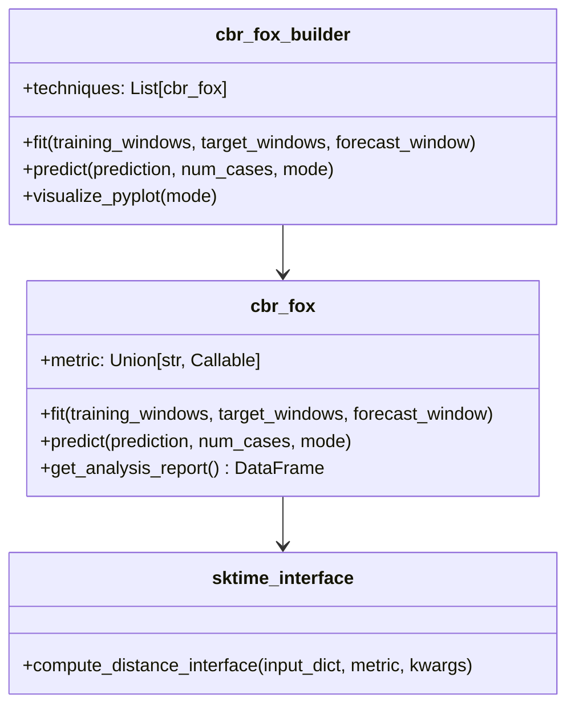

# CBR-FoX: Case-Based Reasoning for Time Series Forecasting

[](https://www.python.org/downloads/)
[](https://joinup.ec.europa.eu/collection/eupl/eupl-text-eupl-12)
[](https://cbr-fox.readthedocs.io/en/latest/?badge=latest)
[](https://codecov.io/gh/aaaimx/CBR-FoX)
[](https://badge.fury.io/py/cbr-fox)
[](https://doi.org/10.5281/zenodo.XXXXXXX)

CBR-FoX is a Python library designed to provide case-based reasoning explanations for time series prediction models. This approach enhances the transparency and interpretability of machine learning models applied to sequential data through explainable AI capabilities.

---

## Table of Contents

- [Features](#-features)
- [Installation](#-installation)
- [Quick Start](#-quick-start)
- [Usage Workflow](#-usage-workflow)
- [Documentation](#-documentation)
- [Architecture](#-architecture)
- [Citation](#-citation)
- [Support](#-support)
- [Operating Environment](#-operating-environment)
- [License](#-license)
- [Contributing](#-contributing)
- [Acknowledgments](#-acknowledgments)

---

## Features

- **Case-Based Reasoning (CBR) Implementation**: Utilizes case-based reasoning to enhance explainability in time series predictions
- **Multiple Distance Metrics**: DTW, Euclidean, Pearson correlation, and custom CCI metric
- **Explainable AI**: Visualize and understand case selection process with clear, human-readable insights
- **Flexible Architecture**: Easy integration with custom metrics via sktime adapter
- **Versatile & Adaptable**: Supports various types of time series data (univariate, multivariate)
- **ML Model Compatibility**: Easily integrates with common machine learning models
- **Comprehensive Visualization**: Built-in plotting utilities with matplotlib and plotly
- **Production Ready**: Fully tested, documented, and containerized

---

## Installation

### Install via PyPI

```bash
pip install CBR-FoX
```

### Using conda

```bash
conda env create -f environment.yml
conda activate cbr_fox
```

### Install via GitHub (Development)

```bash
# Clone the repository
git clone https://github.com/aaaimx/CBR-FoX.git
cd CBR-FoX

# Install required dependencies
pip install -r requirements.txt

# Install in development mode
pip install -e .
```

### Using Docker

```bash
# Build and run with docker-compose
docker-compose up cbr_fox

# Or run directly
docker build -t cbr_fox .
docker run cbr_fox python scripts/examples/reproduce_all_figures.py
```

---

## Quick Start

```python
from cbr_fox.core import cbr_fox
from cbr_fox.builder import cbr_fox_builder
import numpy as np

# Create sample data
# training_windows: shape [n_windows, window_len, n_features]
training_windows = np.random.randn(100, 24, 3)
target_windows = np.random.randn(100, 3)
forecast_window = np.random.randn(24, 3)

# Initialize CBR with DTW metric
cbr = cbr_fox(metric="dtw", smoothness_factor=0.2)

# Fit and predict
cbr.fit(training_windows, target_windows, forecast_window)
prediction = np.random.randn(3)
cbr.predict(prediction, num_cases=5, mode="simple")

# Get analysis report
report = cbr.get_analysis_report()
print(report)

# Visualize results
from cbr_fox.utils import plot_utils
plot_utils.visualize_pyplot(cbr)
```

---

## Usage Workflow

Follow these steps to use CBR-FoX in your projects:

### 1. Retrieve Model Information
Extract the relevant inputs and outputs from your AI model:
```python
# Get your model's training windows, targets, and forecasts
training_windows = model.get_training_windows()  # shape: [n_windows, window_len, n_features]
target_windows = model.get_targets()             # shape: [n_windows, n_features]
forecast_window = model.get_current_window()     # shape: [window_len, n_features]
prediction = model.predict()                     # shape: [n_features]
```

### 2. Create CBR-FoX Instances
```python
from cbr_fox.core import cbr_fox

# Single metric instance
cbr_instance = cbr_fox(metric="dtw", smoothness_factor=0.2)

# Or multiple instances for comparison
cbr_dtw = cbr_fox(metric="dtw")
cbr_euclidean = cbr_fox(metric="euclidean")
cbr_cci = cbr_fox(metric="cci_distance", kwargs={"punishedSumFactor": 0.5})
```

### 3. Initialize the Builder (Optional - for comparing multiple techniques)
```python
from cbr_fox.builder import cbr_fox_builder

# Create builder with multiple techniques
builder = cbr_fox_builder([cbr_dtw, cbr_euclidean, cbr_cci])
```

### 4. Train the Instance
```python
# Single instance
cbr_instance.fit(training_windows, target_windows, forecast_window)

# Or with builder
builder.fit(training_windows, target_windows, forecast_window)
```

### 5. Obtain Explanations
```python
# Single instance
cbr_instance.predict(prediction=prediction, num_cases=5, mode="simple")
report = cbr_instance.get_analysis_report()

# Or with builder
builder.predict(prediction=prediction, num_cases=5, mode="simple")
```

### 6. Visualize Results
```python
# Single instance visualization
plot_utils.visualize_pyplot(
    cbr_instance,
    fmt='--d',
    scatter_params={'s': 50},
    xtick_rotation=50,
    title='CBR-FoX Analysis',
    xlabel='Time Steps',
    ylabel='Values'
)

# Or with builder (compares all techniques)
builder.visualize_pyplot(
    mode="individual",  # or "combined"
    fmt='--o',
    title='Multi-Metric Comparison'
)
```

---

## Documentation

Full documentation is available at [https://cbr-fox.readthedocs.io](https://cbr-fox.readthedocs.io/en/latest/overview.html)

- [API Reference](https://cbr-fox.readthedocs.io/en/latest/api/)
- [Tutorials](https://cbr-fox.readthedocs.io/en/latest/tutorials/)
- [Examples](https://cbr-fox.readthedocs.io/en/latest/examples/)
- [Troubleshooting](https://cbr-fox.readthedocs.io/en/latest/troubleshooting/)

### Reproducing Paper Figures

To reproduce all figures from the publication:

```bash
python scripts/examples/reproduce_all_figures.py --output-dir figures
```

Individual figures can be generated using:

```bash
python scripts/examples/figure_1_architecture.py
python scripts/examples/figure_5_metric_comparison.py
```

---

## Architecture

### Library Usage Diagram
The following diagram illustrates the typical workflow of CBR-FoX, from retrieving AI model outputs to generating visual explanations:


### Class Diagram
Detailed class relationships and module dependencies:



### Module File Relations
The following diagram represents the core classes and their interactions within the library:


For detailed architecture documentation including type hints and interface specifications, see the [Architecture Documentation](docs/architecture.md).

---

## Citation

If you use CBR-FoX in your research, please cite:

### BibTeX

```bibtex
@article{cbr_fox2025,
  title   = {CBR-FoX: A Python Framework for Case-Based Reasoning in Time Series Forecasting},
  author  = {Gerardo A. Pérez-Pérez and
             Moisés F. Valdez-Ávila and
             Mauricio G. Orozco-del-Castillo and
             Carlos Bermejo-Sabbagh and
             Juan A. Recio-García},
  journal = {SoftwareX},
  year    = {2025},
  pages   = {15},
  url     = {https://github.com/aaaimx/CBR-FoX}
}
```

### APA

```
[Your Name]. (2025). CBR-FoX: A Python Framework for Case-Based Reasoning 
in Time Series Forecasting. SoftwareX, [Volume]([Issue]), [Pages]. 
https://doi.org/[DOI]
```

For the software itself, please also cite:

```bibtex
@software{cbr_fox_software,
    author  = {Gerardo A. Pérez-Pérez and
             Moisés F. Valdez-Ávila and
             Mauricio G. Orozco-del-Castillo and
             Carlos Bermejo-Sabbagh and
             Juan A. Recio-García},
  title = {CBR-FoX: Case-Based Reasoning for Time Series Forecasting},
  year = {2025},
  version = {1.0.1},
  url = {https://github.com/aaaimx/CBR-FoX},
  doi = {10.5281/zenodo.XXXXXXX}
}
```

See [CITATION.cff](CITATION.cff) for machine-readable citation metadata.

---

## 💬 Support

- **Issues**: [GitHub Issues](https://github.com/aaaimx/CBR-FoX/issues)
- **Discussions**: [GitHub Discussions](https://github.com/aaaimx/CBR-FoX/discussions)
- **Documentation**: [Read the Docs](https://cbr-fox.readthedocs.io)
- **Email**: [your-email@example.com](mailto:your-email@example.com)

---

## 🖥️ Operating Environment

### Supported Platforms

| Platform | Versions | Status |
|----------|----------|--------|
| **Linux** | Ubuntu 20.04+, Debian 10+, CentOS 8+ | ✅ Fully Supported |
| **macOS** | 11 (Big Sur) and later | ✅ Fully Supported |
| **Windows** | 10, 11 | ✅ Fully Supported |

### Python Support

- **Minimum Python Version**: 3.9
- **Recommended**: Python 3.11
- **Maximum Tested**: Python 3.12

### Dependencies

All dependencies are pinned in `requirements.txt` and `environment.yml` for reproducibility. Key dependencies include:

- NumPy >= 1.24.0, < 2.1.0
- SciPy >= 1.10.0, < 1.14.0
- pandas >= 2.0.0, < 2.4.0
- scikit-learn >= 1.3.0, < 1.7.0
- sktime == 0.38.5
- matplotlib >= 3.7.0, < 3.10.0
- statsmodels >= 0.14.0, < 0.15.0

See [NOTICE](NOTICE) for third-party license information.

### Installation Verification

```bash
# Run tests to verify installation
pytest tests/ -v

# Check coverage
pytest tests/ --cov=cbr_fox --cov-report=html
```

---

## 📄 License

This project is licensed under the **European Union Public Licence (EUPL) v. 1.2**.

- **License**: [EUPL-1.2](Licence.txt)
- **SPDX**: `EUPL-1.2`
- **OSI Approved**: Yes
- **Compatible with**: GPL, MIT, BSD, Apache, MPL

### Third-Party Compliance

All third-party dependencies have been verified for EUPL 1.2 compatibility. See [NOTICE](NOTICE) for detailed license information of all dependencies.

### Commercial Use

EUPL allows commercial use, modification, and distribution under the same license (copyleft). For specific use cases, please review the [full license text](Licence.txt).

---

## 🤝 Contributing

We welcome contributions! Please see [CONTRIBUTING.md](CONTRIBUTING.md) for guidelines.

Key areas for contribution:
- New distance metrics
- Visualization enhancements
- Documentation improvements
- Bug reports and fixes
- Performance optimizations

---

## 🌟 Acknowledgments

This work was supported by [Your Funding Source/Institution].

Special thanks to:
- The **sktime** community for their excellent time series toolkit
- The **scikit-learn** community for machine learning foundations
- All contributors and users of CBR-FoX

---

**Maintained by**: [AAAIMX](https://aaaimx.github.io)  
**Institution**: [AAAIMX - Advanced Analytics and AI Research Group](https://aaaimx.github.io)  
**Repository**: [https://github.com/aaaimx/CBR-FoX](https://github.com/aaaimx/CBR-FoX)  
**Last Updated**: October 2025