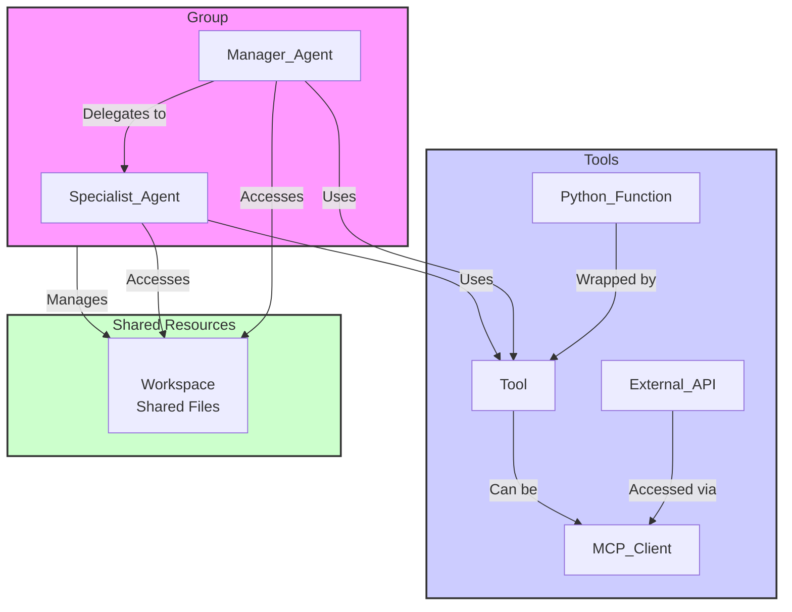

[中文](./README_zh.md)

# Agenticle

[](https://badge.fury.io/py/agenticle)
[](https://opensource.org/licenses/MIT)
[](https://pypi.org/project/agenticle)
[](https://deepwiki.com/A03HCY/Agenticle)

Agenticle is a lightweight, event-driven Python framework for building and orchestrating multi-agent systems. It provides simple yet powerful abstractions to create individual agents, equip them with tools, and make them collaborate in groups to solve complex tasks.

## ✨ Highlights

-   ✅ **Declarative Multi-Agent Systems**: Easily define, manage, and version complex multi-agent workflows using a single YAML file.
-   ✅ **Built-in Real-Time Dashboard**: Instantly visualize agent thoughts and collaboration flows without extra setup, making debugging intuitive.
-   ✅ **Flexible Collaboration Modes**: Natively supports various team dynamics like `manager_delegation`, `voting`, and `competition` to orchestrate complex agent interactions.
-   ✅ **Extensible & Interoperable**: Seamlessly integrate with external tools and services written in any language via the Model Context Protocol (MCP).
-   ✅ **Parallel Tool Execution**: Agents can execute multiple tools concurrently, dramatically speeding up I/O-bound tasks.

## Installation

Install the package directly from PyPI:

```bash
pip install agenticle
```

For development, clone the repository and install in editable mode:

```bash
git clone https://github.com/A03HCY/Agenticle.git
cd Agenticle
pip install -e .
```

## 🚀 Quick Start

There are two ways to get started: the programmatic Python approach (great for quick experiments) and the declarative YAML approach (recommended for managing complex systems).

### Option 1: The Programmatic Way (Python)

You can define all agents and groups directly in Python.

```python
from agenticle import Agent, Group, Tool, Endpoint

# 1. Define the tool function
def get_current_weather(location: str) -> str:
    """Gets the current weather for a specified location."""
    return f"Weather in {location}: 15 degrees Celsius, sunny."

# 2. Create an endpoint configuration
openai_endpoint = Endpoint(
    api_key='YOUR_API_KEY',
    base_url='YOUR_API_BASE_URL'
)

# 3. Create the specialist agent
weather_agent = Agent(
    name="Weather_Specialist",
    description="Specializes in fetching weather information for a given city.",
    tools=[Tool(get_current_weather)],
    endpoint=openai_endpoint,
    model_id='your-model-id'
)

# 4. Create the manager agent
planner_agent = Agent(
    name="Planner_Manager",
    description="A smart planner that breaks down requests and delegates tasks to specialists.",
    input_parameters=[{"name": "user_request"}],
    tools=[], # The manager delegates, it doesn't work
    endpoint=openai_endpoint,
    model_id='your-model-id'
)

# 5. Assemble the group
travel_agency = Group(
    name="Travel_Agency",
    agents=[planner_agent, weather_agent],
    manager_agent_name="Planner_Manager",
    mode='manager_delegation'
)

# 6. Run the group
user_query = "I want to travel to Beijing. How is the weather?"
event_stream = travel_agency.run(stream=True, user_request=user_query)

for event in event_stream:
    print(event)
```

### Option 2: The Declarative Way (YAML)

This is the recommended approach for building and managing complex multi-agent systems.

**1. Create `agents.yaml`:**

Define a manager and a specialist. The manager will delegate the task to the specialist.

```yaml
# agents.yaml
endpoints:
  default:
    api_key: "YOUR_API_KEY" # Or use environment variable API_KEY
    base_url: "YOUR_API_BASE_URL"

agents:
  - name: Weather_Specialist
    description: "Specializes in fetching weather information for a given city."
    input_parameters: [{name: "city"}]
    tools: ["get_current_weather"] # This tool will be provided in Python
    model_id: "your-model-id"
    endpoint: "default"

  - name: Planner_Manager
    description: "A smart planner that breaks down requests and delegates tasks to the appropriate specialist."
    input_parameters: [{name: "user_request"}]
    tools: ["Weather_Specialist"] # Uses the other agent as a tool
    model_id: "your-model-id"
    endpoint: "default"

groups:
  - name: Travel_Agency
    agents: ["Planner_Manager", "Weather_Specialist"]
    manager_agent_name: "Planner_Manager"
    mode: "manager_delegation"
```

**2. Create `main.py`:**

Load the YAML file and provide the Python function for the `get_current_weather` tool.

```python
from agenticle import Model, Tool

# Define the Python function for the tool mentioned in the YAML
def get_current_weather(location: str) -> str:
    """Gets the current weather for a specified location."""
    return f"Weather in {location}: 15 degrees Celsius, sunny."

# Load the entire system from the YAML file
# The Tool object is automatically created from the function
model = Model(path="agents.yaml", tools=[get_current_weather])

# Access the group defined in YAML
travel_agency = model.groups["Travel_Agency"]

# Run the group and stream the events
event_stream = travel_agency.run(stream=True, user_request="How is the weather in Beijing?")
for event in event_stream:
    print(event)
```

**3. Run it!**

```bash
python main.py
```

You will see a real-time stream of events as the `Planner_Manager` receives the request, decides to delegate to the `Weather_Specialist`, and gets the final result.

## Built-in Tools

Agenticle comes with powerful tools for monitoring and integration out-of-the-box.

### Real-Time Monitoring Dashboard

Visualize the event stream from any `Agent` or `Group` in real-time. It's perfect for debugging and observing agent behavior.


**How to Use:**

1.  Install dashboard dependencies: `pip install "agenticle[dashboard]"`
2.  Wrap your agent/group with the `Dashboard` and run it.

```python
from agenticle import Agent, Dashboard

# Assume 'my_agent' is an already configured Agent instance
agent_args = {"query": "What is the weather in London?"}

# Wrap the agent and run the dashboard server
dashboard = Dashboard(my_agent, **agent_args)
dashboard.run() # Server starts at http://127.0.0.1:8000
```

### RESTful API Server

Expose your agents and groups through a RESTful API to integrate Agenticle into larger applications.

**How to Use:**

1.  Install API dependencies: `pip install "agenticle[api]"`
2.  Register your agents and start the server.

```python
# in run_api.py
import agenticle.server as server
from agenticle.agent import Agent

# 1. Define your agent
my_agent = Agent(...)

# 2. Register it with a unique name
server.register("my_agent_api_name", my_agent)

# 3. Start the server
if __name__ == "__main__":
    server.start_server()
```

Now you can interact with your agent via HTTP endpoints for streaming or asynchronous task execution.

## Key Concepts

### Architecture

The core components of Agenticle work together to enable complex multi-agent collaboration.



### Agent

The `Agent` is the fundamental actor. It's defined by its `name`, `description`, `tools`, and the LLM `endpoint` it uses. An agent follows a "Think-Act" cycle to reason about a task and decide which tool to use.

### Group

A `Group` orchestrates multiple `Agent` instances. Its behavior is determined by the `mode`:
-   `'manager_delegation'`: A manager agent delegates tasks to specialist agents.
-   `'broadcast'`: Every agent can communicate with every other agent.
-   `'round_robin'`: Agents execute sequentially, forming a processing pipeline.
-   `'voting'`: Agents run in parallel and vote on a final answer.
-   `'competition'`: Agents compete to produce the best answer, which is then selected by an optimizer agent.

### Workspace

A `Workspace` is a sandboxed directory that can be shared by all agents in a `Group`. This allows them to collaborate by reading and writing files, enabling stateful, long-running tasks.

### Understanding the Event Stream

Every action in Agenticle generates an `Event`. By streaming these events, you get a transparent, real-time view of the entire execution process, from an agent's internal `reasoning_stream` to its final `decision` and `tool_result`. This is the foundation for the monitoring dashboard and makes debugging easy.

### Integrating with External Tools via MCP

Agenticle supports the **Model Context Protocol (MCP)**, allowing agents to connect to external, language-agnostic tool servers. This means you can integrate with microservices, external APIs, or tools written in other languages as easily as using a local Python function.

## Advanced Usage

### Declarative Setup with YAML

Defining your system in YAML separates architecture from code, making complex setups easy to manage.
-   **`model = Model(path="...", tools=[...])`**: Load a system from a YAML file. You must provide any non-serializable tools (like Python functions) at runtime.
-   **`modelize(agents=[...], groups=[...], path="...")`**: Serialize a programmatically created system into a YAML file. This is great for snapshotting a dynamic setup.

### Customizing Agent Behavior with Prompts

You can completely redefine an agent's behavior, personality, and reasoning structure by providing a custom Jinja2 prompt template.

```python
custom_agent = Agent(
    name="Custom_Agent",
    # ... other parameters
    prompt_template_path="path/to/your/custom_prompt.md"
)
```

Your template can use variables like `{{ agent_name }}`, `{{ agent_description }}`, and lists of `{{ tools }}` to dynamically generate the system prompt at runtime.
