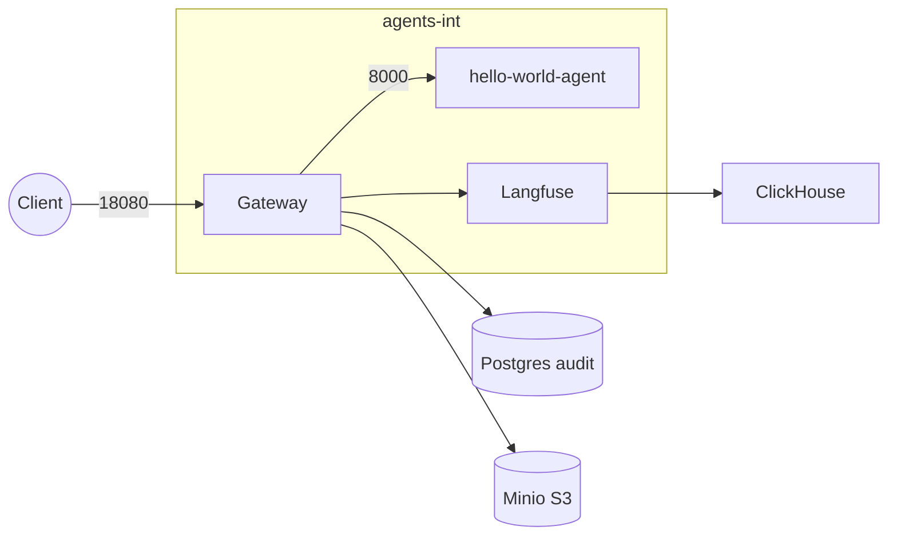

# AgentSystems Platform Deployment

**Deployment configuration** for the AgentSystems platform. This directory contains Docker Compose manifests and configuration files needed to run the AgentSystems platform locally.

* Brings up: Gateway (Control Plane), Postgres audit DB, Langfuse tracing, and example agents
* Primary target: Docker Compose for local development and testing

Related repos:
• [`agent-control-plane`](https://github.com/agentsystems/agent-control-plane) – Gateway runtime
• [`agent-template`](https://github.com/agentsystems/agent-template) – Scaffold to build new agents

---

## Folder layout

| Path | Purpose |
|------|---------|
| `compose/local/` | One-node Docker Compose stack for local dev & demos. |
| `compose/langfuse/` | Optional compose file that attaches a full Langfuse stack to `agents-int`. |
| `Makefile` | Friendly wrappers: `make up`, `make down`, `make restart`. |

---

## Architecture (local compose)



---

## Quick start

This deployment was created using the AgentSystems SDK. To start the platform:

```bash
# From this directory
make up

# Or using the SDK CLI
agentsystems up
```

When all containers are healthy:

```bash
curl http://localhost:18080/agents -H "Authorization: Bearer demo"
curl -X POST http://localhost:18080/invoke/hello-world-agent \
     -H 'Content-Type: application/json' \
     -d '{"sync": true, "prompt":"Ping"}'
```

---

## Continuous Integration (GitHub Actions)

The `ci.yml` workflow validates every pull request by performing a full stack boot:

1. Creates a **placeholder `.env`** containing minimal required variables so Compose starts even in a fresh clone.
2. Uses `actions/checkout` with a PAT (`ACP_READ_TOKEN`) to clone the private `agent-control-plane` repo.
3. **Builds the Gateway image locally** (avoids relying on Docker Hub for PRs from forks).
4. Brings up the compose stack (`compose/local/docker-compose.yml`) in a dedicated Docker network.
5. Polls `http://localhost:18080/health` until the Gateway reports **200 OK**.
6. Tears the stack down and removes the network.

This helps ensure future merges don't break the deployment instructions.

---

Default mapped ports:

| Service | Host port | URL |
|---------|-----------|-----|
| Gateway (REST) | 18080 | <http://localhost:18080/docs> |
| Langfuse UI | 3000 | <http://localhost:3000> |
| ClickHouse HTTP | 18123 | <http://localhost:18123> |
| Minio S3 API | 19000 | <http://localhost:19000> |

---

## Marketplace configuration (`agentsystems-config.yml`)

Agent discovery is now driven by a single YAML file at repo root. You can enable **registry connections** and list the agents you want to run without touching the Compose files.

```yaml
registry_connections:
  dockerhub_main:
    url: docker.io
    enabled: true
    auth:
      method: basic           # username & password / token via env vars
      username_env: DOCKERHUB_USER
      password_env: DOCKERHUB_TOKEN

  dockerhub_alt:
    url: docker.io
    enabled: true
    auth:
      method: basic
      username_env: DOCKERHUB_USER_ALT
      password_env: DOCKERHUB_TOKEN_ALT

agents:
  - name: hello-world                    # container becomes `hello-world-agent`
    registry_connection: dockerhub_main  # key from registry_connections above
    repo: agentsystems/hello-world-agent
    tag: latest

  - name: ext-hello-world
    registry_connection: dockerhub_alt
    repo: ironbirdlabs/ext-hello-world-agent
    tag: latest
```

To add your own agent:

1. Build & push an image to **any enabled registry**.
2. Add a block under `agents:` with at least `name`, `registry_connection`, and `repo`. Pin a `tag:` or rely on `latest`.
3. Run `agentsystems up`.  The CLI will:
   * log into each enabled registry **connection** using the credentials referenced in `registry_connections.<name>.auth.*`,
   * pull the image,
   * start the container with **the entire `.env`** forwarded via `--env-file`, and
   * label it so the Gateway auto-discovers the HTTP port.

> **Security tip** – keep your credentials in environment variables (not in the YAML). The SDK passes `--env-file .env` to Docker directly; the CLI avoids parsing or logging secret values. (As with any process, environment data may exist in memory during execution.)

---

## Add your own agent (compose style – legacy)

1. Build & push an image: `docker build -t mycorp/echo-agent:1.0 . && docker push …`
2. Duplicate the `hello-world-agent` service block in `compose/local/docker-compose.yml` and update the `image:` line (you can keep `:latest` or pin a version) plus discovery labels:

```yaml
  echo-agent:
    image: mycorp/echo-agent:1.0
    networks:
      - agents-int
    labels:
      - agent.enabled=true
      - agent.port=8000
```

The demo `hello-world-agent` service tracks `:latest`, so new releases are picked up with `docker compose pull hello-world-agent` or `make restart`.
`make restart` will rebuild the stack and the Gateway will start routing `POST /echo-agent`.‎

**Note:** `make up` auto-creates the shared `agents-int` internal network then `docker compose up -d` (gateway + Postgres + example agent).

---

## File Uploads & Artifacts

The platform supports file uploads to agents and provides a shared artifacts volume for data exchange.

### Uploading Files to Agents

Send files using multipart requests:

```bash
# Upload single file with JSON payload
curl -X POST http://localhost:18080/invoke/agent-name \
  -H "Authorization: Bearer token" \
  -F "file=@data.csv" \
  -F 'json={"sync": true, "format": "csv"}'

# Upload multiple files
curl -X POST http://localhost:18080/invoke/agent-name \
  -H "Authorization: Bearer token" \
  -F "file=@input1.txt" \
  -F "file=@input2.txt" \
  -F 'json={"sync": true}'
```

### Artifacts Volume

All agents automatically get the `agentsystems-artifacts` volume mounted at `/artifacts` with a thread-centric structure:

```
/artifacts/
├── {thread-id}/
│   ├── in/          # Files uploaded by client
│   └── out/         # Files created by agent
```

### Accessing Artifacts

Retrieve agent outputs or debug uploads:

```bash
# List all active threads
docker exec local-gateway-1 ls -la /artifacts/

# Read agent output files
docker exec local-gateway-1 cat /artifacts/{thread-id}/out/result.txt

# Check uploaded input files
docker exec local-gateway-1 ls -la /artifacts/{thread-id}/in/

# Use CLI helper (requires agentsystems-sdk)
agentsystems artifacts-path {thread-id} output.json
```

### Agent Development Tips

When building agents that handle file uploads:

1. **Read uploaded files**: Check `/artifacts/{thread_id}/in/` for uploaded files
2. **Write output files**: Save results to `/artifacts/{thread_id}/out/`
3. **Handle missing files**: Provide fallback behavior when no files are uploaded
4. **File size limits**: Default upload limit is 200MB (configurable via `ACP_MAX_UPLOAD_MB`)

See the [agent-template](https://github.com/agentsystems/agent-template) for a complete example.

---

## Environment variables (`.env`)

> Backup cadence: set **`BACKUP_INTERVAL`** (seconds, preferred) or the legacy **`BACKUP_SCHEDULE`** – the db-backup side-car accepts either.

A template lives at repo root – copy it to `.env` **and keep it alongside the `agent-platform-deployments` folder, _not_ inside `compose/langfuse/`.**
The `compose/langfuse/docker-compose.yml` file now declares `env_file: ../../.env`, so those variables are injected at runtime (no `${VAR}` interpolation required).

### Core variables

> Note: `LANGFUSE_HOST`, `LANGFUSE_PUBLIC_KEY`, and `LANGFUSE_SECRET_KEY` are written by the CLI **without quotes** so they are passed correctly into Docker. If you edit `.env` manually be sure to keep them unquoted.

| Var | Purpose |
|-----|---------|
| `POSTGRES_PASSWORD` | Password for audit DB and Langfuse Postgres |
| `MINIO_ROOT_PASSWORD` | Console login for Minio |
| `OPENAI_API_KEY` / etc. | Model credentials passed into agent containers |

### Langfuse head-less initialisation
Set these **nine** variables to have Langfuse auto-provision an organisation, project and API keys on first start-up:

| Variable | Required | Example |
|----------|----------|---------|
| `LANGFUSE_INIT_ORG_ID` | ✅ | `my-org` |
| `LANGFUSE_INIT_ORG_NAME` |  | `My Org` |
| `LANGFUSE_INIT_PROJECT_ID` | ✅ | `my-project` |
| `LANGFUSE_INIT_PROJECT_NAME` |  | `My Project` |
| `LANGFUSE_INIT_PROJECT_PUBLIC_KEY` | ✅ (pk-) | `pk-lf-123456` |
| `LANGFUSE_INIT_PROJECT_SECRET_KEY` | ✅ (sk-) | `sk-lf-abcdef` |
| `LANGFUSE_INIT_USER_EMAIL` | ✅ | `owner@example.com` |
| `LANGFUSE_INIT_USER_NAME` |  | `Owner` |
| `LANGFUSE_INIT_USER_PASSWORD` | ✅ | `ChangeMe123!` |

> **Tip** – Headless init runs only when the Langfuse Postgres volume is _empty_.  If you change any of these values later you must wipe the `langfuse_postgres_data` volume using `agentsystems down --delete-volumes` (or `--delete-all`) before restarting.

---

## Container readiness & health checks

`agentsystems up` waits until every agent container reports **healthy** before printing "Platform ready". To enable this, each agent image should include a Docker `HEALTHCHECK` that pings the existing `/health` endpoint (already present in the FastAPI template):

```dockerfile
# inside your agent Dockerfile
ENV PORT 8000
HEALTHCHECK --interval=10s --retries=3 CMD curl -sf http://localhost:${PORT}/health || exit 1
```

With a healthy container and correct configuration, the first request should succeed. If not, see Troubleshooting.

---

## Release / upgrade

1. Pull the latest image tags for Gateway & agents.
2. Update versions in compose or Helm values.
3. `make restart` (Compose) **or** `helm upgrade` (K8s).
4. Verify `/health` endpoints and Langfuse traces.
