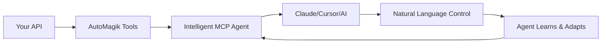

<p align="center">
  
</p>
<h2 align="center">From API to AI in 30 Seconds</h2>

<p align="center">
  <strong>🎯 The Bridge Between Your APIs and Intelligent AI Agents</strong><br>
  Transform any API into a smart MCP agent that learns, adapts, and speaks human<br>
  No code generation, no complex setup—just instant intelligence
</p>

<p align="center">
  <a href="https://github.com/namastexlabs/automagik-tools/actions"></a>
  <a href="https://github.com/namastexlabs/automagik-tools/blob/main/LICENSE"></a>
  <a href="https://discord.gg/xcW8c7fF3R"></a>
  <a href="https://pypi.org/project/automagik-tools/"></a>
</p>

<p align="center">
  <a href="#-key-features">Features</a> •
  <a href="#-quick-start">Quick Start</a> •
  <a href="#-built-in-tools">Tools</a> •
  <a href="#-roadmap">Roadmap</a> •
  <a href="#-contributing">Contributing</a>
</p>

---

## 🚀 What is Automagik Tools?

**Automagik Tools** is the MCP (Model Context Protocol) toolkit that transforms any API into an intelligent agent in seconds. Think of it as the universal translator between your systems and AI—no coding required, just point to your API and start talking to it in natural language.

### 🎭 The API Integration Problem

**The Old Way**: Want your AI to talk to Stripe? Write 500 lines of integration code. Update the API? Rewrite everything. Need another API? Start from scratch. Hours turn into weeks, developers cry, budgets explode.

**The Automagik Way**:

```bash
# One command. 30 seconds. Done.
uvx automagik-tools openapi https://api.stripe.com/openapi.json
```

Now your AI can process payments, manage subscriptions, and handle refunds—all in natural language.

### 🚫 Why Traditional Integration Fails

The integration nightmare is real:
- **Weeks of Development**: Each API needs custom code (2-4 weeks average)
- **No Standardization**: Every team reinvents the wheel
- **Maintenance Hell**: APIs change, everything breaks
- **Zero Reusability**: Can't share work across projects
- **Complex Deployment**: Getting it to production is a full-time job

### ✅ The Automagik Tools Solution

We flip the script completely:
- ⚡ **30 Seconds to Integration**: Point to OpenAPI spec, done
- 🧠 **Self-Learning Agents**: Remember your patterns, adapt to your workflow
- 🔄 **Universal Protocol**: One standard (MCP) for all integrations
- 🎯 **Zero Code**: No SDKs, no wrappers, just conversation
- 📦 **Instant Deployment**: `uvx` = installed and running
- 🔌 **Plug & Play**: Works with Claude, Cursor, any MCP client
- 💰 **99% Cost Reduction**: R$ 45k → R$ 100 per integration

---

## 🌟 Key Features

- **🔧 Instant MCP Generation**: Any OpenAPI spec becomes an intelligent agent in seconds
- **🧠 Self-Learning Intelligence**: Agents remember your patterns and improve with use
- **📋 Markdown Processing**: GPT-4.1-nano cleans noisy JSON into readable output
- **🧞 Genie Orchestrator**: Connect and coordinate unlimited MCP servers with persistent memory
- **🤖 Automagik Integration**: Native orchestration with Spark, Hive, Forge, and Omni
- **🔄 Multiple Transports**: stdio for local, SSE for team sharing, HTTP for APIs
- **📱 WhatsApp Automation**: Complete Evolution API integration built-in
- **🎨 Three Intelligence Modes**: Standard (precise), Markdown (readable), Genie (natural language)
- **🚀 Zero Installation**: Run with `uvx` - no global install needed
- **🔌 Universal Compatibility**: Works with Claude Code, Cursor, Cline, Roo, Gemini CLI
- **📦 Centralized Toolkit**: All your tools in one hub, versioned and standardized
- **🏗️ Plugin Architecture**: Drop tools in a folder, auto-discovered instantly
- **100% Open Source**: MIT license, self-hostable, no vendor lock-in

---

## 🧞 Genie: Your Universal AI Conductor

Genie is the crown jewel—a meta-agent that orchestrates any MCP servers with persistent memory.

### What Makes Genie Special?

```bash
# Start Genie with memory
uvx automagik-tools tool genie -t sse --port 8000
```

**Connect Any MCP Servers**:
```bash
export GENIE_MCP_CONFIGS='{
  "agent-memory": {
    "url": "http://localhost:8001/sse",
    "transport": "sse"
  },
  "filesystem": {
    "command": "npx",
    "args": ["-y", "@modelcontextprotocol/server-filesystem", "/workspace"],
    "env": {}
  },
  "github": {
    "command": "uvx",
    "args": ["mcp-server-git"],
    "env": {"GITHUB_TOKEN": "your-token"}
  }
}'
```

**Now Tell Genie in Natural Language**:
- "Use memory to track my GitHub preferences, then analyze my repos and create weekly summaries"
- "Coordinate between Slack and Linear to set up daily standups for the design team"
- "Monitor competitor pricing with the trading API and remember my risk preferences"

Genie **learns your patterns**—after a few interactions, it knows exactly how you like data formatted, which metrics matter, and when to alert you.

---

## 📸 Real-World Magic

### Stripe Payments in 30 Seconds
```bash
uvx automagik-tools openapi https://raw.githubusercontent.com/stripe/openapi/master/openapi/spec3.json

# Now just talk to it:
# "Process a $100 payment for customer cus_123"
# "Show me failed payments from last week"
# "Create a subscription for Pro plan"
```

### Discord Bot Without Code
```bash
uvx automagik-tools openapi \
  https://raw.githubusercontent.com/discord/discord-api-spec/main/specs/openapi.json \
  -t sse --port 8001

# Natural language commands:
# "Schedule a voice call for 3pm in the dev channel"
# "Find all threads mentioning the new feature"
# "Show unread messages from the design team"
```

### Your Internal API, AI-Ready
```bash
# Your company's API becomes conversational
uvx automagik-tools openapi https://api.yourcompany.com/openapi.json

# Team shares the same learning agent via SSE
# Agent adapts to company terminology and workflows
```

---

## 📡 MCP: Remote Control from Anywhere

Automagik Tools works with **any MCP-compatible client**—Claude Code, Cursor, Cline, Roo, Gemini CLI—you name it.

### Typical Workflow

1. **Point to API**: Give AutoMagik any OpenAPI spec
2. **Deploy Agent**: Choose stdio (local) or SSE (team sharing)
3. **Connect Client**: Add to Claude/Cursor/your favorite tool
4. **Start Talking**: Natural language, the agent figures it out
5. **Agent Learns**: Remembers your patterns, gets smarter

### Example Use Cases

- 🎯 **"Connect to our warehouse API and alert me when inventory drops below thresholds"**
- 🐛 **"Monitor production logs and categorize errors automatically"**
- ✅ **"Generate weekly sales reports and send to regional managers"**
- 📋 **"Track competitor prices and notify me of changes above 5%"**

### Available MCP Tools

| Tool | Description | Use Case |
|------|-------------|----------|
| `genie` | Universal MCP orchestrator | Coordinate multiple tools with memory |
| `automagik` | Automagik Suite integration | Orchestrate Spark, Hive, Forge, Omni |
| `automagik-workflows` | Claude workflow execution | Run and monitor Claude Code workflows |
| `evolution-api` | WhatsApp automation | Send/receive messages, media, groups |
| `openapi` | Dynamic API agent | Any OpenAPI spec → instant agent |

### Quick Setup

<details>
<summary><b>🤖 Claude Code Configuration</b></summary>

1. Open Claude Code settings
2. Navigate to MCP Servers section
3. Add configuration:

```json
{
  "mcpServers": {
    "automagik-tools": {
      "command": "uvx",
      "args": [
        "automagik-tools@latest",
        "serve",
        "--tool",
        "genie",
        "--transport",
        "stdio"
      ],
      "env": {
        "OPENAI_API_KEY": "your-openai-key",
        "GENIE_MCP_CONFIGS": "{\"your-mcp-config-here\":{}}"
      }
    }
  }
}
```

</details>

<details>
<summary><b>🎯 Cursor Configuration</b></summary>

1. Open Cursor Settings (`Cmd/Ctrl + ,`)
2. Search for "MCP"
3. Add to `~/.cursor/mcp.json`:

```json
{
  "mcpServers": {
    "automagik-tools": {
      "command": "uvx",
      "args": [
        "automagik-tools@latest",
        "serve",
        "--tool",
        "automagik",
        "--transport",
        "stdio"
      ],
      "env": {
        "AUTOMAGIK_API_KEY": "your-key",
        "AUTOMAGIK_BASE_URL": "http://localhost:8881"
      }
    }
  }
}
```

</details>

<details>
<summary><b>📝 VSCode + Cline Configuration</b></summary>

1. Install Cline from VSCode marketplace
2. Open Cline settings
3. Add MCP server:

```json
{
  "cline.mcpServers": [
    {
      "name": "automagik-tools",
      "command": "uvx",
      "args": [
        "automagik-tools@latest",
        "serve",
        "--openapi-url",
        "https://api.example.com/openapi.json",
        "--transport",
        "stdio"
      ]
    }
  ]
}
```

</details>

<details>
<summary><b>🚀 Roo Code Configuration</b></summary>

1. Open Roo Code preferences
2. Navigate to Extensions → MCP
3. Add server:

```yaml
servers:
  automagik-tools:
    command: uvx
    args:
      - automagik-tools@latest
      - serve
      - --tool
      - genie
      - --transport
      - stdio
    environment:
      OPENAI_API_KEY: your-key
```

</details>

<details>
<summary><b>💎 Gemini CLI Configuration</b></summary>

1. Edit `~/.gemini/config.json`
2. Add MCP server:

```json
{
  "mcp": {
    "servers": {
      "automagik-tools": {
        "type": "stdio",
        "command": "uvx",
        "args": [
          "automagik-tools@latest",
          "serve",
          "--tool",
          "automagik",
          "--transport",
          "stdio"
        ]
      }
    }
  }
}
```

</details>

<details>
<summary><b>🔧 Generic MCP Configuration</b></summary>

For any MCP-compatible tool:

```json
{
  "command": "uvx",
  "args": [
    "automagik-tools@latest",
    "serve",
    "--openapi-url",
    "YOUR_API_OPENAPI_URL",
    "--transport",
    "stdio"
  ],
  "env": {
    "OPENAI_API_KEY": "your-key",
    "API_CUSTOM_ENV": "your-value"
  }
}
```

</details>

---

## 🎭 From Chaos to Intelligence

### The Evolution of API Integration



### Example: E-commerce Automation
```bash
You: "Set up my Shopify store as an AI agent"

Your Process:
1. Get OpenAPI spec URL
2. Run: uvx automagik-tools openapi https://shopify.dev/.../openapi.json
3. Done! Now talk to your store:
   - "Show me orders from last week with revenue > $500"
   - "Which products have low inventory?"
   - "Create a discount code for returning customers"

Agent learns your patterns:
- Remembers your preferred date formats
- Knows which metrics you care about
- Adapts responses to your style
```

---

## 📦 Quick Start

### Prerequisites

- Python 3.12+ (that's it!)
- OpenAI API key (for intelligence features)
- Your API's OpenAPI specification

### Installation

**Option 1: No Installation (Recommended)**
```bash
# Use uvx - run directly without installing
uvx automagik-tools list
```

**Option 2: Global Install**
```bash
pip install automagik-tools
```

**Option 3: Development**
```bash
git clone https://github.com/namastexlabs/automagik-tools
cd automagik-tools
make install
```

### First Run

```bash
# List all available tools
uvx automagik-tools list

# Run Genie orchestrator
uvx automagik-tools tool genie --transport stdio

# Convert any API to agent
uvx automagik-tools openapi https://api.github.com/openapi.json

# Run with team sharing (SSE)
uvx automagik-tools tool automagik --transport sse --port 8000
```

### Environment Setup

Create `.env` file:

```bash
# OpenAI for intelligence
OPENAI_API_KEY=sk-your-key

# Automagik Suite integration (optional)
AUTOMAGIK_API_KEY=your-key
AUTOMAGIK_BASE_URL=http://localhost:8881

# Enable Markdown processing (optional)
ENABLE_JSON_PROCESSING=true
JSON_PROCESSOR_MODEL=gpt-4.1-nano
```

---

## 🛠️ Built-in Tools

### 🧞 Genie - Universal Orchestrator
Your AI conductor that coordinates any MCP servers with persistent memory.

```bash
uvx automagik-tools tool genie -t sse --port 8000
```

**Use Cases**:
- Coordinate multiple tools for complex workflows
- Remember context across all sessions
- Natural language task orchestration
- Team-wide shared intelligence

### 🤖 Automagik - Suite Integration
Native integration with the Automagik ecosystem (Spark, Hive, Forge, Omni).

```bash
uvx automagik-tools tool automagik -t stdio
```

**Use Cases**:
- Spawn agent swarms with Hive
- Schedule recurring tasks with Spark
- Manage development workflows with Forge
- Send WhatsApp notifications via Omni

### 🚀 Automagik Workflows - Claude Execution
Execute and monitor Claude Code workflows with real-time progress.

```bash
uvx automagik-tools tool automagik-workflows -t stdio
```

**Use Cases**:
- Run Claude workflows programmatically
- Track execution progress visually
- List available workflows
- Monitor workflow status

### 📱 Evolution API - WhatsApp Automation
Complete WhatsApp Business automation via Evolution API.

```bash
uvx automagik-tools tool evolution-api -t stdio
```

**Use Cases**:
- Send/receive messages and media
- Manage groups and contacts
- Handle status updates
- Automate customer support

### 🌐 OpenAPI - Dynamic Agents
Transform any OpenAPI spec into an instant intelligent agent.

```bash
uvx automagik-tools openapi https://api.example.com/openapi.json
```

**Use Cases**:
- Any REST API with OpenAPI/Swagger
- Internal company APIs
- Third-party services
- Legacy system integration

---

## 🛠️ Development

Interested in contributing or building custom tools?

### Creating Your Own Tool

```bash
# 1. Create tool folder
mkdir -p automagik_tools/tools/my_tool

# 2. Implement FastMCP server
# See docs/TOOL_CREATION_GUIDE.md for templates

# 3. Register in pyproject.toml
[project.entry-points."automagik_tools.plugins"]
my_tool = "automagik_tools.tools.my_tool"

# 4. Done! Auto-discovered
uvx automagik-tools list
```

### Development Commands

```bash
make install              # Install with dev dependencies
make test                 # Run all tests
make lint                 # Check code quality
make format               # Auto-format code
make build                # Build package
```

See [CONTRIBUTING.md](CONTRIBUTING.md) for detailed guidelines.

---

## 🗺️ Roadmap

### Completed ✅
- [x] Dynamic OpenAPI agent generation
- [x] Genie universal orchestrator
- [x] Multi-transport support (stdio, SSE, HTTP)
- [x] Self-learning with memory
- [x] Markdown output processing
- [x] Evolution API (WhatsApp)
- [x] Automagik Suite integration
- [x] Plugin architecture

### Next Up 🚀 (Q4 2025 - Q1 2026)
- [ ] **Smart Tools v1**: Specialized SLMs per tool for expert-level API knowledge
- [ ] **Web UI**: Visual interface for managing and testing tools
- [ ] **Marketplace Beta**: Community tool sharing platform
- [ ] **5-Minute Creation**: Reduce tool creation from 30min to 5min
- [ ] **Tool Templates**: Pre-built templates for common API patterns

### Future Vision 🌟 (2026-2027)
- [ ] **Auto-Learning**: Tools improve themselves based on usage patterns
- [ ] **Auto-Discovery**: Connect to APIs without OpenAPI specs
- [ ] **Self-Maintenance**: Agents maintain their own code
- [ ] **Visual Builder**: Drag-and-drop tool creation
- [ ] **Enterprise Cloud**: Fully managed SaaS offering
- [ ] **Global Marketplace**: Buy/sell community tools

---

## 🤝 Contributing

We love contributions! However, to maintain project coherence:

1. **Discuss First**: Open an issue before starting work
2. **Align with Roadmap**: Ensure changes fit our vision
3. **Follow Standards**: Match existing code patterns
4. **Test Thoroughly**: Include tests for new features
5. **Document Well**: Update docs with your changes

See [CONTRIBUTING.md](CONTRIBUTING.md) for detailed guidelines.

---

## 🙏 Acknowledgments

Special thanks to:
- [Anthropic](https://anthropic.com) for creating MCP
- [FastMCP](https://github.com/jlowin/fastmcp) for the awesome framework
- Our amazing community of early adopters and contributors
- Every developer who's ever cursed at API documentation

---

## 📄 License

MIT License - see [LICENSE](LICENSE) file for details.

---

## 🔗 Links

- **GitHub**: [github.com/namastexlabs/automagik-tools](https://github.com/namastexlabs/automagik-tools)
- **PyPI**: [pypi.org/project/automagik-tools](https://pypi.org/project/automagik-tools)
- **Discord**: [discord.gg/xcW8c7fF3R](https://discord.gg/xcW8c7fF3R)
- **Twitter**: [@namastexlabs](https://twitter.com/namastexlabs)
- **DeepWiki Docs**: [deepwiki.com/namastexlabs/automagik-tools](https://deepwiki.com/namastexlabs/automagik-tools)

---

<p align="center">
  <strong>🚀 Stop writing integrations. Start having conversations.</strong><br>
  <strong>Every API becomes an intelligent agent that learns how you work.</strong><br><br>
  <a href="https://github.com/namastexlabs/automagik-tools">Star us on GitHub</a> •
  <a href="https://discord.gg/xcW8c7fF3R">Join our Discord</a>
</p>

<p align="center">
  Made with ❤️ by <a href="https://namastex.ai">Namastex Labs</a><br>
  <em>AI that elevates human potential, not replaces it</em>
</p>

<p align="center">
  <a href="https://mseep.ai/app/namastexlabs-automagik-tools"></a><br>
  <a href="https://deepwiki.com/namastexlabs/automagik-tools"></a>
</p>