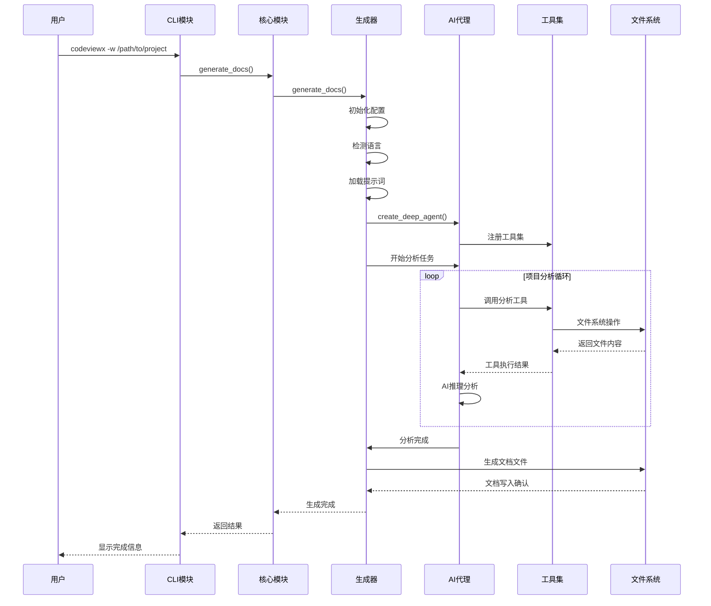
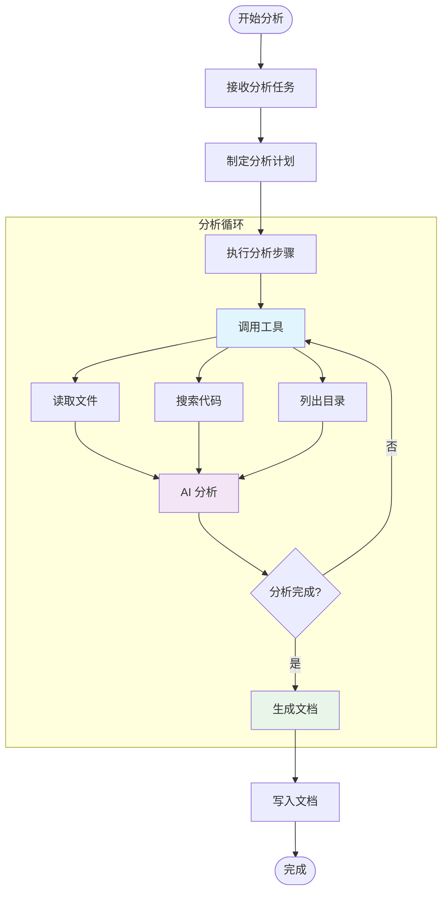
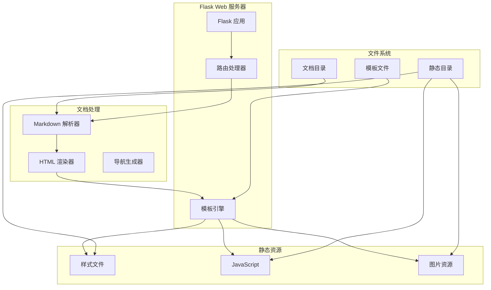
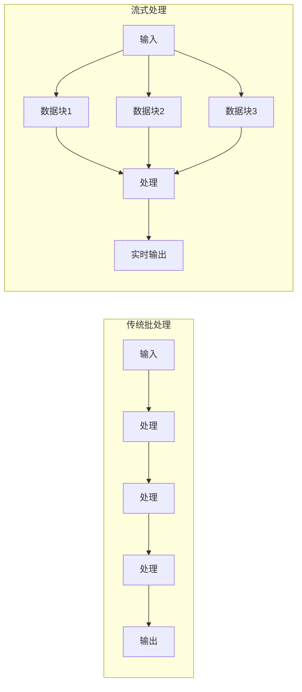
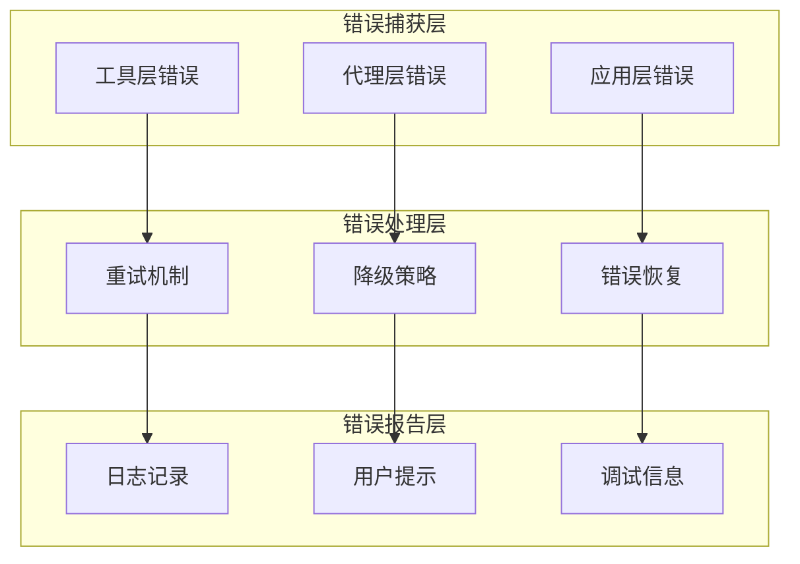

# 核心工作机制

本文档深入分析 CodeViewX 的核心工作机制，包括文档生成的完整流程、AI 代理的工作原理、以及关键算法的实现细节。

## 核心流程 #1: 文档生成主流程

### 概述
文档生成主流程是 CodeViewX 的核心工作机制，从用户输入到最终文档输出的完整过程。该流程包括初始化、项目分析、AI 推理和文档生成四个主要阶段。

**输入**：项目目录路径、输出配置、语言设置
**处理**：AI 驱动的项目分析和文档生成
**输出**：结构化的技术文档集合

### 时序图



### 详细步骤

#### 步骤1: CLI 参数解析与初始化
**触发条件**: 用户执行 `codeviewx` 命令
**核心代码**:
```python
# 文件：codeviewx/cli.py | 行：16-30 | 描述：命令行参数解析
def main():
    """
    Command line entry point
    """
    ui_lang = detect_ui_language()
    get_i18n().set_locale(ui_lang)
    
    parser = argparse.ArgumentParser(
        prog="codeviewx",
        description=t('cli_description'),
        formatter_class=argparse.RawDescriptionHelpFormatter,
        epilog=t('cli_examples')
    )
```

**数据流**: 命令行参数 → 参数解析器 → 配置对象
**关键点**:
- 支持多语言界面自动检测
- 参数验证和默认值设置
- 错误处理和用户友好提示

#### 步骤2: 生成器初始化
**触发条件**: CLI 调用核心 API
**核心代码**:
```python
# 文件：codeviewx/generator.py | 行：24-60 | 描述：生成器初始化和配置
def generate_docs(
    working_directory: Optional[str] = None,
    output_directory: str = "docs",
    doc_language: Optional[str] = None,
    ui_language: Optional[str] = None,
    recursion_limit: int = 1000,
    verbose: bool = False
) -> None:
    if ui_language is None:
        ui_language = detect_ui_language()
        ui_language_source = t('auto_detected')
    else:
        ui_language_source = t('user_specified')
    
    get_i18n().set_locale(ui_language)
    
    if doc_language is None:
        doc_language = detect_system_language()
        doc_language_source = t('auto_detected')
    else:
        doc_language_source = t('user_specified')
```

**数据流**: 配置参数 → 语言检测 → 日志配置 → 提示词加载
**关键点**:
- 自动语言检测机制
- 多层配置优先级处理
- 详细的日志配置和调试支持

#### 步骤3: AI 代理创建与工具注册
**触发条件**: 生成器完成初始化
**核心代码**:
```python
# 文件：codeviewx/generator.py | 行：85-95 | 描述：AI 代理创建
    prompt = load_prompt(
        "document_engineer",
        working_directory=working_directory,
        output_directory=output_directory,
        doc_language=doc_language
    )
    
    tools = [
        execute_command,
        ripgrep_search,
        write_real_file,
        read_real_file,
        list_real_directory,
    ]
    
    agent = create_deep_agent(tools, prompt)
```

**数据流**: 提示词模板 → 工具列表 → DeepAgents 实例
**关键点**:
- 动态提示词模板加载
- 工具函数统一注册机制
- AI 代理能力配置

#### 步骤4: 项目分析与推理
**触发条件**: AI 代理开始执行分析任务
**核心代码**:
```python
# 文件：codeviewx/generator.py | 行：100-130 | 描述：项目分析循环
    for chunk in agent.stream(
        {"messages": [{"role": "user", "content": t('agent_task_instruction')}]},
        stream_mode="values",
        config={"recursion_limit": recursion_limit}
    ):
        if "messages" in chunk:
            step_count += 1
            last_message = chunk["messages"][-1]
            
            if not verbose:
                message_type = last_message.__class__.__name__
                
                if message_type == 'AIMessage' and hasattr(last_message, 'content'):
                    content = str(last_message.content).strip()
                    has_tool_calls = hasattr(last_message, 'tool_calls') and last_message.tool_calls
                    if content and len(content) > 20 and not has_tool_calls:
                        summary = content[:200].replace('\n', ' ').strip()
                        if len(content) > 200:
                            summary += "..."
                        print(f"\n💭 AI: {summary}")
```

**数据流**: 分析指令 → AI 推理 → 工具调用 → 结果处理 → 文档生成
**关键点**:
- 流式处理机制，实时显示进度
- 递归限制防止无限循环
- 智能进度检测和状态管理

### 异常处理
- **网络异常**: 重试机制和降级策略
- **文件访问异常**: 权限检查和路径验证
- **AI 服务异常**: 超时处理和错误恢复
- **内存溢出**: 资源限制和垃圾回收

### 设计亮点
- **流式处理**: 实时显示分析进度，提升用户体验
- **工具抽象**: 统一的工具接口，便于扩展和维护
- **多语言支持**: 完整的国际化框架
- **智能检测**: 自动语言和项目类型检测

## 核心流程 #2: AI 代理工作流

### 概述
AI 代理工作流是基于 DeepAgents 框架的智能分析流程，通过工具调用和推理循环，实现对项目的深度分析和文档生成。

**输入**: 项目文件、分析任务指令
**处理**: AI 推理 + 工具调用的循环执行
**输出**: 结构化的分析结果和文档内容

### 工作流图



### 详细步骤

#### 步骤1: 任务规划
**触发条件**: AI 代理接收到分析任务
**核心代码**:
```python
# 文件：codeviewx/generator.py | 行：140-180 | 描述：任务规划和进度检测
                    if tool_name == 'write_todos':
                        try:
                            if isinstance(args, dict):
                                todos = args.get('todos', [])
                            else:
                                todos = getattr(args, 'todos', [])
                            
                            if todos:
                                completed_count = sum(1 for t in todos if isinstance(t, dict) and t.get('status') == 'completed')
                                total_count = len(todos)
                                
                                should_show = False
                                
                                if not todos_shown and total_count > 0:
                                    should_show = True
                                elif completed_count >= last_todos_count + 2:
                                    should_show = True
                                elif completed_count == total_count and total_count > 0 and completed_count > last_todos_count:
                                    should_show = True
```

**数据流**: 分析任务 → 任务分解 → 优先级排序 → 执行计划
**关键点**:
- 智能任务分解算法
- 动态优先级调整
- 进度跟踪和状态管理

#### 步骤2: 工具调用执行
**触发条件**: AI 代理决定需要特定信息
**核心代码**:
```python
# 文件：codeviewx/tools/filesystem.py | 行：45-80 | 描述：文件读取工具
def read_real_file(file_path: str) -> str:
    """
    Read file content from real filesystem
    
    Args:
        file_path: File path (relative or absolute)
    
    Returns:
        File content, or error message if failed
    """
    try:
        with open(file_path, 'r', encoding='utf-8') as f:
            content = f.read()
        
        file_size = os.path.getsize(file_path)
        file_size_kb = file_size / 1024
        lines_count = len(content.split('\n'))
        
        header = f"File: {file_path} ({file_size_kb:.2f} KB, {lines_count} lines)\n{'=' * 60}\n"
        return header + content
```

**数据流**: 工具调用 → 参数验证 → 文件系统操作 → 结果格式化
**关键点**:
- 统一的错误处理机制
- 结果格式化和元数据添加
- 安全性检查（路径验证、权限检查）

#### 步骤3: 代码搜索分析
**触发条件**: 需要分析代码结构或查找特定模式
**核心代码**:
```python
# 文件：codeviewx/tools/search.py | 行：8-50 | 描述：代码搜索工具
def ripgrep_search(pattern: str, path: str = ".", 
                   file_type: str = None, 
                   ignore_case: bool = False,
                   max_count: int = 100) -> str:
    """
    Search for text patterns in files using ripgrep (faster than grep)
    """
    try:
        rg = Ripgrepy(pattern, path)
        
        rg = rg.line_number()
        rg = rg.with_filename()
        rg = rg.max_count(max_count)
        
        if ignore_case:
            rg = rg.ignore_case()
        
        if file_type:
            rg = rg.type_add(file_type)
        
        ignore_patterns = [
            ".git", ".venv", "venv", "env", "node_modules", 
            "__pycache__", ".pytest_cache", ".mypy_cache",
            "dist", "build", "target", ".cache", "*.pyc",
            ".DS_Store", "Thumbs.db", "*.log"
        ]
        for ignore_pattern in ignore_patterns:
            rg = rg.glob(f"!{ignore_pattern}")
```

**数据流**: 搜索模式 → ripgrep 配置 → 执行搜索 → 结果过滤
**关键点**:
- 高性能的 ripgrep 集成
- 智能文件过滤机制
- 搜索结果优化和格式化

#### 步骤4: 文档生成
**触发条件**: 分析完成，开始生成文档
**核心代码**:
```python
# 文件：codeviewx/generator.py | 行：180-200 | 描述：文档生成进度检测
                    elif doc_file:
                        docs_generated += 1
                        print(t('generating_doc', current=docs_generated, filename=doc_file))
                        analysis_phase = False
                    elif analysis_phase and any(t in ['list_real_directory', 'ripgrep_search'] for t in tool_names):
                        print(t('analyzing_structure'))
                        analysis_phase = False
```

**数据流**: 分析结果 → 文档模板 → 内容生成 → 文件写入
**关键点**:
- 多文档协调生成
- 内容质量验证
- 生成进度实时反馈

### 设计亮点
- **自适应工作流**: 根据项目特点动态调整分析策略
- **工具链优化**: 高效的工具调用和结果处理
- **智能缓存**: 避免重复分析和文件读取
- **错误恢复**: 完善的异常处理和恢复机制

## 核心流程 #3: Web 文档浏览服务

### 概述
Web 文档浏览服务提供美观的文档浏览界面，支持 Markdown 渲染、导航树、目录生成等功能。

**输入**: HTTP 请求（文档访问）
**处理**: Markdown 解析 → HTML 渲染 → 模板组合
**输出**: 响应式 HTML 页面

### 服务架构图



### 详细步骤

#### 步骤1: Flask 应用初始化
**触发条件**: 用户执行 `codeviewx --serve`
**核心代码**:
```python
# 文件：codeviewx/server.py | 行：105-125 | 描述：Flask 应用初始化
def start_document_web_server(output_directory):
    """
    Start documentation web server
    """
    current_dir = os.path.dirname(os.path.abspath(__file__))
    template_dir = os.path.join(current_dir, 'tpl')
    static_dir = os.path.join(current_dir, 'static')
    
    app = Flask(__name__, template_folder=template_dir, static_folder=static_dir)
    
    @app.route("/")
    def home():
        return index("README.md")
    
    @app.route("/<path:filename>")
    def index(filename):
```

**数据流**: 服务器启动 → Flask 初始化 → 路由注册 → 模板配置
**关键点**:
- 灵活的模板和静态资源配置
- 自动路由生成机制
- 错误处理和异常捕获

#### 步骤2: 文档请求处理
**触发条件**: 用户访问特定文档页面
**核心代码**:
```python
# 文件：codeviewx/server.py | 行：126-160 | 描述：文档请求处理
        index_file_path = os.path.join(output_directory, filename)
        if os.path.exists(index_file_path):
            with open(index_file_path, "r") as f:
                content = f.read()
            
            # 自动插入目录
            if '[TOC]' not in content:
                lines = content.split('\n')
                insert_index = 0

                for i, line in enumerate(lines):
                    if line.strip().startswith('#'):
                        insert_index = i
                        break

                lines.insert(insert_index, '[TOC]')
                lines.insert(insert_index + 1, '')
                content = '\n'.join(lines)
```

**数据流**: HTTP 请求 → 文件路径解析 → 内容读取 → 目录插入 → Markdown 解析
**关键点**:
- 智能目录自动生成
- 文件存在性验证
- 路径安全检查

#### 步骤3: Markdown 渲染
**触发条件**: 文档内容读取完成
**核心代码**:
```python
# 文件：codeviewx/server.py | 行：161-180 | 描述：Markdown 渲染配置
            import markdown
            from markdown.extensions.toc import TocExtension

            toc_extension = TocExtension(
                permalink=True,
                permalink_class='headerlink',
                title=t('server_toc_title'),
                baselevel=1,
                toc_depth=6,
                marker='[TOC]'
            )

            html = markdown.markdown(
                content,
                extensions=[
                    'tables',
                    'fenced_code',
                    'codehilite',
                    toc_extension
                ],
                extension_configs={
                    'codehilite': {
                        'css_class': 'language-',
                        'use_pygments': False
                    }
                }
            )
```

**数据流**: Markdown 内容 → 扩展配置 → HTML 渲染 → 样式处理
**关键点**:
- 丰富的 Markdown 扩展支持
- 代码高亮配置
- 目录生成优化

#### 步骤4: 文件树生成
**触发条件**: 每次页面请求时生成导航
**核心代码**:
```python
# 文件：codeviewx/server.py | 行：33-80 | 描述：文件树生成
def generate_file_tree(directory, current_file=None):
    """
    Generate file tree data structure for a directory
    """
    if not os.path.exists(directory):
        return []

    file_tree = []

    try:
        items = []
        for item in os.listdir(directory):
            item_path = os.path.join(directory, item)
            if os.path.isfile(item_path):
                items.append(item)

        items.sort()

        for item in items:
            file_path = os.path.join(directory, item)
            rel_path = os.path.relpath(file_path, directory)

            file_type = 'file'
            display_name = item
            
            if item.lower().endswith('.md'):
                file_type = 'markdown'
                
                if item.upper() == 'README.MD':
                    display_name = 'README'
                else:
                    title = get_markdown_title(file_path)
                    if title:
                        display_name = title
                    else:
                        display_name = item[:-3] if item.endswith('.md') else item

            is_active = (item == current_file)

            file_tree.append({
                'name': item,
                'display_name': display_name,
                'path': rel_path,
                'type': file_type,
                'active': is_active
            })

    except Exception as e:
        print(t('server_error_generating_tree', error=str(e)))
        return []

    return file_tree
```

**数据流**: 目录扫描 → 文件过滤 → 标题提取 → 树结构构建
**关键点**:
- 智能文件名提取（从 Markdown 标题）
- 当前文件状态标识
- 错误处理和容错机制

### 设计亮点
- **响应式设计**: 支持多种设备和屏幕尺寸
- **实时渲染**: 动态 Markdown 解析和 HTML 生成
- **智能导航**: 自动文件树和目录生成
- **性能优化**: 文件缓存和增量更新

## 核心算法详解

### 1. 语言检测算法

**文件位置**: `codeviewx/language.py`

```python
# 文件：codeviewx/language.py | 行：8-25 | 描述：系统语言检测
def detect_system_language() -> str:
    """
    Detect system language based on locale settings
    
    Returns:
        Language name for documentation generation
    """
    try:
        import locale
        lang, _ = locale.getdefaultlocale()
        
        if lang:
            if lang.startswith('zh'):
                return 'Chinese'
            elif lang.startswith('ja'):
                return 'Japanese'
            elif lang.startswith('ko'):
                return 'Korean'
            elif lang.startswith('fr'):
                return 'French'
            elif lang.startswith('de'):
                return 'German'
            elif lang.startswith('es'):
                return 'Spanish'
            elif lang.startswith('ru'):
                return 'Russian'
            else:
                return 'English'
        
        return 'English'
        
    except Exception:
        return 'English'
```

**算法特点**:
- 基于系统 locale 设置
- 支持主流语言检测
- 默认英文降级策略

### 2. 提示词模板算法

**文件位置**: `codeviewx/prompt.py`

```python
# 文件：codeviewx/prompt.py | 行：10-40 | 描述：动态提示词加载
def load_prompt(name: str, **kwargs) -> str:
    """
    Load and render a prompt template
    
    Args:
        name: Template name (without .md extension)
        **kwargs: Variables to inject into the template
    
    Returns:
        Rendered prompt content
    """
    try:
        # 尝试从包资源加载
        try:
            from importlib.resources import files
            prompt_files = files('codeviewx.prompts')
            template_file = prompt_files / f"{name}.md"
            
            with template_file.open('r', encoding='utf-8') as f:
                template_content = f.read()
        except ImportError:
            # 兼容旧版本 Python
            from importlib.resources import open_text
            with open_text('codeviewx.prompts', f"{name}.md") as f:
                template_content = f.read()
        
        # 使用 LangChain PromptTemplate 进行渲染
        from langchain_core.prompts import PromptTemplate
        prompt = PromptTemplate(
            input_variables=list(kwargs.keys()),
            template=template_content
        )
        
        return prompt.format(**kwargs)
        
    except Exception as e:
        # 如果模板加载失败，返回基本提示词
        from .i18n import t
        return t('error_file_not_found', filename=f"{name}.md")
```

**算法特点**:
- 兼容多版本 Python
- 动态变量注入
- 错误降级处理

### 3. 进度检测算法

**文件位置**: `codeviewx/generator.py` (行 140-200)

```python
# 算法伪代码
def detect_progress(tool_calls, todos_shown, last_todos_count):
    """
    智能进度检测算法
    """
    for tool_call in tool_calls:
        if tool_call['name'] == 'write_todos':
            todos = tool_call['args']['todos']
            completed = sum(1 for t in todos if t['status'] == 'completed')
            total = len(todos)
            
            # 智能显示策略
            should_show = (
                not todos_shown and total > 0 or
                completed >= last_todos_count + 2 or
                completed == total and total > 0
            )
            
            if should_show:
                return True, completed, total
    
    return False, last_todos_count, 0
```

**算法特点**:
- 避免频繁更新造成的视觉干扰
- 智能判断重要进度节点
- 实时状态跟踪

## 性能优化机制

### 1. 流式处理优化



**优化效果**:
- 减少内存占用
- 提升用户体验
- 支持长时间任务

### 2. 工具调用优化

- **批量操作**: 合并相似的文件读取请求
- **缓存机制**: 避免重复文件读取
- **并行执行**: 独立工具的并行调用

### 3. 内存管理

- **垃圾回收**: 及时释放大文件内容
- **流式读取**: 大文件分块处理
- **内存监控**: 实时内存使用跟踪

## 错误处理与恢复机制

### 1. 分层错误处理



### 2. 具体错误处理策略

#### 网络错误
- **重试机制**: 指数退避重试
- **超时处理**: 可配置的超时时间
- **降级策略**: 本地缓存降级

#### 文件系统错误
- **权限检查**: 预先验证访问权限
- **路径验证**: 防止路径遍历攻击
- **容错机制**: 部分文件失败不影响整体

#### AI 服务错误
- **备用模型**: 多模型支持
- **上下文截断**: 防止上下文溢出
- **结果验证**: 生成结果质量检查

这些核心机制确保了 CodeViewX 的可靠性、性能和用户体验，使其成为一个强大而稳定的代码文档生成工具。