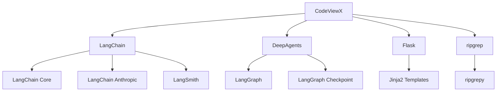

# 项目概览

## 项目简介

CodeViewX 是一个基于 AI 技术的智能代码文档生成工具，旨在通过自动化分析代码库，为开发者提供专业、完整的技术文档。

### 项目目标
- **自动化文档生成**：减少手动编写文档的时间成本
- **深度代码分析**：理解代码结构和设计模式
- **多语言支持**：支持多种编程语言和文档语言
- **智能内容组织**：生成结构化的技术文档

## 技术栈

### 核心技术

#### 编程语言
- **Python 3.8+**：主要开发语言
  - 支持版本：3.8, 3.9, 3.10, 3.11, 3.12
  - 特性利用：类型注解、异步编程、模块化设计

#### AI 框架
- **LangChain 0.3.27**：LLM 应用开发框架
  - 提供统一的 LLM 接口
  - 支持链式调用和工作流编排
- **DeepAgents 0.0.5**：AI Agent 框架
  - 提供智能代理能力
  - 支持工具调用和多步骤推理
- **LangGraph 0.6.10**：工作流编排框架
  - 支持复杂的工作流设计
  - 提供状态管理和检查点功能

#### Web 框架
- **Flask 3.0.0**：轻量级 Web 框架
  - 用于文档浏览服务器
  - 提供静态文件服务和模板渲染

#### 搜索工具
- **ripgrep (rg) 2.0.0**：高性能代码搜索工具
  - 基于 Rust 实现，速度极快
  - 支持正则表达式和多种过滤条件

#### 文档处理
- **Markdown 3.5.1**：Markdown 解析库
- **pymdown-extensions 10.5**：Markdown 扩展
  - 支持目录生成、代码高亮等功能

### 依赖关系图



## 项目结构

### 目录组织

```
codeviewx/
├── codeviewx/                    # 主包目录
│   ├── __init__.py              # 包初始化，版本信息
│   ├── __version__.py           # 版本号定义
│   ├── cli.py                   # 命令行接口
│   ├── core.py                  # 核心 API 模块
│   ├── generator.py             # 文档生成器
│   ├── server.py                # Web 服务器
│   ├── prompt.py                # 提示词管理
│   ├── i18n.py                  # 国际化支持
│   ├── language.py              # 语言检测
│   ├── tools/                   # 工具模块
│   │   ├── __init__.py
│   │   ├── command.py           # 系统命令执行
│   │   ├── filesystem.py        # 文件系统操作
│   │   └── search.py            # 代码搜索
│   ├── prompts/                 # 提示词模板
│   │   ├── __init__.py
│   │   ├── document_engineer.md      # 英文提示词
│   │   └── document_engineer_zh.md   # 中文提示词
│   ├── tpl/                     # HTML 模板
│   │   └── doc_detail.html      # 文档展示页面
│   └── static/                  # 静态资源
│       ├── css/                 # 样式文件
│       ├── js/                  # JavaScript 文件
│       └── images/              # 图片资源
├── tests/                       # 测试文件
│   ├── __init__.py
│   ├── test_core.py
│   ├── test_language.py
│   ├── test_progress.py
│   └── test_tools.py
├── examples/                    # 示例代码
├── docs/                        # 文档输出目录
├── pyproject.toml               # 项目配置文件
├── requirements.txt             # 生产依赖
├── requirements-dev.txt         # 开发依赖
├── README.md                    # 项目说明（英文）
├── README.zh.md                 # 项目说明（中文）
├── LICENSE                      # 许可证文件
└── MANIFEST.in                  # 包含文件清单
```

### 核心模块说明

#### 1. CLI 模块 (`cli.py`)
**功能**：命令行接口和参数解析
- 使用 `argparse` 处理命令行参数
- 支持多种操作模式：生成文档、启动服务器
- 集成国际化支持

#### 2. 生成器模块 (`generator.py`)
**功能**：文档生成的核心逻辑
- 使用 DeepAgents 创建智能代理
- 管理文档生成的工作流程
- 处理多语言和国际化

#### 3. 服务器模块 (`server.py`)
**功能**：Web 文档浏览服务
- 基于 Flask 的 HTTP 服务器
- Markdown 文档渲染和展示
- 文件树导航和目录生成

#### 4. 工具模块 (`tools/`)
**功能**：提供文件系统、搜索、命令执行能力
- `filesystem.py`：文件读写和目录操作
- `search.py`：基于 ripgrep 的代码搜索
- `command.py`：系统命令执行

#### 5. 国际化模块 (`i18n.py`)
**功能**：多语言支持
- 支持中文和英文界面
- 自动语言检测
- 消息翻译和格式化

## 配置文件分析

### pyproject.toml (项目主配置)

```toml
[project]
name = "codeviewx"
version = "0.2.0"
description = "AI-powered code documentation generator based on DeepAgents and LangChain"
requires-python = ">=3.8"
license = {text = "GPL-3.0-or-later"}

dependencies = [
    "langchain>=0.3.27",
    "langchain-anthropic>=0.3.22",
    "deepagents>=0.0.5",
    "ripgrepy>=2.0.0",
    "flask>=2.0.0",
    "markdown>=3.4.0",
]
```

**关键配置**：
- **Python 版本要求**：3.8+
- **许可证**：GPL-3.0-or-later
- **核心依赖**：LangChain 生态系统、Flask、ripgrep

### requirements.txt (生产依赖)

```
langchain==0.3.27
langchain-anthropic==0.3.22
langchain-core==0.3.79
langchain-text-splitters==0.3.11
langgraph==0.6.10
deepagents==0.0.5
ripgrepy==2.0.0
Flask==3.0.0
markdown==3.5.1
pymdown-extensions==10.5
```

## 支持的项目类型

### 编程语言支持
- **Python**：完整支持（主要测试语言）
- **JavaScript/TypeScript**：支持 Node.js 项目
- **Java**：支持 Maven/Gradle 项目
- **Go**：支持 Go Modules 项目
- **Rust**：支持 Cargo 项目
- **其他**：基于文件结构和配置文件的通用分析

### 项目模板支持
- **Web 应用**：Flask、Django、Express、Spring Boot
- **CLI 工具**：Python CLI、Node.js 工具
- **库/SDK**：Python 包、JavaScript 库
- **微服务**：基于配置文件的微服务架构

## 文档生成策略

### 分析优先级
1. **配置文件**：`package.json`、`requirements.txt`、`go.mod` 等
2. **项目文档**：`README.md`、`docs/` 目录
3. **源代码**：`src/`、`lib/`、`app/` 核心模块
4. **数据库**：`schema.sql`、ORM 模型
5. **测试文件**：`tests/`、`__tests__/`

### 忽略的文件和目录
- 版本控制：`.git/`、`.svn/`
- 依赖目录：`node_modules/`、`venv/`、`target/`
- 缓存文件：`__pycache__/`、`.pytest_cache/`
- IDE 配置：`.vscode/`、`.idea/`
- 构建产物：`dist/`、`build/`
- 敏感文件：`.env`、`*.log`

### 生成的文档类型
- **项目概览**：技术栈、目录结构、项目背景
- **快速开始**：安装、配置、基本使用
- **架构设计**：系统架构、模块关系
- **核心机制**：工作流程、算法实现
- **数据模型**：数据库设计、数据结构
- **API 参考**：接口文档、使用示例
- **开发指南**：环境搭建、贡献流程
- **测试策略**：测试覆盖、质量保证