# 系统架构设计

## 整体架构概览

CodeViewX 采用模块化的分层架构设计，结合了现代 AI 技术和传统软件工程最佳实践。系统主要分为以下几个层次：

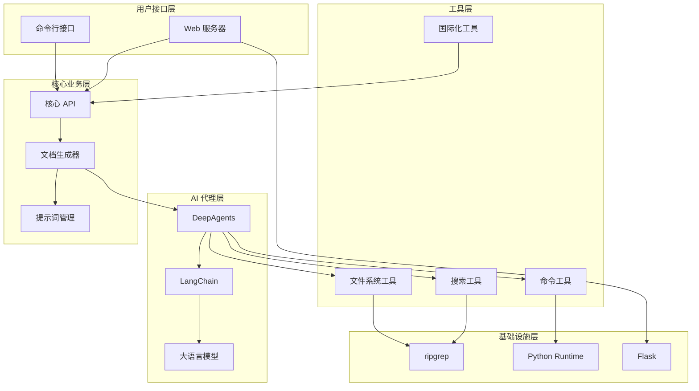

## 核心组件架构

### 1. CLI 模块架构

**文件位置**：`codeviewx/cli.py`

**设计模式**：命令模式 + 策略模式

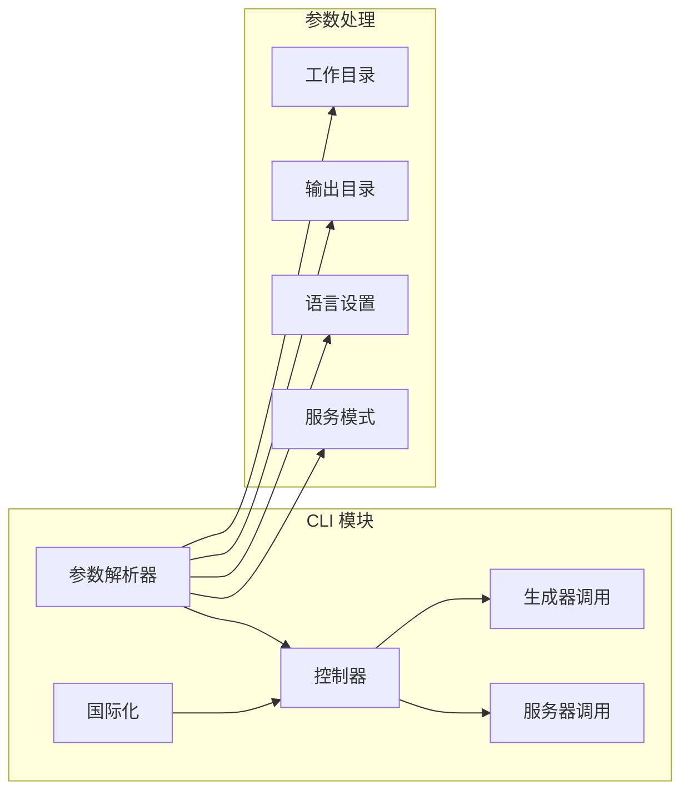

**核心功能**：
- **参数解析**：使用 `argparse` 处理命令行参数
- **模式选择**：根据参数选择生成文档或启动服务器
- **错误处理**：统一的异常处理和用户友好的错误信息
- **国际化**：支持多语言界面

### 2. 文档生成器架构

**文件位置**：`codeviewx/generator.py`

**设计模式**：工厂模式 + 观察者模式

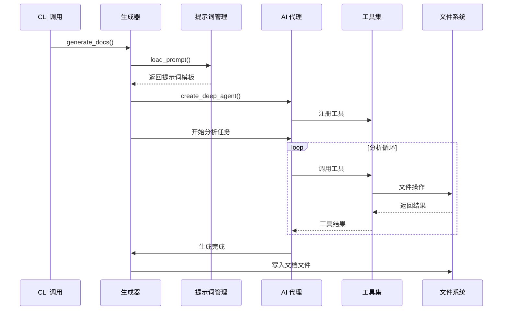

**核心流程**：
1. **初始化阶段**：加载配置、设置日志、检测语言
2. **代理创建阶段**：创建 DeepAgents 实例并注册工具
3. **分析执行阶段**：AI 代理执行分析任务
4. **文档生成阶段**：生成并保存文档文件

### 3. AI 代理架构

**设计模式**：代理模式 + 策略模式

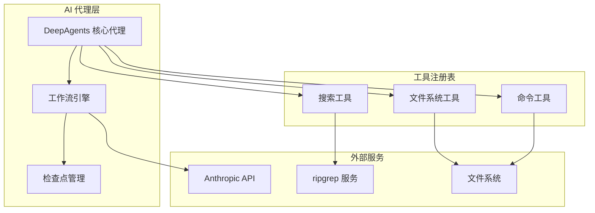

**代理能力**：
- **工具调用**：动态调用各种分析工具
- **工作流编排**：管理复杂的分析流程
- **状态管理**：维护分析过程中的状态信息
- **错误恢复**：通过检查点机制实现错误恢复

### 4. 工具系统架构

**文件位置**：`codeviewx/tools/`

**设计模式**：适配器模式 + 装饰器模式

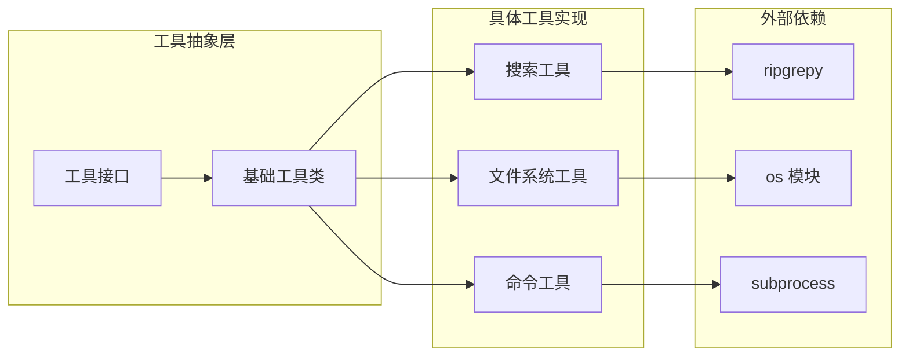

**工具特性**：
- **统一接口**：所有工具实现相同的调用接口
- **错误处理**：统一的错误处理和结果格式化
- **性能优化**：针对不同操作类型的性能优化
- **安全性**：路径验证和权限检查

## 数据流架构

### 文档生成数据流

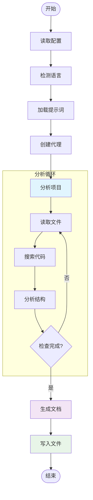

### 工具调用数据流

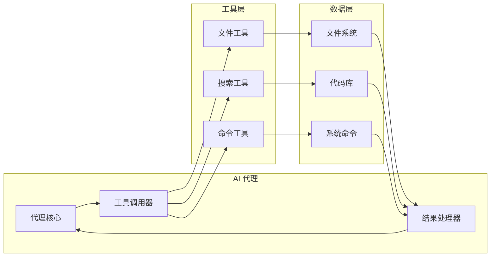

## 模块依赖关系

### 依赖层次图

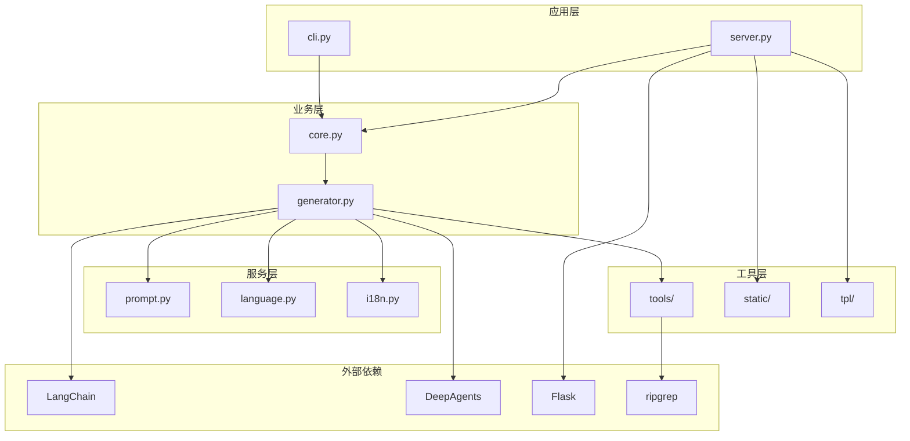

### 模块耦合度分析

| 模块 | 耦合度 | 依赖模块 | 说明 |
|------|--------|----------|------|
| `cli.py` | 低 | `core.py`, `i18n.py` | 仅依赖核心功能，耦合度低 |
| `generator.py` | 中 | `tools/`, `prompt.py`, `i18n.py` | 依赖多个工具模块 |
| `server.py` | 低 | `i18n.py`, `tpl/`, `static/` | 独立的 Web 服务模块 |
| `tools/` | 低 | 外部系统 | 工具模块间相互独立 |
| `i18n.py` | 无 | 无 | 完全独立的模块 |

## 配置管理架构

### 配置层次结构

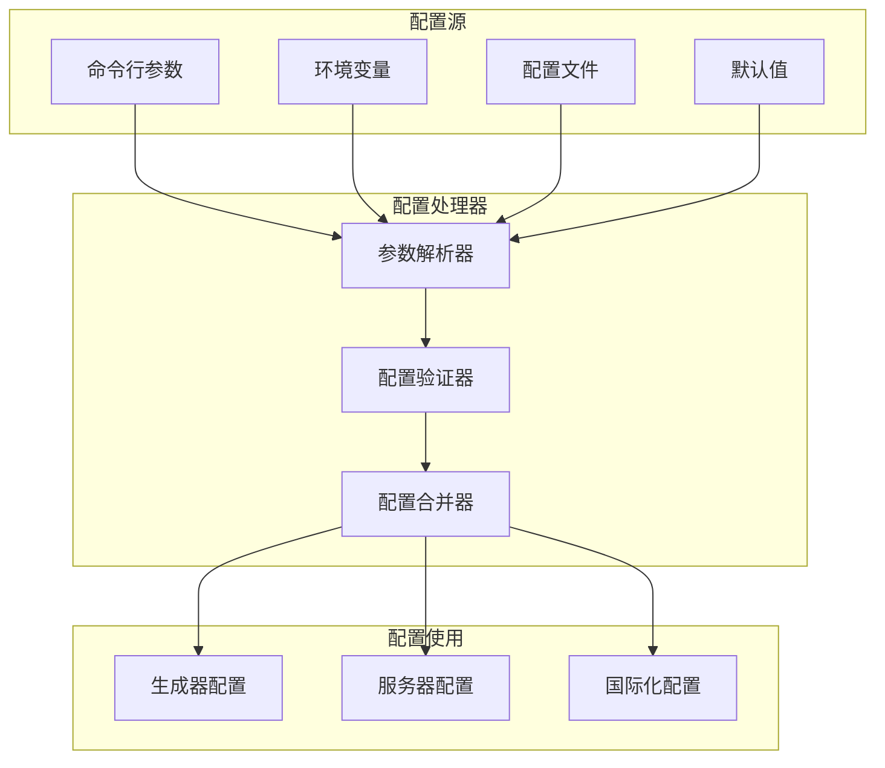

### 配置优先级

1. **命令行参数**（最高优先级）
2. **环境变量**
3. **配置文件**（`pyproject.toml`）
4. **默认值**（最低优先级）

## 扩展性设计

### 插件架构

CodeViewX 设计了可扩展的插件架构，支持：

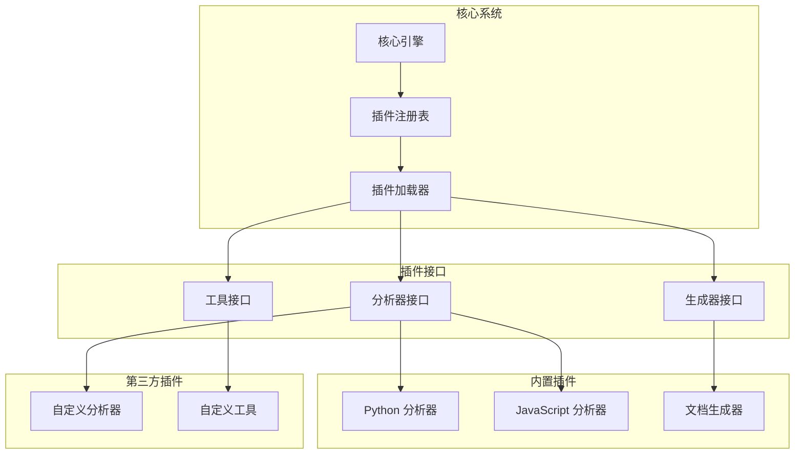

### 扩展点设计

1. **分析器扩展**：支持新的编程语言和框架
2. **生成器扩展**：支持新的文档格式和模板
3. **工具扩展**：支持新的文件操作和搜索工具
4. **模板扩展**：支持自定义文档模板

## 性能优化架构

### 缓存策略

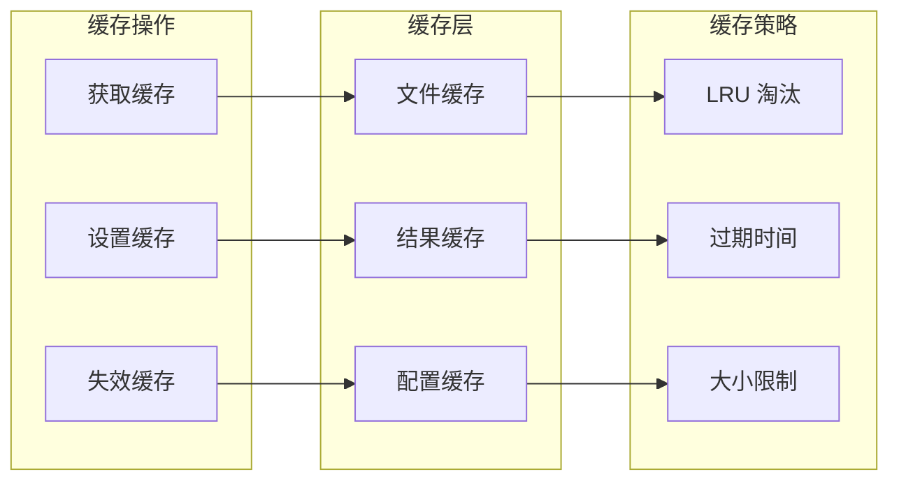

### 并发处理

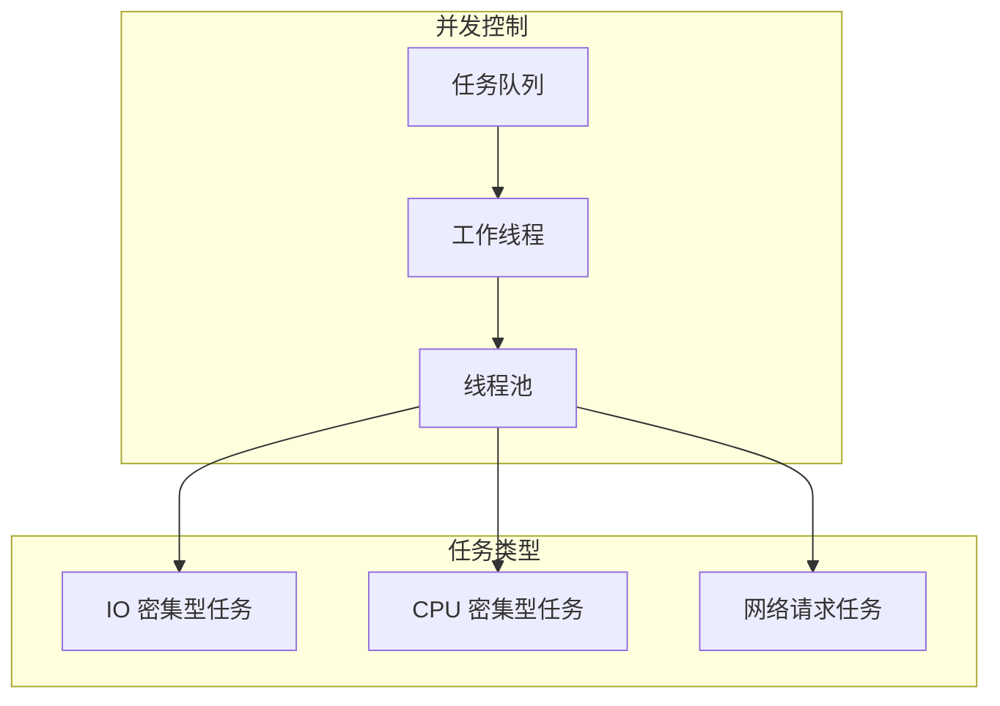

## 安全架构

### 安全防护机制

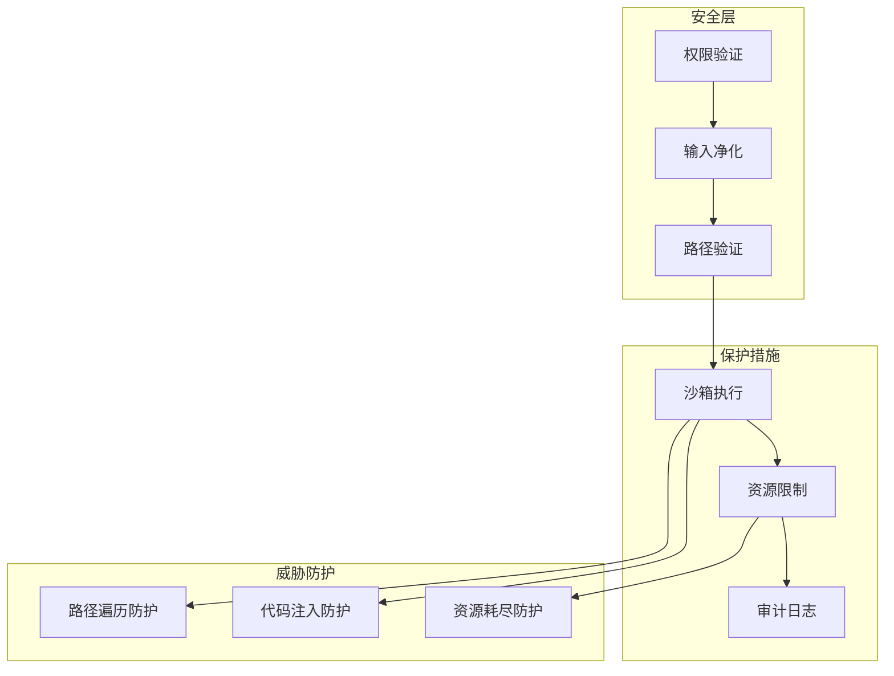

### 安全策略

1. **路径验证**：防止路径遍历攻击
2. **资源限制**：防止资源耗尽攻击
3. **输入净化**：防止代码注入攻击
4. **权限控制**：最小权限原则
5. **审计日志**：完整的操作审计

## 监控与日志架构

### 日志系统

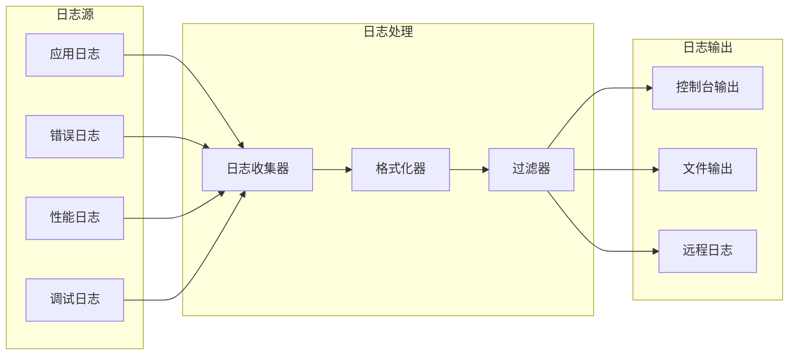

### 监控指标

1. **性能指标**：响应时间、吞吐量、资源使用率
2. **错误指标**：错误率、异常类型、错误分布
3. **业务指标**：文档生成数量、用户活跃度
4. **系统指标**：内存使用、CPU 使用、磁盘 IO

## 部署架构

### 部署模式

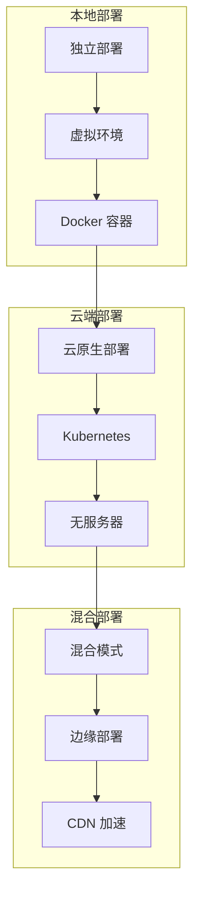

### 容器化架构

```dockerfile
# 基础镜像
FROM python:3.9-slim

# 依赖安装
COPY requirements.txt .
RUN pip install -r requirements.txt

# 应用部署
COPY . /app
WORKDIR /app

# 运行配置
EXPOSE 5000
CMD ["python", "-m", "codeviewx.cli", "--serve"]
```

这种架构设计确保了 CodeViewX 的：

- **可扩展性**：模块化设计支持功能扩展
- **可维护性**：清晰的分层架构便于维护
- **性能**：优化的数据流和缓存策略
- **安全性**：多层安全防护机制
- **可靠性**：完善的错误处理和监控