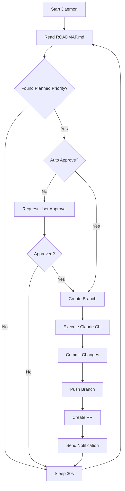

# Autonomous Development Daemon

A minimal Python daemon that continuously reads `ROADMAP.md` and autonomously implements features via Claude CLI.

## Architecture

```
coffee_maker/autonomous/
├── __init__.py                    # Package exports
├── daemon.py                      # Core autonomous loop (407 lines)
├── roadmap_parser.py              # ROADMAP.md parser (281 lines)
├── claude_cli_interface.py        # Claude CLI subprocess wrapper (189 lines)
├── git_manager.py                 # Git operations (271 lines)
└── README.md                      # This file
```

## Quick Start

```bash
# Run daemon (safe mode - asks for approval)
python run_dev_daemon.py

# Run daemon (auto mode - implements without asking)
python run_dev_daemon.py --auto
```

See [DAEMON_USAGE.md](../../docs/DAEMON_USAGE.md) for full documentation.

## Core Components

### 1. DevDaemon (`daemon.py`)

Main autonomous loop that orchestrates the entire workflow.

**Key Methods**:
- `run()` - Main loop: read → approve → implement → commit → repeat
- `_implement_priority(priority)` - Implement a single priority
- `_request_approval(priority)` - Ask user for approval via notifications
- `_build_implementation_prompt(priority)` - Generate Claude CLI prompt

**Example**:
```python
from coffee_maker.autonomous.daemon import DevDaemon

daemon = DevDaemon(
    roadmap_path="docs/ROADMAP.md",
    auto_approve=False,
    create_prs=True
)
daemon.run()
```

### 2. RoadmapParser (`roadmap_parser.py`)

Parses `ROADMAP.md` to extract priorities and their status.

**Key Methods**:
- `get_priorities()` - Extract all priorities from roadmap
- `get_next_planned_priority()` - Find next priority to implement
- `get_in_progress_priorities()` - Find currently active priorities
- `extract_deliverables(priority_name)` - Get deliverables list

**Example**:
```python
from coffee_maker.autonomous.roadmap_parser import RoadmapParser

parser = RoadmapParser("docs/ROADMAP.md")
priorities = parser.get_priorities()
next_task = parser.get_next_planned_priority()

if next_task:
    print(f"Next: {next_task['title']}")
    deliverables = parser.extract_deliverables(next_task['name'])
```

### 3. ClaudeCLI (`claude_cli_interface.py`)

Subprocess wrapper for executing Claude CLI commands.

**Key Methods**:
- `execute_prompt(prompt, timeout)` - Execute a prompt, return result
- `execute_command(args)` - Execute arbitrary Claude CLI command
- `check_available()` - Check if Claude CLI is installed

**Example**:
```python
from coffee_maker.autonomous.claude_cli_interface import ClaudeCLI

cli = ClaudeCLI()

if cli.check_available():
    result = cli.execute_prompt(
        "Read docs/ROADMAP.md and implement PRIORITY 2",
        timeout=3600  # 1 hour
    )

    if result.success:
        print("Implementation complete!")
    else:
        print(f"Error: {result.stderr}")
```

### 4. GitManager (`git_manager.py`)

Git operations for branching, committing, pushing, and creating PRs.

**Key Methods**:
- `create_branch(name)` - Create and checkout branch
- `commit(message)` - Commit changes with message
- `push()` - Push to remote
- `create_pull_request(title, body)` - Create PR via gh CLI
- `is_clean()` - Check if working directory is clean

**Example**:
```python
from coffee_maker.autonomous.git_manager import GitManager

git = GitManager()

if git.is_clean():
    git.create_branch("feature/new-feature")
    # ... make changes ...
    git.commit("feat: Implement new feature")
    git.push()
    pr_url = git.create_pull_request(
        "Add new feature",
        "## Summary\n\nImplemented X, Y, Z"
    )
    print(f"PR created: {pr_url}")
```

## Workflow



## Safety Features

1. **Git-based safety**: All changes in branches, never on `main`
2. **User approval**: Non-auto mode requires explicit approval
3. **Timeouts**: Claude CLI operations timeout after 1 hour
4. **Error handling**: Retry logic and graceful failures
5. **Logging**: Detailed logs in `dev_daemon.log`

## Testing

Run integration tests:
```bash
pytest tests/integration/test_daemon_integration.py -v
```

**Test Coverage**:
- RoadmapParser integration (4 tests)
- ClaudeCLI integration (2 tests)
- GitManager integration (4 tests)
- Component integration (2 tests)
- Safety features (4 tests)

All 16 tests passing ✅

## Configuration

### Daemon Parameters

```python
DevDaemon(
    roadmap_path: str = "docs/ROADMAP.md",
    auto_approve: bool = False,
    create_prs: bool = True,
    sleep_interval: int = 30,
    model: str = "claude-sonnet-4"
)
```

### Environment Variables

- `LANGFUSE_PUBLIC_KEY` - For observability
- `LANGFUSE_SECRET_KEY` - For observability
- `CLAUDE_API_KEY` - Claude authentication

## Dependencies

**Runtime**:
- Claude CLI (`claude`)
- GitHub CLI (`gh`)
- Git
- Python 3.10+

**Python Packages**:
- Standard library only (no external dependencies!)

## Limitations (MVP)

1. **No parallel execution**: Implements one priority at a time
2. **No rollback on failure**: Manual rollback via Git required
3. **No test verification**: Doesn't automatically run tests
4. **Simple parsing**: Uses regex, not full markdown parser
5. **Basic error handling**: Logs and continues on error

These will be addressed in future iterations.

## Future Enhancements

- **Priority 3.1**: Advanced error handling and recovery
- **Priority 3.2**: Parallel implementation of independent priorities
- **Priority 3.3**: Automatic test running and verification
- **Priority 3.4**: Rollback on failure
- **Priority 3.5**: Claude AI integration for roadmap CLI (unified daemon)

## Documentation

- [DAEMON_USAGE.md](../../docs/DAEMON_USAGE.md) - Complete usage guide
- [ROADMAP.md](../../docs/ROADMAP.md) - Project roadmap
- [PRIORITY 3](../../docs/ROADMAP.md#priority-3) - Daemon implementation details

## Contributing

This is an active development project. The daemon is implementing itself! 🤖

To contribute:
1. Add your feature to `docs/ROADMAP.md`
2. Run the daemon: `python run_dev_daemon.py`
3. Review the PR
4. Merge if satisfied

---

**Built with Claude Code** 🤖
