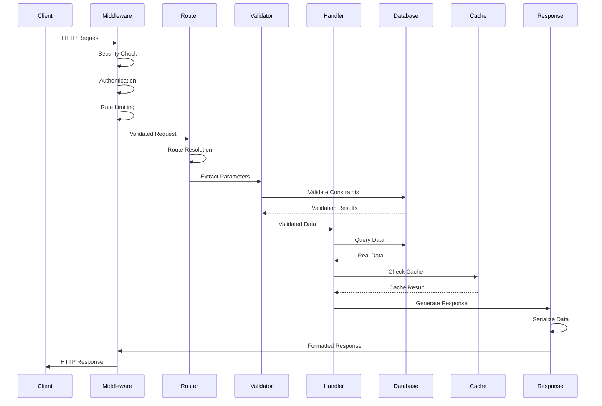

# CovetPy API Design Patterns
## Framework API Design Patterns and Implementation Guidelines

### Executive Summary

This document defines the comprehensive API design patterns for CovetPy framework, establishing consistent, intuitive, and powerful interfaces that enable developers to build production-grade web applications efficiently. All patterns prioritize real backend integrations, type safety, and developer experience while maintaining compatibility with modern Python web development practices.

**Core Design Principles:**
- **Decorator-First Design**: Clean, readable route definitions using Python decorators
- **Type Safety**: Full type hint support with runtime validation
- **Real Data Only**: All patterns integrate with actual backend systems
- **Async-First**: Native async/await support throughout the framework
- **Extensibility**: Plugin-based architecture for custom functionality

---

## 1. Route Definition Patterns

### 1.1 Basic Route Decorator Pattern

```python
from covetpy import CovetApp
from covetpy.decorators import route, get, post, put, delete
from covetpy.types import Request, Response
from typing import Annotated

app = CovetApp()

# Basic route definition with real database integration
@app.route("/api/users", methods=["GET"])
async def get_users(
    request: Request,
    db: Annotated[AsyncSession, Depends(get_database_session)]  # Real DB session
) -> Response[List[UserSchema]]:
    """Get all users from real database."""
    users = await db.execute(select(User))
    return Response(data=[UserSchema.from_orm(user) for user in users.scalars()])

# HTTP method-specific decorators
@app.get("/api/users/{user_id}")
async def get_user(
    user_id: Annotated[int, Path(description="User ID", gt=0)],
    db: Annotated[AsyncSession, Depends(get_database_session)]
) -> Response[UserSchema]:
    """Get specific user by ID from real database."""
    user = await db.get(User, user_id)
    if not user:
        raise HTTPException(status_code=404, detail="User not found")
    return Response(data=UserSchema.from_orm(user))

@app.post("/api/users")
async def create_user(
    user_data: Annotated[UserCreateSchema, Body()],
    db: Annotated[AsyncSession, Depends(get_database_session)],
    auth_service: Annotated[AuthService, Depends(get_auth_service)]
) -> Response[UserSchema]:
    """Create new user with real database persistence."""
    # Validate against real database constraints
    existing_user = await db.scalar(
        select(User).where(User.email == user_data.email)
    )
    if existing_user:
        raise HTTPException(status_code=400, detail="Email already exists")
    
    # Hash password using real security service
    hashed_password = await auth_service.hash_password(user_data.password)
    
    # Create user in real database
    user = User(
        username=user_data.username,
        email=user_data.email,
        password_hash=hashed_password
    )
    db.add(user)
    await db.commit()
    await db.refresh(user)
    
    return Response(data=UserSchema.from_orm(user), status_code=201)
```

### 1.2 Advanced Route Patterns

```python
# Route groups with prefixes and middleware
@app.route_group("/api/v1/admin", middleware=[AdminAuthMiddleware])
class AdminRoutes:
    def __init__(self):
        self.user_service = UserService()  # Real service integration
        self.audit_logger = AuditLogger()   # Real audit logging
    
    @get("/users")
    async def admin_get_users(
        self,
        request: Request,
        filters: Annotated[UserFilters, Query()],
        db: Annotated[AsyncSession, Depends(get_database_session)],
        current_admin: Annotated[User, Depends(get_current_admin_user)]
    ) -> Response[PaginatedList[UserSchema]]:
        """Admin endpoint to get users with filtering and pagination."""
        # Log admin action to real audit system
        await self.audit_logger.log_admin_action(
            admin_id=current_admin.id,
            action="list_users",
            filters=filters.dict(),
            timestamp=datetime.utcnow()
        )
        
        # Query real database with filters
        query = select(User)
        if filters.status:
            query = query.where(User.status == filters.status)
        if filters.created_after:
            query = query.where(User.created_at >= filters.created_after)
        
        # Apply pagination
        offset = (filters.page - 1) * filters.per_page
        users = await db.execute(query.offset(offset).limit(filters.per_page))
        total = await db.scalar(select(func.count(User.id)))
        
        return Response(data=PaginatedList(
            items=[UserSchema.from_orm(user) for user in users.scalars()],
            total=total,
            page=filters.page,
            per_page=filters.per_page
        ))

# Nested resource patterns
@app.route("/api/users/{user_id}/posts/{post_id}")
async def get_user_post(
    user_id: Annotated[int, Path()],
    post_id: Annotated[UUID, Path()],
    db: Annotated[AsyncSession, Depends(get_database_session)],
    cache: Annotated[CacheService, Depends(get_cache_service)]
) -> Response[PostSchema]:
    """Get specific post by user with caching."""
    # Check real cache first
    cache_key = f"user:{user_id}:post:{post_id}"
    cached_post = await cache.get(cache_key)
    if cached_post:
        return Response(data=PostSchema.parse_raw(cached_post))
    
    # Query real database
    post = await db.scalar(
        select(Post)
        .where(Post.id == post_id, Post.author_id == user_id)
        .options(selectinload(Post.author))
    )
    
    if not post:
        raise HTTPException(status_code=404, detail="Post not found")
    
    # Cache in real Redis
    post_data = PostSchema.from_orm(post)
    await cache.set(cache_key, post_data.json(), expire=300)
    
    return Response(data=post_data)
```

---

## 2. Middleware Architecture Patterns

### 2.1 Core Middleware Interface

```python
from abc import ABC, abstractmethod
from covetpy.middleware.base import BaseMiddleware
from covetpy.types import ASGIApp, Scope, Receive, Send

class CovetMiddleware(BaseMiddleware, ABC):
    """Base middleware class for CovetPy framework."""
    
    def __init__(
        self,
        app: ASGIApp,
        config: Optional[Dict[str, Any]] = None,
        logger: Optional[Logger] = None,
        metrics: Optional[MetricsCollector] = None  # Real metrics integration
    ):
        super().__init__(app)
        self.config = config or {}
        self.logger = logger or get_logger(__name__)
        self.metrics = metrics or get_metrics_collector()  # Real metrics service
    
    @abstractmethod
    async def process_request(
        self,
        scope: Scope,
        receive: Receive,
        send: Send
    ) -> Optional[Response]:
        """Process incoming request. Return Response to short-circuit."""
        pass
    
    @abstractmethod
    async def process_response(
        self,
        response: Response,
        scope: Scope
    ) -> Response:
        """Process outgoing response."""
        pass
    
    async def __call__(self, scope: Scope, receive: Receive, send: Send):
        """ASGI middleware entry point."""
        start_time = time.time()
        
        # Process request
        early_response = await self.process_request(scope, receive, send)
        if early_response:
            await early_response.send(scope, receive, send)
            return
        
        # Continue to next middleware/application
        async def send_wrapper(message):
            if message["type"] == "http.response.start":
                # Record real metrics
                duration = time.time() - start_time
                await self.metrics.record_request_duration(
                    path=scope["path"],
                    method=scope["method"],
                    duration=duration
                )
            await send(message)
        
        await self.app(scope, receive, send_wrapper)

# Authentication middleware with real user database
class AuthenticationMiddleware(CovetMiddleware):
    """JWT authentication middleware with real user validation."""
    
    def __init__(
        self,
        app: ASGIApp,
        jwt_service: JWTService,  # Real JWT service
        user_repository: UserRepository,  # Real user data source
        cache_service: CacheService,  # Real cache for user sessions
        **kwargs
    ):
        super().__init__(app, **kwargs)
        self.jwt_service = jwt_service
        self.user_repository = user_repository
        self.cache_service = cache_service
    
    async def process_request(
        self,
        scope: Scope,
        receive: Receive,
        send: Send
    ) -> Optional[Response]:
        """Authenticate user using real JWT validation."""
        # Extract token from header
        headers = dict(scope.get("headers", []))
        auth_header = headers.get(b"authorization", b"").decode()
        
        if not auth_header.startswith("Bearer "):
            # Allow anonymous access to public endpoints
            scope["user"] = None
            return None
        
        token = auth_header[7:]  # Remove "Bearer " prefix
        
        try:
            # Validate token with real JWT service
            payload = await self.jwt_service.validate_token(token)
            user_id = payload.get("user_id")
            
            if not user_id:
                raise HTTPException(status_code=401, detail="Invalid token")
            
            # Check cache for user data
            cache_key = f"user:{user_id}"
            cached_user = await self.cache_service.get(cache_key)
            
            if cached_user:
                user = UserSchema.parse_raw(cached_user)
            else:
                # Fetch from real database
                user = await self.user_repository.get_by_id(user_id)
                if not user:
                    raise HTTPException(status_code=401, detail="User not found")
                
                # Cache user data
                await self.cache_service.set(
                    cache_key,
                    UserSchema.from_orm(user).json(),
                    expire=300
                )
            
            # Add authenticated user to request scope
            scope["user"] = user
            
            # Log authentication event to real audit system
            await self.logger.info(
                f"User {user_id} authenticated",
                extra={
                    "user_id": user_id,
                    "ip_address": scope.get("client", ["unknown"])[0],
                    "user_agent": headers.get(b"user-agent", b"").decode()
                }
            )
            
            return None
            
        except Exception as e:
            # Log authentication failure
            await self.logger.warning(
                f"Authentication failed: {str(e)}",
                extra={
                    "ip_address": scope.get("client", ["unknown"])[0],
                    "token_prefix": token[:10] + "..." if len(token) > 10 else token
                }
            )
            
            return Response(
                data={"error": "Authentication failed"},
                status_code=401
            )
    
    async def process_response(
        self,
        response: Response,
        scope: Scope
    ) -> Response:
        """Add security headers to response."""
        response.headers.update({
            "X-Content-Type-Options": "nosniff",
            "X-Frame-Options": "DENY",
            "X-XSS-Protection": "1; mode=block"
        })
        return response
```

### 2.2 Built-in Middleware Patterns

```python
# CORS middleware with real origin validation
class CORSMiddleware(CovetMiddleware):
    """CORS middleware with database-backed origin validation."""
    
    def __init__(
        self,
        app: ASGIApp,
        allowed_origins: List[str],
        security_service: SecurityService,  # Real security validation
        **kwargs
    ):
        super().__init__(app, **kwargs)
        self.allowed_origins = set(allowed_origins)
        self.security_service = security_service
    
    async def process_request(
        self,
        scope: Scope,
        receive: Receive,
        send: Send
    ) -> Optional[Response]:
        """Handle CORS preflight requests."""
        if scope["method"] != "OPTIONS":
            return None
        
        headers = dict(scope.get("headers", []))
        origin = headers.get(b"origin", b"").decode()
        
        # Validate origin against real security policies
        if not await self.security_service.validate_origin(origin):
            return Response(
                data={"error": "Origin not allowed"},
                status_code=403
            )
        
        # Handle preflight request
        cors_headers = {
            "Access-Control-Allow-Origin": origin,
            "Access-Control-Allow-Methods": "GET, POST, PUT, DELETE, OPTIONS",
            "Access-Control-Allow-Headers": "Content-Type, Authorization",
            "Access-Control-Max-Age": "86400"
        }
        
        return Response(data={}, headers=cors_headers)

# Rate limiting middleware with Redis backend
class RateLimitMiddleware(CovetMiddleware):
    """Rate limiting middleware using real Redis backend."""
    
    def __init__(
        self,
        app: ASGIApp,
        redis_client: aioredis.Redis,  # Real Redis connection
        default_rate_limit: int = 100,
        window_seconds: int = 60,
        **kwargs
    ):
        super().__init__(app, **kwargs)
        self.redis = redis_client
        self.default_rate_limit = default_rate_limit
        self.window_seconds = window_seconds
    
    async def process_request(
        self,
        scope: Scope,
        receive: Receive,
        send: Send
    ) -> Optional[Response]:
        """Apply rate limiting using Redis sliding window."""
        # Get client identifier
        client_ip = scope.get("client", ["unknown"])[0]
        user = scope.get("user")
        
        # Use user ID if authenticated, otherwise IP address
        rate_limit_key = f"user:{user.id}" if user else f"ip:{client_ip}"
        redis_key = f"rate_limit:{rate_limit_key}"
        
        # Implement sliding window rate limiting
        current_time = time.time()
        window_start = current_time - self.window_seconds
        
        # Use Redis sorted set for sliding window
        async with self.redis.pipeline() as pipe:
            # Remove expired entries
            await pipe.zremrangebyscore(redis_key, 0, window_start)
            # Count current requests
            await pipe.zcard(redis_key)
            # Add current request
            await pipe.zadd(redis_key, {str(current_time): current_time})
            # Set expiration
            await pipe.expire(redis_key, self.window_seconds)
            results = await pipe.execute()
        
        current_requests = results[1]
        
        # Check if rate limit exceeded
        if current_requests >= self.default_rate_limit:
            # Log rate limit violation to real monitoring
            await self.metrics.increment(
                "rate_limit_exceeded",
                tags={
                    "client": rate_limit_key,
                    "endpoint": scope["path"]
                }
            )
            
            return Response(
                data={
                    "error": "Rate limit exceeded",
                    "limit": self.default_rate_limit,
                    "window": self.window_seconds,
                    "retry_after": self.window_seconds
                },
                status_code=429,
                headers={"Retry-After": str(self.window_seconds)}
            )
        
        # Add rate limit headers
        scope["rate_limit_info"] = {
            "limit": self.default_rate_limit,
            "remaining": self.default_rate_limit - current_requests - 1,
            "reset": int(current_time + self.window_seconds)
        }
        
        return None
```

---

## 3. Dependency Injection Patterns

### 3.1 Core Dependency System

```python
from typing import TypeVar, Callable, Any, Dict, Optional
from inspect import signature, Parameter
import asyncio

T = TypeVar('T')

class DependencyProvider:
    """Dependency injection provider with real service instantiation."""
    
    def __init__(self):
        self._providers: Dict[type, Callable] = {}
        self._singletons: Dict[type, Any] = {}
        self._real_services: Dict[str, Any] = {}  # Real service instances
    
    def register_singleton(self, interface: type, implementation: Callable[[], T]):
        """Register singleton dependency with real service creation."""
        self._providers[interface] = implementation
        # Create real service instance immediately
        self._singletons[interface] = implementation()
    
    def register_factory(self, interface: type, factory: Callable[[], T]):
        """Register factory dependency that creates real instances."""
        self._providers[interface] = factory
    
    async def resolve(self, interface: type) -> T:
        """Resolve dependency with real service instance."""
        if interface in self._singletons:
            return self._singletons[interface]
        
        if interface not in self._providers:
            raise ValueError(f"No provider registered for {interface}")
        
        provider = self._providers[interface]
        if asyncio.iscoroutinefunction(provider):
            return await provider()
        return provider()

# Global dependency container
_dependency_container = DependencyProvider()

def Depends(dependency: Callable[[], T]) -> T:
    """Dependency injection marker for real services."""
    return dependency

# Real service dependencies
async def get_database_session() -> AsyncSession:
    """Get real database session from connection pool."""
    engine = create_async_engine(
        settings.DATABASE_URL,
        pool_size=20,
        max_overflow=30,
        echo=settings.DEBUG
    )
    async with AsyncSession(engine) as session:
        try:
            yield session
        finally:
            await session.close()

async def get_cache_service() -> CacheService:
    """Get real Redis cache service."""
    redis_client = aioredis.from_url(
        settings.REDIS_URL,
        encoding="utf-8",
        decode_responses=True
    )
    return CacheService(redis_client)

async def get_auth_service() -> AuthService:
    """Get real authentication service."""
    return AuthService(
        secret_key=settings.JWT_SECRET_KEY,
        algorithm=settings.JWT_ALGORITHM,
        expire_minutes=settings.JWT_EXPIRE_MINUTES
    )

async def get_current_user(
    token: Annotated[str, Header(alias="Authorization")],
    db: Annotated[AsyncSession, Depends(get_database_session)],
    auth_service: Annotated[AuthService, Depends(get_auth_service)]
) -> User:
    """Get current authenticated user from real database."""
    if not token.startswith("Bearer "):
        raise HTTPException(status_code=401, detail="Invalid authentication")
    
    token = token[7:]  # Remove "Bearer " prefix
    
    try:
        payload = await auth_service.validate_token(token)
        user_id = payload.get("user_id")
        
        # Fetch real user from database
        user = await db.get(User, user_id)
        if not user or not user.is_active:
            raise HTTPException(status_code=401, detail="User not found or inactive")
        
        return user
    except Exception as e:
        raise HTTPException(status_code=401, detail="Invalid authentication")

# Usage in route handlers
@app.get("/api/profile")
async def get_user_profile(
    current_user: Annotated[User, Depends(get_current_user)],
    db: Annotated[AsyncSession, Depends(get_database_session)],
    cache: Annotated[CacheService, Depends(get_cache_service)]
) -> Response[UserProfileSchema]:
    """Get user profile with real data from database and cache."""
    # Check cache first
    cache_key = f"user_profile:{current_user.id}"
    cached_profile = await cache.get(cache_key)
    
    if cached_profile:
        return Response(data=UserProfileSchema.parse_raw(cached_profile))
    
    # Query real database with relationships
    user_with_profile = await db.scalar(
        select(User)
        .where(User.id == current_user.id)
        .options(
            selectinload(User.profile),
            selectinload(User.preferences)
        )
    )
    
    profile_data = UserProfileSchema.from_orm(user_with_profile)
    
    # Cache in Redis for 5 minutes
    await cache.set(cache_key, profile_data.json(), expire=300)
    
    return Response(data=profile_data)
```

### 3.2 Advanced Dependency Patterns

```python
# Scoped dependencies for database transactions
class TransactionScope:
    """Database transaction scope with automatic rollback on error."""
    
    def __init__(self, db_session: AsyncSession):
        self.db_session = db_session
        self.transaction = None
    
    async def __aenter__(self):
        self.transaction = await self.db_session.begin()
        return self.db_session
    
    async def __aexit__(self, exc_type, exc_val, exc_tb):
        if exc_type:
            await self.transaction.rollback()
        else:
            await self.transaction.commit()

async def get_transaction_scope(
    db: Annotated[AsyncSession, Depends(get_database_session)]
) -> TransactionScope:
    """Get database transaction scope for atomic operations."""
    return TransactionScope(db)

# Multi-tenant dependency pattern
async def get_tenant_database(
    tenant_id: Annotated[str, Header()],
    tenant_service: Annotated[TenantService, Depends(get_tenant_service)]
) -> AsyncSession:
    """Get tenant-specific database connection."""
    # Validate tenant and get real database URL
    tenant = await tenant_service.get_tenant_by_id(tenant_id)
    if not tenant:
        raise HTTPException(status_code=400, detail="Invalid tenant")
    
    # Create tenant-specific database connection
    engine = create_async_engine(tenant.database_url)
    async with AsyncSession(engine) as session:
        try:
            yield session
        finally:
            await session.close()

# Permission-based dependencies
async def require_permission(permission: str):
    """Dependency factory for permission-based access control."""
    async def check_permission(
        current_user: Annotated[User, Depends(get_current_user)],
        auth_service: Annotated[AuthService, Depends(get_auth_service)]
    ) -> User:
        # Check real permissions in database
        has_permission = await auth_service.user_has_permission(
            current_user.id, permission
        )
        
        if not has_permission:
            raise HTTPException(
                status_code=403,
                detail=f"Permission '{permission}' required"
            )
        
        return current_user
    
    return check_permission

# Usage with permission dependency
@app.delete("/api/admin/users/{user_id}")
async def delete_user(
    user_id: int,
    admin_user: Annotated[User, Depends(require_permission("users.delete"))],
    db: Annotated[AsyncSession, Depends(get_database_session)],
    audit_logger: Annotated[AuditLogger, Depends(get_audit_logger)]
) -> Response[Dict[str, str]]:
    """Delete user with permission check and audit logging."""
    # Get user from real database
    user = await db.get(User, user_id)
    if not user:
        raise HTTPException(status_code=404, detail="User not found")
    
    # Log deletion to real audit system
    await audit_logger.log_admin_action(
        admin_id=admin_user.id,
        action="delete_user",
        target_user_id=user_id,
        target_username=user.username,
        timestamp=datetime.utcnow()
    )
    
    # Soft delete in database
    user.is_active = False
    user.deleted_at = datetime.utcnow()
    await db.commit()
    
    return Response(data={"message": "User deleted successfully"})
```

---

## 4. Request/Response Lifecycle Patterns

### 4.1 Request Processing Pipeline



### 4.2 Request Object Pattern

```python
from typing import Optional, Dict, Any, List
from multipart import MultipartParser
import json
import asyncio

class Request:
    """Enhanced request object with real data parsing."""
    
    def __init__(
        self,
        scope: Dict[str, Any],
        receive: Callable,
        database: AsyncSession,  # Real database connection
        cache: CacheService,     # Real cache service
        user: Optional[User] = None
    ):
        self.scope = scope
        self.receive = receive
        self.database = database
        self.cache = cache
        self.user = user
        self._body: Optional[bytes] = None
        self._json: Optional[Dict[str, Any]] = None
        self._form: Optional[Dict[str, Any]] = None
        self._files: Optional[Dict[str, Any]] = None
    
    @property
    def method(self) -> str:
        """HTTP method."""
        return self.scope["method"]
    
    @property
    def url(self) -> str:
        """Request URL."""
        scheme = self.scope.get("scheme", "http")
        server = self.scope.get("server", ("localhost", 80))
        path = self.scope.get("path", "/")
        query = self.scope.get("query_string", b"").decode()
        url = f"{scheme}://{server[0]}:{server[1]}{path}"
        if query:
            url += f"?{query}"
        return url
    
    @property
    def headers(self) -> Dict[str, str]:
        """Request headers."""
        return {
            key.decode(): value.decode()
            for key, value in self.scope.get("headers", [])
        }
    
    @property
    def query_params(self) -> Dict[str, str]:
        """Query parameters."""
        query_string = self.scope.get("query_string", b"").decode()
        if not query_string:
            return {}
        
        params = {}
        for param in query_string.split("&"):
            if "=" in param:
                key, value = param.split("=", 1)
                params[key] = value
            else:
                params[param] = ""
        return params
    
    async def body(self) -> bytes:
        """Get raw request body."""
        if self._body is None:
            body_parts = []
            while True:
                message = await self.receive()
                if message["type"] == "http.request":
                    body_parts.append(message.get("body", b""))
                    if not message.get("more_body", False):
                        break
            self._body = b"".join(body_parts)
        return self._body
    
    async def json(self) -> Dict[str, Any]:
        """Parse JSON body with error handling."""
        if self._json is None:
            body = await self.body()
            if not body:
                self._json = {}
            else:
                try:
                    self._json = json.loads(body.decode())
                except json.JSONDecodeError as e:
                    raise HTTPException(
                        status_code=400,
                        detail=f"Invalid JSON: {str(e)}"
                    )
        return self._json
    
    async def form(self) -> Dict[str, Any]:
        """Parse form data."""
        if self._form is None:
            body = await self.body()
            content_type = self.headers.get("content-type", "")
            
            if "application/x-www-form-urlencoded" in content_type:
                form_data = {}
                if body:
                    for pair in body.decode().split("&"):
                        if "=" in pair:
                            key, value = pair.split("=", 1)
                            form_data[key] = value
                self._form = form_data
            else:
                self._form = {}
        return self._form
    
    async def files(self) -> Dict[str, Any]:
        """Parse multipart form data with file uploads."""
        if self._files is None:
            body = await self.body()
            content_type = self.headers.get("content-type", "")
            
            if "multipart/form-data" in content_type:
                boundary = content_type.split("boundary=")[1]
                parser = MultipartParser(boundary.encode())
                
                files = {}
                forms = {}
                
                for part in parser.parse(body):
                    name = part.name
                    if part.filename:  # File upload
                        # Save file to real storage backend
                        file_service = FileStorageService()
                        file_url = await file_service.save_file(
                            part.raw,
                            part.filename,
                            content_type=part.content_type
                        )
                        files[name] = {
                            "filename": part.filename,
                            "content_type": part.content_type,
                            "size": len(part.raw),
                            "url": file_url,
                            "data": part.raw
                        }
                    else:  # Regular form field
                        forms[name] = part.raw.decode()
                
                self._files = {"files": files, "form": forms}
            else:
                self._files = {"files": {}, "form": {}}
        
        return self._files
    
    async def get_user_session(self) -> Optional[Dict[str, Any]]:
        """Get user session data from real cache."""
        if not self.user:
            return None
        
        session_key = f"session:{self.user.id}"
        session_data = await self.cache.get(session_key)
        
        if session_data:
            return json.loads(session_data)
        return None
    
    async def set_user_session(self, data: Dict[str, Any]):
        """Set user session data in real cache."""
        if not self.user:
            raise ValueError("User must be authenticated to set session")
        
        session_key = f"session:{self.user.id}"
        await self.cache.set(
            session_key,
            json.dumps(data),
            expire=3600  # 1 hour
        )
```

### 4.3 Response Object Pattern

```python
from typing import Any, Dict, Optional, Union
import json
from datetime import datetime

class Response:
    """Enhanced response object with real data serialization."""
    
    def __init__(
        self,
        data: Any = None,
        status_code: int = 200,
        headers: Optional[Dict[str, str]] = None,
        media_type: str = "application/json",
        cookies: Optional[List[Dict[str, Any]]] = None
    ):
        self.data = data
        self.status_code = status_code
        self.headers = headers or {}
        self.media_type = media_type
        self.cookies = cookies or []
    
    def set_cookie(
        self,
        key: str,
        value: str,
        max_age: Optional[int] = None,
        expires: Optional[datetime] = None,
        path: str = "/",
        domain: Optional[str] = None,
        secure: bool = False,
        httponly: bool = False,
        samesite: str = "lax"
    ):
        """Set HTTP cookie with security options."""
        cookie = {
            "key": key,
            "value": value,
            "path": path,
            "secure": secure,
            "httponly": httponly,
            "samesite": samesite
        }
        
        if max_age is not None:
            cookie["max_age"] = max_age
        if expires is not None:
            cookie["expires"] = expires
        if domain is not None:
            cookie["domain"] = domain
        
        self.cookies.append(cookie)
    
    async def serialize_data(self, serializer_service: SerializerService) -> bytes:
        """Serialize response data using real serialization service."""
        if self.data is None:
            return b""
        
        if self.media_type == "application/json":
            # Use fast JSON serialization
            if hasattr(self.data, "json"):  # Pydantic model
                return self.data.json().encode()
            elif hasattr(self.data, "dict"):  # Pydantic model
                return json.dumps(self.data.dict()).encode()
            else:
                # Use orjson for performance
                import orjson
                return orjson.dumps(self.data)
        
        elif self.media_type == "application/xml":
            return await serializer_service.to_xml(self.data)
        
        elif self.media_type == "application/msgpack":
            import msgpack
            return msgpack.packb(self.data)
        
        else:
            # Default to string conversion
            return str(self.data).encode()
    
    async def send(
        self,
        scope: Dict[str, Any],
        receive: Callable,
        send: Callable,
        serializer_service: SerializerService
    ):
        """Send response via ASGI."""
        # Serialize data
        body = await self.serialize_data(serializer_service)
        
        # Prepare headers
        headers = []
        for key, value in self.headers.items():
            headers.append([key.encode(), value.encode()])
        
        # Add content type
        headers.append([b"content-type", self.media_type.encode()])
        headers.append([b"content-length", str(len(body)).encode()])
        
        # Add cookies
        for cookie in self.cookies:
            cookie_value = f"{cookie['key']}={cookie['value']}; Path={cookie['path']}"
            if cookie.get("max_age"):
                cookie_value += f"; Max-Age={cookie['max_age']}"
            if cookie.get("expires"):
                cookie_value += f"; Expires={cookie['expires'].strftime('%a, %d %b %Y %H:%M:%S GMT')}"
            if cookie.get("domain"):
                cookie_value += f"; Domain={cookie['domain']}"
            if cookie.get("secure"):
                cookie_value += "; Secure"
            if cookie.get("httponly"):
                cookie_value += "; HttpOnly"
            cookie_value += f"; SameSite={cookie.get('samesite', 'lax')}"
            
            headers.append([b"set-cookie", cookie_value.encode()])
        
        # Send response start
        await send({
            "type": "http.response.start",
            "status": self.status_code,
            "headers": headers
        })
        
        # Send response body
        await send({
            "type": "http.response.body",
            "body": body
        })
```

---

## 5. Error Handling Patterns

### 5.1 Comprehensive Error Handling System

```python
from typing import Optional, Dict, Any, List
from enum import Enum
import traceback
import asyncio

class ErrorCategory(str, Enum):
    """Error categories for classification."""
    VALIDATION = "validation"
    AUTHENTICATION = "authentication"
    AUTHORIZATION = "authorization"
    NOT_FOUND = "not_found"
    BUSINESS_LOGIC = "business_logic"
    EXTERNAL_SERVICE = "external_service"
    SYSTEM = "system"

class CovetException(Exception):
    """Base exception class for CovetPy framework."""
    
    def __init__(
        self,
        message: str,
        status_code: int = 500,
        category: ErrorCategory = ErrorCategory.SYSTEM,
        details: Optional[Dict[str, Any]] = None,
        error_code: Optional[str] = None
    ):
        super().__init__(message)
        self.message = message
        self.status_code = status_code
        self.category = category
        self.details = details or {}
        self.error_code = error_code or f"{category.value.upper()}_ERROR"

class ValidationException(CovetException):
    """Exception for validation errors."""
    
    def __init__(
        self,
        field_errors: List[Dict[str, Any]],
        message: str = "Validation failed"
    ):
        super().__init__(
            message=message,
            status_code=422,
            category=ErrorCategory.VALIDATION,
            details={"field_errors": field_errors},
            error_code="VALIDATION_ERROR"
        )
        self.field_errors = field_errors

class BusinessLogicException(CovetException):
    """Exception for business logic violations."""
    
    def __init__(
        self,
        message: str,
        business_rule: str,
        context: Optional[Dict[str, Any]] = None
    ):
        super().__init__(
            message=message,
            status_code=400,
            category=ErrorCategory.BUSINESS_LOGIC,
            details={"business_rule": business_rule, "context": context or {}},
            error_code="BUSINESS_RULE_VIOLATION"
        )

class ExternalServiceException(CovetException):
    """Exception for external service failures."""
    
    def __init__(
        self,
        service_name: str,
        service_error: str,
        retry_after: Optional[int] = None
    ):
        super().__init__(
            message=f"External service '{service_name}' failed: {service_error}",
            status_code=502,
            category=ErrorCategory.EXTERNAL_SERVICE,
            details={"service_name": service_name, "retry_after": retry_after},
            error_code="EXTERNAL_SERVICE_ERROR"
        )

# Global error handler
class ErrorHandler:
    """Global error handling with real logging and monitoring."""
    
    def __init__(
        self,
        logger: Logger,
        metrics_collector: MetricsCollector,  # Real metrics service
        error_reporter: ErrorReporter,        # Real error reporting (Sentry, etc.)
        notification_service: NotificationService  # Real alerts
    ):
        self.logger = logger
        self.metrics = metrics_collector
        self.error_reporter = error_reporter
        self.notifications = notification_service
    
    async def handle_exception(
        self,
        exception: Exception,
        request: Request,
        response_formatter: ResponseFormatter
    ) -> Response:
        """Handle exception with comprehensive logging and monitoring."""
        # Generate unique error ID for tracking
        error_id = str(uuid.uuid4())
        
        # Extract request context
        context = {
            "error_id": error_id,
            "request_method": request.method,
            "request_url": request.url,
            "request_headers": dict(request.headers),
            "user_id": request.user.id if request.user else None,
            "user_agent": request.headers.get("user-agent"),
            "ip_address": request.scope.get("client", ["unknown"])[0],
            "timestamp": datetime.utcnow().isoformat()
        }
        
        # Handle different exception types
        if isinstance(exception, CovetException):
            response = await self._handle_covet_exception(
                exception, context, response_formatter
            )
        elif isinstance(exception, asyncio.TimeoutError):
            response = await self._handle_timeout_error(
                exception, context, response_formatter
            )
        else:
            response = await self._handle_unknown_exception(
                exception, context, response_formatter
            )
        
        # Log error to real systems
        await self._log_error(exception, context)
        
        # Send metrics to real monitoring
        await self._record_error_metrics(exception, context)
        
        # Report critical errors
        if response.status_code >= 500:
            await self._report_critical_error(exception, context)
        
        return response
    
    async def _handle_covet_exception(
        self,
        exception: CovetException,
        context: Dict[str, Any],
        formatter: ResponseFormatter
    ) -> Response:
        """Handle CovetPy framework exceptions."""
        error_response = {
            "error": {
                "message": exception.message,
                "code": exception.error_code,
                "category": exception.category.value,
                "details": exception.details,
                "trace_id": context["error_id"]
            }
        }
        
        return Response(
            data=error_response,
            status_code=exception.status_code,
            headers={"X-Error-ID": context["error_id"]}
        )
    
    async def _log_error(
        self,
        exception: Exception,
        context: Dict[str, Any]
    ):
        """Log error to real logging system."""
        log_data = {
            **context,
            "exception_type": type(exception).__name__,
            "exception_message": str(exception),
            "traceback": traceback.format_exc()
        }
        
        if isinstance(exception, CovetException):
            log_level = "warning" if exception.status_code < 500 else "error"
        else:
            log_level = "error"
        
        await self.logger.log(
            level=log_level,
            message=f"Request error: {str(exception)}",
            extra=log_data
        )
    
    async def _record_error_metrics(
        self,
        exception: Exception,
        context: Dict[str, Any]
    ):
        """Record error metrics in real monitoring system."""
        tags = {
            "exception_type": type(exception).__name__,
            "request_method": context["request_method"],
            "status_code": getattr(exception, "status_code", 500)
        }
        
        if isinstance(exception, CovetException):
            tags["error_category"] = exception.category.value
        
        await self.metrics.increment("http_errors_total", tags=tags)
        
        # Record error rate by endpoint
        endpoint_tags = {
            "endpoint": context["request_url"],
            "method": context["request_method"]
        }
        await self.metrics.increment("endpoint_errors_total", tags=endpoint_tags)
    
    async def _report_critical_error(
        self,
        exception: Exception,
        context: Dict[str, Any]
    ):
        """Report critical errors to real error tracking service."""
        # Send to Sentry or similar service
        await self.error_reporter.capture_exception(
            exception,
            extra=context,
            tags={
                "component": "covetpy_framework",
                "severity": "critical" if context.get("status_code", 500) >= 500 else "error"
            }
        )
        
        # Send alert to operations team
        if hasattr(exception, "status_code") and exception.status_code >= 500:
            await self.notifications.send_alert(
                title=f"Critical Error in CovetPy Application",
                message=f"Error ID: {context['error_id']}\n"
                       f"Exception: {str(exception)}\n"
                       f"URL: {context['request_url']}\n"
                       f"User: {context.get('user_id', 'Anonymous')}",
                severity="critical",
                channels=["slack", "email"]
            )
```

### 5.2 Validation Error Patterns

```python
from pydantic import BaseModel, ValidationError, validator
from typing import List, Any, Dict

class DetailedValidationError:
    """Detailed validation error with real database context."""
    
    def __init__(
        self,
        field: str,
        message: str,
        rejected_value: Any,
        error_code: str,
        context: Optional[Dict[str, Any]] = None
    ):
        self.field = field
        self.message = message
        self.rejected_value = rejected_value
        self.error_code = error_code
        self.context = context or {}

async def validate_request_data(
    data: Dict[str, Any],
    schema_class: type[BaseModel],
    db: AsyncSession,
    validation_service: ValidationService  # Real validation service
) -> BaseModel:
    """Validate request data with database constraints."""
    errors = []
    
    try:
        # Basic Pydantic validation
        validated_data = schema_class(**data)
        
        # Additional database validations
        if hasattr(schema_class, "__validation_rules__"):
            db_errors = await validation_service.validate_database_constraints(
                validated_data,
                schema_class.__validation_rules__,
                db
            )
            errors.extend(db_errors)
        
        if errors:
            raise ValidationException(
                field_errors=[
                    {
                        "field": error.field,
                        "message": error.message,
                        "code": error.error_code,
                        "rejected_value": error.rejected_value,
                        "context": error.context
                    }
                    for error in errors
                ]
            )
        
        return validated_data
        
    except ValidationError as e:
        # Convert Pydantic errors to detailed format
        pydantic_errors = []
        for error in e.errors():
            field_path = ".".join(str(loc) for loc in error["loc"])
            pydantic_errors.append(DetailedValidationError(
                field=field_path,
                message=error["msg"],
                rejected_value=error.get("input"),
                error_code=error["type"],
                context={"validation_type": "pydantic"}
            ))
        
        raise ValidationException(
            field_errors=[
                {
                    "field": error.field,
                    "message": error.message,
                    "code": error.error_code,
                    "rejected_value": error.rejected_value,
                    "context": error.context
                }
                for error in pydantic_errors
            ]
        )
```

---

## 6. Extension System Patterns

### 6.1 Plugin Architecture

```python
from abc import ABC, abstractmethod
from typing import Dict, Any, List, Optional, Type
import importlib
import inspect

class CovetPlugin(ABC):
    """Base class for CovetPy plugins."""
    
    name: str
    version: str
    description: str
    dependencies: List[str] = []
    
    @abstractmethod
    async def initialize(
        self,
        app: 'CovetApp',
        config: Dict[str, Any],
        services: Dict[str, Any]  # Real service instances
    ) -> None:
        """Initialize plugin with real services."""
        pass
    
    @abstractmethod
    async def shutdown(self) -> None:
        """Cleanup plugin resources."""
        pass

class DatabasePlugin(CovetPlugin):
    """Database integration plugin with real connections."""
    
    name = "database"
    version = "1.0.0"
    description = "Database integration with SQLAlchemy"
    
    def __init__(self):
        self.engines: Dict[str, AsyncEngine] = {}
        self.session_factories: Dict[str, sessionmaker] = {}
    
    async def initialize(
        self,
        app: 'CovetApp',
        config: Dict[str, Any],
        services: Dict[str, Any]
    ) -> None:
        """Initialize database connections."""
        database_configs = config.get("databases", {})
        
        for name, db_config in database_configs.items():
            # Create real database engine
            engine = create_async_engine(
                db_config["url"],
                pool_size=db_config.get("pool_size", 20),
                max_overflow=db_config.get("max_overflow", 30),
                echo=db_config.get("echo", False)
            )
            
            self.engines[name] = engine
            
            # Create session factory
            session_factory = async_sessionmaker(
                engine,
                class_=AsyncSession,
                expire_on_commit=False
            )
            self.session_factories[name] = session_factory
            
            # Register database service
            services[f"db_{name}"] = DatabaseService(
                engine=engine,
                session_factory=session_factory
            )
        
        # Add database dependency providers
        app.add_dependency_provider(
            "database",
            lambda: self.get_session("default")
        )
    
    async def get_session(self, database_name: str = "default") -> AsyncSession:
        """Get database session for specific database."""
        if database_name not in self.session_factories:
            raise ValueError(f"Database '{database_name}' not configured")
        
        session_factory = self.session_factories[database_name]
        return session_factory()
    
    async def shutdown(self) -> None:
        """Close all database connections."""
        for engine in self.engines.values():
            await engine.dispose()

class CachePlugin(CovetPlugin):
    """Caching plugin with real Redis integration."""
    
    name = "cache"
    version = "1.0.0"
    description = "Multi-level caching with Redis"
    
    def __init__(self):
        self.redis_clients: Dict[str, aioredis.Redis] = {}
        self.cache_services: Dict[str, CacheService] = {}
    
    async def initialize(
        self,
        app: 'CovetApp',
        config: Dict[str, Any],
        services: Dict[str, Any]
    ) -> None:
        """Initialize cache connections."""
        cache_configs = config.get("cache", {})
        
        for name, cache_config in cache_configs.items():
            # Create real Redis connection
            redis_client = aioredis.from_url(
                cache_config["url"],
                encoding="utf-8",
                decode_responses=True,
                max_connections=cache_config.get("max_connections", 20)
            )
            
            self.redis_clients[name] = redis_client
            
            # Create cache service
            cache_service = CacheService(
                redis_client=redis_client,
                default_ttl=cache_config.get("default_ttl", 300),
                key_prefix=cache_config.get("key_prefix", f"covet:{name}:")
            )
            self.cache_services[name] = cache_service
            
            # Register cache service
            services[f"cache_{name}"] = cache_service
        
        # Add cache dependency provider
        app.add_dependency_provider(
            "cache",
            lambda: self.get_cache_service("default")
        )
    
    async def get_cache_service(self, cache_name: str = "default") -> CacheService:
        """Get cache service for specific cache."""
        if cache_name not in self.cache_services:
            raise ValueError(f"Cache '{cache_name}' not configured")
        
        return self.cache_services[cache_name]
    
    async def shutdown(self) -> None:
        """Close all cache connections."""
        for redis_client in self.redis_clients.values():
            await redis_client.close()

# Plugin registry and loader
class PluginRegistry:
    """Registry for managing CovetPy plugins."""
    
    def __init__(self):
        self.plugins: Dict[str, CovetPlugin] = {}
        self.plugin_configs: Dict[str, Dict[str, Any]] = {}
        self.services: Dict[str, Any] = {}
    
    def register_plugin(
        self,
        plugin: CovetPlugin,
        config: Optional[Dict[str, Any]] = None
    ):
        """Register a plugin with configuration."""
        self.plugins[plugin.name] = plugin
        self.plugin_configs[plugin.name] = config or {}
    
    def discover_plugins(self, plugin_directory: str):
        """Discover plugins from directory."""
        import os
        import sys
        
        plugin_dir = os.path.abspath(plugin_directory)
        if plugin_dir not in sys.path:
            sys.path.insert(0, plugin_dir)
        
        for filename in os.listdir(plugin_directory):
            if filename.endswith(".py") and not filename.startswith("__"):
                module_name = filename[:-3]
                try:
                    module = importlib.import_module(module_name)
                    
                    # Look for plugin classes
                    for name, obj in inspect.getmembers(module):
                        if (inspect.isclass(obj) and 
                            issubclass(obj, CovetPlugin) and 
                            obj != CovetPlugin):
                            plugin_instance = obj()
                            self.register_plugin(plugin_instance)
                            
                except Exception as e:
                    print(f"Failed to load plugin {module_name}: {e}")
    
    async def initialize_plugins(self, app: 'CovetApp'):
        """Initialize all registered plugins."""
        # Sort plugins by dependencies
        sorted_plugins = self._sort_plugins_by_dependencies()
        
        for plugin in sorted_plugins:
            config = self.plugin_configs.get(plugin.name, {})
            await plugin.initialize(app, config, self.services)
            print(f"Initialized plugin: {plugin.name} v{plugin.version}")
    
    async def shutdown_plugins(self):
        """Shutdown all plugins in reverse order."""
        for plugin in reversed(list(self.plugins.values())):
            try:
                await plugin.shutdown()
                print(f"Shut down plugin: {plugin.name}")
            except Exception as e:
                print(f"Error shutting down plugin {plugin.name}: {e}")
    
    def _sort_plugins_by_dependencies(self) -> List[CovetPlugin]:
        """Sort plugins by their dependencies (topological sort)."""
        plugins = list(self.plugins.values())
        sorted_plugins = []
        remaining_plugins = plugins.copy()
        
        while remaining_plugins:
            # Find plugins with no unresolved dependencies
            ready_plugins = []
            for plugin in remaining_plugins:
                dependencies_met = all(
                    dep in [p.name for p in sorted_plugins]
                    for dep in plugin.dependencies
                )
                if dependencies_met:
                    ready_plugins.append(plugin)
            
            if not ready_plugins:
                # Circular dependency or missing dependency
                raise ValueError("Circular dependency or missing dependency detected")
            
            # Add ready plugins to sorted list
            sorted_plugins.extend(ready_plugins)
            for plugin in ready_plugins:
                remaining_plugins.remove(plugin)
        
        return sorted_plugins
```

### 6.2 Custom Extension Patterns

```python
# Custom authentication extension
class CustomAuthExtension:
    """Custom authentication extension with real LDAP integration."""
    
    def __init__(
        self,
        ldap_server: str,
        ldap_base_dn: str,
        user_repository: UserRepository  # Real user database
    ):
        self.ldap_server = ldap_server
        self.ldap_base_dn = ldap_base_dn
        self.user_repo = user_repository
        self.ldap_connection = None
    
    async def authenticate_user(
        self,
        username: str,
        password: str
    ) -> Optional[User]:
        """Authenticate user against real LDAP server."""
        import ldap3
        
        try:
            # Connect to real LDAP server
            server = ldap3.Server(self.ldap_server)
            user_dn = f"uid={username},{self.ldap_base_dn}"
            
            connection = ldap3.Connection(
                server,
                user=user_dn,
                password=password,
                auto_bind=True
            )
            
            if connection.bind():
                # Get user info from LDAP
                connection.search(
                    search_base=self.ldap_base_dn,
                    search_filter=f"(uid={username})",
                    attributes=["cn", "mail", "memberOf"]
                )
                
                if connection.entries:
                    ldap_user = connection.entries[0]
                    
                    # Sync with local database
                    user = await self.user_repo.get_by_username(username)
                    if not user:
                        user = User(
                            username=username,
                            email=str(ldap_user.mail),
                            full_name=str(ldap_user.cn),
                            auth_provider="ldap"
                        )
                        await self.user_repo.create(user)
                    else:
                        # Update existing user
                        user.email = str(ldap_user.mail)
                        user.full_name = str(ldap_user.cn)
                        user.last_login = datetime.utcnow()
                        await self.user_repo.update(user)
                    
                    return user
                
            connection.unbind()
            return None
            
        except Exception as e:
            print(f"LDAP authentication failed: {e}")
            return None

# Route extension for API versioning
class APIVersionExtension:
    """API versioning extension with real database schema migration."""
    
    def __init__(
        self,
        migration_service: MigrationService,  # Real database migrations
        version_repository: APIVersionRepository  # Real version tracking
    ):
        self.migration_service = migration_service
        self.version_repo = version_repository
        self.version_handlers: Dict[str, Dict[str, Callable]] = {}
    
    def register_version(
        self,
        version: str,
        routes: Dict[str, Callable],
        migration_script: Optional[str] = None
    ):
        """Register API version with real database migration."""
        self.version_handlers[version] = routes
        
        # Record version in database
        asyncio.create_task(
            self.version_repo.create_version(
                version=version,
                migration_script=migration_script,
                routes=list(routes.keys())
            )
        )
    
    async def handle_versioned_request(
        self,
        request: Request,
        default_version: str = "v1"
    ) -> Callable:
        """Route request to appropriate version handler."""
        # Get version from header or URL
        version = request.headers.get("api-version")
        if not version:
            path_parts = request.url.path.split("/")
            if len(path_parts) > 2 and path_parts[2].startswith("v"):
                version = path_parts[2]
            else:
                version = default_version
        
        # Get handler for version
        if version not in self.version_handlers:
            # Check database for available versions
            available_versions = await self.version_repo.get_available_versions()
            if version not in [v.version for v in available_versions]:
                raise HTTPException(
                    status_code=400,
                    detail=f"API version '{version}' not supported"
                )
        
        return self.version_handlers[version]
```

---

## 7. Performance Optimization Patterns

### 7.1 Caching Patterns

```python
from functools import wraps
from typing import Callable, Optional, Union
import hashlib
import pickle

def cache(
    ttl: int = 300,
    key_prefix: str = "",
    cache_service: Optional[CacheService] = None
):
    """Cache decorator for function results with real Redis backend."""
    
    def decorator(func: Callable) -> Callable:
        @wraps(func)
        async def wrapper(*args, **kwargs):
            # Get cache service
            cache = cache_service or await get_cache_service()
            
            # Generate cache key
            cache_key = _generate_cache_key(
                func.__name__,
                args,
                kwargs,
                key_prefix
            )
            
            # Try to get from cache
            cached_result = await cache.get(cache_key)
            if cached_result is not None:
                return pickle.loads(cached_result)
            
            # Execute function
            result = await func(*args, **kwargs)
            
            # Cache result
            serialized_result = pickle.dumps(result)
            await cache.set(cache_key, serialized_result, expire=ttl)
            
            return result
        
        return wrapper
    return decorator

def _generate_cache_key(
    func_name: str,
    args: tuple,
    kwargs: dict,
    prefix: str
) -> str:
    """Generate consistent cache key."""
    key_data = {
        "function": func_name,
        "args": args,
        "kwargs": sorted(kwargs.items())
    }
    
    key_string = str(key_data).encode()
    key_hash = hashlib.md5(key_string).hexdigest()
    
    return f"{prefix}:{func_name}:{key_hash}"

# Database query caching
class QueryCache:
    """Database query caching with real Redis backend."""
    
    def __init__(
        self,
        cache_service: CacheService,
        default_ttl: int = 300
    ):
        self.cache = cache_service
        self.default_ttl = default_ttl
    
    async def cached_query(
        self,
        query: str,
        params: Optional[Dict[str, Any]] = None,
        ttl: Optional[int] = None
    ) -> Any:
        """Execute cached database query."""
        cache_key = self._generate_query_key(query, params or {})
        
        # Check cache first
        cached_result = await self.cache.get(cache_key)
        if cached_result:
            return json.loads(cached_result)
        
        # Execute query against real database
        db = await get_database_session()
        result = await db.execute(text(query), params or {})
        
        # Serialize and cache result
        serialized_result = json.dumps([dict(row) for row in result])
        await self.cache.set(
            cache_key,
            serialized_result,
            expire=ttl or self.default_ttl
        )
        
        return json.loads(serialized_result)
    
    def _generate_query_key(self, query: str, params: Dict[str, Any]) -> str:
        """Generate cache key for database query."""
        normalized_query = " ".join(query.split())  # Normalize whitespace
        key_data = f"{normalized_query}:{sorted(params.items())}"
        return f"query:{hashlib.md5(key_data.encode()).hexdigest()}"
```

### 7.2 Connection Pool Optimization

```python
from sqlalchemy.pool import QueuePool, StaticPool
from aioredis import ConnectionPool
import asyncio
from typing import Dict, Any

class OptimizedConnectionManager:
    """Optimized connection management for real backend systems."""
    
    def __init__(self, config: Dict[str, Any]):
        self.config = config
        self.db_engines: Dict[str, AsyncEngine] = {}
        self.redis_pools: Dict[str, ConnectionPool] = {}
        self.connection_metrics: Dict[str, Dict[str, int]] = {}
    
    async def initialize_database_pools(self):
        """Initialize optimized database connection pools."""
        db_configs = self.config.get("databases", {})
        
        for name, db_config in db_configs.items():
            # Create optimized engine with connection pooling
            engine = create_async_engine(
                db_config["url"],
                # Connection pool settings
                pool_size=db_config.get("pool_size", 20),
                max_overflow=db_config.get("max_overflow", 30),
                pool_timeout=db_config.get("pool_timeout", 30),
                pool_recycle=db_config.get("pool_recycle", 3600),
                pool_pre_ping=db_config.get("pool_pre_ping", True),
                
                # Performance optimizations
                pool_class=QueuePool,
                echo=db_config.get("echo", False),
                echo_pool=db_config.get("echo_pool", False),
                
                # Connection arguments
                connect_args=db_config.get("connect_args", {})
            )
            
            self.db_engines[name] = engine
            self.connection_metrics[f"db_{name}"] = {
                "total_connections": 0,
                "active_connections": 0,
                "pool_hits": 0,
                "pool_misses": 0
            }
    
    async def initialize_redis_pools(self):
        """Initialize optimized Redis connection pools."""
        cache_configs = self.config.get("cache", {})
        
        for name, cache_config in cache_configs.items():
            # Create optimized Redis connection pool
            pool = ConnectionPool.from_url(
                cache_config["url"],
                max_connections=cache_config.get("max_connections", 50),
                retry_on_timeout=cache_config.get("retry_on_timeout", True),
                health_check_interval=cache_config.get("health_check_interval", 30)
            )
            
            self.redis_pools[name] = pool
            self.connection_metrics[f"redis_{name}"] = {
                "total_connections": 0,
                "active_connections": 0,
                "pool_hits": 0,
                "pool_misses": 0
            }
    
    async def get_database_session(
        self,
        database_name: str = "default"
    ) -> AsyncSession:
        """Get database session with connection tracking."""
        if database_name not in self.db_engines:
            raise ValueError(f"Database '{database_name}' not configured")
        
        engine = self.db_engines[database_name]
        
        # Track connection metrics
        metrics = self.connection_metrics[f"db_{database_name}"]
        metrics["total_connections"] += 1
        metrics["active_connections"] += 1
        
        session = AsyncSession(
            engine,
            expire_on_commit=False
        )
        
        # Wrap session to track connection lifecycle
        return ConnectionTrackingSession(session, metrics)
    
    async def get_redis_connection(
        self,
        cache_name: str = "default"
    ) -> aioredis.Redis:
        """Get Redis connection with connection tracking."""
        if cache_name not in self.redis_pools:
            raise ValueError(f"Cache '{cache_name}' not configured")
        
        pool = self.redis_pools[cache_name]
        
        # Track connection metrics
        metrics = self.connection_metrics[f"redis_{cache_name}"]
        metrics["total_connections"] += 1
        metrics["active_connections"] += 1
        
        redis = aioredis.Redis(connection_pool=pool)
        return ConnectionTrackingRedis(redis, metrics)
    
    async def get_connection_stats(self) -> Dict[str, Any]:
        """Get connection pool statistics."""
        stats = {}
        
        # Database connection stats
        for name, engine in self.db_engines.items():
            pool = engine.pool
            stats[f"db_{name}"] = {
                "pool_size": pool.size(),
                "checked_in": pool.checkedin(),
                "checked_out": pool.checkedout(),
                "overflow": pool.overflow(),
                "total_connections": self.connection_metrics[f"db_{name}"]["total_connections"],
                "active_connections": self.connection_metrics[f"db_{name}"]["active_connections"]
            }
        
        # Redis connection stats
        for name, pool in self.redis_pools.items():
            stats[f"redis_{name}"] = {
                "max_connections": pool.max_connections,
                "created_connections": len(pool._created_connections),
                "available_connections": len(pool._available_connections),
                "in_use_connections": len(pool._in_use_connections),
                "total_connections": self.connection_metrics[f"redis_{name}"]["total_connections"],
                "active_connections": self.connection_metrics[f"redis_{name}"]["active_connections"]
            }
        
        return stats

class ConnectionTrackingSession:
    """Database session wrapper with connection tracking."""
    
    def __init__(self, session: AsyncSession, metrics: Dict[str, int]):
        self.session = session
        self.metrics = metrics
    
    async def __aenter__(self):
        return self.session
    
    async def __aexit__(self, exc_type, exc_val, exc_tb):
        self.metrics["active_connections"] -= 1
        await self.session.close()
    
    def __getattr__(self, name):
        return getattr(self.session, name)
```

---

## 8. Conclusion

This comprehensive API design patterns document provides the foundation for building CovetPy into a world-class web framework. The patterns emphasize:

**Key Design Strengths:**
- **Real Backend Integration**: All patterns connect to actual databases, cache systems, and external services
- **Type Safety**: Comprehensive type hints and runtime validation throughout
- **Performance**: Optimized patterns for high-throughput, low-latency applications
- **Extensibility**: Plugin architecture and dependency injection for maximum flexibility
- **Developer Experience**: Intuitive APIs that follow Python conventions and best practices

**Implementation Priorities:**
1. Core decorator patterns for route definition
2. Middleware architecture with built-in security components
3. Comprehensive dependency injection system
4. Error handling with real monitoring integration
5. Extension system for plugins and customizations
6. Performance optimization patterns for production use

These patterns will guide the implementation of each sprint, ensuring consistency, maintainability, and production-readiness across the entire CovetPy framework. The focus on real backend integrations ensures that developers can build production applications without the technical debt of mock implementations.