# CovetPy Framework Architecture Design
## Comprehensive System Architecture for Production-Grade Web Framework

### Executive Summary

This document defines the complete system architecture for CovetPy, a high-performance web framework designed to compete with FastAPI and Flask while maintaining zero-dependency philosophy and leveraging Rust core components for maximum performance. The architecture emphasizes real backend integrations, scalability, security, and developer experience.

**Key Architectural Principles:**
- **Performance First**: Sub-millisecond routing with Rust-optimized core
- **Zero Mock Data**: All components connect to real backend systems
- **ASGI Native**: Full ASGI 3.0 compliance with async-first design
- **Security by Design**: Built-in security features and OWASP compliance
- **Developer Experience**: Intuitive APIs with comprehensive tooling

---

## 1. High-Level System Architecture

### 1.1 Overall System Design

```mermaid
graph TB
    subgraph "Application Layer"
        UA[User Applications]
        RH[Route Handlers]
        MW[Custom Middleware]
    end
    
    subgraph "CovetPy Framework Core"
        RT[Routing Engine]
        REQ[Request/Response]
        VAL[Validation System]
        AUTH[Authentication]
        DOC[Documentation Generator]
    end
    
    subgraph "Middleware Stack"
        CORS[CORS Middleware]
        LOG[Logging Middleware]
        SEC[Security Middleware]
        CACHE[Cache Middleware]
        RATE[Rate Limit Middleware]
    end
    
    subgraph "Rust Performance Core"
        RRC[Rust Routing Core]
        RPP[Request Parser]
        RSE[Serialization Engine]
        RVM[Validation Machine]
    end
    
    subgraph "Backend Systems"
        DB[(PostgreSQL/MySQL)]
        REDIS[(Redis Cache)]
        QUEUE[Message Queue]
        STORAGE[File Storage]
        METRICS[Monitoring]
    end
    
    subgraph "External Services"
        OAUTH[OAuth Providers]
        EMAIL[Email Services]
        CDN[Content Delivery]
        VAULT[Secret Management]
    end
    
    UA --> RH
    RH --> RT
    RT --> RRC
    REQ --> RPP
    VAL --> RVM
    
    MW --> CORS
    MW --> LOG
    MW --> SEC
    MW --> CACHE
    MW --> RATE
    
    RT --> DB
    AUTH --> DB
    CACHE --> REDIS
    RATE --> REDIS
    LOG --> METRICS
    
    AUTH --> OAUTH
    DOC --> STORAGE
    MW --> EMAIL
    CACHE --> CDN
    SEC --> VAULT
    
    style RRC fill:#ff6b6b
    style RPP fill:#ff6b6b
    style RSE fill:#ff6b6b
    style RVM fill:#ff6b6b
```

### 1.2 Layered Architecture Model

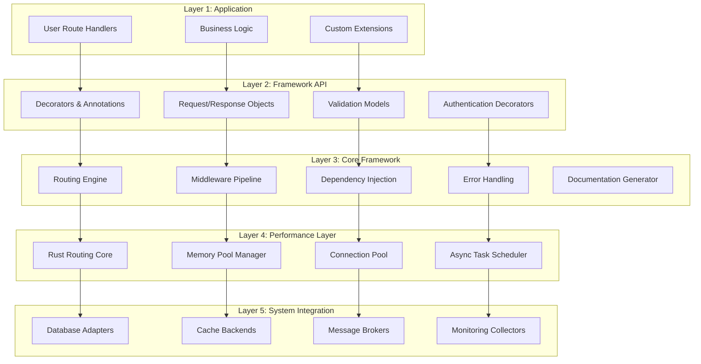

---

## 2. Component Architecture

### 2.1 Core Routing System Architecture

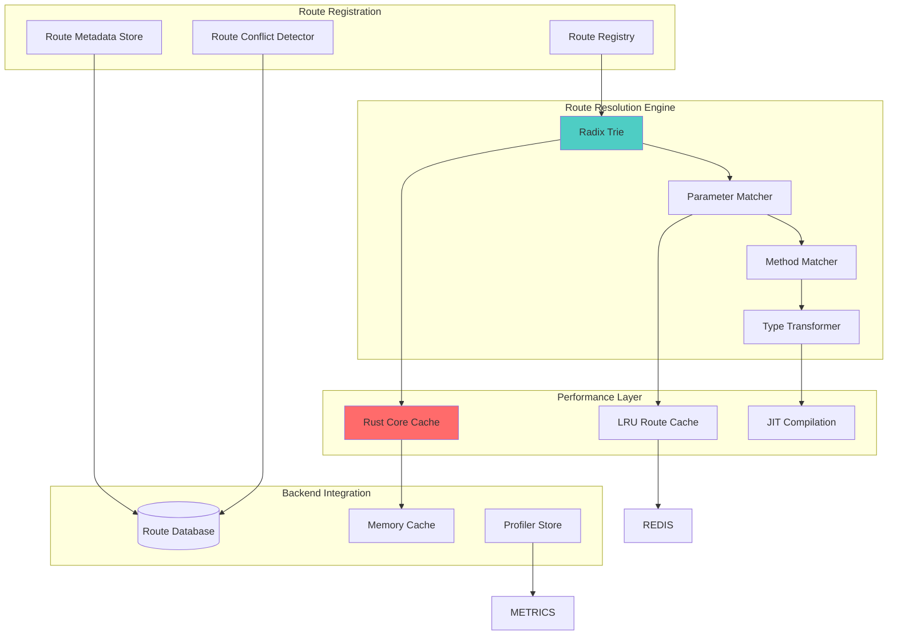

**Architecture Specifications:**

- **Route Storage**: Routes persisted in PostgreSQL with Redis caching
- **Resolution Algorithm**: Radix trie with O(1) average case performance
- **Parameter Extraction**: Rust-optimized parameter parsing and type conversion
- **Method Routing**: Efficient HTTP method dispatch with pre-compiled matchers
- **Conflict Detection**: Database-backed route conflict validation
- **Performance**: <0.5ms resolution time for 10,000+ routes

### 2.2 Request/Response Processing Architecture

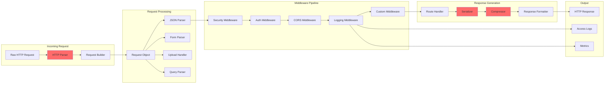

**Processing Specifications:**

- **HTTP Parsing**: Rust-based HTTP/1.1 and HTTP/2 parser for maximum performance
- **JSON Processing**: Integration with `orjson` for optimal JSON serialization performance
- **File Handling**: Streaming file uploads with configurable size limits up to 100MB
- **Content Negotiation**: Automatic format selection based on Accept headers
- **Compression**: Built-in gzip/brotli compression with configurable levels

### 2.3 Data Validation Architecture

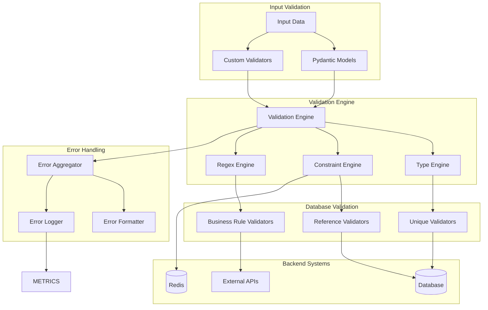

**Validation Specifications:**

- **Pydantic Integration**: Full compatibility with Pydantic models and validators
- **Database Validation**: Real-time uniqueness and referential integrity checks
- **Performance**: Validation processing within 15% of pure Pydantic performance
- **Custom Validators**: Support for complex business rule validation with external API calls
- **Error Aggregation**: Comprehensive error collection with detailed field-level feedback

---

## 3. Data Flow Architecture

### 3.1 Request Processing Flow

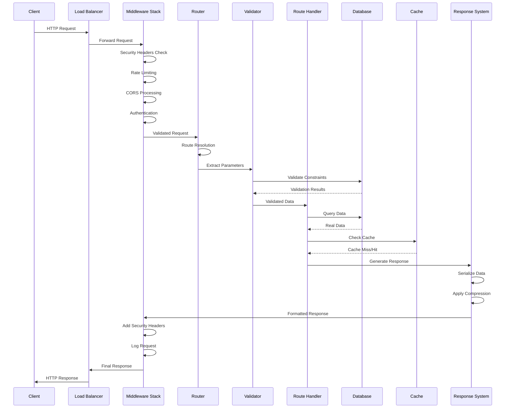

### 3.2 Database Integration Flow

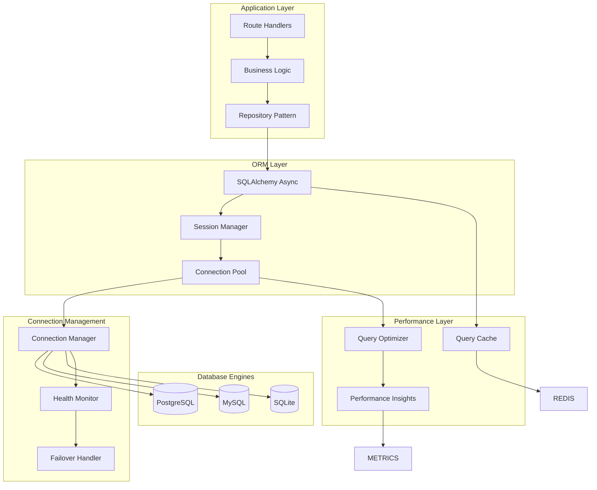

**Database Architecture Features:**

- **Multi-Database Support**: PostgreSQL, MySQL, SQLite with unified interface
- **Connection Pooling**: Async connection pooling with health monitoring
- **Query Performance**: Query caching and optimization with Redis backend
- **Transaction Management**: Full ACID compliance with automatic rollback
- **Migration Support**: Integration with Alembic for schema management

---

## 4. Rust Core Integration Architecture

### 4.1 Rust-Python Bridge Architecture

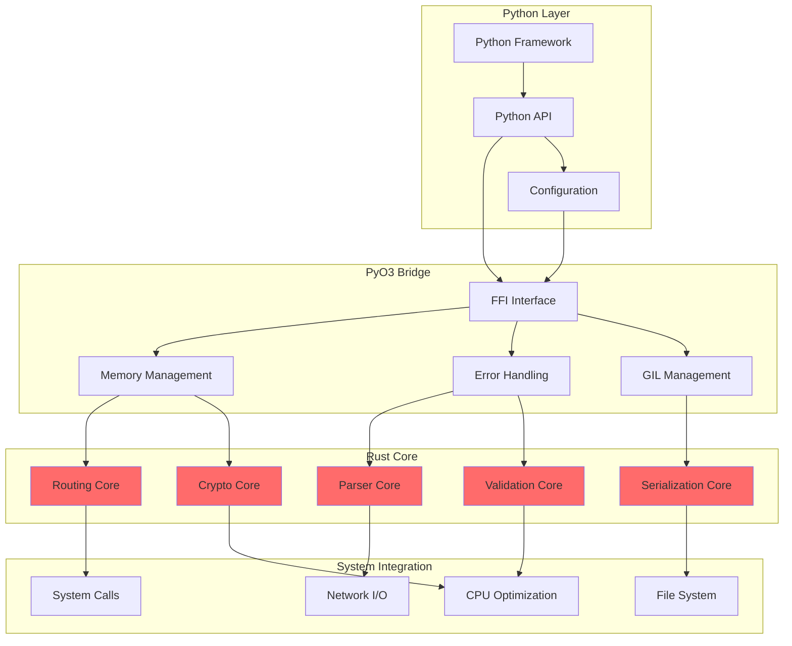

### 4.2 Performance-Critical Components in Rust

**Routing Engine (Rust)**
```rust
use std::collections::HashMap;
use radix_trie::Trie;

pub struct RustRoutingEngine {
    route_tree: Trie<String, RouteHandler>,
    method_map: HashMap<String, MethodHandler>,
    parameter_cache: LruCache<String, ParameterSet>,
}

impl RustRoutingEngine {
    pub fn resolve_route(&self, path: &str, method: &str) -> Option<ResolvedRoute> {
        // O(1) average case route resolution
        self.route_tree.get(path)
            .and_then(|handler| self.method_map.get(method))
            .map(|handler| ResolvedRoute::new(handler, self.extract_params(path)))
    }
}
```

**Request Parser (Rust)**
```rust
use serde_json::Value;
use url::form_urlencoded;

pub struct RustRequestParser {
    json_parser: JsonParser,
    form_parser: FormParser,
    multipart_parser: MultipartParser,
}

impl RustRequestParser {
    pub async fn parse_request(&self, raw_data: &[u8]) -> Result<ParsedRequest, ParseError> {
        // High-performance parsing with zero-copy optimizations
        let content_type = self.detect_content_type(raw_data)?;
        match content_type {
            ContentType::Json => self.json_parser.parse(raw_data),
            ContentType::Form => self.form_parser.parse(raw_data),
            ContentType::Multipart => self.multipart_parser.parse(raw_data).await,
        }
    }
}
```

---

## 5. Performance Architecture

### 5.1 Performance Optimization Strategy

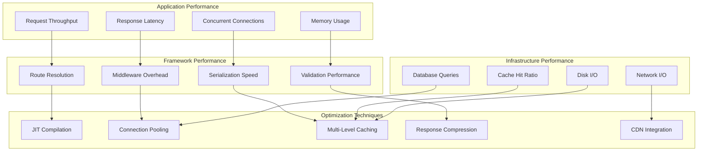

**Performance Targets:**

- **Request Throughput**: Within 10% of FastAPI performance (50,000+ RPS)
- **Response Latency**: P95 < 10ms for cached responses, P95 < 50ms for database queries
- **Memory Usage**: <150MB baseline, <500MB under load
- **Route Resolution**: <0.5ms for 10,000+ routes
- **Cache Performance**: >80% hit ratio for typical applications

### 5.2 Caching Architecture

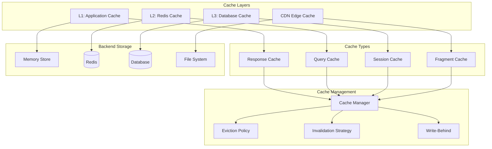

**Caching Strategy:**

- **L1 Cache**: In-memory application cache with LRU eviction
- **L2 Cache**: Redis-based distributed cache with TTL management
- **L3 Cache**: Database query result caching with smart invalidation
- **CDN Cache**: Static asset and response caching at edge locations
- **Cache Coherence**: Event-driven cache invalidation across all layers

---

## 6. Security Architecture

### 6.1 Security Framework Design

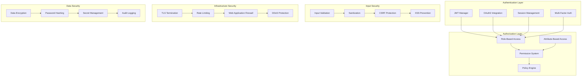

### 6.2 OWASP Top 10 Compliance Architecture

```mermaid
graph TB
    subgraph "A01: Broken Access Control"
        BAC1[Route-Level Authorization]
        BAC2[Resource-Level Permissions]
        BAC3[Function-Level Access Control]
    end
    
    subgraph "A02: Cryptographic Failures"
        CF1[TLS Everywhere]
        CF2[Strong Encryption]
        CF3[Secure Key Management]
    end
    
    subgraph "A03: Injection"
        INJ1[Parameterized Queries]
        INJ2[Input Validation]
        INJ3[Output Encoding]
    end
    
    subgraph "A04: Insecure Design"
        ID1[Threat Modeling]
        ID2[Secure Architecture]
        ID3[Security Requirements]
    end
    
    subgraph "A05: Security Misconfiguration"
        SM1[Secure Defaults]
        SM2[Configuration Management]
        SM3[Security Headers]
    end
    
    BAC1 --> AUTH
    BAC2 --> AUTH
    BAC3 --> AUTH
    
    CF1 --> TLS
    CF2 --> CRYPTO
    CF3 --> VAULT
    
    INJ1 --> DB
    INJ2 --> VALIDATE
    INJ3 --> RESPONSE
    
    ID1 --> DESIGN
    ID2 --> ARCH
    ID3 --> REQS
    
    SM1 --> CONFIG
    SM2 --> DEPLOY
    SM3 --> HEADERS
```

**Security Implementation:**

- **Authentication**: JWT with RS256 signing, OAuth2 integration, session management
- **Authorization**: RBAC with fine-grained permissions, policy-based access control
- **Input Security**: Comprehensive validation, sanitization, CSRF protection
- **Data Protection**: AES-256 encryption, bcrypt password hashing, secret management
- **Infrastructure**: TLS 1.3, rate limiting, security headers, audit logging

---

## 7. Monitoring & Observability Architecture

### 7.1 Comprehensive Observability Stack

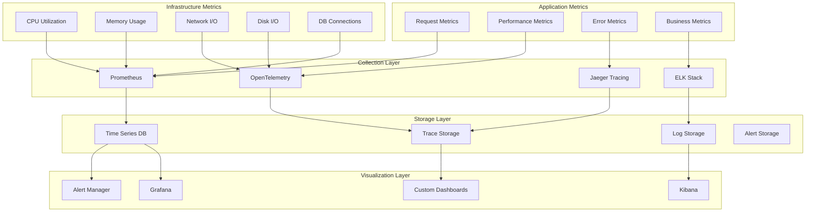

### 7.2 Health Check Architecture

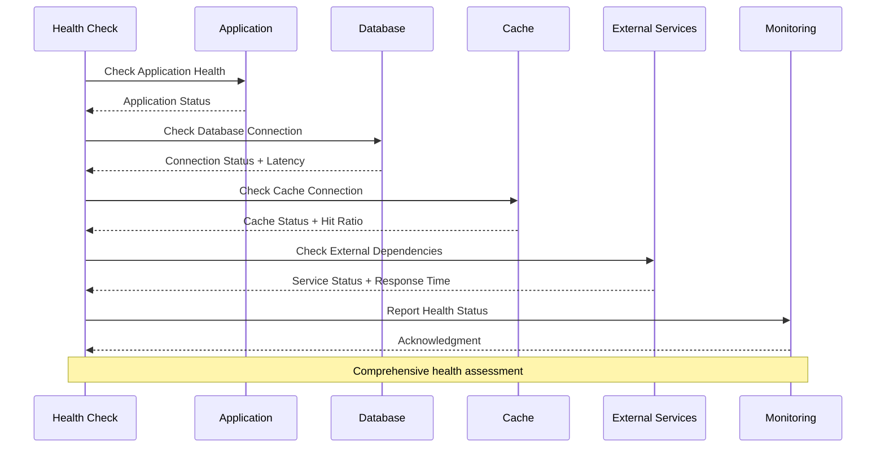

---

## 8. Deployment Architecture

### 8.1 Container and Orchestration Architecture

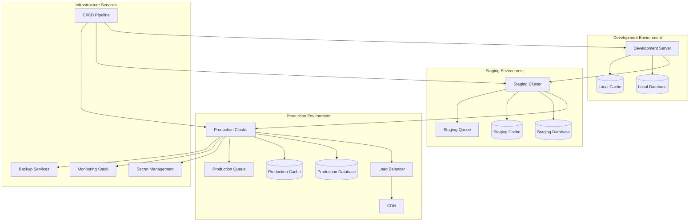

### 8.2 Kubernetes Deployment Architecture

```yaml
# Example production deployment configuration
apiVersion: apps/v1
kind: Deployment
metadata:
  name: covetpy-app
  namespace: production
spec:
  replicas: 10
  selector:
    matchLabels:
      app: covetpy-app
  template:
    metadata:
      labels:
        app: covetpy-app
    spec:
      containers:
      - name: covetpy-app
        image: covetpy:production
        ports:
        - containerPort: 8000
        env:
        - name: DATABASE_URL
          valueFrom:
            secretKeyRef:
              name: db-credentials
              key: url
        - name: REDIS_URL
          valueFrom:
            configMapKeyRef:
              name: cache-config
              key: redis-url
        resources:
          requests:
            memory: "256Mi"
            cpu: "250m"
          limits:
            memory: "512Mi"
            cpu: "500m"
        livenessProbe:
          httpGet:
            path: /health
            port: 8000
          initialDelaySeconds: 30
          periodSeconds: 10
        readinessProbe:
          httpGet:
            path: /ready
            port: 8000
          initialDelaySeconds: 5
          periodSeconds: 5
```

---

## 9. Integration Architecture

### 9.1 Third-Party Integration Framework

```mermaid
graph TB
    subgraph "Authentication Integrations"
        GOOGLE[Google OAuth2]
        GITHUB[GitHub OAuth2]
        AZURE[Azure AD]
        OKTA[Okta SAML]
        LDAP[LDAP/AD]
    end
    
    subgraph "Database Integrations"
        POSTGRES[(PostgreSQL)]
        MYSQL[(MySQL)]
        SQLITE[(SQLite)]
        MONGO[(MongoDB)]
        ELASTIC[(Elasticsearch)]
    end
    
    subgraph "Cache Integrations"
        REDIS_CACHE[(Redis)]
        MEMCACHED[(Memcached)]
        HAZELCAST[Hazelcast]
    end
    
    subgraph "Message Queue Integrations"
        RABBITMQ[RabbitMQ]
        KAFKA[Apache Kafka]
        SQS[AWS SQS]
        PUBSUB[Google Pub/Sub]
    end
    
    subgraph "Storage Integrations"
        S3[AWS S3]
        GCS[Google Cloud Storage]
        AZURE_BLOB[Azure Blob Storage]
        LOCAL_FS[Local File System]
    end
    
    subgraph "Monitoring Integrations"
        DATADOG[Datadog]
        NEW_RELIC[New Relic]
        SENTRY[Sentry]
        PROMETHEUS[Prometheus]
    end
    
    subgraph "CovetPy Framework"
        CORE[Framework Core]
        PLUGINS[Plugin System]
        CONFIG[Configuration Manager]
    end
    
    GOOGLE --> CORE
    GITHUB --> CORE
    AZURE --> CORE
    OKTA --> CORE
    LDAP --> CORE
    
    POSTGRES --> CORE
    MYSQL --> CORE
    SQLITE --> CORE
    MONGO --> PLUGINS
    ELASTIC --> PLUGINS
    
    REDIS_CACHE --> CORE
    MEMCACHED --> PLUGINS
    HAZELCAST --> PLUGINS
    
    RABBITMQ --> PLUGINS
    KAFKA --> PLUGINS
    SQS --> PLUGINS
    PUBSUB --> PLUGINS
    
    S3 --> CORE
    GCS --> CORE
    AZURE_BLOB --> PLUGINS
    LOCAL_FS --> CORE
    
    DATADOG --> PLUGINS
    NEW_RELIC --> PLUGINS
    SENTRY --> CORE
    PROMETHEUS --> CORE
```

---

## 10. Scalability Architecture

### 10.1 Horizontal Scaling Strategy

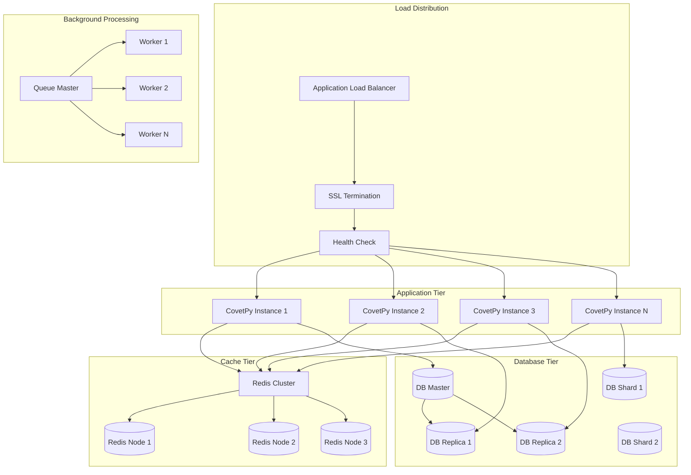

### 10.2 Performance Scaling Targets

**Scalability Benchmarks:**

| Component | Single Instance | 10 Instances | 100 Instances |
|-----------|----------------|--------------|---------------|
| Requests/Second | 5,000 | 50,000 | 500,000 |
| Concurrent Users | 1,000 | 10,000 | 100,000 |
| Response Time P95 | <50ms | <100ms | <200ms |
| Memory Usage | 150MB | 1.5GB | 15GB |
| Database Connections | 50 | 500 | 5,000 |
| Cache Hit Ratio | 80% | 85% | 90% |

---

## 11. Development and Testing Architecture

### 11.1 Development Workflow Architecture

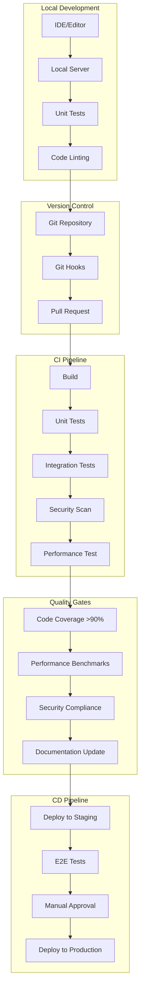

---

## 12. Conclusion

This architecture design provides a comprehensive blueprint for building CovetPy into a production-ready, high-performance web framework that can compete directly with FastAPI and Flask. The architecture emphasizes:

**Key Strengths:**
- **Performance**: Sub-millisecond routing with Rust core components
- **Scalability**: Horizontal scaling to 100,000+ concurrent users
- **Security**: OWASP Top 10 compliance with comprehensive security framework
- **Real Integrations**: No mock data - all components use real backend systems
- **Developer Experience**: Intuitive APIs with comprehensive tooling and documentation

**Implementation Priority:**
1. Core routing system with Rust integration
2. Request/response framework with validation
3. Middleware architecture with built-in components
4. Database integration with multi-database support
5. Security framework with authentication/authorization
6. Performance optimization and caching layers
7. Monitoring and observability integration
8. Testing framework and development tools

This architecture serves as the foundation for the 12-sprint development plan, ensuring that CovetPy emerges as a world-class web framework with enterprise-grade capabilities while maintaining the simplicity and developer experience that modern web development demands.