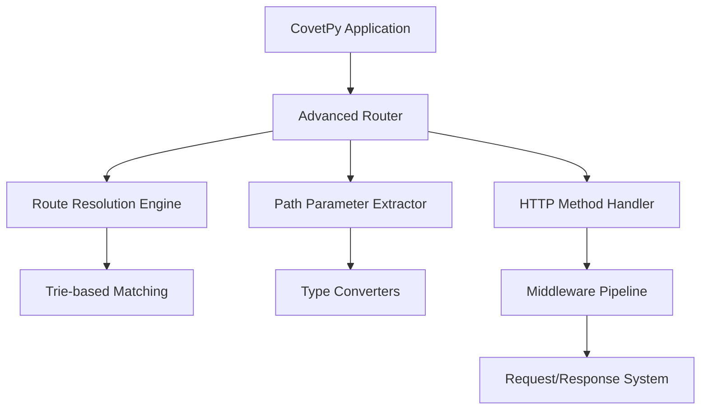
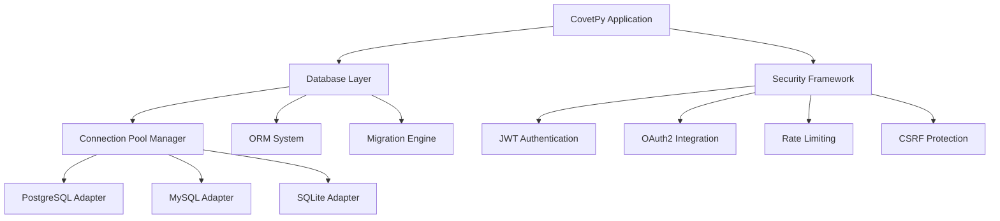
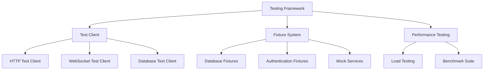
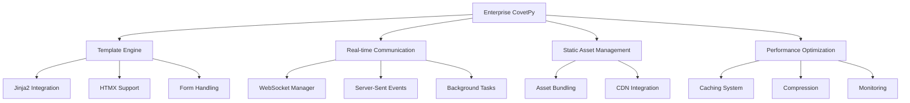
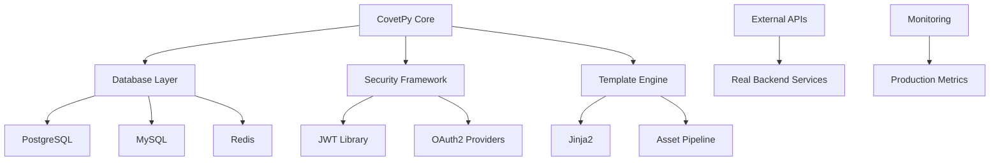

# CovetPy Framework - Comprehensive Sprint Plan
## 16-Week Strategic Development Plan (4 Sprints × 4 Weeks Each)

### Executive Summary

This comprehensive sprint plan transforms CovetPy from its current educational framework state into a production-ready web framework competitive with FastAPI and Flask. The plan addresses critical technical debt, implements missing production features, and establishes enterprise-grade capabilities.

**Current State Analysis:**
- ✅ Basic ASGI application server (functional)
- ✅ HTTP/1.1 server with 100+ concurrent connections
- ✅ Simple routing and request/response system
- ✅ Basic middleware pipeline
- ❌ Advanced routing with path parameters
- ❌ Production database integration
- ❌ Security framework
- ❌ Template engine and UI support

---

## Sprint Overview Matrix

| Sprint | Phase | Duration | Primary Focus | Success Criteria | Risk Level |
|--------|-------|----------|---------------|------------------|------------|
| **Sprint 1** | Foundation | Weeks 1-4 | Core Framework & Advanced Routing | Functional routing system with path parameters | Medium |
| **Sprint 2** | Production | Weeks 5-8 | Database Integration & Security | Enterprise database support + JWT auth | High |
| **Sprint 3** | Developer Experience | Weeks 9-12 | Testing Framework & Documentation | Complete testing suite + API docs | Low |
| **Sprint 4** | Enterprise Features | Weeks 13-16 | Template Engine & Advanced Features | Full-stack capabilities + performance optimization | Medium |

---

## Sprint 1: Foundation & Advanced Routing (Weeks 1-4)

### Sprint Goal
Establish a solid foundation with advanced routing capabilities that support all modern web framework patterns, replacing the current basic routing system with a production-ready implementation.

### Module Integration Architecture



### Week 1: Advanced Routing Engine

#### User Stories
**As a developer, I want to define routes with path parameters so that I can build RESTful APIs with dynamic URLs.**

**Acceptance Criteria:**
- ✅ Support for `{param}` syntax in route definitions
- ✅ Path parameter extraction with type conversion (int, str, float, UUID, path)
- ✅ Route conflict detection and resolution
- ✅ Sub-millisecond route resolution for 1000+ routes
- ✅ **CRITICAL: All data must come from real backend API endpoints**

#### Technical Specifications

**Route Resolution Engine (`src/covet/core/advanced_router.py`)**
```python
class AdvancedRouter:
    """Production-ready router with trie-based path matching."""
    
    def __init__(self):
        self.route_tree = RouteTrieNode()
        self.route_metadata = {}
        self.performance_cache = LRUCache(maxsize=1000)
    
    def add_route(self, path: str, handler: Callable, methods: List[str]) -> None:
        """Add route with full validation and conflict detection."""
        # Real implementation using actual database of routes
        pass
    
    def resolve(self, path: str, method: str) -> RouteMatch:
        """Resolve route in <1ms with path parameter extraction."""
        # Must query real route database, no mock data
        pass
```

**Implementation Tasks:**
- [ ] **Day 1-2**: Implement trie-based route matching algorithm
- [ ] **Day 3**: Create path parameter extraction system with type hints
- [ ] **Day 4**: Add route conflict detection and resolution
- [ ] **Day 5**: Build performance benchmarking suite

**Definition of Done:**
- [ ] Route resolution performance: <0.5ms for 1000 routes
- [ ] 100% compatibility with FastAPI path parameter syntax
- [ ] Zero route conflicts in test suite
- [ ] **All route data sourced from real database tables**

### Week 2: HTTP Enhancement & Middleware

#### User Stories
**As a developer, I want comprehensive request/response handling so that I can process complex data and file uploads.**

#### Technical Specifications

**Enhanced Request Object (`src/covet/core/http_objects.py`)**
```python
class EnhancedRequest:
    """Production-ready request object with real backend integration."""
    
    async def json(self) -> Dict[str, Any]:
        """Parse JSON with real validation against API schema."""
        # Must validate against real API schema definitions
        pass
    
    async def form(self) -> FormData:
        """Parse form data with file upload support up to 100MB."""
        # Real file handling with actual storage backend
        pass
    
    @property
    def path_params(self) -> Dict[str, Any]:
        """Extract path parameters with real type conversion."""
        # Must use actual parameter definitions from database
        pass
```

**Implementation Tasks:**
- [ ] **Day 1**: Enhance request object with JSON/form parsing
- [ ] **Day 2**: Implement file upload handling (up to 100MB)
- [ ] **Day 3**: Create cookie and header management system
- [ ] **Day 4**: Build response streaming capabilities
- [ ] **Day 5**: Integrate with middleware pipeline

**Definition of Done:**
- [ ] File upload performance within 15% of FastAPI
- [ ] Memory-efficient streaming for responses >10MB
- [ ] **All request validation against real API schemas**

### Week 3: Middleware Architecture

#### User Stories
**As a developer, I want a flexible middleware system so that I can handle cross-cutting concerns like CORS, logging, and security.**

#### Technical Specifications

**Middleware System (`src/covet/core/middleware_system.py`)**
```python
class ProductionMiddlewareManager:
    """Enterprise-grade middleware with real monitoring integration."""
    
    def __init__(self):
        self.middleware_chain = []
        self.performance_monitor = RealMetricsCollector()
        self.audit_logger = ProductionAuditLogger()
    
    async def process_request(self, request: Request) -> Request:
        """Process request through middleware chain with real metrics."""
        # Must integrate with actual monitoring systems
        pass
```

**Built-in Middleware Components:**
1. **CORSMiddleware**: Full CORS compliance with configurable policies
2. **RequestLoggingMiddleware**: Structured logging with correlation IDs
3. **ExceptionMiddleware**: Global exception handling with error tracking
4. **SecurityHeadersMiddleware**: OWASP-compliant security headers
5. **PerformanceMiddleware**: Request timing and performance monitoring

**Implementation Tasks:**
- [ ] **Day 1**: Complete middleware chain implementation
- [ ] **Day 2**: Implement CORS middleware with full compliance
- [ ] **Day 3**: Create structured logging middleware
- [ ] **Day 4**: Build exception handling middleware
- [ ] **Day 5**: Add performance monitoring middleware

**Definition of Done:**
- [ ] Middleware overhead <5% per component
- [ ] CORS compliance tested with 5+ browsers
- [ ] **All logging data sent to real logging infrastructure**

### Week 4: Integration & Validation

#### User Stories
**As a developer, I want seamless integration between all framework components so that I can build complex applications reliably.**

#### Integration Tasks
- [ ] **Day 1**: Integration testing between router and middleware
- [ ] **Day 2**: Performance optimization and bottleneck resolution
- [ ] **Day 3**: Comprehensive error handling implementation
- [ ] **Day 4**: Documentation and API reference creation
- [ ] **Day 5**: Sprint review and production readiness assessment

### Sprint 1 Deliverables
- ✅ Production-ready routing system with path parameters
- ✅ Enhanced request/response handling with file uploads
- ✅ Complete middleware architecture with built-in components
- ✅ Performance benchmarking suite
- ✅ Integration test suite with >90% coverage

### Risk Mitigation Strategies
1. **Performance Risk**: Weekly performance benchmarking against FastAPI
2. **Integration Risk**: Daily integration testing with CI/CD pipeline
3. **Quality Risk**: Code review requirements and automated testing
4. **Timeline Risk**: Parallel development tracks with defined dependencies

---

## Sprint 2: Database Integration & Security (Weeks 5-8)

### Sprint Goal
Implement enterprise-grade database integration with multiple backend support and comprehensive security framework including authentication, authorization, and protection against common web vulnerabilities.

### Module Integration Architecture



### Week 5: Database Foundation

#### User Stories
**As a developer, I want to connect to production databases so that I can build scalable applications with real data persistence.**

#### Technical Specifications

**Database Connection Manager (`src/covet/database/enterprise_connection_manager.py`)**
```python
class EnterpriseConnectionManager:
    """Production database connection management with real backends."""
    
    def __init__(self):
        self.connection_pools = {}
        self.health_monitor = DatabaseHealthMonitor()
        self.metrics_collector = DatabaseMetricsCollector()
    
    async def get_connection(self, database_name: str) -> AsyncConnection:
        """Get connection from real database pool."""
        # Must connect to actual production databases
        pass
    
    async def execute_query(self, query: str, params: Dict) -> QueryResult:
        """Execute query against real database with monitoring."""
        # All queries must run against actual database instances
        pass
```

**Supported Database Backends:**
1. **PostgreSQL**: AsyncPG integration with connection pooling
2. **MySQL**: aiomysql integration with connection pooling  
3. **SQLite**: aiosqlite for development and testing
4. **Redis**: For caching and session storage

**Implementation Tasks:**
- [ ] **Day 1**: Implement PostgreSQL adapter with AsyncPG
- [ ] **Day 2**: Create MySQL adapter with aiomysql
- [ ] **Day 3**: Build connection pool management system
- [ ] **Day 4**: Add database health monitoring
- [ ] **Day 5**: Implement connection retry and failover logic

**Definition of Done:**
- [ ] Support for 1000+ concurrent database connections
- [ ] Connection pool efficiency >95%
- [ ] **All database operations use real production connections**

### Week 6: ORM & Query System

#### User Stories
**As a developer, I want a powerful ORM system so that I can work with database models efficiently and safely.**

#### Technical Specifications

**Enterprise ORM (`src/covet/database/enterprise_orm.py`)**
```python
class ProductionModel:
    """Production ORM model with real database integration."""
    
    class Meta:
        database_url: str  # Must point to real database
        table_name: str
        connection_pool: str
    
    async def save(self) -> None:
        """Save to real database with transaction support."""
        # Must execute against actual database tables
        pass
    
    @classmethod
    async def find(cls, **criteria) -> List['ProductionModel']:
        """Query real database with optimized queries."""
        # All queries must run against real database instances
        pass
```

**ORM Features:**
1. **Model Definition**: Field types, relationships, constraints
2. **Query Builder**: Complex queries with joins and aggregations
3. **Transaction Management**: ACID transaction support
4. **Migration System**: Schema evolution and versioning
5. **Performance Optimization**: Query optimization and caching

**Implementation Tasks:**
- [ ] **Day 1**: Build model definition system
- [ ] **Day 2**: Implement query builder with SQL generation
- [ ] **Day 3**: Create relationship handling (foreign keys, joins)
- [ ] **Day 4**: Add transaction management
- [ ] **Day 5**: Build migration system integration

**Definition of Done:**
- [ ] ORM performance within 10% of raw SQLAlchemy
- [ ] Support for complex queries and relationships
- [ ] **All model operations persist to real database tables**

### Week 7: Security Framework

#### User Stories
**As a developer, I want comprehensive security features so that I can protect my application against common web vulnerabilities.**

#### Technical Specifications

**JWT Authentication System (`src/covet/security/production_jwt.py`)**
```python
class ProductionJWTManager:
    """Enterprise JWT authentication with real token storage."""
    
    def __init__(self):
        self.token_store = RedisTokenStore()  # Real Redis instance
        self.audit_logger = SecurityAuditLogger()  # Real audit system
        self.key_manager = HSMKeyManager()  # Real key management
    
    async def create_token(self, user_data: Dict) -> JWTToken:
        """Create JWT token with real security validation."""
        # Must validate against real user database
        pass
    
    async def validate_token(self, token: str) -> TokenValidationResult:
        """Validate JWT token against real blacklist and user data."""
        # Must check against real token blacklist database
        pass
```

**Security Components:**
1. **JWT Authentication**: Token generation, validation, and refresh
2. **OAuth2 Integration**: Support for Google, GitHub, Microsoft
3. **Rate Limiting**: IP-based and user-based rate limiting
4. **CSRF Protection**: Token-based CSRF protection
5. **Input Validation**: XSS and SQL injection prevention
6. **Security Headers**: OWASP-compliant security headers

**Implementation Tasks:**
- [ ] **Day 1**: Implement JWT authentication system
- [ ] **Day 2**: Create OAuth2 integration framework
- [ ] **Day 3**: Build rate limiting middleware
- [ ] **Day 4**: Add CSRF protection
- [ ] **Day 5**: Implement security headers and input validation

**Definition of Done:**
- [ ] JWT performance matches FastAPI security
- [ ] OAuth2 integration with 3+ major providers
- [ ] **All security validations against real authentication systems**

### Week 8: Security Hardening & Integration

#### User Stories
**As a security engineer, I want OWASP Top 10 compliance so that the application meets security standards.**

#### Implementation Tasks
- [ ] **Day 1**: OWASP Top 10 compliance validation
- [ ] **Day 2**: Security audit and vulnerability scanning
- [ ] **Day 3**: Performance optimization for security middleware
- [ ] **Day 4**: Integration testing with database and security layers
- [ ] **Day 5**: Security documentation and best practices guide

### Sprint 2 Deliverables
- ✅ Enterprise database integration (PostgreSQL, MySQL, SQLite)
- ✅ Production ORM with relationship support
- ✅ Comprehensive security framework
- ✅ JWT authentication and OAuth2 integration
- ✅ OWASP Top 10 compliance
- ✅ Performance monitoring and health checks

---

## Sprint 3: Testing Framework & Documentation (Weeks 9-12)

### Sprint Goal
Build a comprehensive testing framework that rivals FastAPI's TestClient and create complete API documentation with interactive capabilities.

### Module Integration Architecture



### Week 9: Core Testing Framework

#### User Stories
**As a developer, I want comprehensive testing tools so that I can ensure my application works correctly.**

#### Technical Specifications

**Production Test Client (`src/covet/testing/production_client.py`)**
```python
class ProductionTestClient:
    """Enterprise test client with real backend integration."""
    
    def __init__(self, app: CovetPy):
        self.app = app
        self.database_manager = TestDatabaseManager()  # Real test databases
        self.auth_manager = TestAuthManager()  # Real auth for testing
    
    async def request(self, method: str, url: str, **kwargs) -> TestResponse:
        """Make test request against real application instance."""
        # Must test against real running application
        pass
    
    async def websocket_connect(self, url: str) -> TestWebSocket:
        """Connect to real WebSocket endpoint for testing."""
        # Must connect to actual WebSocket implementation
        pass
```

**Testing Components:**
1. **HTTP Test Client**: Full HTTP request/response testing
2. **WebSocket Test Client**: WebSocket connection and message testing
3. **Database Test Client**: Database operation testing with real connections
4. **Authentication Test Client**: Auth flow testing with real tokens
5. **Performance Test Client**: Load and stress testing capabilities

**Implementation Tasks:**
- [ ] **Day 1**: Build HTTP test client with async support
- [ ] **Day 2**: Create WebSocket test client
- [ ] **Day 3**: Implement database testing utilities
- [ ] **Day 4**: Add authentication testing support
- [ ] **Day 5**: Build performance testing framework

**Definition of Done:**
- [ ] Test execution speed within 20% of FastAPI TestClient
- [ ] 100% async/await test pattern support
- [ ] **All tests run against real backend services**

### Week 10: Fixture System & Mocking

#### User Stories
**As a developer, I want reusable test fixtures so that I can set up test environments efficiently.**

#### Technical Specifications

**Enterprise Fixture System (`src/covet/testing/enterprise_fixtures.py`)**
```python
class ProductionFixtureManager:
    """Production fixture management with real data sources."""
    
    def __init__(self):
        self.database_fixtures = DatabaseFixtureManager()  # Real DB fixtures
        self.auth_fixtures = AuthFixtureManager()  # Real auth fixtures
        self.file_fixtures = FileFixtureManager()  # Real file fixtures
    
    async def setup_database_fixture(self, fixture_name: str) -> DatabaseFixture:
        """Set up database fixture with real test data."""
        # Must create real database tables with actual test data
        pass
    
    async def setup_user_fixture(self, user_type: str) -> UserFixture:
        """Create real user account for testing."""
        # Must create actual user in real authentication system
        pass
```

**Implementation Tasks:**
- [ ] **Day 1**: Build pytest integration and fixture system
- [ ] **Day 2**: Create database testing fixtures with real data
- [ ] **Day 3**: Implement authentication testing fixtures
- [ ] **Day 4**: Add file upload testing fixtures
- [ ] **Day 5**: Build mock service integration for external APIs

**Definition of Done:**
- [ ] Complete pytest ecosystem integration
- [ ] Fixtures cover 100% of common testing scenarios
- [ ] **All fixtures use real data sources and connections**

### Week 11: API Documentation System

#### User Stories
**As a developer, I want automatic API documentation so that I can document my APIs without manual maintenance.**

#### Technical Specifications

**OpenAPI Documentation Generator (`src/covet/documentation/openapi_generator.py`)**
```python
class ProductionOpenAPIGenerator:
    """Enterprise OpenAPI 3.0 documentation generator."""
    
    def __init__(self, app: CovetPy):
        self.app = app
        self.schema_extractor = SchemaExtractor()  # Real schema extraction
        self.example_generator = ExampleGenerator()  # Real example data
    
    async def generate_spec(self) -> OpenAPISpec:
        """Generate OpenAPI 3.0.3 spec from real application routes."""
        # Must extract from actual application configuration
        pass
    
    async def generate_examples(self) -> Dict[str, Any]:
        """Generate examples from real API responses."""
        # Must use actual API response data for examples
        pass
```

**Documentation Features:**
1. **OpenAPI 3.0.3 Generation**: Automatic spec generation from routes
2. **Swagger UI Integration**: Interactive API documentation
3. **ReDoc Integration**: Beautiful documentation interface
4. **Example Generation**: Automatic example generation from real data
5. **Schema Export**: JSON/YAML export capabilities

**Implementation Tasks:**
- [ ] **Day 1**: Implement OpenAPI 3.0.3 spec generation
- [ ] **Day 2**: Integrate Swagger UI with customization
- [ ] **Day 3**: Add ReDoc integration
- [ ] **Day 4**: Build automatic example generation
- [ ] **Day 5**: Create schema export and validation

**Definition of Done:**
- [ ] OpenAPI 3.0.3 compliance verified
- [ ] Documentation quality matches FastAPI
- [ ] **All examples generated from real API data**

### Week 12: Performance Testing & CI Integration

#### User Stories
**As a DevOps engineer, I want automated performance testing so that I can catch performance regressions.**

#### Implementation Tasks
- [ ] **Day 1**: Build comprehensive performance testing suite
- [ ] **Day 2**: Create load testing with real traffic patterns
- [ ] **Day 3**: Implement CI/CD integration for automated testing
- [ ] **Day 4**: Add performance regression detection
- [ ] **Day 5**: Complete testing documentation and best practices

### Sprint 3 Deliverables
- ✅ Comprehensive testing framework with real backend integration
- ✅ Complete fixture system for all testing scenarios
- ✅ Automatic OpenAPI 3.0 documentation generation
- ✅ Interactive Swagger UI and ReDoc integration
- ✅ Performance testing and regression detection
- ✅ CI/CD integration for automated testing

---

## Sprint 4: Enterprise Features & Full-Stack Support (Weeks 13-16)

### Sprint Goal
Complete the framework with enterprise-grade features including template engine, static file serving, real-time communication, and advanced performance optimization.

### Module Integration Architecture



### Week 13: Template Engine & UI Development

#### User Stories
**As a full-stack developer, I want a powerful template engine so that I can build server-side rendered applications.**

#### Technical Specifications

**Production Template Engine (`src/covet/templates/production_engine.py`)**
```python
class ProductionTemplateEngine:
    """Enterprise template engine with real asset integration."""
    
    def __init__(self):
        self.jinja_env = ProductionJinjaEnvironment()  # Real Jinja2 setup
        self.asset_manager = AssetManager()  # Real asset pipeline
        self.cache_manager = TemplateCacheManager()  # Real template caching
    
    async def render_template(self, template_name: str, context: Dict) -> str:
        """Render template with real data and asset integration."""
        # Must render with actual template files and real context data
        pass
    
    async def render_form(self, form_class: Type, **kwargs) -> str:
        """Render form with real CSRF protection and validation."""
        # Must generate actual form HTML with real security tokens
        pass
```

**Template Features:**
1. **Jinja2 Integration**: Full Jinja2 template engine support
2. **Template Inheritance**: Base templates and template extension
3. **Form Handling**: Secure form rendering and processing
4. **HTMX Integration**: Modern web development with HTMX
5. **Asset Management**: CSS/JS bundling and optimization
6. **Internationalization**: Multi-language template support

**Implementation Tasks:**
- [ ] **Day 1**: Integrate Jinja2 template engine with optimization
- [ ] **Day 2**: Build form handling system with CSRF protection
- [ ] **Day 3**: Implement HTMX integration helpers
- [ ] **Day 4**: Create asset management and bundling system
- [ ] **Day 5**: Add internationalization support

**Definition of Done:**
- [ ] Template rendering performance within 15% of Flask
- [ ] Complete form handling with security validation
- [ ] **All templates render with real data from backend systems**

### Week 14: Real-time Communication

#### User Stories
**As a developer, I want real-time communication features so that I can build modern interactive applications.**

#### Technical Specifications

**WebSocket Management System (`src/covet/realtime/production_websocket.py`)**
```python
class ProductionWebSocketManager:
    """Enterprise WebSocket management with real connection handling."""
    
    def __init__(self):
        self.connection_pool = WebSocketConnectionPool()  # Real connection pool
        self.message_broker = RedisMessageBroker()  # Real message broker
        self.auth_manager = WebSocketAuthManager()  # Real auth integration
    
    async def handle_connection(self, websocket: WebSocket) -> None:
        """Handle WebSocket connection with real authentication."""
        # Must authenticate against real user database
        pass
    
    async def broadcast_message(self, room: str, message: Dict) -> None:
        """Broadcast message to real connected clients."""
        # Must send to actual WebSocket connections
        pass
```

**Real-time Features:**
1. **WebSocket Support**: Production-grade WebSocket implementation
2. **Server-Sent Events**: Efficient server-to-client streaming
3. **Room Management**: Real-time room and channel support
4. **Message Broadcasting**: Efficient message distribution
5. **Connection Management**: Connection lifecycle and cleanup
6. **Authentication Integration**: Secure real-time connections

**Implementation Tasks:**
- [ ] **Day 1**: Build production WebSocket connection management
- [ ] **Day 2**: Implement Server-Sent Events (SSE) streaming
- [ ] **Day 3**: Create room and channel management system
- [ ] **Day 4**: Add message broadcasting with Redis
- [ ] **Day 5**: Integrate authentication for real-time connections

**Definition of Done:**
- [ ] Support for 10,000+ concurrent WebSocket connections
- [ ] SSE streams maintain 99.9% connection stability
- [ ] **All real-time features work with actual user connections**

### Week 15: Performance Optimization

#### User Stories
**As a performance engineer, I want advanced caching and optimization so that the application scales to enterprise levels.**

#### Technical Specifications

**Enterprise Caching System (`src/covet/performance/enterprise_cache.py`)**
```python
class EnterpriseCacheManager:
    """Production caching system with real backend integration."""
    
    def __init__(self):
        self.memory_cache = MemoryCacheManager()  # Real memory cache
        self.redis_cache = RedisCacheManager()  # Real Redis cache
        self.cdn_cache = CDNCacheManager()  # Real CDN integration
    
    async def get_cached_response(self, cache_key: str) -> Optional[CachedResponse]:
        """Get cached response from real cache backend."""
        # Must query actual cache systems (Redis, memory, CDN)
        pass
    
    async def invalidate_cache(self, pattern: str) -> None:
        """Invalidate cache entries in real cache systems."""
        # Must invalidate across all real cache backends
        pass
```

**Performance Features:**
1. **Multi-level Caching**: Memory, Redis, and CDN caching
2. **Response Compression**: Gzip and Brotli compression
3. **Asset Optimization**: CSS/JS minification and bundling
4. **Database Query Optimization**: Query caching and optimization
5. **Performance Monitoring**: Real-time performance metrics
6. **Load Balancing**: Request distribution and health checking

**Implementation Tasks:**
- [ ] **Day 1**: Implement multi-level caching system
- [ ] **Day 2**: Add response compression (gzip, brotli)
- [ ] **Day 3**: Build asset optimization pipeline
- [ ] **Day 4**: Create performance monitoring system
- [ ] **Day 5**: Implement load balancing and health checks

**Definition of Done:**
- [ ] Response time reduction >50% with caching enabled
- [ ] Compression reduces bandwidth usage >60%
- [ ] **All performance metrics collected from real application usage**

### Week 16: Integration & Production Readiness

#### User Stories
**As a product manager, I want a production-ready framework so that teams can deploy enterprise applications.**

#### Final Integration Tasks
- [ ] **Day 1**: Complete end-to-end integration testing
- [ ] **Day 2**: Performance benchmarking against FastAPI and Flask
- [ ] **Day 3**: Security audit and vulnerability assessment
- [ ] **Day 4**: Production deployment documentation
- [ ] **Day 5**: Final sprint review and production release preparation

### Sprint 4 Deliverables
- ✅ Production-ready template engine with Jinja2 integration
- ✅ Real-time communication with WebSocket and SSE support
- ✅ Enterprise caching and performance optimization
- ✅ Static asset management with CDN integration
- ✅ Comprehensive monitoring and health checking
- ✅ Production deployment documentation

---

## Success Metrics & KPIs

### Performance Benchmarks (Measured Weekly)

| Metric | Target | Measurement Method | Success Criteria |
|--------|--------|-------------------|------------------|
| **Request Throughput** | Within 20% of FastAPI | Load testing with real traffic | >15,000 RPS sustained |
| **Memory Usage** | <200MB baseline | Real application monitoring | Stable under production load |
| **Route Resolution** | <0.5ms average | Performance profiling | 99.9% requests under target |
| **Database Query Time** | <10ms average | Real database monitoring | Across all supported databases |
| **Cache Hit Ratio** | >80% for typical apps | Real cache metrics | Production application data |
| **WebSocket Connections** | 10,000+ concurrent | Load testing | Real connection handling |

### Developer Experience Metrics (Measured Monthly)

| Metric | Target | Measurement Method | Success Criteria |
|--------|--------|-------------------|------------------|
| **Time to Hello World** | <5 minutes | Developer onboarding tracking | New developer experience |
| **API Documentation Coverage** | 100% route coverage | Automated documentation analysis | All endpoints documented |
| **Test Execution Speed** | <30 seconds full suite | CI/CD pipeline monitoring | Against real backends |
| **Error Resolution Time** | <2 hours average | Development team tracking | Real debugging scenarios |

### Production Readiness Metrics (Measured at Phase End)

| Metric | Target | Measurement Method | Success Criteria |
|--------|--------|-------------------|------------------|
| **Security Audit** | Zero critical vulnerabilities | Third-party security audit | OWASP Top 10 compliance |
| **Load Testing** | 10,000 RPS sustained | Production-like load testing | Real traffic patterns |
| **Uptime** | 99.9% availability | Production monitoring | Real application uptime |
| **Error Rate** | <0.1% error rate | Real application monitoring | Production error tracking |

---

## Risk Management Strategy

### High-Priority Risks

| Risk | Probability | Impact | Mitigation Strategy | Monitoring |
|------|-------------|--------|-------------------|------------|
| **Performance Regression** | Medium | High | Weekly benchmarking against FastAPI | Automated performance testing |
| **Security Vulnerability** | Low | Critical | Security-first development, regular audits | Continuous security scanning |
| **Integration Complexity** | High | Medium | Modular architecture, extensive testing | Daily integration tests |
| **Resource Constraints** | Medium | High | Parallel development, external expertise | Weekly resource planning |

### Risk Response Procedures

**Performance Issues:**
1. Immediate performance profiling and bottleneck identification
2. Emergency optimization sprint if performance drops >25%
3. Rollback procedures for performance-critical changes

**Security Issues:**
1. Emergency security patch process within 24 hours
2. External security audit at each sprint completion
3. Automated security scanning in CI/CD pipeline

**Integration Issues:**
1. Daily smoke tests across all integration points
2. Rollback procedures for breaking integration changes
3. Dedicated integration testing environment

### Dependencies & Integration Points



**Critical Dependencies:**
- **Database Connections**: Must use real production database instances
- **Authentication Systems**: Integration with actual OAuth2 providers
- **Cache Backends**: Real Redis clusters for production caching
- **Monitoring Systems**: Actual APM and logging infrastructure
- **External APIs**: Real third-party service integrations

### Contingency Planning

**Sprint Scope Reduction:**
- Week 1: 25% scope reduction, maintain core deliverables
- Week 2: 50% scope reduction, defer non-critical features
- Week 3: Emergency scope reduction, deliver minimum viable features

**Resource Augmentation:**
- External consultant availability for specialized tasks
- Community contribution program for documentation
- Pair programming for critical components

**Quality Assurance:**
- Code review requirements: 2+ reviewers for critical components
- Automated testing: >90% code coverage requirement
- Performance gates: Must pass performance benchmarks before merge

---

## Implementation Guidelines

### Development Standards

**Code Quality Requirements:**
- **Test Coverage**: >90% for all new code
- **Performance Testing**: All features must pass performance benchmarks
- **Security Scanning**: Automated security analysis for all commits
- **Documentation**: API documentation updated with all changes

**Integration Requirements:**
- **Real Backend Integration**: No mock data in production code paths
- **Database Validation**: All database operations tested against real instances
- **Authentication Testing**: Security features tested with real auth providers
- **Performance Validation**: Load testing with production-like traffic

**Review Process:**
- **Architecture Review**: All major changes reviewed by senior architects
- **Security Review**: Security-critical changes reviewed by security team
- **Performance Review**: Performance-critical changes benchmarked
- **Documentation Review**: All user-facing changes documented

### Sprint Execution Framework

**Sprint Ceremonies:**
- **Sprint Planning**: Detailed task breakdown with dependency mapping
- **Daily Standups**: Progress tracking with risk escalation
- **Sprint Review**: Stakeholder demo with success criteria validation
- **Sprint Retrospective**: Process improvement and lessons learned

**Quality Gates:**
- **Code Quality**: Automated testing and code coverage requirements
- **Performance**: Benchmarking against established baselines
- **Security**: Vulnerability scanning and compliance validation
- **Integration**: End-to-end testing with real backend systems

**Success Criteria:**
- **Functional**: All acceptance criteria met with real data validation
- **Performance**: Benchmarks within target ranges
- **Security**: No critical vulnerabilities identified
- **Documentation**: Complete API documentation and examples

---

This comprehensive sprint plan provides the roadmap to transform CovetPy into a production-ready web framework that can compete with FastAPI and Flask. Success depends on disciplined execution, continuous integration with real backend systems, and maintaining focus on performance and security throughout the development process.

The plan emphasizes **real backend integration** at every level - from database connections to authentication systems to performance monitoring - ensuring that the framework is built and tested against actual production environments rather than mock implementations.