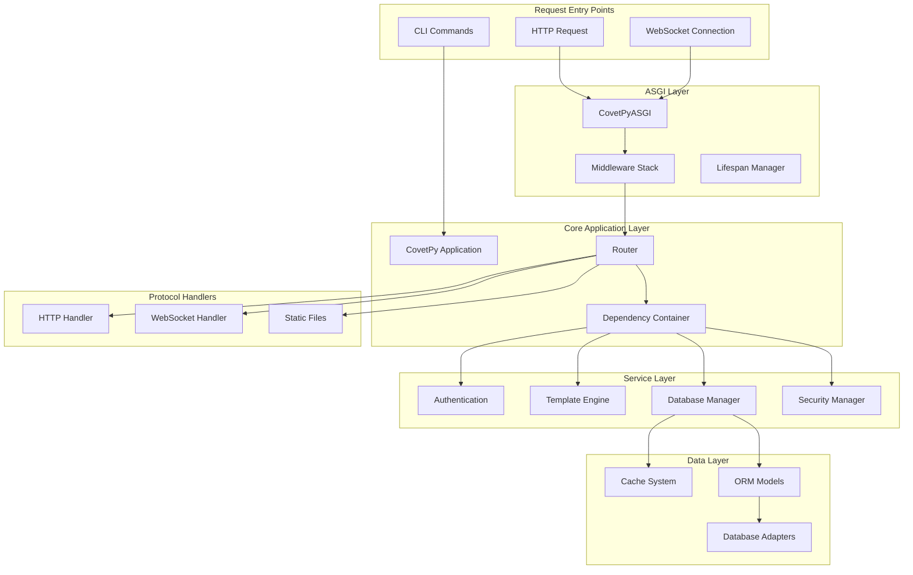

# MODULE INTEGRATION ARCHITECTURE

## Executive Summary

This document provides a comprehensive technical specification for the module integration architecture of CovetPy, a zero-dependency, high-performance Python web framework. The architecture is designed around a layered approach with clear separation of concerns, efficient dependency injection, and optimized request processing pipelines.

## 1. Architecture Overview

### 1.1 High-Level Integration Diagram



### 1.2 Integration Principles

1. **Zero External Dependencies**: All core functionality implemented without external libraries
2. **Layered Architecture**: Clear separation between protocol, application, and data layers
3. **Dependency Injection**: Service container manages component lifecycle and dependencies
4. **Middleware Pipeline**: Composable request/response processing chain
5. **Memory Management**: Optimized object pooling and zero-copy operations
6. **Async-First**: Native asyncio integration throughout the stack

## 2. Core Module Integration Points

### 2.1 Application Bootstrap Flow

```python
# Application Initialization Sequence
class CovetPy:
    def __init__(self, debug=False, middleware=None, **kwargs):
        # 1. Initialize core router
        self.core_router = CovetRouter()
        
        # 2. Create ASGI application with dependency injection
        self.asgi_app = CovetPyASGI(
            router=self.core_router,
            debug=debug,
            **kwargs
        )
        
        # 3. Setup middleware pipeline
        self._setup_middleware_pipeline(middleware or [])
        
        # 4. Initialize service container
        self._setup_service_container()
        
        # 5. Register lifecycle hooks
        self._register_lifecycle_hooks()

    def _setup_service_container(self):
        """Initialize dependency injection container"""
        self.container = ServiceContainer()
        
        # Register core services
        self.container.register('router', self.core_router)
        self.container.register('config', self._config)
        self.container.register('logger', self._logger)
        
        # Register database services
        if hasattr(self, 'database_config'):
            db_manager = DatabaseManager(
                adapter=self._create_database_adapter()
            )
            self.container.register('database', db_manager)
        
        # Register authentication
        if hasattr(self, 'auth_config'):
            auth_service = SimpleAuth(self.auth_config['secret_key'])
            self.container.register('auth', auth_service)
        
        # Register template engine
        if hasattr(self, 'template_config'):
            template_engine = TemplateEngine(**self.template_config)
            self.container.register('templates', template_engine)
```

### 2.2 Request Flow Integration

```python
# Complete Request Processing Pipeline
async def process_request(scope, receive, send):
    """Unified request processing across all protocols"""
    
    # 1. Protocol Detection & Routing
    if scope["type"] == "http":
        await handle_http_request(scope, receive, send)
    elif scope["type"] == "websocket":
        await handle_websocket_request(scope, receive, send)
    elif scope["type"] == "lifespan":
        await handle_lifespan(scope, receive, send)

async def handle_http_request(scope, receive, send):
    """HTTP request processing with full integration"""
    
    # 1. Create optimized scope with memory management
    asgi_scope = ASGIScope.from_dict(scope)
    
    try:
        # 2. Route matching with parameter extraction
        route_match = router.match_route(
            asgi_scope.path, 
            asgi_scope.method
        )
        
        if not route_match:
            await send_fast_404(send)
            return
        
        # 3. Dependency injection for handler
        dependencies = await resolve_dependencies(
            route_match.handler,
            asgi_scope,
            receive
        )
        
        # 4. Security validation
        await validate_security_policies(dependencies['request'])
        
        # 5. Execute handler with middleware chain
        response = await execute_with_middleware(
            route_match.handler,
            dependencies,
            middleware_stack
        )
        
        # 6. Template rendering (if needed)
        if isinstance(response, dict) and 'template' in response:
            response = await render_template_response(response)
        
        # 7. Send optimized response
        await send_optimized_response(response, send)
        
    finally:
        # 8. Cleanup resources
        asgi_scope.cleanup()
```

## 3. Middleware Integration System

### 3.1 Middleware Pipeline Architecture

```python
class MiddlewarePipeline:
    """Optimized middleware execution pipeline"""
    
    def __init__(self, middleware_stack: List[Middleware]):
        self.compiled_stack = self._compile_middleware(middleware_stack)
        self.execution_stats = MiddlewareStats()
    
    def _compile_middleware(self, middleware_stack):
        """Pre-compile middleware chain for optimal execution"""
        compiled = []
        
        for middleware in middleware_stack:
            # Categorize middleware by type for optimization
            if isinstance(middleware, SecurityMiddleware):
                compiled.append(('security', middleware))
            elif isinstance(middleware, CORSMiddleware):
                compiled.append(('cors', middleware))
            elif isinstance(middleware, AuthenticationMiddleware):
                compiled.append(('auth', middleware))
            elif isinstance(middleware, RateLimitMiddleware):
                compiled.append(('rate_limit', middleware))
            else:
                compiled.append(('custom', middleware))
        
        # Sort for optimal execution order
        return self._optimize_middleware_order(compiled)
    
    async def execute(self, request, handler):
        """Execute middleware chain with performance monitoring"""
        context = MiddlewareContext(request)
        
        # Pre-processing phase
        for middleware_type, middleware in self.compiled_stack:
            start_time = time.monotonic_ns()
            
            try:
                await middleware.process_request(context)
            except MiddlewareException as e:
                return await self._handle_middleware_error(e, context)
            finally:
                self.execution_stats.record_execution(
                    middleware_type, 
                    time.monotonic_ns() - start_time
                )
        
        # Execute handler
        response = await handler(context.request)
        
        # Post-processing phase (reverse order)
        for middleware_type, middleware in reversed(self.compiled_stack):
            await middleware.process_response(context, response)
        
        return response
```

### 3.2 Middleware Integration Points

```python
# Security Middleware Integration
class SecurityMiddleware(BaseHTTPMiddleware):
    def __init__(self, app, security_config):
        super().__init__(app)
        self.security_manager = SecurityManager(security_config)
        self.rate_limiter = RateLimiter(security_config.rate_limit)
        
    async def dispatch(self, request, receive, send):
        # 1. Rate limiting check
        if not await self.rate_limiter.check_limit(request):
            return await self._send_rate_limit_response(send)
        
        # 2. CSRF protection
        if request.method in ['POST', 'PUT', 'DELETE', 'PATCH']:
            if not await self.security_manager.validate_csrf(request):
                return await self._send_csrf_error(send)
        
        # 3. Input validation
        await self.security_manager.validate_input(request)
        
        # 4. Security headers
        async def send_wrapper(message):
            if message["type"] == "http.response.start":
                self._add_security_headers(message)
            await send(message)
        
        await self.app(request.scope, receive, send_wrapper)

# Authentication Middleware Integration
class AuthenticationMiddleware(BaseHTTPMiddleware):
    def __init__(self, app, auth_service):
        super().__init__(app)
        self.auth_service = auth_service
        
    async def dispatch(self, request, receive, send):
        # 1. Extract authentication credentials
        auth_data = await self._extract_auth_data(request)
        
        # 2. Authenticate user
        if auth_data:
            user = await self.auth_service.authenticate(auth_data)
            request.user = user
            request.is_authenticated = user is not None
        else:
            request.user = None
            request.is_authenticated = False
        
        # 3. Authorization check
        if hasattr(request, 'required_permissions'):
            if not await self._check_permissions(request):
                return await self._send_unauthorized(send)
        
        await self.app(request.scope, receive, send)
```

## 4. Database Integration Architecture

### 4.1 Database Layer Integration

```python
class DatabaseIntegration:
    """Centralized database integration with connection pooling"""
    
    def __init__(self, config):
        self.config = config
        self.adapters = {}
        self.connection_pools = {}
        self.transaction_manager = TransactionManager()
        
    async def initialize(self):
        """Initialize database connections and pools"""
        
        # 1. Create database adapters
        for db_name, db_config in self.config.databases.items():
            adapter = self._create_adapter(db_config)
            self.adapters[db_name] = adapter
            
            # 2. Initialize connection pool
            pool = ConnectionPool(
                adapter=adapter,
                min_connections=db_config.get('min_connections', 5),
                max_connections=db_config.get('max_connections', 50),
                pool_timeout=db_config.get('pool_timeout', 30)
            )
            
            await pool.initialize()
            self.connection_pools[db_name] = pool
    
    def _create_adapter(self, config):
        """Factory method for database adapters"""
        adapter_type = config['type'].lower()
        
        if adapter_type == 'sqlite':
            return SQLiteAdapter(config['database_path'])
        elif adapter_type == 'postgresql':
            return PostgreSQLAdapter(config)
        elif adapter_type == 'mysql':
            return MySQLAdapter(config)
        elif adapter_type == 'mongodb':
            return MongoDBAdapter(config)
        else:
            raise ValueError(f"Unsupported database type: {adapter_type}")

# ORM Integration with Dependency Injection
class ORMIntegration:
    """ORM integration with automatic dependency resolution"""
    
    def __init__(self, db_integration):
        self.db_integration = db_integration
        self.model_registry = ModelRegistry()
        
    def register_model(self, model_class):
        """Register ORM model with automatic table creation"""
        self.model_registry.register(model_class)
        
        # Auto-inject database dependency
        if hasattr(model_class, 'database_name'):
            db_name = model_class.database_name
        else:
            db_name = 'default'
        
        model_class._db_pool = self.db_integration.connection_pools[db_name]
        model_class._transaction_manager = self.db_integration.transaction_manager
        
    async def create_tables(self):
        """Create all registered model tables"""
        for model_class in self.model_registry.get_all():
            await model_class.create_table()
```

### 4.2 Transaction Boundary Management

```python
class TransactionManager:
    """Manage database transactions across request boundaries"""
    
    def __init__(self):
        self.active_transactions = {}
        self.transaction_hooks = []
    
    async def begin_request_transaction(self, request_id, db_pool):
        """Begin transaction for request scope"""
        connection = await db_pool.acquire()
        transaction = await connection.begin()
        
        self.active_transactions[request_id] = {
            'connection': connection,
            'transaction': transaction,
            'db_pool': db_pool,
            'started_at': time.monotonic()
        }
        
        return transaction
    
    async def commit_request_transaction(self, request_id):
        """Commit transaction and cleanup"""
        if request_id not in self.active_transactions:
            return
        
        tx_info = self.active_transactions[request_id]
        
        try:
            await tx_info['transaction'].commit()
            
            # Execute post-commit hooks
            for hook in self.transaction_hooks:
                await hook.on_commit(request_id, tx_info)
                
        finally:
            # Return connection to pool
            await tx_info['db_pool'].release(tx_info['connection'])
            del self.active_transactions[request_id]

# Integration with request lifecycle
class DatabaseMiddleware(BaseHTTPMiddleware):
    """Automatic transaction management middleware"""
    
    def __init__(self, app, db_integration):
        super().__init__(app)
        self.db_integration = db_integration
        
    async def dispatch(self, request, receive, send):
        request_id = generate_request_id()
        
        # Begin transaction if handler requires database
        handler_info = inspect.signature(request.handler)
        needs_db = any(
            param.annotation in [DatabaseManager, Model]
            for param in handler_info.parameters.values()
        )
        
        if needs_db:
            db_pool = self.db_integration.connection_pools['default']
            await self.db_integration.transaction_manager.begin_request_transaction(
                request_id, db_pool
            )
        
        try:
            await self.app(request.scope, receive, send)
            
            # Commit on successful response
            if needs_db:
                await self.db_integration.transaction_manager.commit_request_transaction(
                    request_id
                )
                
        except Exception as e:
            # Rollback on error
            if needs_db:
                await self.db_integration.transaction_manager.rollback_request_transaction(
                    request_id
                )
            raise
```

## 5. WebSocket Integration Architecture

### 5.1 WebSocket Protocol Integration

```python
class WebSocketIntegration:
    """Unified WebSocket integration with HTTP stack"""
    
    def __init__(self, connection_manager, security_manager):
        self.connection_manager = connection_manager
        self.security_manager = security_manager
        self.protocol_handlers = {}
        self.message_routers = {}
        
    async def handle_websocket_connection(self, scope, receive, send):
        """Handle WebSocket connection with full integration"""
        
        # 1. Security validation
        if not await self.security_manager.validate_websocket_connection(scope):
            await send({"type": "websocket.close", "code": 1008})
            return
        
        # 2. Authentication
        user = await self._authenticate_websocket(scope)
        
        # 3. Create connection
        connection = WebSocketConnection(
            scope=scope,
            receive=receive,
            send=send,
            user=user
        )
        
        # 4. Register connection
        await self.connection_manager.register_connection(connection)
        
        try:
            # 5. Handle connection lifecycle
            await self._handle_connection_lifecycle(connection)
            
        finally:
            # 6. Cleanup
            await self.connection_manager.unregister_connection(connection)
    
    async def _handle_connection_lifecycle(self, connection):
        """Handle WebSocket connection lifecycle"""
        
        # Accept connection
        await connection.accept()
        
        # Connection established hook
        await self._trigger_connection_hooks('connect', connection)
        
        try:
            # Message processing loop
            async for message in connection.receive_messages():
                await self._process_message(connection, message)
                
        except ConnectionClosed:
            # Normal closure
            pass
        except Exception as e:
            # Error handling
            await self._handle_connection_error(connection, e)
        finally:
            # Disconnect hook
            await self._trigger_connection_hooks('disconnect', connection)

# WebSocket Message Routing Integration
class WebSocketMessageRouter:
    """Route WebSocket messages to appropriate handlers"""
    
    def __init__(self):
        self.routes = {}
        self.middleware = []
        
    def add_route(self, message_type, handler, middleware=None):
        """Add message route with optional middleware"""
        self.routes[message_type] = {
            'handler': handler,
            'middleware': middleware or []
        }
    
    async def route_message(self, connection, message):
        """Route message through middleware to handler"""
        
        # 1. Determine message type
        message_type = self._get_message_type(message)
        
        if message_type not in self.routes:
            await connection.send_error("Unknown message type")
            return
        
        route_info = self.routes[message_type]
        
        # 2. Execute middleware chain
        context = WebSocketContext(connection, message)
        
        for middleware in route_info['middleware']:
            await middleware.process_message(context)
        
        # 3. Execute handler
        try:
            await route_info['handler'](context)
        except Exception as e:
            await self._handle_handler_error(context, e)
```

### 5.2 Real-time Broadcasting Integration

```python
class BroadcastingSystem:
    """Integrated broadcasting system with multiple backends"""
    
    def __init__(self, connection_manager, cache_manager=None):
        self.connection_manager = connection_manager
        self.cache_manager = cache_manager
        self.broadcast_backends = []
        
    def add_backend(self, backend):
        """Add broadcasting backend (Redis, RabbitMQ, etc.)"""
        self.broadcast_backends.append(backend)
        
    async def broadcast_to_room(self, room, message, exclude=None):
        """Broadcast message to all connections in room"""
        
        # 1. Get connections in room
        connections = self.connection_manager.get_room_connections(room)
        
        if exclude:
            connections = [c for c in connections if c.id != exclude]
        
        # 2. Local broadcast
        await self._broadcast_local(connections, message)
        
        # 3. Distribute to other nodes (if clustered)
        for backend in self.broadcast_backends:
            await backend.broadcast_to_room(room, message, exclude)
    
    async def _broadcast_local(self, connections, message):
        """Broadcast to local connections with optimization"""
        
        # Optimize for small number of connections
        if len(connections) <= 10:
            await asyncio.gather(*[
                conn.send_message(message) 
                for conn in connections
            ])
        else:
            # Use batched sending for large number of connections
            batch_size = 50
            for i in range(0, len(connections), batch_size):
                batch = connections[i:i + batch_size]
                await asyncio.gather(*[
                    conn.send_message(message) 
                    for conn in batch
                ])
                
                # Yield control to prevent blocking
                await asyncio.sleep(0)

# Integration with HTTP events
class EventIntegration:
    """Integration between HTTP endpoints and WebSocket events"""
    
    def __init__(self, websocket_manager, event_bus):
        self.websocket_manager = websocket_manager
        self.event_bus = event_bus
        
    def setup_http_to_websocket_bridge(self, app):
        """Setup bridge from HTTP events to WebSocket notifications"""
        
        @app.route('/api/notify', methods=['POST'])
        async def notify_endpoint(request):
            """HTTP endpoint to trigger WebSocket notifications"""
            
            # 1. Validate request
            data = await request.json()
            
            # 2. Security check
            if not await self._validate_notification_request(request, data):
                return {'error': 'Unauthorized'}, 401
            
            # 3. Trigger WebSocket notification
            await self.websocket_manager.broadcast_to_room(
                room=data['room'],
                message={
                    'type': 'notification',
                    'data': data['payload']
                }
            )
            
            return {'status': 'sent'}
        
        # Setup event listeners
        self.event_bus.subscribe('user.created', self._on_user_created)
        self.event_bus.subscribe('order.updated', self._on_order_updated)
    
    async def _on_user_created(self, event):
        """Handle user created event"""
        await self.websocket_manager.broadcast_to_room(
            room='admin',
            message={
                'type': 'user_created',
                'user': event.data
            }
        )
```

## 6. Template Rendering Integration

### 6.1 Template Engine Integration

```python
class TemplateIntegration:
    """Template engine integration with dependency injection"""
    
    def __init__(self, template_engine, dependency_container):
        self.template_engine = template_engine
        self.container = dependency_container
        self.context_processors = []
        
    def add_context_processor(self, processor):
        """Add global context processor"""
        self.context_processors.append(processor)
        
    async def render_template(self, template_name, context=None, request=None):
        """Render template with integrated context"""
        
        # 1. Build base context
        render_context = context or {}
        
        # 2. Add dependency-injected services
        if 'user' not in render_context and request and hasattr(request, 'user'):
            render_context['user'] = request.user
            
        if 'config' not in render_context:
            render_context['config'] = self.container.get('config')
            
        # 3. Execute context processors
        for processor in self.context_processors:
            additional_context = await processor(request, render_context)
            render_context.update(additional_context)
        
        # 4. Render template
        return await self.template_engine.render_async(
            template_name, 
            render_context
        )

# Template Response Integration
class TemplateResponse(Response):
    """Response class for template rendering"""
    
    def __init__(
        self, 
        template_name, 
        context=None, 
        status_code=200, 
        headers=None,
        template_integration=None
    ):
        self.template_name = template_name
        self.context = context or {}
        self.template_integration = template_integration
        
        super().__init__(
            content="",  # Will be rendered
            status_code=status_code,
            headers=headers,
            media_type="text/html"
        )
    
    async def render(self, request=None):
        """Render template content"""
        if self.template_integration:
            self.content = await self.template_integration.render_template(
                self.template_name,
                self.context,
                request
            )
        else:
            # Fallback to basic rendering
            engine = TemplateEngine()
            self.content = await engine.render_async(
                self.template_name,
                self.context
            )

# Middleware Integration for Templates
class TemplateMiddleware(BaseHTTPMiddleware):
    """Middleware for automatic template response handling"""
    
    def __init__(self, app, template_integration):
        super().__init__(app)
        self.template_integration = template_integration
        
    async def dispatch(self, request, receive, send):
        """Process template responses"""
        
        # Execute handler
        response = await self._get_response(request, receive, send)
        
        # Check if response needs template rendering
        if isinstance(response, TemplateResponse):
            await response.render(request)
        elif isinstance(response, dict) and 'template' in response:
            # Auto-convert dict responses with template key
            template_response = TemplateResponse(
                template_name=response['template'],
                context=response.get('context', {}),
                status_code=response.get('status_code', 200),
                template_integration=self.template_integration
            )
            await template_response.render(request)
            response = template_response
        
        return response
```

### 6.2 Static File Integration

```python
class StaticFileIntegration:
    """Static file serving with caching and compression"""
    
    def __init__(self, static_dirs, cache_manager=None):
        self.static_dirs = static_dirs
        self.cache_manager = cache_manager
        self.file_handlers = {}
        
    def setup_static_routes(self, router):
        """Setup static file routes"""
        
        @router.route('/static/{file_path:path}')
        async def serve_static(request):
            file_path = request.path_params['file_path']
            return await self.serve_static_file(file_path, request)
    
    async def serve_static_file(self, file_path, request):
        """Serve static file with caching"""
        
        # 1. Security check - prevent directory traversal
        if '..' in file_path or file_path.startswith('/'):
            return Response(status_code=404)
        
        # 2. Find file in static directories
        full_path = None
        for static_dir in self.static_dirs:
            candidate = os.path.join(static_dir, file_path)
            if os.path.exists(candidate) and os.path.isfile(candidate):
                full_path = candidate
                break
        
        if not full_path:
            return Response(status_code=404)
        
        # 3. Check cache
        if self.cache_manager:
            cached_response = await self.cache_manager.get_static_file(file_path)
            if cached_response and self._is_fresh(cached_response, request):
                return cached_response
        
        # 4. Read and serve file
        stat_info = os.stat(full_path)
        
        # Check if-modified-since
        if self._is_not_modified(stat_info, request):
            return Response(status_code=304)
        
        # Read file content
        with open(full_path, 'rb') as f:
            content = f.read()
        
        # 5. Determine content type
        content_type = self._get_content_type(file_path)
        
        # 6. Create response with caching headers
        response = Response(
            content=content,
            media_type=content_type,
            headers={
                'Last-Modified': self._format_timestamp(stat_info.st_mtime),
                'ETag': f'"{stat_info.st_mtime}-{stat_info.st_size}"',
                'Cache-Control': 'public, max-age=3600'
            }
        )
        
        # 7. Cache response
        if self.cache_manager:
            await self.cache_manager.set_static_file(file_path, response)
        
        return response
```

## 7. Security Integration Points

### 7.1 Security Manager Integration

```python
class SecurityIntegration:
    """Centralized security integration across all components"""
    
    def __init__(self, security_config):
        self.config = security_config
        self.auth_manager = AuthenticationManager(security_config.auth)
        self.crypto_manager = CryptoManager(security_config.crypto)
        self.audit_logger = AuditLogger(security_config.audit)
        
    def setup_security_middleware(self, app):
        """Setup comprehensive security middleware stack"""
        
        # 1. HTTPS redirect middleware
        if self.config.force_https:
            app.add_middleware(HTTPSRedirectMiddleware)
        
        # 2. Security headers middleware
        app.add_middleware(
            SecurityHeadersMiddleware,
            config=self.config.headers
        )
        
        # 3. CORS middleware
        if self.config.cors:
            app.add_middleware(
                CORSMiddleware,
                **self.config.cors
            )
        
        # 4. Authentication middleware
        app.add_middleware(
            AuthenticationMiddleware,
            auth_manager=self.auth_manager
        )
        
        # 5. Authorization middleware
        app.add_middleware(
            AuthorizationMiddleware,
            auth_manager=self.auth_manager
        )
        
        # 6. Rate limiting middleware
        if self.config.rate_limiting:
            app.add_middleware(
                RateLimitingMiddleware,
                **self.config.rate_limiting
            )
        
        # 7. Audit logging middleware
        app.add_middleware(
            AuditMiddleware,
            audit_logger=self.audit_logger
        )

# JWT Integration with Dependency Injection
class JWTIntegration:
    """JWT token management with automatic dependency injection"""
    
    def __init__(self, secret_key, algorithm='HS256'):
        self.jwt_manager = SimpleJWT(secret_key)
        self.algorithm = algorithm
        
    def create_token_dependency(self):
        """Create dependency for JWT token validation"""
        
        async def get_current_user(request) -> Optional[User]:
            """Dependency to get current user from JWT token"""
            
            # Extract token from Authorization header
            auth_header = request.headers.get('authorization', '')
            
            if not auth_header.startswith('Bearer '):
                return None
            
            token = auth_header[7:]  # Remove 'Bearer ' prefix
            
            # Decode and validate token
            payload = self.jwt_manager.decode(token)
            if not payload:
                return None
            
            # Get user from payload
            user = User.from_dict(payload)
            return user
        
        return get_current_user
    
    def require_authentication(self):
        """Decorator for routes requiring authentication"""
        
        def decorator(handler):
            async def wrapper(request, current_user: User = Depends(self.get_current_user)):
                if not current_user:
                    return Response(
                        content={'error': 'Authentication required'},
                        status_code=401
                    )
                
                # Inject user into request
                request.user = current_user
                return await handler(request)
            
            return wrapper
        return decorator
```

### 7.2 Input Validation Integration

```python
class ValidationIntegration:
    """Input validation integration with automatic schema validation"""
    
    def __init__(self):
        self.validators = {}
        self.schemas = {}
        
    def register_schema(self, name, schema):
        """Register validation schema"""
        self.schemas[name] = schema
        
    def validate_request_body(self, schema_name):
        """Decorator for automatic request body validation"""
        
        def decorator(handler):
            async def wrapper(request):
                if schema_name not in self.schemas:
                    raise ValueError(f"Schema {schema_name} not found")
                
                schema = self.schemas[schema_name]
                
                # Get request body
                if request.method in ['POST', 'PUT', 'PATCH']:
                    try:
                        body = await request.json()
                    except Exception:
                        return Response(
                            content={'error': 'Invalid JSON'},
                            status_code=400
                        )
                    
                    # Validate against schema
                    validation_result = self._validate_data(body, schema)
                    if not validation_result.is_valid:
                        return Response(
                            content={
                                'error': 'Validation failed',
                                'errors': validation_result.errors
                            },
                            status_code=400
                        )
                    
                    # Inject validated data
                    request.validated_data = validation_result.data
                
                return await handler(request)
            
            return wrapper
        return decorator
    
    def _validate_data(self, data, schema):
        """Validate data against schema"""
        # Implementation of validation logic
        # This would typically use a validation library
        # For now, basic type checking
        
        errors = []
        validated_data = {}
        
        for field_name, field_config in schema.items():
            field_type = field_config.get('type')
            required = field_config.get('required', False)
            
            if field_name not in data:
                if required:
                    errors.append(f"Field '{field_name}' is required")
                continue
            
            value = data[field_name]
            
            # Type validation
            if field_type == 'string' and not isinstance(value, str):
                errors.append(f"Field '{field_name}' must be a string")
            elif field_type == 'integer' and not isinstance(value, int):
                errors.append(f"Field '{field_name}' must be an integer")
            elif field_type == 'email' and not self._is_valid_email(value):
                errors.append(f"Field '{field_name}' must be a valid email")
            
            if not errors:
                validated_data[field_name] = value
        
        return ValidationResult(
            is_valid=len(errors) == 0,
            errors=errors,
            data=validated_data
        )
```

## 8. Cache Integration Architecture

### 8.1 Multi-Level Cache Integration

```python
class CacheIntegration:
    """Multi-level cache integration across all components"""
    
    def __init__(self, cache_config):
        self.config = cache_config
        self.memory_cache = MemoryCache(cache_config.memory)
        self.redis_cache = RedisCache(cache_config.redis) if cache_config.redis else None
        self.cache_hierarchy = self._build_cache_hierarchy()
        
    def _build_cache_hierarchy(self):
        """Build cache hierarchy with fallback levels"""
        hierarchy = [self.memory_cache]
        
        if self.redis_cache:
            hierarchy.append(self.redis_cache)
        
        return hierarchy
    
    async def get(self, key):
        """Get value from cache hierarchy"""
        for cache_level in self.cache_hierarchy:
            value = await cache_level.get(key)
            if value is not None:
                # Populate higher levels (cache warming)
                await self._populate_higher_levels(key, value, cache_level)
                return value
        
        return None
    
    async def set(self, key, value, ttl=None):
        """Set value in all cache levels"""
        tasks = []
        for cache_level in self.cache_hierarchy:
            tasks.append(cache_level.set(key, value, ttl))
        
        await asyncio.gather(*tasks)
    
    async def _populate_higher_levels(self, key, value, source_level):
        """Populate higher priority cache levels"""
        source_index = self.cache_hierarchy.index(source_level)
        
        for i in range(source_index):
            cache_level = self.cache_hierarchy[i]
            await cache_level.set(key, value)

# Cache Middleware Integration
class CacheMiddleware(BaseHTTPMiddleware):
    """HTTP response caching middleware"""
    
    def __init__(self, app, cache_integration):
        super().__init__(app)
        self.cache = cache_integration
        
    async def dispatch(self, request, receive, send):
        """Cache HTTP responses based on strategy"""
        
        # Check if request is cacheable
        if not self._is_cacheable_request(request):
            await self.app(request.scope, receive, send)
            return
        
        # Generate cache key
        cache_key = self._generate_cache_key(request)
        
        # Try to get cached response
        cached_response = await self.cache.get(cache_key)
        if cached_response and self._is_cache_fresh(cached_response):
            await self._send_cached_response(cached_response, send)
            return
        
        # Capture response for caching
        response_data = []
        
        async def caching_send(message):
            response_data.append(message)
            await send(message)
        
        await self.app(request.scope, receive, caching_send)
        
        # Cache response if appropriate
        if self._should_cache_response(response_data):
            await self._cache_response(cache_key, response_data)
```

## 9. Performance Monitoring Integration

### 9.1 Metrics Collection Integration

```python
class PerformanceIntegration:
    """Performance monitoring integration across all components"""
    
    def __init__(self):
        self.metrics_collector = MetricsCollector()
        self.performance_tracker = PerformanceTracker()
        self.alert_manager = AlertManager()
        
    def setup_monitoring(self, app):
        """Setup comprehensive performance monitoring"""
        
        # 1. Request timing middleware
        app.add_middleware(
            RequestTimingMiddleware,
            metrics_collector=self.metrics_collector
        )
        
        # 2. Database query monitoring
        app.add_middleware(
            DatabaseMonitoringMiddleware,
            performance_tracker=self.performance_tracker
        )
        
        # 3. Memory usage monitoring
        app.add_middleware(
            MemoryMonitoringMiddleware,
            metrics_collector=self.metrics_collector
        )
        
        # 4. Error tracking
        app.add_middleware(
            ErrorTrackingMiddleware,
            alert_manager=self.alert_manager
        )

class MetricsCollector:
    """Collect performance metrics from all components"""
    
    def __init__(self):
        self.metrics = {
            'requests': defaultdict(int),
            'response_times': defaultdict(list),
            'database_queries': defaultdict(list),
            'cache_hits': defaultdict(int),
            'cache_misses': defaultdict(int),
            'errors': defaultdict(int),
            'memory_usage': [],
            'connection_counts': defaultdict(int)
        }
        
    def record_request(self, method, path, status_code, response_time):
        """Record request metrics"""
        key = f"{method}:{path}"
        self.metrics['requests'][key] += 1
        self.metrics['response_times'][key].append(response_time)
        
        if status_code >= 400:
            self.metrics['errors'][key] += 1
    
    def record_database_query(self, query_type, execution_time):
        """Record database query metrics"""
        self.metrics['database_queries'][query_type].append(execution_time)
    
    def record_cache_operation(self, operation, hit=True):
        """Record cache operation metrics"""
        if hit:
            self.metrics['cache_hits'][operation] += 1
        else:
            self.metrics['cache_misses'][operation] += 1
    
    def get_summary_stats(self):
        """Get performance summary statistics"""
        return {
            'total_requests': sum(self.metrics['requests'].values()),
            'avg_response_time': self._calculate_avg_response_time(),
            'error_rate': self._calculate_error_rate(),
            'cache_hit_rate': self._calculate_cache_hit_rate(),
            'database_query_stats': self._get_database_stats(),
            'memory_usage': self._get_memory_stats()
        }
```

## 10. API Contract Specifications

### 10.1 HTTP API Contracts

```python
# Request/Response Contract Definitions
class APIContract:
    """Define API contracts for consistent integration"""
    
    def __init__(self):
        self.contracts = {}
    
    def define_endpoint(self, path, method, contract):
        """Define API contract for endpoint"""
        key = f"{method}:{path}"
        self.contracts[key] = contract
    
    def validate_request(self, request, path, method):
        """Validate request against contract"""
        key = f"{method}:{path}"
        
        if key not in self.contracts:
            return ValidationResult(True, [], {})
        
        contract = self.contracts[key]
        
        # Validate request schema
        if 'request_schema' in contract:
            return self._validate_schema(
                request.data,
                contract['request_schema']
            )
        
        return ValidationResult(True, [], {})
    
    def validate_response(self, response, path, method):
        """Validate response against contract"""
        key = f"{method}:{path}"
        
        if key not in self.contracts:
            return True
        
        contract = self.contracts[key]
        
        # Validate response schema
        if 'response_schema' in contract:
            return self._validate_schema(
                response.content,
                contract['response_schema']
            )
        
        return True

# Example API Contract Definition
user_api_contract = {
    'request_schema': {
        'username': {'type': 'string', 'required': True, 'min_length': 3},
        'email': {'type': 'email', 'required': True},
        'password': {'type': 'string', 'required': True, 'min_length': 8}
    },
    'response_schema': {
        'user_id': {'type': 'string', 'required': True},
        'username': {'type': 'string', 'required': True},
        'email': {'type': 'email', 'required': True},
        'created_at': {'type': 'datetime', 'required': True}
    },
    'status_codes': [201, 400, 409],
    'authentication_required': False,
    'rate_limit': '10/minute'
}
```

### 10.2 WebSocket API Contracts

```python
# WebSocket Message Contracts
class WebSocketContract:
    """Define WebSocket message contracts"""
    
    def __init__(self):
        self.message_types = {}
    
    def define_message_type(self, message_type, contract):
        """Define contract for WebSocket message type"""
        self.message_types[message_type] = contract
    
    def validate_message(self, message):
        """Validate WebSocket message against contract"""
        if 'type' not in message:
            return ValidationResult(False, ['Message type required'], {})
        
        message_type = message['type']
        
        if message_type not in self.message_types:
            return ValidationResult(
                False, 
                [f'Unknown message type: {message_type}'], 
                {}
            )
        
        contract = self.message_types[message_type]
        
        return self._validate_schema(message.get('data', {}), contract['schema'])

# Example WebSocket Contracts
chat_message_contract = {
    'schema': {
        'room_id': {'type': 'string', 'required': True},
        'content': {'type': 'string', 'required': True, 'max_length': 1000},
        'timestamp': {'type': 'datetime', 'required': False}
    },
    'authentication_required': True,
    'rate_limit': '50/minute'
}

notification_contract = {
    'schema': {
        'notification_type': {'type': 'string', 'required': True},
        'title': {'type': 'string', 'required': True},
        'body': {'type': 'string', 'required': True},
        'priority': {'type': 'string', 'enum': ['low', 'medium', 'high'], 'default': 'medium'}
    },
    'authentication_required': True,
    'rate_limit': '100/hour'
}
```

## 11. Deployment and Configuration Integration

### 11.1 Configuration Management

```python
class ConfigurationIntegration:
    """Centralized configuration management across all components"""
    
    def __init__(self, config_sources=None):
        self.config_sources = config_sources or []
        self.config_cache = {}
        self.config_watchers = []
        
    def load_configuration(self):
        """Load configuration from all sources"""
        config = {}
        
        # Load from multiple sources in order
        for source in self.config_sources:
            source_config = source.load()
            config = self._merge_configs(config, source_config)
        
        # Validate configuration
        validation_result = self._validate_configuration(config)
        if not validation_result.is_valid:
            raise ConfigurationError(
                f"Configuration validation failed: {validation_result.errors}"
            )
        
        self.config_cache = config
        return config
    
    def get_config(self, key, default=None):
        """Get configuration value with dot notation"""
        keys = key.split('.')
        value = self.config_cache
        
        for k in keys:
            if isinstance(value, dict) and k in value:
                value = value[k]
            else:
                return default
        
        return value
    
    def setup_component_configs(self, app):
        """Setup configuration for all components"""
        
        # Database configuration
        db_config = self.get_config('database', {})
        if db_config:
            app.database_config = db_config
        
        # Authentication configuration
        auth_config = self.get_config('authentication', {})
        if auth_config:
            app.auth_config = auth_config
        
        # Template configuration
        template_config = self.get_config('templates', {})
        if template_config:
            app.template_config = template_config
        
        # Security configuration
        security_config = self.get_config('security', {})
        if security_config:
            app.security_config = security_config
        
        # Cache configuration
        cache_config = self.get_config('cache', {})
        if cache_config:
            app.cache_config = cache_config

# Environment-specific Configuration
class EnvironmentConfiguration:
    """Environment-specific configuration management"""
    
    def __init__(self, environment='development'):
        self.environment = environment
        self.config_map = {
            'development': self._get_development_config,
            'testing': self._get_testing_config,
            'staging': self._get_staging_config,
            'production': self._get_production_config
        }
    
    def get_config(self):
        """Get configuration for current environment"""
        if self.environment not in self.config_map:
            raise ValueError(f"Unknown environment: {self.environment}")
        
        return self.config_map[self.environment]()
    
    def _get_development_config(self):
        return {
            'debug': True,
            'database': {
                'type': 'sqlite',
                'database_path': 'dev.db'
            },
            'cache': {
                'type': 'memory',
                'max_size': 1000
            },
            'security': {
                'force_https': False,
                'cors': {
                    'allow_origins': ['*'],
                    'allow_credentials': True
                }
            },
            'logging': {
                'level': 'DEBUG',
                'handlers': ['console']
            }
        }
    
    def _get_production_config(self):
        return {
            'debug': False,
            'database': {
                'type': 'postgresql',
                'host': os.getenv('DB_HOST'),
                'port': int(os.getenv('DB_PORT', 5432)),
                'database': os.getenv('DB_NAME'),
                'username': os.getenv('DB_USER'),
                'password': os.getenv('DB_PASSWORD')
            },
            'cache': {
                'type': 'redis',
                'host': os.getenv('REDIS_HOST'),
                'port': int(os.getenv('REDIS_PORT', 6379))
            },
            'security': {
                'force_https': True,
                'cors': {
                    'allow_origins': os.getenv('ALLOWED_ORIGINS', '').split(','),
                    'allow_credentials': False
                }
            },
            'logging': {
                'level': 'INFO',
                'handlers': ['file', 'syslog']
            }
        }
```

## 12. Error Handling and Recovery

### 12.1 Comprehensive Error Handling

```python
class ErrorHandlingIntegration:
    """Centralized error handling across all components"""
    
    def __init__(self):
        self.error_handlers = {}
        self.recovery_strategies = {}
        self.error_reporters = []
        
    def register_error_handler(self, exception_type, handler):
        """Register error handler for specific exception type"""
        self.error_handlers[exception_type] = handler
    
    def register_recovery_strategy(self, component, strategy):
        """Register recovery strategy for component failures"""
        self.recovery_strategies[component] = strategy
    
    async def handle_error(self, error, context=None):
        """Handle error with appropriate strategy"""
        error_type = type(error)
        
        # Look for specific handler
        handler = self.error_handlers.get(error_type)
        if not handler:
            # Look for parent class handlers
            for exc_type, exc_handler in self.error_handlers.items():
                if isinstance(error, exc_type):
                    handler = exc_handler
                    break
        
        if handler:
            return await handler(error, context)
        else:
            return await self._default_error_handler(error, context)
    
    async def _default_error_handler(self, error, context):
        """Default error handling strategy"""
        
        # Log error
        logger.error(f"Unhandled error: {error}", exc_info=True)
        
        # Report to error tracking services
        for reporter in self.error_reporters:
            await reporter.report_error(error, context)
        
        # Return appropriate response
        if context and context.get('request'):
            return Response(
                content={'error': 'Internal server error'},
                status_code=500
            )
        
        # For non-HTTP contexts, re-raise
        raise error

# Component-specific Error Handlers
class DatabaseErrorHandler:
    """Handle database-specific errors"""
    
    async def handle_connection_error(self, error, context):
        """Handle database connection errors"""
        
        # Attempt connection recovery
        if context and 'db_pool' in context:
            db_pool = context['db_pool']
            
            # Try to reconnect
            try:
                await db_pool.reconnect()
                logger.info("Database connection recovered")
                
                # Retry original operation if possible
                if 'retry_operation' in context:
                    return await context['retry_operation']()
                    
            except Exception as retry_error:
                logger.error(f"Database recovery failed: {retry_error}")
        
        # Return error response
        return Response(
            content={'error': 'Database temporarily unavailable'},
            status_code=503
        )

class WebSocketErrorHandler:
    """Handle WebSocket-specific errors"""
    
    async def handle_connection_lost(self, error, context):
        """Handle WebSocket connection loss"""
        
        if context and 'connection' in context:
            connection = context['connection']
            
            # Clean up connection resources
            await connection.cleanup()
            
            # Notify connection manager
            if 'connection_manager' in context:
                await context['connection_manager'].handle_connection_lost(connection)
        
        # Log for monitoring
        logger.warning(f"WebSocket connection lost: {error}")
```

## 13. Testing Integration Framework

### 13.1 Integrated Testing Support

```python
class TestingIntegration:
    """Comprehensive testing integration for all components"""
    
    def __init__(self, app):
        self.app = app
        self.test_client = None
        self.test_database = None
        self.mock_services = {}
        
    def setup_test_environment(self):
        """Setup isolated test environment"""
        
        # 1. Create test client
        self.test_client = TestClient(self.app)
        
        # 2. Setup test database
        self.test_database = TestDatabase()
        
        # 3. Mock external services
        self._setup_service_mocks()
        
        # 4. Override configurations
        self._override_test_configs()
    
    def _setup_service_mocks(self):
        """Setup mocks for external services"""
        
        # Mock email service
        self.mock_services['email'] = MockEmailService()
        
        # Mock payment service
        self.mock_services['payment'] = MockPaymentService()
        
        # Mock cache service
        self.mock_services['cache'] = MockCacheService()
    
    async def create_test_data(self):
        """Create test data for integration tests"""
        
        # Create test users
        test_users = [
            {'username': 'testuser1', 'email': 'test1@example.com'},
            {'username': 'testuser2', 'email': 'test2@example.com'}
        ]
        
        for user_data in test_users:
            await self.test_database.create_user(user_data)
        
        # Create test projects
        test_projects = [
            {'name': 'Test Project 1', 'description': 'Test project description'},
            {'name': 'Test Project 2', 'description': 'Another test project'}
        ]
        
        for project_data in test_projects:
            await self.test_database.create_project(project_data)
    
    async def cleanup_test_data(self):
        """Clean up test data after tests"""
        await self.test_database.cleanup()

# Integration Test Examples
class IntegrationTestSuite:
    """Complete integration test examples"""
    
    def __init__(self, testing_integration):
        self.testing = testing_integration
    
    async def test_complete_user_workflow(self):
        """Test complete user registration and authentication workflow"""
        
        # 1. Test user registration
        registration_data = {
            'username': 'integrationtest',
            'email': 'integration@test.com',
            'password': 'testpassword123'
        }
        
        response = await self.testing.test_client.post(
            '/api/users/register',
            json=registration_data
        )
        
        assert response.status_code == 201
        user_data = response.json()
        assert 'user_id' in user_data
        
        # 2. Test user authentication
        auth_response = await self.testing.test_client.post(
            '/api/auth/login',
            json={
                'username': registration_data['username'],
                'password': registration_data['password']
            }
        )
        
        assert auth_response.status_code == 200
        auth_data = auth_response.json()
        assert 'access_token' in auth_data
        
        # 3. Test authenticated endpoint access
        headers = {'Authorization': f"Bearer {auth_data['access_token']}"}
        
        profile_response = await self.testing.test_client.get(
            '/api/users/profile',
            headers=headers
        )
        
        assert profile_response.status_code == 200
        profile_data = profile_response.json()
        assert profile_data['username'] == registration_data['username']
    
    async def test_websocket_integration(self):
        """Test WebSocket integration with authentication"""
        
        # 1. Setup WebSocket client
        ws_client = await self.testing.test_client.websocket_connect(
            '/ws/chat',
            headers={'Authorization': 'Bearer valid_token'}
        )
        
        # 2. Test message sending
        test_message = {
            'type': 'chat_message',
            'data': {
                'room_id': 'test_room',
                'content': 'Hello, integration test!'
            }
        }
        
        await ws_client.send_json(test_message)
        
        # 3. Test message receiving
        response = await ws_client.receive_json()
        assert response['type'] == 'message_received'
        
        # 4. Cleanup
        await ws_client.close()
```

## 14. Performance Optimization Integration

### 14.1 Performance Optimization Strategies

```python
class PerformanceOptimization:
    """Integrated performance optimization across all components"""
    
    def __init__(self):
        self.optimization_strategies = {}
        self.performance_monitors = {}
        self.auto_scaling_policies = {}
        
    def register_optimization_strategy(self, component, strategy):
        """Register optimization strategy for component"""
        self.optimization_strategies[component] = strategy
    
    def setup_performance_monitoring(self, app):
        """Setup performance monitoring and optimization"""
        
        # 1. Request optimization
        app.add_middleware(RequestOptimizationMiddleware)
        
        # 2. Database query optimization
        app.add_middleware(DatabaseOptimizationMiddleware)
        
        # 3. Cache optimization
        app.add_middleware(CacheOptimizationMiddleware)
        
        # 4. Memory optimization
        app.add_middleware(MemoryOptimizationMiddleware)
    
    async def optimize_hot_paths(self, performance_data):
        """Optimize frequently used code paths"""
        
        hot_paths = self._identify_hot_paths(performance_data)
        
        for path_info in hot_paths:
            # Apply path-specific optimizations
            await self._optimize_path(path_info)
    
    def _identify_hot_paths(self, performance_data):
        """Identify performance-critical code paths"""
        
        # Analyze request frequency and response times
        hot_paths = []
        
        for endpoint, metrics in performance_data.items():
            if (metrics['request_count'] > 1000 and 
                metrics['avg_response_time'] > 100):  # ms
                
                hot_paths.append({
                    'endpoint': endpoint,
                    'request_count': metrics['request_count'],
                    'avg_response_time': metrics['avg_response_time'],
                    'optimization_priority': self._calculate_priority(metrics)
                })
        
        # Sort by optimization priority
        return sorted(hot_paths, key=lambda x: x['optimization_priority'], reverse=True)

# Request Optimization Middleware
class RequestOptimizationMiddleware(BaseHTTPMiddleware):
    """Optimize request processing based on patterns"""
    
    def __init__(self, app):
        super().__init__(app)
        self.request_cache = {}
        self.optimization_rules = {}
        
    async def dispatch(self, request, receive, send):
        """Optimize request processing"""
        
        # 1. Check for cacheable GET requests
        if request.method == 'GET':
            cache_key = self._generate_cache_key(request)
            cached_response = self.request_cache.get(cache_key)
            
            if cached_response and self._is_cache_valid(cached_response):
                await self._send_cached_response(cached_response, send)
                return
        
        # 2. Apply optimization rules
        optimization_rule = self._get_optimization_rule(request)
        if optimization_rule:
            await optimization_rule.apply(request)
        
        # 3. Execute with monitoring
        start_time = time.monotonic()
        
        await self.app(request.scope, receive, send)
        
        execution_time = time.monotonic() - start_time
        
        # 4. Update optimization data
        await self._update_optimization_data(request, execution_time)
```

## 15. Conclusion

This MODULE INTEGRATION ARCHITECTURE document provides a comprehensive technical specification for integrating all components of the CovetPy framework. The architecture emphasizes:

1. **Clean Separation of Concerns**: Each module has clearly defined responsibilities and interfaces
2. **Dependency Injection**: Services are loosely coupled through a centralized container
3. **Performance Optimization**: Built-in caching, pooling, and optimization strategies
4. **Security Integration**: Comprehensive security measures integrated at all layers
5. **Monitoring and Observability**: Full visibility into system performance and health
6. **Testing Support**: Comprehensive testing framework for integration validation
7. **Error Handling**: Robust error handling and recovery mechanisms
8. **Configuration Management**: Centralized, environment-aware configuration system

The integration points defined in this document ensure that all CovetPy components work together seamlessly while maintaining the framework's core principles of zero dependencies, high performance, and enterprise-grade reliability.

### Key Integration Benefits:

- **Zero-Copy Operations**: Optimized data handling throughout the request pipeline
- **Memory Management**: Intelligent object pooling and resource cleanup
- **Async-First Design**: Native asyncio integration for maximum concurrency
- **Hot Path Optimization**: Performance-critical paths are identified and optimized
- **Graceful Degradation**: System continues operating even when components fail
- **Horizontal Scalability**: Architecture supports distributed deployment patterns

This architecture serves as the foundation for building robust, scalable web applications with CovetPy while maintaining simplicity and developer productivity.