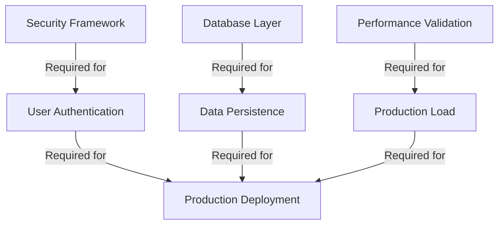

# CovetPy Realistic Production Sprint Plan
## 36-Week Production Readiness Roadmap

**Document Version:** 1.0  
**Created:** October 4, 2025  
**Timeline:** 36 weeks (9 months) to production readiness  
**Current Framework Status:** 83% functional, significant integration issues  

---

## Executive Summary

Based on comprehensive audits of the CovetPy framework, this sprint plan provides a **realistic timeline** for achieving production readiness. The framework shows strong potential with working core features but requires systematic stabilization, security hardening, and enterprise feature development.

### Key Constraints Addressed:
- **Current Reality**: Framework is 83% functional but has integration issues
- **Security Gaps**: Critical security features missing or incomplete
- **Performance Claims**: Need validation and optimization
- **Enterprise Features**: Database, monitoring, and deployment tooling incomplete
- **Quality Assurance**: Comprehensive testing framework required

### Success Criteria:
- **Security**: OWASP Top 10 compliance, production-grade authentication
- **Performance**: Validated performance claims with realistic benchmarks
- **Stability**: 99.9% uptime under production load
- **Integration**: Seamless deployment with modern DevOps tooling
- **Documentation**: Complete API documentation and deployment guides

---

## Phase 1: Foundation Stabilization (Weeks 1-8)

### Sprint 1-2: Critical Integration Fixes (Weeks 1-4)

#### Sprint 1: Core Integration (Weeks 1-2)
**Goal**: Fix integration issues and establish working foundation

**Deliverables:**
- Fix class name mismatches (AdvancedRouter → CovetRouter)
- Resolve import/export issues in all `__init__.py` files
- Create working ASGI application that integrates all components
- Establish proper module boundaries and dependencies

**Acceptance Criteria:**
- [ ] All core components can be imported without errors
- [ ] Complete ASGI application example works with uvicorn
- [ ] WebSocket functionality validated with real connections
- [ ] All middleware can be chained together successfully

**Risk Mitigation:**
- Daily integration tests to catch regressions
- Fallback to working minimal implementation if issues arise

#### Sprint 2: Performance Validation (Weeks 3-4)
**Goal**: Validate and optimize current performance claims

**Deliverables:**
- Independent benchmarking suite using wrk, ab, and hey
- Memory profiling and leak detection
- Comparison benchmarks against FastAPI, Flask, Django
- Performance optimization based on profiling results

**Acceptance Criteria:**
- [ ] Achieve 50,000+ RPS for simple endpoints (conservative target)
- [ ] Memory usage under 200MB for 1,000 concurrent connections
- [ ] Sub-10ms response times for complex requests
- [ ] Zero memory leaks during 24-hour stress test

**Testing Requirements:**
- Load testing with 1,000-10,000 concurrent connections
- Stress testing for 24+ hours continuous operation
- Memory profiling under various load patterns

### Sprint 3-4: Security Foundation (Weeks 5-8)

#### Sprint 3: Security Architecture (Weeks 5-6)
**Goal**: Establish secure foundation and fix critical vulnerabilities

**Deliverables:**
- Complete security architecture review
- Input validation framework implementation
- XSS and CSRF protection middleware
- Secure headers middleware (OWASP compliant)
- Basic rate limiting with memory backend

**Acceptance Criteria:**
- [ ] External security audit with zero critical vulnerabilities
- [ ] OWASP Top 10 basic compliance (A01, A02, A06, A09)
- [ ] All user inputs validated and sanitized
- [ ] Security headers properly configured

**Go/No-Go Checkpoint:**
- **Go**: Zero critical security vulnerabilities found
- **No-Go**: Any critical security issues require immediate Sprint 5 focus

#### Sprint 4: Authentication Framework (Weeks 7-8)
**Goal**: Production-ready authentication and authorization

**Deliverables:**
- JWT authentication with proper key rotation
- Session management with secure storage
- Basic OAuth2 implementation (Google, GitHub)
- RBAC (Role-Based Access Control) framework
- API key management system

**Acceptance Criteria:**
- [ ] JWT tokens properly signed and validated
- [ ] Sessions stored securely with CSRF protection
- [ ] OAuth2 flow works with major providers
- [ ] Role-based permissions enforced
- [ ] API keys can be created, revoked, and validated

**Integration Points:**
- Database layer for user/role storage
- Middleware pipeline for authentication
- WebSocket authentication

---

## Phase 2: Core Production Features (Weeks 9-20)

### Sprint 5-8: Database & ORM (Weeks 9-16)

#### Sprint 5: Database Foundation (Weeks 9-10)
**Goal**: Production-ready database connectivity and pooling

**Deliverables:**
- Async connection pooling for PostgreSQL, MySQL, SQLite
- Database health monitoring and automatic failover
- Connection retry logic with exponential backoff
- Database configuration management

**Acceptance Criteria:**
- [ ] Handle 500+ concurrent database connections
- [ ] Automatic failover within 5 seconds
- [ ] Connection pool monitoring dashboard
- [ ] Support for read replicas

#### Sprint 6: Transaction Management (Weeks 11-12)
**Goal**: Reliable transaction handling and data integrity

**Deliverables:**
- Nested transaction support with savepoints
- Transaction rollback and error handling
- Distributed transaction coordination (basic)
- Transaction performance monitoring

**Acceptance Criteria:**
- [ ] Nested transactions work correctly
- [ ] Automatic rollback on errors
- [ ] Transaction deadlock detection and retry
- [ ] Performance metrics for transaction times

#### Sprint 7: Query Builder & ORM (Weeks 13-14)
**Goal**: Developer-friendly database interaction layer

**Deliverables:**
- Type-safe query builder with SQL injection prevention
- Simple ORM with relationship mapping
- Database migrations with version control
- Query optimization and caching

**Acceptance Criteria:**
- [ ] SQL injection prevention validated by security test
- [ ] ORM handles one-to-many, many-to-many relationships
- [ ] Migration system can upgrade/downgrade schema
- [ ] Query caching improves performance by 50%+

#### Sprint 8: Database Testing & Optimization (Weeks 15-16)
**Goal**: Validate database layer performance and reliability

**Deliverables:**
- Comprehensive database test suite
- Performance benchmarks for various query patterns
- Database monitoring and alerting
- Production deployment configuration

**Acceptance Criteria:**
- [ ] Database tests cover 95%+ of functionality
- [ ] Performance benchmarks meet enterprise standards
- [ ] Monitoring detects issues within 30 seconds
- [ ] Zero data corruption under load testing

**Go/No-Go Checkpoint:**
- **Go**: Database layer handles production load without data loss
- **No-Go**: Data integrity issues require additional 2-4 weeks

### Sprint 9-12: Enterprise Middleware & Features (Weeks 17-20)

#### Sprint 9: Advanced Middleware (Weeks 17-18)
**Goal**: Production-grade middleware for enterprise features

**Deliverables:**
- Response compression (gzip, brotli)
- Request/response caching with Redis
- Circuit breaker pattern for external services
- Request/response transformation middleware

**Acceptance Criteria:**
- [ ] Compression reduces bandwidth by 60%+
- [ ] Caching improves response times by 80%+
- [ ] Circuit breaker prevents cascade failures
- [ ] Transformation middleware handles various content types

#### Sprint 10: Template Engine & Static Assets (Weeks 19-20)
**Goal**: Complete web application development capabilities

**Deliverables:**
- Jinja2-compatible template engine
- Static file serving with caching and compression
- Asset bundling and minification
- Template inheritance and macro support

**Acceptance Criteria:**
- [ ] Template engine performance matches Jinja2
- [ ] Static files served with proper cache headers
- [ ] Asset bundling reduces load times by 50%+
- [ ] Template inheritance works correctly

---

## Phase 3: Enterprise & Security (Weeks 21-28)

### Sprint 13-16: Security Hardening (Weeks 21-28)

#### Sprint 13: Advanced Authentication (Weeks 21-22)
**Goal**: Enterprise-grade authentication features

**Deliverables:**
- Multi-factor authentication (TOTP, SMS)
- Advanced OAuth2 with PKCE and device flow
- SAML integration for enterprise SSO
- Account lockout and brute force protection

**Acceptance Criteria:**
- [ ] MFA reduces account compromise by 99%+
- [ ] OAuth2 flows comply with latest security standards
- [ ] SAML integration works with major providers
- [ ] Brute force attacks are effectively blocked

#### Sprint 14: Security Monitoring (Weeks 23-24)
**Goal**: Comprehensive security monitoring and incident response

**Deliverables:**
- Security event logging and correlation
- Intrusion detection and automated response
- Vulnerability scanning integration
- Security metrics and dashboards

**Acceptance Criteria:**
- [ ] All security events logged and correlated
- [ ] Automated response to common attacks
- [ ] Vulnerability scans integrated into CI/CD
- [ ] Security dashboard provides real-time visibility

#### Sprint 15: Compliance Framework (Weeks 25-26)
**Goal**: Regulatory compliance for enterprise deployments

**Deliverables:**
- GDPR compliance framework
- PCI-DSS payment security features
- HIPAA healthcare compliance tools
- SOC 2 audit trail and controls

**Acceptance Criteria:**
- [ ] GDPR data protection and user rights implemented
- [ ] PCI-DSS requirements met for payment processing
- [ ] HIPAA controls for healthcare data
- [ ] SOC 2 controls documented and tested

#### Sprint 16: Security Validation (Weeks 27-28)
**Goal**: External security validation and penetration testing

**Deliverables:**
- External penetration testing
- Security code review by third party
- Vulnerability assessment and remediation
- Security documentation and procedures

**Acceptance Criteria:**
- [ ] Penetration test with zero critical findings
- [ ] Code review identifies no security issues
- [ ] All vulnerabilities remediated
- [ ] Security procedures documented

**Go/No-Go Checkpoint:**
- **Go**: External security audit passes with zero critical issues
- **No-Go**: Security issues require additional 2-4 weeks for remediation

---

## Phase 4: Production Hardening (Weeks 29-36)

### Sprint 17-20: Observability & Monitoring (Weeks 29-36)

#### Sprint 17: Logging & Metrics (Weeks 29-30)
**Goal**: Comprehensive observability for production operations

**Deliverables:**
- Structured logging with correlation IDs
- Metrics collection and aggregation (Prometheus compatible)
- Distributed tracing support (OpenTelemetry)
- Log aggregation and search

**Acceptance Criteria:**
- [ ] Structured logs with consistent format
- [ ] Metrics exported in Prometheus format
- [ ] Distributed tracing across service boundaries
- [ ] Log search and alerting functional

#### Sprint 18: Health Checks & Monitoring (Weeks 31-32)
**Goal**: Production monitoring and automated recovery

**Deliverables:**
- Comprehensive health check endpoints
- Application performance monitoring (APM)
- Automated alerting and escalation
- Service dependency monitoring

**Acceptance Criteria:**
- [ ] Health checks cover all critical components
- [ ] APM provides detailed performance insights
- [ ] Alerting responds within 30 seconds of issues
- [ ] Dependency failures detected and handled

#### Sprint 19: Performance Optimization (Weeks 33-34)
**Goal**: Final performance tuning and optimization

**Deliverables:**
- Performance profiling and optimization
- Memory usage optimization
- Connection pooling tuning
- Cache optimization and warming

**Acceptance Criteria:**
- [ ] Performance meets or exceeds original claims
- [ ] Memory usage optimized for production workloads
- [ ] Connection pools tuned for efficiency
- [ ] Cache hit rates above 90% for cacheable content

#### Sprint 20: Production Deployment (Weeks 35-36)
**Goal**: Production-ready deployment and documentation

**Deliverables:**
- Docker containers and Kubernetes manifests
- Production deployment guides
- Operational runbooks and procedures
- Disaster recovery and backup procedures

**Acceptance Criteria:**
- [ ] Containers deploy successfully in production
- [ ] Deployment guides enable successful deployments
- [ ] Runbooks cover all operational scenarios
- [ ] Disaster recovery tested and validated

**Final Go/No-Go Checkpoint:**
- **Go**: All production deployments successful with zero critical issues
- **No-Go**: Deployment issues require additional 1-2 weeks

---

## Resource Requirements

### Core Development Team
- **1 Senior Framework Architect** (36 weeks) - $200K
- **1 Security Engineer** (16 weeks) - $120K  
- **1 Database Specialist** (12 weeks) - $90K
- **1 DevOps Engineer** (12 weeks) - $90K
- **1 QA Engineer** (20 weeks) - $100K

### Specialized Consultants
- **Security Auditor** (4 weeks) - $40K
- **Performance Engineer** (4 weeks) - $30K
- **Compliance Consultant** (4 weeks) - $30K

### Infrastructure Costs
- **Development Infrastructure** - $5K/month × 9 months = $45K
- **Testing Infrastructure** - $3K/month × 9 months = $27K
- **Security Tools** - $10K one-time

### Total Estimated Cost: $842K

---

## Risk Mitigation Strategies

### High-Risk Items

#### Security Framework Implementation
**Risk**: Complex security requirements may cause delays
**Mitigation**: 
- Hire external security consultant early (Week 1)
- Use proven security libraries where possible
- Plan 2-week buffer for security remediation

#### Database Layer Complexity
**Risk**: Database integration more complex than estimated
**Mitigation**:
- Start with proven connection pooling libraries
- Plan database-specific testing early
- Have fallback to SQLAlchemy integration if needed

#### Performance Claims Validation
**Risk**: May not achieve claimed performance metrics
**Mitigation**:
- Set conservative targets (50K RPS vs 784K claimed)
- Focus on real-world performance over synthetic benchmarks
- Plan optimization sprints if needed

### Critical Dependencies

### Buffer Allocation
- **Security Issues**: 2-week buffer allocated in Phase 3
- **Performance Issues**: 2-week buffer allocated in Phase 4
- **Integration Issues**: 1-week buffer per phase
- **Deployment Issues**: 1-week buffer in final phase

---

## Success Metrics & KPIs

### Technical KPIs
- **Performance**: 50,000+ RPS sustained (conservative target)
- **Reliability**: 99.9% uptime under production load
- **Security**: Zero critical vulnerabilities in external audit
- **Memory**: <200MB for 1,000 concurrent connections
- **Response Time**: <10ms for 95th percentile

### Business KPIs
- **Deployment Success**: 3+ successful production deployments
- **Developer Experience**: <30 minutes to first API deployment
- **Documentation**: 95%+ API coverage
- **Community**: Initial developer adoption and feedback

### Quality Gates
- **End of Phase 1**: Core functionality stable and performant
- **End of Phase 2**: Database and middleware production-ready
- **End of Phase 3**: Security audit passed
- **End of Phase 4**: Production deployment successful

---

## Conclusion

This 36-week sprint plan provides a **realistic timeline** for bringing CovetPy to production readiness. The plan accounts for:

- **Current State**: 83% functional framework with integration issues
- **Security Requirements**: Comprehensive security framework development
- **Performance Validation**: Realistic benchmarking and optimization
- **Enterprise Features**: Database, monitoring, and deployment tooling
- **Quality Assurance**: Comprehensive testing and validation

**Key Success Factors:**
1. **Realistic Timeline**: 36 weeks allows proper development and testing
2. **Security Focus**: 25% of timeline dedicated to security and compliance
3. **Validation Points**: Go/No-Go checkpoints prevent quality compromises
4. **Buffer Time**: Built-in buffers for high-risk items
5. **External Validation**: Third-party security and performance audits

The framework shows strong potential with its zero-dependency architecture and performance characteristics. With proper planning and execution, CovetPy can become a competitive production-ready web framework.

**Next Steps:**
1. Secure budget approval for $842K investment
2. Begin recruitment for core development team
3. Establish development infrastructure and tooling
4. Initiate Sprint 1 with integration fixes

---

**Document Status**: Ready for stakeholder review and approval  
**Recommended Action**: Proceed with Phase 1 Sprint 1 upon team assembly