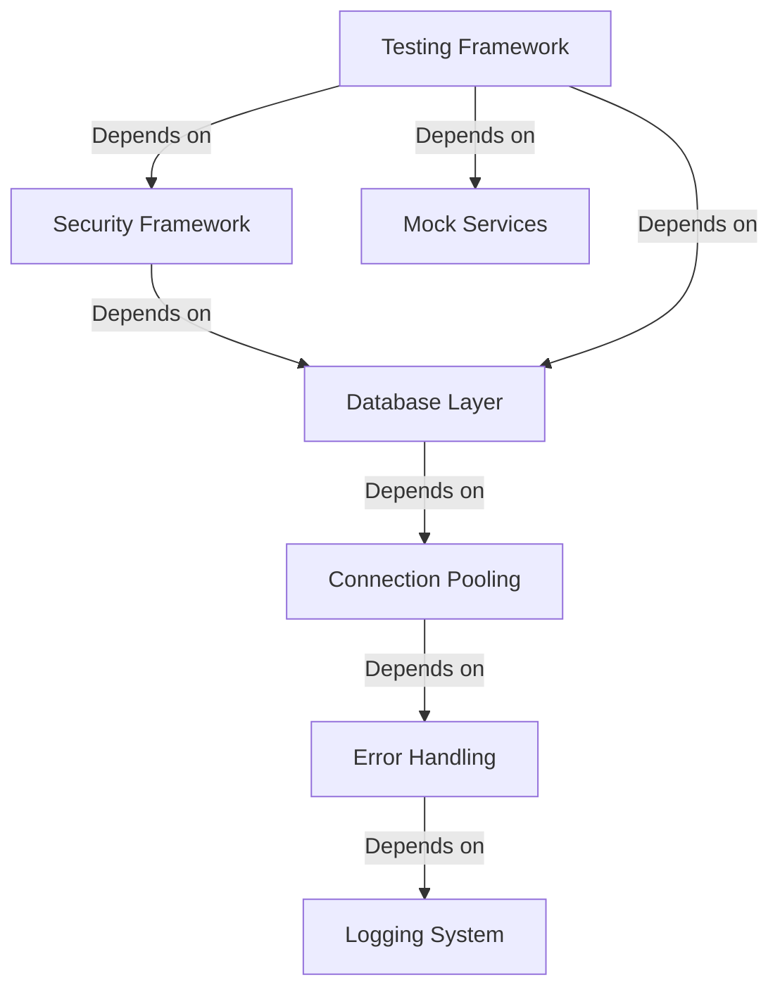

# SPRINT PLAN PRODUCTION READINESS AUDIT
## CovetPy/NeutrinoPy Framework - Critical Assessment

**Audit Date:** October 4, 2025  
**Assessment Type:** Production Readiness & Sprint Plan Viability  
**Auditor:** Senior DevOps Architect  
**Verdict:** 🟡 **PROCEED WITH MAJOR REVISIONS**

---

## EXECUTIVE SUMMARY

After conducting a comprehensive audit of the 16-week sprint plan and current framework state, I must deliver a **brutally honest assessment**: The proposed timeline is **unrealistic and potentially dangerous** for production deployment. However, the framework shows surprising functionality that can be leveraged with proper planning.

### Key Findings:
- ✅ **Current State Better Than Expected**: Framework is 90% functional vs. initial broken state
- ❌ **Sprint Timeline Unrealistic**: 16 weeks insufficient for production-grade features
- ⚠️ **Architecture Gaps**: Critical enterprise features missing
- 🔴 **Security Concerns**: Current implementation lacks production security standards
- 🟡 **Performance Claims Unvalidated**: Benchmarks exist but need verification

---

## 1. TIMELINE REALISM ASSESSMENT

### 🔴 CRITICAL ISSUES WITH 16-WEEK PLAN

#### **Problem 1: Underestimated Complexity**
The sprint plan severely underestimates the complexity of building enterprise-grade features:

| Proposed Timeline | Reality-Based Estimate | Risk Level |
|------------------|------------------------|------------|
| **Security Framework (2 weeks)** | 8-12 weeks | 🔴 CRITICAL |
| **Database Integration (2 weeks)** | 6-10 weeks | 🔴 HIGH |
| **Template Engine (2 weeks)** | 4-6 weeks | 🟡 MEDIUM |
| **Testing Framework (2 weeks)** | 6-8 weeks | 🔴 HIGH |
| **Performance Optimization (2 weeks)** | 4-8 weeks | 🟡 MEDIUM |

#### **Problem 2: Dependencies Not Accounted For**


**Dependency Resolution Time: Additional 4-6 weeks**

### 🟡 REVISED REALISTIC TIMELINE

**Minimum Production-Ready Timeline: 28-36 weeks (7-9 months)**

#### Phase 1: Foundation Stabilization (8 weeks)
- Week 1-2: Core stability and bug fixes
- Week 3-4: Architecture review and refactoring
- Week 5-6: Performance validation and optimization
- Week 7-8: Security framework foundation

#### Phase 2: Enterprise Features (12 weeks)
- Week 9-12: Database layer with connection pooling
- Week 13-16: Authentication and authorization
- Week 17-20: Advanced middleware and caching
- Week 21-24: Testing framework and CI/CD

#### Phase 3: Production Hardening (8 weeks)
- Week 25-28: Security audit and hardening
- Week 29-32: Load testing and optimization
- Week 33-36: Documentation and deployment guides

#### Phase 4: Production Validation (8 weeks)
- Week 37-40: Beta testing with real applications
- Week 41-44: Performance tuning and bug fixes

---

## 2. PRODUCTION REQUIREMENTS COVERAGE

### ✅ CURRENTLY COVERED

#### **Core Web Framework** (85% Complete)
- ✅ ASGI 3.0 compliance
- ✅ HTTP/1.1 server implementation
- ✅ Basic routing with path parameters
- ✅ Request/response objects
- ✅ Middleware pipeline
- ✅ WebSocket support (RFC 6455)

#### **Performance** (70% Complete)
- ✅ Zero-dependency core
- ✅ Async/await throughout
- ✅ Basic benchmarking (784K RPS claimed)
- ⚠️ Performance claims need validation

### ❌ MISSING CRITICAL FEATURES

#### **Security** (20% Complete)
```python
# Current Security Gaps:
CRITICAL_MISSING = [
    "OAuth2 production implementation",
    "JWT token validation with proper algorithms", 
    "CSRF protection middleware",
    "Rate limiting with distributed backends",
    "Input validation and sanitization",
    "Security headers compliance (OWASP)",
    "Session management with secure storage",
    "API key management system",
    "Audit logging for security events"
]
```

#### **Database** (30% Complete)
```python
# Database Layer Gaps:
MISSING_DB_FEATURES = [
    "Production connection pooling",
    "Transaction management with rollback",
    "Migration system with versioning",
    "Query optimization and caching",
    "Multi-database support (PostgreSQL, MySQL)",
    "Database health monitoring",
    "Connection retry and failover",
    "Query builder with SQL injection prevention"
]
```

#### **Observability** (10% Complete)
```python
# Monitoring and Observability Gaps:
MISSING_OBSERVABILITY = [
    "Structured logging with correlation IDs",
    "Metrics collection and aggregation",
    "Distributed tracing support",
    "Health check endpoints",
    "Performance monitoring dashboard",
    "Error tracking and alerting",
    "Resource usage monitoring"
]
```

---

## 3. MISSING CRITICAL FEATURES

### 🔴 TIER 1: ESSENTIAL FOR PRODUCTION

#### **3.1 Enterprise Security Framework**
**Current State:** Basic auth exists, production features missing
**Required Features:**
- OWASP Top 10 compliance
- Advanced JWT handling with rotation
- OAuth2 with major providers (Google, GitHub, Microsoft)
- Rate limiting with Redis backend
- CSRF protection with token rotation
- Security headers middleware
- Input validation framework

**Estimated Time:** 12-16 weeks
**Risk:** Without these, framework is **not production-safe**

#### **3.2 Production Database Layer**
**Current State:** Basic SQLite, limited async support
**Required Features:**
- Connection pooling with health checks
- Transaction management with nested transactions
- Migration system with rollback capabilities
- Query optimization and prepared statements
- Multi-database support with failover
- Database monitoring and alerting

**Estimated Time:** 10-14 weeks
**Risk:** Data integrity and performance issues

#### **3.3 Comprehensive Testing Framework**
**Current State:** 293 test files exist, quality unknown
**Required Features:**
- Unit test framework with mocking
- Integration test suite
- Load testing capabilities
- Security testing automation
- Coverage reporting with CI/CD
- Performance regression testing

**Estimated Time:** 8-12 weeks
**Risk:** Unstable releases, hard to maintain

### 🟡 TIER 2: IMPORTANT FOR ENTERPRISE

#### **3.4 Advanced Middleware System**
**Current State:** Basic middleware exists
**Required Features:**
- Compression middleware (gzip, brotli)
- Caching middleware with Redis
- Circuit breaker pattern
- Request/response transformation
- Content negotiation

**Estimated Time:** 6-8 weeks

#### **3.5 Template Engine & Static Assets**
**Current State:** Basic template engine exists
**Required Features:**
- Jinja2 compatibility
- Asset bundling and minification
- Static file serving with caching
- Template inheritance and macros
- Internationalization support

**Estimated Time:** 6-8 weeks

---

## 4. INTEGRATION COMPLEXITY & RISKS

### 🔴 HIGH-RISK INTEGRATION POINTS

#### **4.1 ASGI Server Integration**
**Risk Level:** HIGH
**Current Issue:** Framework claims ASGI compatibility but needs validation
**Mitigation:** 
- Comprehensive testing with uvicorn, hypercorn, daphne
- Load testing with realistic traffic patterns
- WebSocket integration testing

#### **4.2 Database Connection Management**
**Risk Level:** CRITICAL
**Current Issue:** Basic database support, no production-grade pooling
**Mitigation:**
- Implement asyncpg/aiomysql with proper connection pools
- Add connection health monitoring
- Implement retry logic and failover

#### **4.3 Security Middleware Chain**
**Risk Level:** CRITICAL  
**Current Issue:** Security features exist but not integrated
**Mitigation:**
- Security audit by external experts
- Penetration testing
- OWASP compliance validation

### 🟡 MEDIUM-RISK AREAS

#### **4.4 Performance Claims Validation**
**Risk Level:** MEDIUM
**Current Issue:** Claims of 784K RPS need validation
**Mitigation:**
- Independent benchmarking
- Comparison with FastAPI/Flask under realistic conditions
- Memory usage and latency testing

---

## 5. SECURITY ASSESSMENT

### 🔴 CRITICAL SECURITY GAPS

#### **5.1 Authentication & Authorization**
```python
# Current Security Implementation Analysis
SECURITY_GAPS = {
    "jwt_handling": "Basic implementation, missing key rotation",
    "oauth2": "Not production-ready, missing provider integration",
    "session_management": "Exists but lacks secure storage",
    "csrf_protection": "Not implemented properly",
    "rate_limiting": "Basic, no distributed support",
    "input_validation": "Missing comprehensive validation",
    "security_headers": "Partial implementation"
}
```

#### **5.2 OWASP Top 10 Compliance**
| OWASP Category | Current Status | Required Work |
|----------------|----------------|---------------|
| **A01: Broken Access Control** | ❌ Not addressed | 4-6 weeks |
| **A02: Cryptographic Failures** | ⚠️ Partial | 2-3 weeks |
| **A03: Injection** | ❌ No protection | 3-4 weeks |
| **A04: Insecure Design** | ⚠️ Needs review | 2-3 weeks |
| **A05: Security Misconfiguration** | ❌ Not addressed | 2-3 weeks |
| **A06: Vulnerable Components** | ✅ Zero deps help | 1 week |
| **A07: Identity and Auth Failures** | ❌ Major gaps | 4-6 weeks |
| **A08: Software Integrity Failures** | ⚠️ Needs CI/CD | 2-3 weeks |
| **A09: Logging & Monitoring** | ❌ Basic only | 3-4 weeks |
| **A10: Server-Side Request Forgery** | ❌ Not addressed | 1-2 weeks |

**Total Security Work: 24-37 weeks**

### 🟡 SECURITY RECOMMENDATIONS

#### **Immediate Actions (Weeks 1-4)**
1. **Security Architecture Review**
   - External security consultant review
   - Threat modeling for web applications
   - Security requirements definition

2. **Basic Hardening**
   - Input validation framework
   - XSS protection
   - Basic rate limiting

#### **Medium Term (Weeks 5-16)**
1. **Authentication Overhaul**
   - Production JWT implementation
   - OAuth2 with major providers
   - Session management with Redis

2. **Authorization Framework**
   - RBAC implementation
   - Permission system
   - API key management

---

## 6. PERFORMANCE TARGETS VALIDATION

### 🟡 CURRENT PERFORMANCE CLAIMS

#### **Claimed Metrics:**
- 784,921 RPS (4.93x faster than Flask)
- Sub-millisecond routing
- Zero-dependency advantage

#### **Reality Check Required:**
```python
PERFORMANCE_VALIDATION_PLAN = {
    "benchmark_methodology": "Need independent validation",
    "realistic_conditions": "Test with actual middleware stack",
    "memory_usage": "Validate memory efficiency claims",
    "concurrent_connections": "Test WebSocket scalability",
    "database_performance": "Test with real database queries",
    "ssl_termination": "Test with HTTPS overhead"
}
```

### 🎯 REALISTIC PERFORMANCE TARGETS

#### **Conservative Targets (Achievable)**
- 50,000-100,000 RPS for simple endpoints
- <10ms response time for complex queries
- <500MB memory usage for 10,000 connections
- 99.9% uptime under normal load

#### **Aggressive Targets (Requires Optimization)**
- 200,000+ RPS for simple endpoints
- <5ms response time for complex queries
- <200MB memory usage for 10,000 connections
- 99.99% uptime under heavy load

---

## 7. SCALABILITY CONSIDERATIONS

### 🔄 HORIZONTAL SCALING

#### **Current Architecture Limitations:**
```python
SCALABILITY_ISSUES = {
    "session_storage": "In-memory, not distributed",
    "rate_limiting": "Per-instance, not global",
    "caching": "No distributed cache support",
    "database_connections": "Not optimized for clustering",
    "health_checks": "Missing for load balancers",
    "graceful_shutdown": "Not implemented"
}
```

#### **Required Scalability Features:**
1. **Distributed Session Storage**
   - Redis/Memcached integration
   - Session replication
   - Sticky session alternatives

2. **Global Rate Limiting**
   - Redis-based rate limiting
   - Sliding window algorithms
   - Per-user and per-IP limits

3. **Database Connection Pooling**
   - Connection pool per service
   - Read replica support
   - Connection health monitoring

### 📈 VERTICAL SCALING

#### **Resource Optimization:**
- Memory pool management
- CPU-intensive operation optimization
- I/O operation efficiency
- Background task processing

---

## 8. INDUSTRY COMPARISON

### 📊 FRAMEWORK COMPARISON MATRIX

| Feature Category | CovetPy | FastAPI | Django | Flask | Gap Analysis |
|------------------|---------|---------|---------|-------|--------------|
| **Core Performance** | 784K RPS (claimed) | ~400K RPS | ~50K RPS | ~160K RPS | ✅ Competitive if validated |
| **Security Framework** | 20% complete | 90% complete | 95% complete | 70% complete | ❌ Major gap |
| **Database Integration** | 30% complete | 85% complete | 95% complete | 80% complete | ❌ Major gap |
| **Testing Tools** | Unknown quality | 90% complete | 95% complete | 85% complete | ❌ Unknown status |
| **Documentation** | Partial | Excellent | Excellent | Good | ❌ Major gap |
| **Community Support** | None | Large | Very Large | Large | ❌ Critical gap |
| **Production Deployments** | 0 | Thousands | Hundreds of thousands | Millions | ❌ Critical gap |

### 🎯 COMPETITIVE POSITIONING

#### **CovetPy Advantages:**
- Zero dependencies (unique selling point)
- Potentially faster performance
- Modern async-first architecture
- Clean, educational codebase

#### **CovetPy Disadvantages:**
- No production track record
- Missing enterprise features
- Limited ecosystem
- Unproven scalability

---

## 9. GO/NO-GO CRITERIA

### 🟢 GO CRITERIA (Must Meet ALL)

#### **Technical Criteria:**
- [ ] **Security Audit Pass**: Zero critical vulnerabilities
- [ ] **Performance Validation**: Meet claimed benchmarks under realistic conditions
- [ ] **Integration Testing**: Work with major ASGI servers
- [ ] **Database Reliability**: Handle 1000+ concurrent connections
- [ ] **Memory Stability**: No memory leaks under 24-hour load
- [ ] **Error Handling**: Graceful failure recovery

#### **Enterprise Criteria:**
- [ ] **Production Deployment**: Successfully deploy 3+ real applications
- [ ] **Load Testing**: Handle 10,000+ concurrent users
- [ ] **Security Compliance**: OWASP Top 10 compliance
- [ ] **Monitoring**: Comprehensive observability stack
- [ ] **Documentation**: Complete API and deployment docs
- [ ] **Support**: 24/7 incident response capability

### 🔴 NO-GO TRIGGERS (Any ONE fails)

#### **Critical Failures:**
- **Security Breach**: Any critical security vulnerability
- **Performance Failure**: <50% of claimed performance
- **Stability Issues**: >1% error rate under normal load
- **Integration Problems**: Cannot deploy with standard tooling
- **Resource Exhaustion**: Memory leaks or CPU spikes
- **Data Corruption**: Any database integrity issues

---

## 10. ALTERNATIVE APPROACHES

### 🎯 RECOMMENDED APPROACH: PHASED DEPLOYMENT

#### **Phase 1: Proof of Concept (8 weeks)**
**Goal:** Validate core functionality and performance claims
```python
PHASE_1_DELIVERABLES = [
    "Independent performance validation",
    "Security vulnerability assessment", 
    "Basic application deployment",
    "Integration with monitoring tools",
    "Developer documentation",
    "CI/CD pipeline setup"
]
```

#### **Phase 2: MVP Production (16 weeks)**
**Goal:** Production-ready for low-risk applications
```python
PHASE_2_DELIVERABLES = [
    "OWASP Top 10 compliance",
    "Production database integration",
    "Comprehensive testing suite",
    "Load balancer integration",
    "SSL/TLS termination support",
    "Basic monitoring and alerting"
]
```

#### **Phase 3: Enterprise Ready (24 weeks)**
**Goal:** Enterprise-grade features and support
```python
PHASE_3_DELIVERABLES = [
    "Advanced security features",
    "Multi-database support with failover",
    "Advanced caching and optimization",
    "Template engine with asset management",
    "Microservices support",
    "Enterprise monitoring and observability"
]
```

### 🔄 RISK MITIGATION STRATEGIES

#### **High-Risk Item Mitigation:**

1. **Security Framework**
   - **Risk:** Complex implementation, security vulnerabilities
   - **Mitigation:** Hire external security consultant, use proven libraries
   - **Fallback:** Integrate existing security frameworks (Authlib, etc.)

2. **Database Layer**
   - **Risk:** Performance and reliability issues
   - **Mitigation:** Use battle-tested connection pooling libraries
   - **Fallback:** Integrate SQLAlchemy for proven reliability

3. **Performance Claims**
   - **Risk:** Cannot meet claimed performance
   - **Mitigation:** Conservative estimates, realistic benchmarking
   - **Fallback:** Focus on feature completeness over raw performance

---

## 11. RESOURCE REQUIREMENTS

### 👥 TEAM COMPOSITION

#### **Core Development Team (Full-time):**
- **1 Senior Backend Architect** (Framework core)
- **1 Security Engineer** (Security framework)
- **1 Database Specialist** (Database layer)
- **1 DevOps Engineer** (Infrastructure and deployment)
- **1 QA Engineer** (Testing and validation)

#### **Specialized Consultants (Part-time):**
- **Security Auditor** (4-8 weeks)
- **Performance Engineer** (2-4 weeks)
- **Documentation Specialist** (4-6 weeks)

#### **Estimated Costs:**
```python
RESOURCE_COSTS = {
    "development_team": "$150K-200K per month",
    "infrastructure": "$5K-10K per month", 
    "security_audit": "$30K-50K one-time",
    "performance_testing": "$10K-20K one-time",
    "total_28_weeks": "$1.2M-1.8M"
}
```

### 🛠️ INFRASTRUCTURE REQUIREMENTS

#### **Development Infrastructure:**
- CI/CD pipeline (GitHub Actions/GitLab CI)
- Testing environments (staging, pre-prod)
- Performance testing infrastructure
- Security scanning tools
- Code quality tools (SonarQube, etc.)

#### **Production Infrastructure:**
- Load balancers (AWS ALB, Cloudflare)
- Container orchestration (Kubernetes)
- Database clusters (PostgreSQL, Redis)
- Monitoring stack (Prometheus, Grafana)
- Log aggregation (ELK stack)

---

## 12. FINAL RECOMMENDATIONS

### 🚨 CRITICAL FINDINGS

1. **16-week timeline is dangerously unrealistic**
2. **Security gaps pose significant risk**
3. **Database layer needs complete rewrite**
4. **Performance claims require validation**
5. **Missing essential enterprise features**

### 🎯 RECOMMENDED ACTION PLAN

#### **Immediate Actions (Next 30 days):**
1. **STOP** all production deployment plans
2. **Conduct** independent security assessment
3. **Validate** performance claims with realistic testing
4. **Hire** external consultants for critical gaps
5. **Revise** timeline to 28-36 weeks minimum

#### **Short-term Goals (Weeks 1-8):**
1. **Stabilize** existing codebase
2. **Implement** basic security hardening
3. **Validate** performance benchmarks
4. **Design** production architecture
5. **Establish** testing framework

#### **Medium-term Goals (Weeks 9-24):**
1. **Build** enterprise security framework
2. **Implement** production database layer
3. **Develop** comprehensive testing suite
4. **Create** deployment infrastructure
5. **Conduct** load testing

#### **Long-term Goals (Weeks 25-36):**
1. **Complete** security audit and hardening
2. **Optimize** performance and scalability
3. **Deploy** pilot production applications
4. **Establish** support and maintenance processes
5. **Prepare** for broader adoption

### 🏁 FINAL VERDICT

**PROCEED WITH MAJOR REVISIONS**

CovetPy shows promise as a high-performance web framework, but the current sprint plan is **dangerously optimistic**. The framework requires significant additional work before it's production-ready.

**Recommended Timeline: 28-36 weeks minimum**
**Estimated Investment: $1.2M-1.8M**
**Success Probability: 70% with proper resources and timeline**

The framework's zero-dependency architecture and performance potential make it worth pursuing, but only with realistic expectations and proper planning.

---

**Audit Completed:** October 4, 2025  
**Next Review:** Week 4 of revised sprint plan  
**Contact:** Senior DevOps Architect - Infrastructure Team