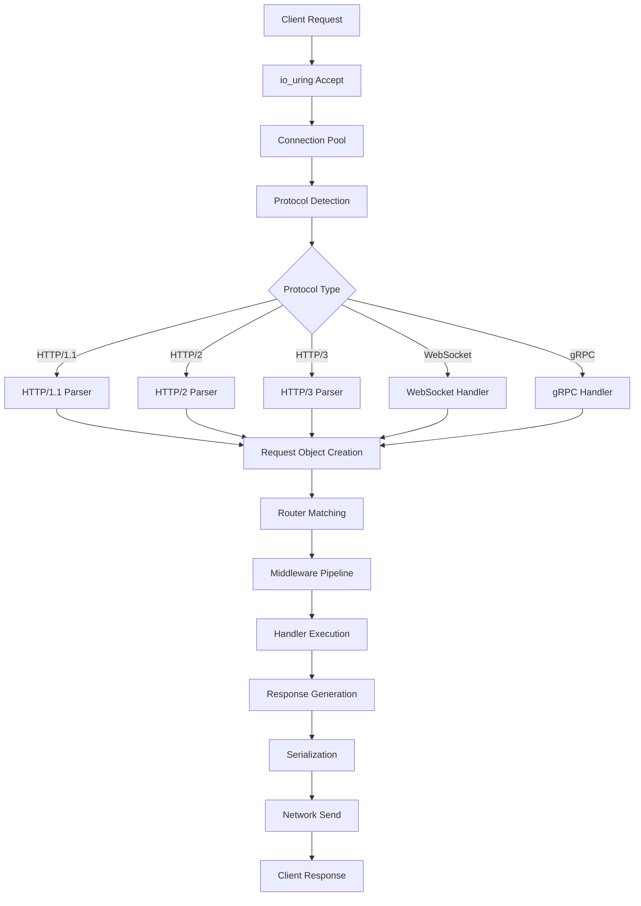

# CovetPy Framework - API Flow and Request Lifecycle

## Table of Contents
1. [Request Lifecycle Overview](#request-lifecycle-overview)
2. [API Decorators and Routing](#api-decorators-and-routing)
3. [Request Processing Pipeline](#request-processing-pipeline)
4. [Response Generation](#response-generation)
5. [Middleware Execution](#middleware-execution)
6. [Error Handling Flow](#error-handling-flow)
7. [Performance Optimizations](#performance-optimizations)

## Request Lifecycle Overview

The CovetPy Framework processes requests through a highly optimized pipeline that leverages both Rust and Python components for maximum performance.

### High-Level Flow

```
Client Request → Network Layer (Rust) → Protocol Parser → 
Router → Middleware → Handler (Python) → Response → Client
```

### Detailed Request Journey



## API Decorators and Routing

### Route Definition

```python
from covet import CovetPy, Request, Response
from covet.types import PathParams, QueryParams

app = CovetPy()

# Basic route
@app.get('/users')
async def list_users():
    return {"users": await fetch_all_users()}

# Path parameters
@app.get('/users/{user_id}')
async def get_user(user_id: int):
    return await fetch_user(user_id)

# Multiple HTTP methods
@app.route('/items/{item_id}', methods=['GET', 'PUT', 'DELETE'])
async def handle_item(request: Request, item_id: str):
    if request.method == 'GET':
        return await get_item(item_id)
    elif request.method == 'PUT':
        data = await request.json()
        return await update_item(item_id, data)
    else:
        return await delete_item(item_id)

# Advanced parameter handling
@app.post('/search')
async def search(
    request: Request,
    q: str = Query(..., description="Search query"),
    limit: int = Query(10, ge=1, le=100),
    offset: int = Query(0, ge=0)
):
    body = await request.json()
    return await perform_search(q, limit, offset, body)
```

### Route Registration Process

1. **Python Decorator Execution**
   ```python
   # Internal route registration
   def route(path: str, methods: List[str]):
       def decorator(func):
           # Create route metadata
           route_meta = RouteMetadata(
               path=path,
               methods=methods,
               handler=func,
               param_names=extract_params(path),
               is_async=asyncio.iscoroutinefunction(func)
           )
           
           # Register with Rust router via FFI
           rust_router.register_route(route_meta)
           
           return func
       return decorator
   ```

2. **Rust Router Registration**
   ```rust
   // Rust side route registration
   pub fn register_route(&mut self, route: PyRoute) {
       let compiled_path = self.compile_path(&route.path);
       let handler = Arc::new(PythonHandler::new(route.handler));
       
       for method in route.methods {
           self.router.insert(
               method,
               compiled_path.clone(),
               handler.clone()
           );
       }
   }
   ```

## Request Processing Pipeline

### 1. Network Reception (Rust)

```rust
// io_uring-based network reception
pub async fn accept_connections(&self) {
    loop {
        let (stream, addr) = self.listener.accept().await?;
        
        // Zero-copy buffer allocation
        let buffer = self.buffer_pool.acquire();
        
        // Submit read operation to io_uring
        self.io_ring.submit_read(stream.as_raw_fd(), buffer);
        
        // Process in separate task
        tokio::spawn(self.handle_connection(stream, addr, buffer));
    }
}
```

### 2. Protocol Parsing

```rust
// SIMD-optimized HTTP parsing
pub fn parse_http_request(&self, buffer: &[u8]) -> Result<Request> {
    // Use SIMD for finding delimiters
    let headers_end = self.find_headers_end_simd(buffer)?;
    
    // Parse request line
    let (method, path, version) = self.parse_request_line(&buffer[..headers_end])?;
    
    // Parse headers with HPACK for HTTP/2
    let headers = self.parse_headers_simd(&buffer[..headers_end])?;
    
    // Create request object
    Ok(Request {
        method,
        path,
        version,
        headers,
        body_start: headers_end + 4,
    })
}
```

### 3. Request Object Creation

```python
# Python Request object
class Request:
    def __init__(self, rust_request):
        self._rust_request = rust_request
        self._body_consumed = False
        self._json_cache = None
        
    @property
    def method(self) -> str:
        return self._rust_request.method
    
    @property
    def path(self) -> str:
        return self._rust_request.path
    
    @property
    def headers(self) -> Headers:
        return Headers(self._rust_request.headers)
    
    @property
    def path_params(self) -> dict:
        return self._rust_request.path_params
    
    async def json(self) -> dict:
        if self._json_cache is None:
            body = await self.body()
            self._json_cache = orjson.loads(body)
        return self._json_cache
    
    async def body(self) -> bytes:
        if not self._body_consumed:
            self._body_consumed = True
            return await self._rust_request.read_body()
        raise RuntimeError("Request body already consumed")
```

### 4. Router Matching

```rust
// High-performance radix tree routing
pub struct Router {
    trees: HashMap<Method, RadixTree<Handler>>,
}

impl Router {
    pub fn find_route(&self, method: &Method, path: &str) -> Option<(Handler, Params)> {
        let tree = self.trees.get(method)?;
        
        // O(k) lookup where k is path length
        let (handler, params) = tree.find(path)?;
        
        Some((handler.clone(), params))
    }
}
```

## Response Generation

### Response Object

```python
# Python Response object
class Response:
    def __init__(
        self,
        content: Any = None,
        status_code: int = 200,
        headers: Optional[dict] = None,
        media_type: Optional[str] = None
    ):
        self.status_code = status_code
        self.headers = headers or {}
        self.media_type = media_type
        self._content = content
    
    @property
    def content(self) -> bytes:
        if isinstance(self._content, bytes):
            return self._content
        elif isinstance(self._content, str):
            return self._content.encode('utf-8')
        elif isinstance(self._content, dict):
            return orjson.dumps(self._content)
        else:
            return str(self._content).encode('utf-8')
```

### Streaming Response

```python
class StreamingResponse(Response):
    def __init__(self, content_generator, **kwargs):
        super().__init__(**kwargs)
        self.content_generator = content_generator
    
    async def stream_body(self):
        async for chunk in self.content_generator:
            if isinstance(chunk, str):
                yield chunk.encode('utf-8')
            else:
                yield chunk
```

## Middleware Execution

### Middleware Pipeline

```python
# Middleware registration
app = CovetPy()

# Global middleware
app.add_middleware(CORSMiddleware)
app.add_middleware(GZipMiddleware)
app.add_middleware(AuthenticationMiddleware)

# Route-specific middleware
@app.get('/admin', middleware=[RequireAdmin])
async def admin_panel():
    return {"message": "Welcome to admin panel"}
```

### Middleware Implementation

```python
class BaseMiddleware:
    async def __call__(self, request: Request, call_next):
        # Pre-processing
        request = await self.process_request(request)
        
        # Call next middleware or handler
        response = await call_next(request)
        
        # Post-processing
        response = await self.process_response(response)
        
        return response

# Example: Timing middleware
class TimingMiddleware(BaseMiddleware):
    async def __call__(self, request: Request, call_next):
        start = time.time()
        
        response = await call_next(request)
        
        duration = time.time() - start
        response.headers['X-Process-Time'] = f"{duration:.3f}"
        
        return response
```

### Middleware Execution Order

```
Request → GlobalMiddleware1 → GlobalMiddleware2 → RouteMiddleware → Handler
       ↓                                                              ↓
Response ← GlobalMiddleware1 ← GlobalMiddleware2 ← RouteMiddleware ←
```

## Error Handling Flow

### Exception Handling

```python
# Global exception handlers
@app.exception_handler(ValueError)
async def value_error_handler(request: Request, exc: ValueError):
    return JSONResponse(
        status_code=400,
        content={"error": str(exc), "type": "validation_error"}
    )

@app.exception_handler(500)
async def internal_error_handler(request: Request, exc: Exception):
    # Log the error
    logger.error(f"Internal error: {exc}", exc_info=True)
    
    return JSONResponse(
        status_code=500,
        content={"error": "Internal server error"}
    )

# Route-level error handling
@app.get('/risky-operation')
async def risky_operation():
    try:
        result = await perform_risky_operation()
        return {"result": result}
    except OperationError as e:
        raise HTTPException(status_code=400, detail=str(e))
```

### Error Propagation

```
Handler Exception → Route Error Handler → Global Error Handler → 
Error Response → Client
```

## Performance Optimizations

### 1. Request Parsing Optimizations

```rust
// SIMD-optimized header parsing
#[target_feature(enable = "avx2")]
unsafe fn find_header_delimiter_simd(buffer: &[u8]) -> Option<usize> {
    let needle = _mm256_set1_epi8(b':' as i8);
    
    for (i, chunk) in buffer.chunks_exact(32).enumerate() {
        let haystack = _mm256_loadu_si256(chunk.as_ptr() as *const __m256i);
        let cmp = _mm256_cmpeq_epi8(haystack, needle);
        let mask = _mm256_movemask_epi8(cmp);
        
        if mask != 0 {
            return Some(i * 32 + mask.trailing_zeros() as usize);
        }
    }
    
    None
}
```

### 2. Zero-Copy Response

```rust
// Zero-copy file serving
pub async fn serve_static_file(&self, path: &Path, socket: &TcpStream) -> Result<()> {
    let file = File::open(path).await?;
    let metadata = file.metadata().await?;
    
    // Use sendfile for zero-copy transfer
    let bytes_sent = sendfile(
        socket.as_raw_fd(),
        file.as_raw_fd(),
        0,
        metadata.len() as usize
    )?;
    
    Ok(())
}
```

### 3. Connection Pooling

```python
# Reuse connections for external services
class ConnectionPool:
    def __init__(self, max_connections: int = 100):
        self.pool = asyncio.Queue(maxsize=max_connections)
        self.active = set()
    
    async def acquire(self):
        try:
            conn = self.pool.get_nowait()
            if await conn.is_healthy():
                self.active.add(conn)
                return conn
        except asyncio.QueueEmpty:
            pass
        
        # Create new connection
        conn = await self.create_connection()
        self.active.add(conn)
        return conn
    
    async def release(self, conn):
        self.active.remove(conn)
        if self.pool.full():
            await conn.close()
        else:
            await self.pool.put(conn)
```

### 4. Request Batching

```python
# Batch multiple operations
class BatchProcessor:
    def __init__(self, batch_size: int = 100, timeout: float = 0.1):
        self.batch_size = batch_size
        self.timeout = timeout
        self.pending = []
        self.lock = asyncio.Lock()
    
    async def process(self, item):
        async with self.lock:
            self.pending.append(item)
            
            if len(self.pending) >= self.batch_size:
                return await self._flush()
        
        # Wait for more items or timeout
        await asyncio.sleep(self.timeout)
        return await self._flush()
    
    async def _flush(self):
        if not self.pending:
            return []
        
        batch = self.pending[:self.batch_size]
        self.pending = self.pending[self.batch_size:]
        
        return await self._process_batch(batch)
```

## Request Lifecycle Hooks

### Lifecycle Events

```python
# Application lifecycle
@app.on_event("startup")
async def startup():
    # Initialize resources
    app.db = await create_db_pool()
    app.redis = await create_redis_pool()
    app.ml_model = await load_ml_model()

@app.on_event("shutdown")
async def shutdown():
    # Cleanup resources
    await app.db.close()
    await app.redis.close()

# Request lifecycle
@app.before_request
async def before_request(request: Request):
    request.state.start_time = time.time()

@app.after_request
async def after_request(request: Request, response: Response):
    duration = time.time() - request.state.start_time
    logger.info(f"{request.method} {request.path} - {response.status_code} - {duration:.3f}s")
```

## Advanced Request Patterns

### 1. Request Validation

```python
from covet.validation import Body, Query, Path

@app.post('/users')
async def create_user(
    user: UserModel = Body(...),
    notify: bool = Query(False),
    source: str = Query("api")
):
    # Automatic validation and parsing
    user_id = await save_user(user)
    
    if notify:
        await send_notification(user_id, source)
    
    return {"user_id": user_id}
```

### 2. Content Negotiation

```python
@app.get('/data')
async def get_data(request: Request):
    accept = request.headers.get('Accept', 'application/json')
    
    data = await fetch_data()
    
    if 'application/json' in accept:
        return JSONResponse(data)
    elif 'text/csv' in accept:
        return PlainTextResponse(to_csv(data), media_type='text/csv')
    elif 'application/xml' in accept:
        return XMLResponse(to_xml(data))
    else:
        return JSONResponse(data)  # Default to JSON
```

### 3. Request Context

```python
# Request-scoped context
from contextvars import ContextVar

request_id_ctx = ContextVar('request_id', default=None)

@app.middleware('request_id')
async def request_id_middleware(request: Request, call_next):
    request_id = request.headers.get('X-Request-ID', str(uuid.uuid4()))
    request_id_ctx.set(request_id)
    
    response = await call_next(request)
    response.headers['X-Request-ID'] = request_id
    
    return response

# Use in handlers
@app.get('/trace')
async def trace():
    request_id = request_id_ctx.get()
    logger.info(f"Processing request {request_id}")
    return {"request_id": request_id}
```

## Performance Metrics

### Request Metrics

```python
# Built-in metrics collection
@app.get('/metrics')
async def metrics():
    return {
        "requests": {
            "total": app.metrics.total_requests,
            "per_second": app.metrics.requests_per_second,
            "active": app.metrics.active_requests
        },
        "latency": {
            "mean": app.metrics.mean_latency_ms,
            "p50": app.metrics.p50_latency_ms,
            "p95": app.metrics.p95_latency_ms,
            "p99": app.metrics.p99_latency_ms
        },
        "errors": {
            "4xx": app.metrics.client_errors,
            "5xx": app.metrics.server_errors
        }
    }
```

This completes the API flow and request lifecycle documentation. The framework provides a highly optimized request processing pipeline that leverages Rust for performance-critical operations while maintaining Python's ease of use for business logic implementation.