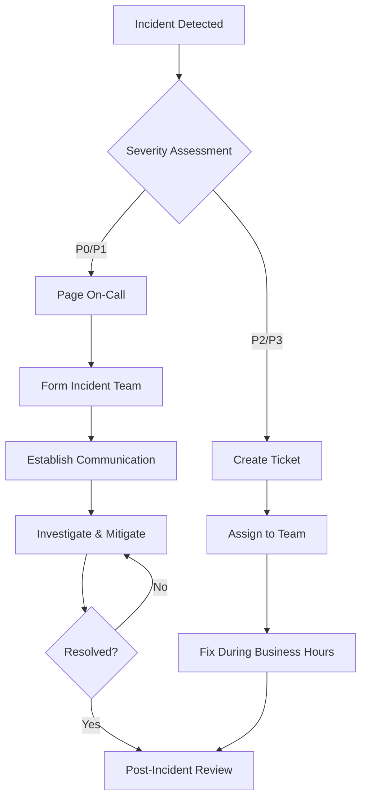

# Site Reliability Engineering (SRE) Practices for CovetPy

## Table of Contents
1. [SRE Philosophy and Principles](#sre-philosophy-and-principles)
2. [Service Level Objectives (SLOs)](#service-level-objectives-slos)
3. [Error Budgets](#error-budgets)
4. [Monitoring and Alerting](#monitoring-and-alerting)
5. [Incident Management](#incident-management)
6. [Capacity Planning](#capacity-planning)
7. [Change Management](#change-management)
8. [Toil Reduction](#toil-reduction)
9. [Disaster Recovery](#disaster-recovery)
10. [Post-Incident Reviews](#post-incident-reviews)

## SRE Philosophy and Principles

### Core Principles

1. **Reliability is the most important feature** - Without reliability, features don't matter
2. **Users define reliability** - Reliability is measured from the user's perspective
3. **100% reliability is the wrong target** - Perfect reliability is impossible and expensive
4. **Change is inevitable** - Embrace change while maintaining reliability
5. **Measure everything** - Make decisions based on data, not assumptions
6. **Automate toil away** - Reduce manual, repetitive work through automation

### SRE vs Traditional Operations

| Aspect | Traditional Ops | SRE |
|--------|----------------|-----|
| Approach | Reactive | Proactive |
| Error handling | Minimize incidents | Accept controlled failure |
| Change velocity | Stability over speed | Balance reliability and velocity |
| Metrics | Infrastructure-focused | User-focused |
| Process | Manual processes | Automation-first |

## Service Level Objectives (SLOs)

### Defined SLOs for CovetPy

#### API Availability SLO
- **Target**: 99.9% availability over 30 days
- **Measurement**: Percentage of successful HTTP responses (status codes 200-299, 400-499)
- **Measurement window**: 30-day rolling window
- **Alert threshold**: 99.5% (early warning)

#### API Latency SLO
- **Target**: 95% of requests complete within 500ms
- **Measurement**: P95 latency of HTTP requests
- **Measurement window**: 5-minute rolling window  
- **Alert threshold**: P95 > 750ms

#### Database Query Performance SLO
- **Target**: 99% of database queries complete within 100ms
- **Measurement**: P99 latency of database operations
- **Measurement window**: 5-minute rolling window
- **Alert threshold**: P99 > 200ms

#### Data Processing SLO
- **Target**: 95% of background jobs complete within SLA
- **Measurement**: Job completion time vs. SLA per job type
- **Measurement window**: 1-hour rolling window
- **Alert threshold**: 90% job SLA compliance

### SLO Configuration

```yaml
# prometheus-slo-rules.yml
groups:
  - name: covet-slo-rules
    rules:
      # API Availability SLO
      - record: covet:sli_api_availability_rate5m
        expr: >
          (
            sum(rate(http_requests_total{job="covet", code!~"5.."}[5m])) 
            / 
            sum(rate(http_requests_total{job="covet"}[5m]))
          )
      
      - record: covet:sli_api_availability_rate30d
        expr: >
          avg_over_time(covet:sli_api_availability_rate5m[30d])
      
      # API Latency SLO
      - record: covet:sli_api_latency_p95_5m
        expr: >
          histogram_quantile(0.95, 
            sum(rate(http_request_duration_seconds_bucket{job="covet"}[5m])) by (le)
          )
      
      # Database Query Performance SLO
      - record: covet:sli_db_latency_p99_5m
        expr: >
          histogram_quantile(0.99,
            sum(rate(db_query_duration_seconds_bucket{job="covet"}[5m])) by (le)
          )
```

## Error Budgets

### Error Budget Calculation

```
Error Budget = (1 - SLO) × Total Time Period
```

#### Monthly Error Budgets

| Service | SLO | Error Budget (monthly) | Downtime Allowed |
|---------|-----|----------------------|------------------|
| API | 99.9% | 0.1% | 43.8 minutes |
| Database | 99.95% | 0.05% | 21.9 minutes |
| Background Jobs | 95% | 5% | 36 hours |

### Error Budget Policy

1. **Budget Available (>50%)**: 
   - Full velocity deployment
   - New feature releases allowed
   - Experimental features enabled

2. **Budget Depleted (10-50%)**:
   - Reduce deployment frequency
   - Focus on reliability improvements
   - Pause non-critical features

3. **Budget Exhausted (<10%)**:
   - Freeze all releases except critical fixes
   - Dedicate full team to reliability
   - Implement emergency response procedures

### Error Budget Monitoring

```yaml
# error-budget-alerts.yml
groups:
  - name: error-budget-alerts
    rules:
      # API Error Budget Alert
      - alert: APIErrorBudgetHigh
        expr: >
          (1 - covet:sli_api_availability_rate30d) > 0.0005
        for: 5m
        labels:
          severity: warning
          service: api
        annotations:
          summary: "API error budget consumption is high"
          description: "API availability SLO error budget is {{ $value | humanizePercentage }} consumed"
      
      - alert: APIErrorBudgetCritical
        expr: >
          (1 - covet:sli_api_availability_rate30d) > 0.0009
        for: 1m
        labels:
          severity: critical
          service: api
        annotations:
          summary: "API error budget nearly exhausted"
          description: "API availability SLO error budget is {{ $value | humanizePercentage }} consumed - implement release freeze"
```

## Monitoring and Alerting

### Four Golden Signals

1. **Latency**: Time to process requests
2. **Traffic**: Rate of requests
3. **Errors**: Rate of failed requests
4. **Saturation**: Resource utilization

### Alert Severity Levels

| Level | Description | Response Time | Escalation |
|-------|-------------|---------------|------------|
| **P0 - Critical** | Service down, data loss | Immediate | Page on-call |
| **P1 - High** | Major functionality impaired | 15 minutes | Email + Slack |
| **P2 - Medium** | Minor functionality impaired | 1 hour | Slack only |
| **P3 - Low** | Potential future problems | Next business day | Ticket only |

### Monitoring Stack

```yaml
# monitoring-architecture.yml
monitoring:
  metrics:
    - prometheus: "Application metrics collection"
    - grafana: "Metrics visualization and dashboards"
    - cloudwatch: "AWS infrastructure metrics"
  
  logging:
    - fluentbit: "Log collection and forwarding"
    - elasticsearch: "Log storage and indexing"
    - kibana: "Log analysis and visualization"
  
  tracing:
    - jaeger: "Distributed tracing"
    - opentelemetry: "Trace collection"
  
  alerting:
    - alertmanager: "Alert routing and notifications"
    - pagerduty: "Incident response platform"
    - slack: "Team notifications"
```

## Incident Management

### Incident Response Process



### Incident Roles

1. **Incident Commander (IC)**
   - Overall incident coordination
   - Decision making authority
   - Communication with stakeholders

2. **Primary Resolver**
   - Technical investigation and resolution
   - System changes and fixes
   - Status updates to IC

3. **Communications Lead**
   - External communication
   - Status page updates
   - Customer notifications

4. **Subject Matter Expert (SME)**
   - Domain-specific knowledge
   - Technical guidance
   - System expertise

### Incident Communication Templates

#### Initial Incident Report
```
🚨 INCIDENT ALERT 🚨

Incident ID: INC-YYYY-MMDD-###
Severity: P[0-3]
Service: [Affected Service]
Started: [Timestamp]

IMPACT:
- [Description of user impact]
- [Affected functionality]

STATUS:
- Investigating
- ETA for update: [Time]

Incident Commander: @[username]
```

#### Status Update Template
```
📊 INCIDENT UPDATE 📊

Incident ID: INC-YYYY-MMDD-###
Time: [Timestamp]

CURRENT STATUS:
- [Current investigation/mitigation status]

ACTIONS TAKEN:
- [List of actions performed]

NEXT STEPS:
- [Planned next actions]

ETA for next update: [Time]
```

#### Resolution Notice
```
✅ INCIDENT RESOLVED ✅

Incident ID: INC-YYYY-MMDD-###
Resolution Time: [Timestamp]
Duration: [Total incident duration]

RESOLUTION:
- [Description of fix applied]

ROOT CAUSE:
- [Brief root cause summary]

NEXT STEPS:
- Post-incident review scheduled for [Date]
- Follow-up items tracked in [Ticket System]
```

## Capacity Planning

### Capacity Metrics

1. **CPU Utilization**
   - Target: <70% average, <90% peak
   - Scale trigger: >80% for 5 minutes

2. **Memory Utilization**
   - Target: <80% average, <95% peak  
   - Scale trigger: >85% for 5 minutes

3. **Storage Utilization**
   - Target: <80% for databases
   - Alert: >85%, Critical: >95%

4. **Network Bandwidth**
   - Monitor ingress/egress patterns
   - Alert on abnormal traffic spikes

### Growth Planning

```python
# capacity-planning.py
import pandas as pd
import numpy as np
from datetime import datetime, timedelta

class CapacityPlanner:
    def __init__(self, historical_data):
        self.data = historical_data
    
    def predict_growth(self, metric, days_ahead=90):
        """Predict resource growth using linear regression"""
        # Implementation for growth prediction
        # Based on historical trends and business projections
        pass
    
    def calculate_scaling_thresholds(self, current_capacity):
        """Calculate when to scale resources"""
        # Implementation for scaling thresholds
        # Based on growth rate and lead times
        pass
    
    def generate_capacity_report(self):
        """Generate capacity planning report"""
        # Implementation for automated reporting
        pass
```

### Auto-scaling Configuration

```yaml
# hpa-advanced.yml
apiVersion: autoscaling/v2
kind: HorizontalPodAutoscaler
metadata:
  name: covet-hpa-advanced
spec:
  scaleTargetRef:
    apiVersion: apps/v1
    kind: Deployment
    name: covet-app
  minReplicas: 3
  maxReplicas: 100
  metrics:
  - type: Resource
    resource:
      name: cpu
      target:
        type: Utilization
        averageUtilization: 70
  - type: Resource
    resource:
      name: memory
      target:
        type: Utilization
        averageUtilization: 80
  - type: Pods
    pods:
      metric:
        name: custom_queue_length
      target:
        type: AverageValue
        averageValue: "30"
  behavior:
    scaleDown:
      stabilizationWindowSeconds: 300
      policies:
      - type: Percent
        value: 10
        periodSeconds: 60
    scaleUp:
      stabilizationWindowSeconds: 60
      policies:
      - type: Percent
        value: 100
        periodSeconds: 30
```

## Change Management

### Change Categories

1. **Emergency Changes**
   - Security patches
   - Critical bug fixes
   - Data loss prevention
   - Approval: Incident Commander

2. **Standard Changes**
   - Feature releases
   - Configuration updates
   - Dependency updates
   - Approval: Change Advisory Board

3. **Low-Risk Changes**
   - Documentation updates
   - Monitoring changes
   - Test environment changes
   - Approval: Automated/Peer review

### Release Process

```yaml
# release-checklist.yml
pre_release:
  - [ ] Code review completed
  - [ ] Tests passing (unit, integration, e2e)
  - [ ] Security scans passed
  - [ ] Performance benchmarks meet SLOs
  - [ ] Documentation updated
  - [ ] Runbooks updated
  - [ ] Rollback plan prepared

release:
  - [ ] Feature flags configured
  - [ ] Canary deployment successful
  - [ ] Monitoring alerts configured
  - [ ] Health checks passing
  - [ ] SLO compliance verified

post_release:
  - [ ] Monitor for 2 hours minimum
  - [ ] Performance metrics stable
  - [ ] Error rates within budget
  - [ ] User feedback collected
  - [ ] Release notes published
```

## Toil Reduction

### Toil Identification

Toil characteristics:
- **Manual**: Requires human intervention
- **Repetitive**: Same steps performed repeatedly
- **Automatable**: Can be automated away
- **Tactical**: Reactive rather than strategic
- **No enduring value**: Doesn't improve system
- **Grows with service**: Scales linearly with service growth

### Toil Inventory

| Task | Frequency | Time (min) | Monthly Toil | Automation Priority |
|------|-----------|------------|--------------|-------------------|
| Manual deployments | 50/month | 30 | 25 hours | High |
| Log analysis | 20/month | 45 | 15 hours | Medium |
| Certificate renewal | 4/month | 60 | 4 hours | High |
| Database maintenance | 8/month | 90 | 12 hours | Medium |
| Alert investigation | 100/month | 15 | 25 hours | High |

### Automation Initiatives

1. **Deployment Automation**
   ```yaml
   # Fully automated GitOps deployment
   # Zero manual intervention required
   ```

2. **Self-Healing Systems**
   ```python
   # Automated recovery from common failures
   # Proactive issue detection and resolution
   ```

3. **Intelligent Alerting**
   ```yaml
   # Context-aware alerts with suggested remediation
   # Automated alert correlation and de-duplication
   ```

## Disaster Recovery

### Recovery Time Objectives (RTO) and Recovery Point Objectives (RPO)

| Component | RTO | RPO | Recovery Strategy |
|-----------|-----|-----|------------------|
| API Service | 15 minutes | 5 minutes | Multi-region deployment |
| Database | 30 minutes | 1 minute | Automated failover |
| File Storage | 1 hour | 15 minutes | Cross-region replication |
| Monitoring | 5 minutes | 1 minute | Independent infrastructure |

### Disaster Recovery Procedures

#### Database Failover
```bash
#!/bin/bash
# database-failover.sh

# 1. Stop application traffic
kubectl scale deployment covet-app --replicas=0

# 2. Promote read replica to primary
aws rds promote-read-replica --db-instance-identifier covet-replica

# 3. Update connection strings
kubectl patch configmap covet-config --patch '{"data":{"db_host":"new-primary-endpoint"}}'

# 4. Restart application
kubectl scale deployment covet-app --replicas=3

# 5. Verify health
kubectl rollout status deployment/covet-app
```

#### Cross-Region Failover
```yaml
# disaster-recovery-runbook.yml
steps:
  1. "Assess impact and declare disaster"
  2. "Activate DR team and communication channels"
  3. "Redirect traffic to DR region using Route53"
  4. "Activate standby infrastructure in DR region"
  5. "Restore data from latest backups"
  6. "Verify system functionality"
  7. "Communicate status to stakeholders"
  8. "Monitor system stability"
  9. "Plan primary region recovery"
```

### Backup Strategy

```yaml
# backup-configuration.yml
databases:
  primary:
    frequency: "continuous"
    retention: "30 days"
    cross_region: true
    encryption: true
  
  snapshots:
    frequency: "daily"
    retention: "90 days"
    cross_region: true

application_data:
  frequency: "hourly"
  retention: "7 days"
  compression: true

configuration:
  frequency: "on_change"
  retention: "indefinite"
  version_control: true
```

## Post-Incident Reviews

### Blameless Post-Mortems

#### Post-Mortem Template

```markdown
# Post-Incident Review: [Incident Title]

## Incident Summary
- **Date**: YYYY-MM-DD
- **Duration**: X hours Y minutes
- **Severity**: P[0-3]
- **Impact**: [User impact description]

## Timeline
- **HH:MM** - [Event description]
- **HH:MM** - [Event description]
- **HH:MM** - [Resolution]

## Root Cause Analysis
### What Happened
[Detailed technical explanation]

### Why It Happened
[Root cause identification]

### Contributing Factors
- [Factor 1]
- [Factor 2]

## Resolution
### Immediate Actions
- [Action taken to resolve]

### Temporary Mitigations
- [Workarounds implemented]

## Lessons Learned
### What Went Well
- [Positive aspects]

### What Could Be Improved
- [Areas for improvement]

## Action Items
| Action | Owner | Due Date | Priority |
|--------|-------|----------|----------|
| [Action description] | @owner | YYYY-MM-DD | High |

## Prevention
### Short-term (1-4 weeks)
- [Immediate preventive measures]

### Long-term (1-6 months)
- [Structural improvements]

### Monitoring Improvements
- [New alerts or dashboards needed]
```

### Action Item Tracking

```python
# action-item-tracker.py
class ActionItemTracker:
    def __init__(self):
        self.items = []
    
    def create_item(self, description, owner, due_date, priority):
        """Create new action item from post-incident review"""
        pass
    
    def track_progress(self):
        """Track completion status of action items"""
        pass
    
    def generate_report(self):
        """Generate action item status report"""
        pass
    
    def escalate_overdue(self):
        """Escalate overdue action items"""
        pass
```

## Metrics and KPIs

### SRE Team Metrics

1. **Toil Percentage**
   - Target: <50% of engineering time
   - Measurement: Time tracking and surveys

2. **Mean Time to Recovery (MTTR)**
   - Target: <30 minutes for P0/P1 incidents
   - Measurement: Incident tracking system

3. **Change Success Rate**
   - Target: >95% of changes deploy successfully
   - Measurement: Deployment pipeline metrics

4. **SLO Compliance**
   - Target: Meet all defined SLOs >95% of time
   - Measurement: SLO monitoring dashboard

### Business Impact Metrics

1. **Customer Satisfaction (CSAT)**
   - Track correlation with reliability
   - Target: >4.5/5.0 rating

2. **Revenue Impact**
   - Measure revenue loss during outages
   - Track customer churn correlation

3. **Engineering Velocity**
   - Deployment frequency
   - Lead time for changes
   - Recovery time from failures

## Continuous Improvement

### Regular Reviews

1. **Weekly SRE Sync**
   - Review ongoing incidents
   - Discuss toil reduction initiatives
   - Plan capacity changes

2. **Monthly Service Review**
   - SLO performance analysis
   - Error budget consumption
   - Capacity planning updates

3. **Quarterly Architecture Review**
   - System reliability assessment
   - Technology debt review
   - Long-term reliability roadmap

### Training and Development

1. **On-Call Training**
   - Incident response procedures
   - System architecture deep-dives
   - Troubleshooting techniques

2. **Chaos Engineering**
   - Regular failure injection
   - System resilience testing
   - Recovery procedure validation

3. **Knowledge Sharing**
   - Post-incident review presentations
   - Architecture decision records
   - Best practices documentation

This comprehensive SRE framework ensures CovetPy maintains high reliability while enabling rapid development and deployment. Regular review and updates of these practices are essential for continuous improvement.