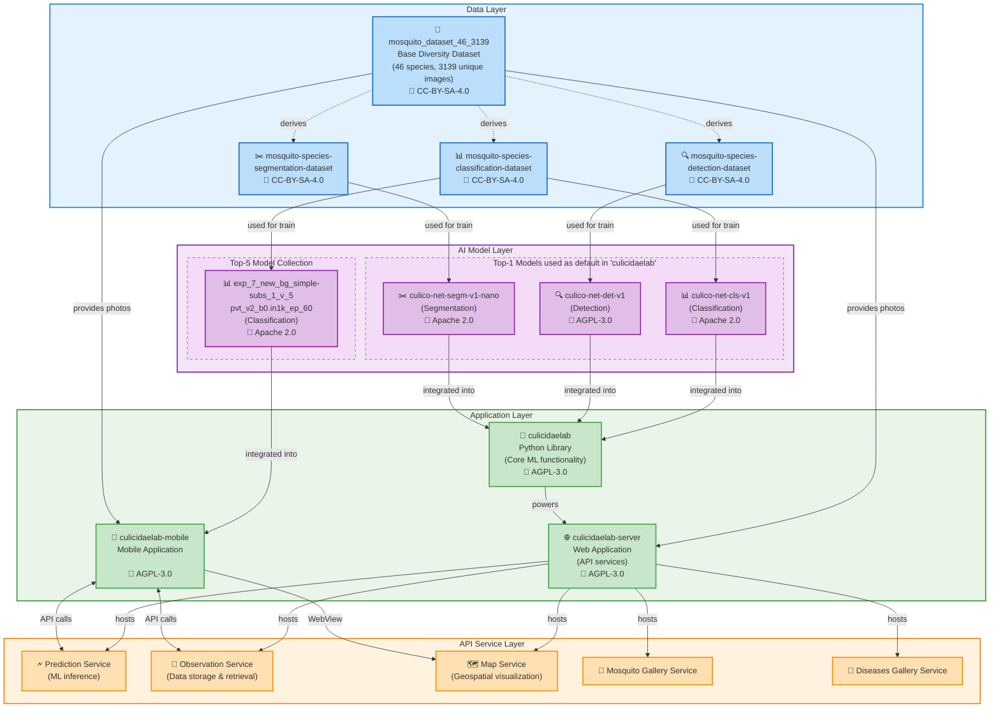

<div align="center">

# CulicidaeLab 🦟

**A configuration-driven Python library for advanced mosquito analysis, featuring pre-trained models for detection, segmentation, and species classification.**

</div>

<p align="center">
  <a href="https://pypi.org/project/culicidaelab/"></a>  <a href="https://github.com/astral-sh/ruff"></a>  <a href="https://deepwiki.com/iloncka-ds/culicidaelab"></a>

</p>

---

`culicidaeLab` python library provides a robust, extensible framework designed to streamline the pipeline of mosquito image analysis. Built on a powerful configuration system, it allows researchers and developers to easily manage datasets, experiment with models, and process images for classification, detection, and segmentation tasks. `culicidaelab` library is part of the is a part of the CulicidaeLab Ecosystem.

## CulicidaeLab Ecosystem Architecture



An open-source system for mosquito research and analysis includes components:

- **Data**:

  - Base [diversity dataset (46 species, 3139 images](https://huggingface.co/datasets/iloncka/mosquito_dataset_46_3139) under CC-BY-SA-4.0 license.
  - Specialized derivatives: [classification](https://huggingface.co/datasets/iloncka/mosquito-species-classification-dataset), [detection](https://huggingface.co/datasets/iloncka/mosquito-species-detection-dataset), and [segmentation](https://huggingface.co/datasets/iloncka/mosquito-species-segmentation-dataset) datasets under CC-BY-SA-4.0 licenses.
- **Models**:

  - Top-1 models (see reports), used as default by `culicidaelab` library: [classification (Apache 2.0)](https://huggingface.co/iloncka/culico-net-cls-v1), [detection (AGPL-3.0)](https://huggingface.co/iloncka/culico-net-det-v1), [segmentation (Apache 2.0)](https://huggingface.co/iloncka/culico-net-segm-v1-nano)
  - [Top-5 classification models collection](https://huggingface.co/collections/iloncka/mosquito-classification-17-top-5-68945bf60bca2c482395efa8) with accuracy >90% for 17 mosquito species.
- **Protocols**: All training parameters and metrics available at:

  - [Detection model reports](https://gitlab.com/mosquitoscan/experiments-reports-detection-models)
  - [Segmentation model reports](https://gitlab.com/mosquitoscan/experiments-reports-segmentation-models)
  - [Classification experiment reports - 1st round](https://gitlab.com/iloncka/mosal-reports)
  - [Classification experiment reports -2nd round](https://gitlab.com/mosquitoscan/experiments-reports)
- **Applications**:

  - [Python library (AGPL-3.0)](https://github.com/iloncka-ds/culicidaelab) providing core ML functionality
  - [Web server (AGPL-3.0)](https://github.com/iloncka-ds/culicidaelab-server) hosting API services
  - [Mobile app (AGPL-3.0)](https://gitlab.com/mosquitoscan/mosquitoscan-app) for field use with optimized models

These components form a cohesive ecosystem where datasets used for training models that power applications, the Python library provides core functionality to the web server, and the server exposes services consumed by the mobile application. All components are openly licensed, promoting transparency and collaboration.

This integrated approach enables comprehensive mosquito research, from data collection to analysis and visualization, supporting both scientific research and public health initiatives.

## Key Features of the `culicidaelab` library

- **Configuration-Driven Workflow**: Manage all settings—from file paths to model parameters—through simple YAML files. Override defaults easily for custom experiments.
- **Ready-to-Use Models**: Leverage pre-trained models for:
  - **Species Classification**: Identify mosquito species using a high-accuracy classifier.
  - **Mosquito Detection**: Localize mosquitoes in images with a YOLO-based detector.
  - **Instance Segmentation**: Generate precise pixel-level masks with a SAM-based segmenter.
- **Unified API**: All predictors share a consistent interface (`.predict()`, `.visualize()`, `.evaluate()`) for a predictable user experience.
- **Automatic Resource Management**: The library intelligently manages local storage, automatically downloading and caching model weights and datasets on first use.
- **Extensible Provider System**: Seamlessly connect to data sources. A `HuggingFaceProvider` is built-in, with an easy-to-implement interface for adding more providers.
- **Powerful Visualization**: Instantly visualize model outputs with built-in, configurable methods for drawing bounding boxes, classification labels, and segmentation masks.

## Practical Applications

`CulicidaeLab` is more than just a set of models; it's a powerful engine for building real-world solutions. Here are some of the ways it can be applied:

- **Automation in Scientific Laboratories:**

  - **Bulk Data Processing:** Automatically analyze thousands of images from camera traps or microscopes to assess mosquito populations without manual intervention.
  - **Reproducible Research:** Standardize the data analysis process, allowing other scientists to easily reproduce and verify research results published using the library.
- **Integration into Governmental and Commercial Systems:**

  - **Epidemiological Surveillance:** Use the library as the core "engine" for national or regional monitoring systems to track vector-borne disease risks.
  - **Custom Solution Development:** Rapidly prototype and create specialized software products for pest control services, agro-industrial companies, or environmental organizations.
- **Advanced Analytics and Data Science:**

  - **Geospatial Analysis:** Write scripts to build disease vector distribution maps by processing geotagged images.
  - **Predictive Modeling:** Use the library's outputs as features for larger models that forecast disease outbreaks based on vector presence and density.

## Requirements

### Hardware Requirements

**Processor (CPU):** Any modern x86-64 CPU.

**Memory (RAM):** Minimum 2 GB. 8 GB or more is recommended for processing large datasets or using more complex models.

**Graphics Card (GPU):** An NVIDIA GPU with CUDA support is highly recommended for a significant performance increase in deep learning model operations, especially for detection and segmentation but not essential for classification (see [performance logs](https://github.com/iloncka-ds/culicidaelab/tree/main/tests/performance/performance_logs) ang [notebook](https://colab.research.google.com/drive/1JdfxSQmtrJND4mNUctOkY7Kt0yvbO0eV?usp=sharing)). For the SAM model, a GPU is virtually essential for acceptable performance. Minimum video memory is 2 GB; 4 GB or more is recommended. For serve-gpu installation profile, CUDA 12.X is required, for CUDA 11.X use installation instructions below.
```bash
pip install onnxruntime-gpu --extra-index-url https://aiinfra.pkgs.visualstudio.com/PublicPackages/_packaging/onnxruntime-cuda-11/pypi/simple/
pip install culicidaelab
```

**Hard Drive:** At least 10 GB of free space to install the library, dependencies, download pre-trained models, and store processed data.

### Software Requirements

Operating Systems (tested):

- Windows 10/11
- Linux 22.04+

Software:

- for Linux needed libgl1 package to be installed
- Git
- Python 3.11
- uv 0.8.13

Python packages:

- PyTorch 2.3.1+
- FastAI 2.7.0 - 2.8.0
- Ultralytics 8.3.0+
- HuggingFace Hub 0.16.0+
- Datasets 4.0.0
- Pillow 9.4.0
- Pydantic 2.0.0+

For full list of dependencies, see the [pyproject.toml](https://github.com/iloncka-ds/culicidaelab/blob/main/pyproject.toml) file.

## Installation

### Basic Installation

For most users, the default installation provides full inference capabilities:

```bash
pip install culicidaelab
```

This includes CPU-based inference using ONNX Runtime, giving you everything needed for fast lightweight mosquito classification inference, and includes all core functionality without heavy ML frameworks, such as configuration management, resource handling, and model downloading capabilities.

### Installation Profiles

Choose an installation profile based on your use case:

#### **For Production/Serving (Lightweight Inference)**
**GPU-accelerated inference:**
```bash
pip install culicidaelab[serve-gpu]
```

**Lightweight serve alias** (equivalent to default):
```bash
pip install culicidaelab[serve]
```

#### **For Research/Development**

**CPU-based development** (includes PyTorch, FastAI, Ultralytics, and ONNX):
```bash
pip install culicidaelab[full] --extra-index-url https://download.pytorch.org/whl/cpu
```

**GPU-accelerated development** (includes PyTorch GPU, FastAI, Ultralytics, and ONNX GPU):
```bash
pip install culicidaelab[full-gpu]
```

### Additional Options

**Run example notebooks locally:**
```bash
pip install culicidaelab[full,examples] --extra-index-url https://download.pytorch.org/whl/cpu
# Or for GPU development:
pip install culicidaelab[full-gpu,examples]
```

**Build documentation locally:**
```bash
pip install culicidaelab[full,docs] --extra-index-url https://download.pytorch.org/whl/cpu
# Or for GPU development:
pip install culicidaelab[full-gpu,docs]
```

**Run tests:**
```bash
pip install culicidaelab[full,test] --extra-index-url https://download.pytorch.org/whl/cpu
# Or for GPU development:
pip install culicidaelab[full-gpu,test]
```

### Development Setup

To set up a **development environment** with all tools:

1. Clone the repository:

```bash
git clone https://github.com/iloncka-ds/culicidaelab.git
cd culicidaelab
```

2. Install dependencies with `uv` (recommended):

```bash
uv venv -p 3.11
source .venv/bin/activate

# On Windows: .venv\Scripts\activate
uv sync -p 3.11
uv cache clean
# This installs the library in editable mode with all dev tools (CPU version)
uv pip install -e .[dev]

# For GPU development, use:
# uv pip install -e .[full-gpu,docs,test]
```

Or with `pip`:

```bash
python -m venv .venv
source .venv/bin/activate  # On Windows: .venv\Scripts\activate
pip install --upgrade pip
pip install -e .[dev]
pip cache purge
```

3. Set up pre-commit hooks:

```bash
pre-commit install
```

This will run linters and formatters automatically on each commit to ensure code quality and consistency.

## Quick Start

Here's how to classify the species of a mosquito in just a few lines of code. The library will automatically download the necessary model on the first run.

```python

from culicidaelab import MosquitoClassifier, get_settings

# 1. Get the central settings object
# This loads all default configurations for the library.
settings = get_settings()

# 2. Instantiate the classifier
# The settings object knows how to configure the classifier.
classifier = MosquitoClassifier(settings, load_model=True)

# 3. Make a prediction
# The model is lazy-loaded (downloaded and loaded into memory) here.
result = classifier.predict("path/to/your/image.jpg")

# 5. Print the results
# The output is a list of (species_name, confidence_score) tuples.
print("Top 3 Predictions:")
for p in result.predictions[:3]:
    print(f"- {p.species}: {p.confidence:.4f}")

# Example Output:
# Top 3 Predictions:
# - Aedes aegypti: 0.9876
# - Aedes albopictus: 0.0112
# - Culex quinquefasciatus: 0.0009
```

## Documentation

For complete guides, tutorials, and the full API reference, **[visit the documentation site](https://iloncka-ds.github.io/culicidaelab/)**.

The documentation includes:

- In-depth installation and configuration guides.
- Detailed tutorials for each predictor.
- Architectural deep-dives for contributors.
- A full, auto-generated API reference.

## Contributing

Contributions are what make the open-source community such an amazing place to learn, inspire, and create. Any contributions you make are **greatly appreciated**.

Please see our **[Contributing Guide](https://github.com/iloncka-ds/culicidaelab/blob/main/CONTRIBUTING.md)** for details on our code of conduct, development setup, and the pull request process.

## Acknowledgments

CulicidaeLab development is  supported by a grant from the [**Foundation for Assistance to Small Innovative Enterprises (FASIE)**](https://fasie.ru/)

## License

This project is distributed under the  AGPL-3.0 License. See the [LICENSE](https://github.com/iloncka-ds/culicidaelab/blob/main/LICENSE) file for more information.

## Citation

If you use `CulicidaeLab` in your research, please cite it as follows:

```bibtex
@software{culicidaelab2024,
  author = {Ilona Kovaleva},
  title = {{CulicidaeLab: A Configuration-Driven Python Library for Mosquito Analysis}},
  year = {2024},
  publisher = {GitHub},
  journal = {GitHub repository},
  url = {https://github.com/iloncka-ds/culicidaelab}
}
```

## Contact

- **Issues**: Please use the [GitHub issue tracker](https://github.com/iloncka-ds/culicidaelab/issues).
- **Email**: [iloncka.ds@gmail.com](mailto:iloncka.ds@gmail.com)
