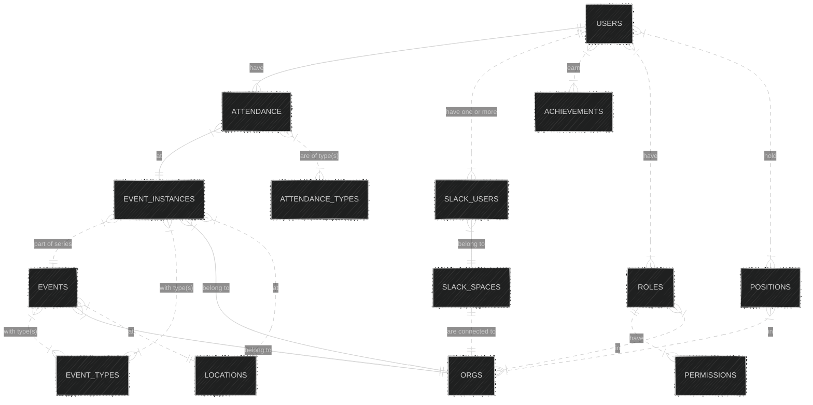

# Overview

This repository defines the F3 data structure, used by the F3 Slack Bot, Maps, etc. The projected uses SQLAlchemy to define the tables / models.

# Running Locally

To load the data structure in your database:

1. Set up a local db, update `.env.example` and save as `.env`
2. Clone the repo, use Poetry to install dependencies:
```sh
poetry env use 3.12
poetry install
```
3. Run the alembic migration:
```sh
source .env && poetry run alembic upgrade head
```

# Contributing

If you would like to make a change, you will need to:

1. Make the change in `models.py`
2. Make a alembic revision:
```sh
source .env && alembic revision --autogenerate -m "Your Message Here"
```
3. Make any edits to the migration script in `alembic/versions`
4. Run the upgrade on your local db:
```sh
source .env && alembic upgrade head
```
5. Bump the version on `pyproject.toml`:
```sh
poetry version patch[minor][major]
```
6. Tag your final commit and make sure to push those tags to trigger the pypi package build:
```sh
git tag <new_version> -a -m "Your message here"
git push origin --tags
```
> [!NOTE]
> The github pages documentation will be updated when you push to `main`, but if you would like to preview locally, run:

```sh
poetry run sphinx-build -b html docs docs/_build/html
cd docs
poetry run python -m http.server --directory _build/html
```

> [!TIP]  
> Adding new fields as nullable (ie `Optional[]`) has the best chance of reducing breaking changes to the apps.

# Entity Overview

