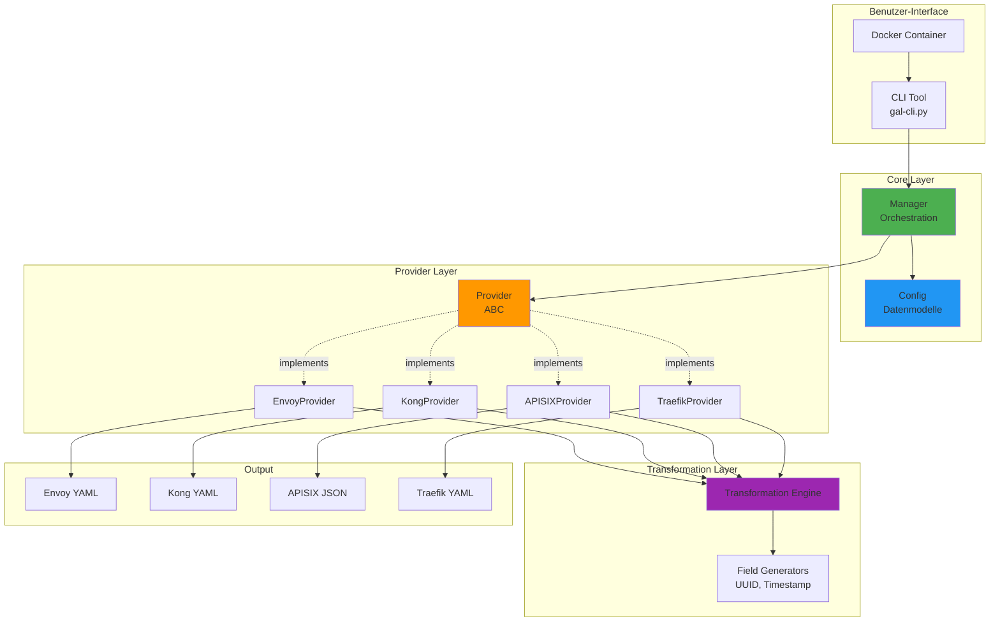
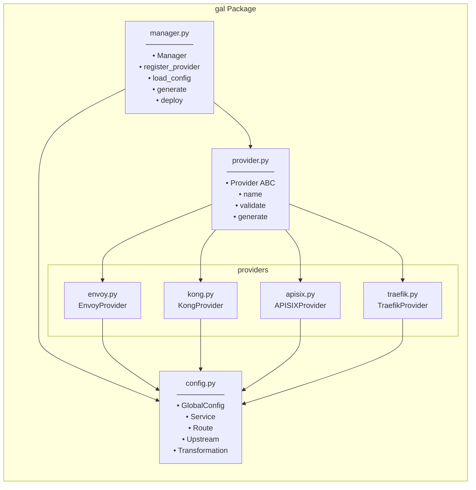
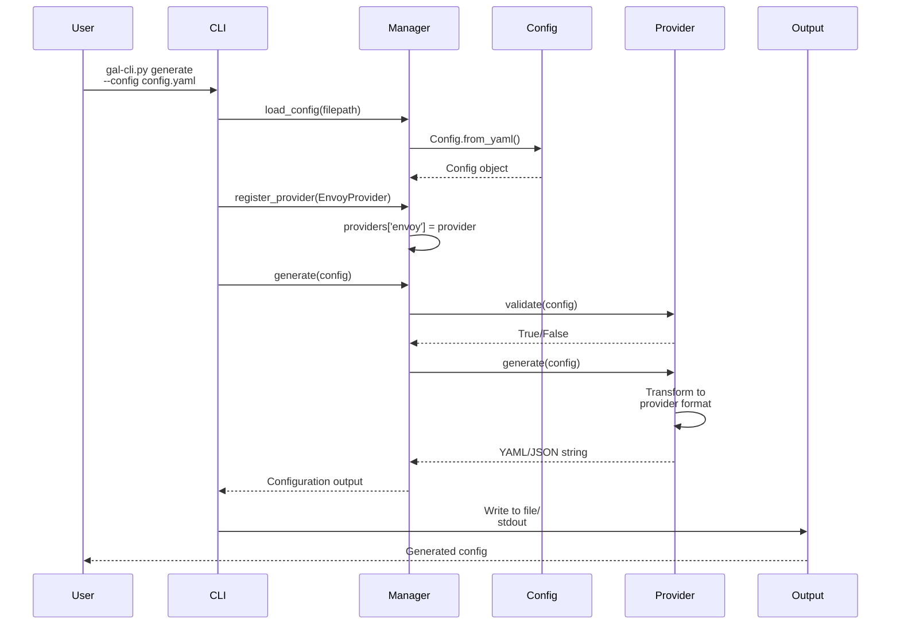
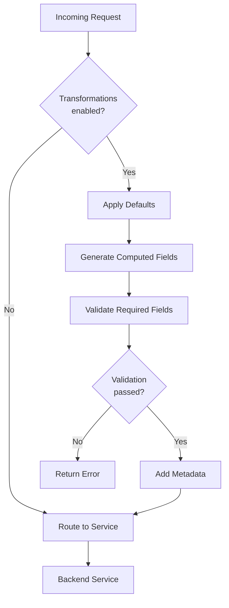
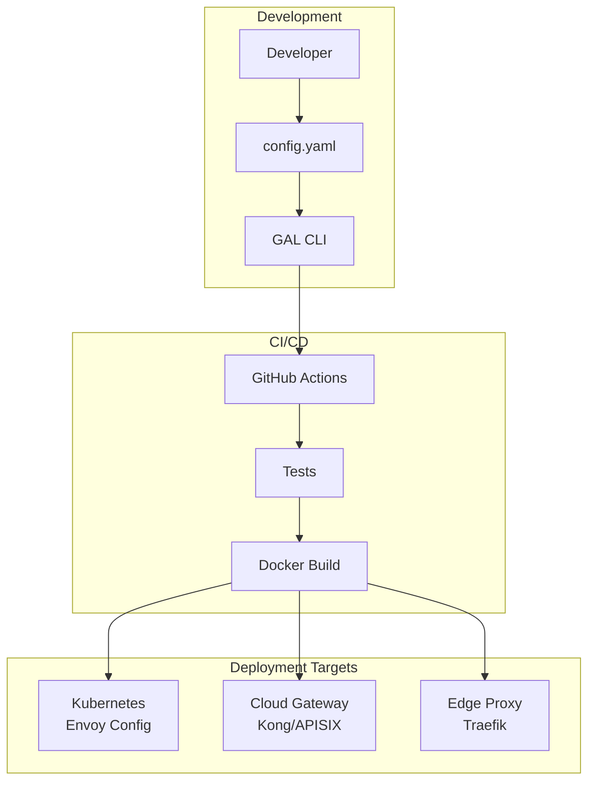

# GAL Architektur-Dokumentation

## Überblick

Gateway Abstraction Layer (GAL) ist ein provider-agnostisches Konfigurationssystem für API-Gateways. Es ermöglicht die Definition von Gateway-Konfigurationen in einem einheitlichen Format und deren Transformation für verschiedene Gateway-Provider.

## System-Architektur



## Komponentendiagramm



## Datenfluss

### Konfigurationsgenerierung



### Transformations-Pipeline



## Modul-Details

### 1. Config Module (`gal/config.py`)

**Verantwortlichkeit:** Datenmodelle und Konfigurationsparser

**Hauptklassen:**

| Klasse | Beschreibung | Wichtige Methoden |
|--------|--------------|-------------------|
| `Config` | Root-Konfiguration | `from_yaml()`, `get_service()`, `get_grpc_services()`, `get_rest_services()` |
| `GlobalConfig` | Globale Gateway-Settings | - |
| `Service` | Service-Definition | - |
| `Route` | Routing-Regeln | - |
| `Upstream` | Backend-Endpunkt | - |
| `Transformation` | Transform-Regeln | - |
| `ComputedField` | Feldgeneratoren | - |
| `Validation` | Validierungsregeln | - |
| `Plugin` | Plugin-Konfiguration | - |

**Abhängigkeiten:**
- PyYAML: YAML-Parsing
- Pydantic: Datenvalidierung (dataclasses)

### 2. Manager Module (`gal/manager.py`)

**Verantwortlichkeit:** Orchestrierung und Provider-Management

**Hauptklasse:** `Manager`

**Methoden:**

| Methode | Parameter | Rückgabe | Beschreibung |
|---------|-----------|----------|--------------|
| `register_provider()` | `Provider` | None | Registriert einen Provider |
| `load_config()` | `filepath: str` | `Config` | Lädt YAML-Konfiguration |
| `generate()` | `Config` | `str` | Generiert Provider-Config |
| `deploy()` | `Config` | `bool` | Deployment (optional) |
| `list_providers()` | - | `List[str]` | Listet Provider auf |

**Design Pattern:** Registry Pattern für Provider-Management

### 3. Provider Module (`gal/provider.py`)

**Verantwortlichkeit:** Provider-Interface (Abstract Base Class)

**ABC-Methoden:**

```python
class Provider(ABC):
    @abstractmethod
    def name(self) -> str:
        """Return provider name"""

    @abstractmethod
    def validate(self, config: Config) -> bool:
        """Validate configuration"""

    @abstractmethod
    def generate(self, config: Config) -> str:
        """Generate provider-specific configuration"""

    def deploy(self, config: Config) -> bool:
        """Optional: Deploy configuration"""
```

### 4. Provider Implementations

#### EnvoyProvider

**Output-Format:** YAML
**Features:**
- Static resources configuration
- HTTP connection manager
- Lua filters für Transformationen
- gRPC-Support mit HTTP/2
- Admin interface

**Transformations:** Lua inline code

#### KongProvider

**Output-Format:** YAML (Declarative Config v3.0)
**Features:**
- Declarative configuration
- Request transformer plugin
- Service und Route-Definitionen
- gRPC protocol support

**Transformations:** Kong Plugins

#### APISIXProvider

**Output-Format:** JSON
**Features:**
- Routes, Services, Upstreams
- Serverless pre-function plugin
- Lua transformations
- Round-robin load balancing

**Transformations:** Lua serverless functions

#### TraefikProvider

**Output-Format:** YAML
**Features:**
- HTTP routers und services
- PathPrefix rules
- LoadBalancer configuration
- Middleware plugins

**Transformations:** Middleware plugins

## Erweiterbarkeit

### Neuen Provider hinzufügen

1. **Provider-Klasse erstellen:**

```python
# gal/providers/newprovider.py
from ..provider import Provider
from ..config import Config

class NewProvider(Provider):
    def name(self) -> str:
        return "newprovider"

    def validate(self, config: Config) -> bool:
        # Validation logic
        return True

    def generate(self, config: Config) -> str:
        # Generation logic
        return "configuration output"
```

2. **Provider exportieren:**

```python
# gal/providers/__init__.py
from .newprovider import NewProvider

__all__ = ['EnvoyProvider', 'KongProvider', 'APISIXProvider',
           'TraefikProvider', 'NewProvider']
```

3. **Provider registrieren:**

```python
# gal-cli.py
manager.register_provider(NewProvider())
```

### Neuen Generator hinzufügen

Für neue Computed Field Generatoren:

```python
# In Provider generate() method
if cf.generator == "new_generator":
    # Implementation
    generated_value = generate_new_value()
```

## Deployment-Architektur



## Sicherheitsarchitektur

### Prinzipien

1. **Non-root Container:** Docker läuft als non-root user `gal`
2. **Read-only Dependencies:** Pip-Packages werden in Builder-Stage installiert
3. **Minimal Image:** Multi-stage build reduziert Angriffsfläche
4. **No Secrets in Config:** Environment Variables für Secrets

### Security Best Practices

```yaml
# Secrets als Environment Variables
plugins:
  - name: auth
    config:
      secret: ${JWT_SECRET}  # Nie direkt in YAML

# Über Environment bereitstellen
export JWT_SECRET="your-secret-key"
gal-cli.py generate -c config.yaml
```

## Performance-Überlegungen

### Optimierungen

1. **Lazy Loading:** Provider werden nur bei Bedarf geladen
2. **Caching:** Config-Parsing einmalig
3. **Minimal Dependencies:** Nur notwendige Bibliotheken
4. **Parallel Generation:** `generate-all` kann parallelisiert werden

### Benchmarks

| Operation | Durchschnitt | Peak Memory |
|-----------|--------------|-------------|
| Load Config | ~5ms | ~10MB |
| Generate Single | ~10-20ms | ~15MB |
| Generate All | ~50-80ms | ~30MB |
| Validation | ~3ms | ~8MB |

## Siehe auch

- [CLI-Referenz](../api/CLI_REFERENCE.md)
- [Provider-Dokumentation](../guides/PROVIDERS.md)
- [Entwickler-Guide](../guides/DEVELOPMENT.md)
