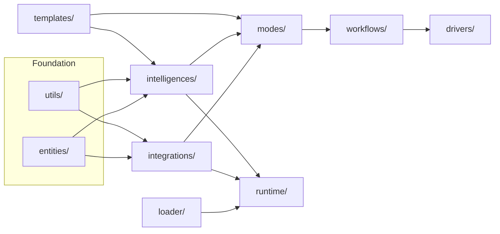
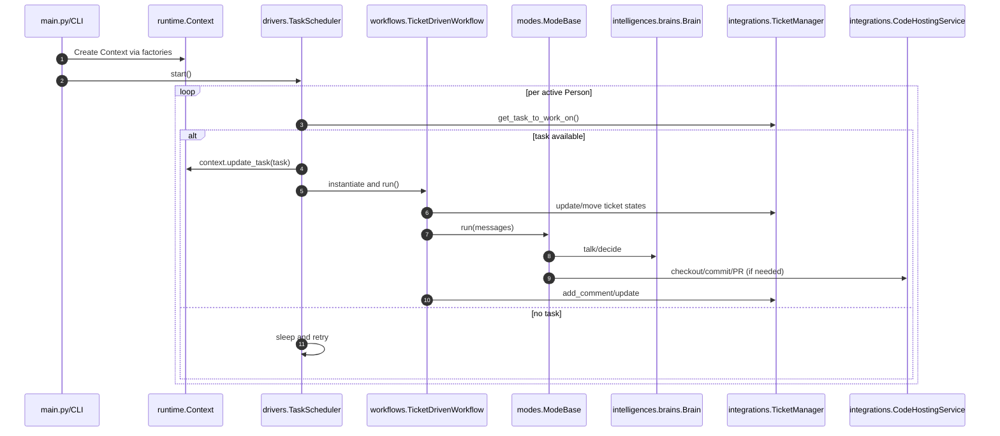

# Architecture Overview

- Document type: Architecture overview
- Purpose: Explain GuildBotics runtime, module boundaries, and flows
- Audience: Contributors (engineers), tool integrators, and operators

## System Overview
GuildBotics is a modular task‑orchestration runtime for software agents. It schedules and runs workflows that invoke “modes” (behavior templates) backed by “brains” (LLM adapters) and “integrations” (ticket/code hosting, etc.).

High‑level execution:
- `main.py` or a CLI initializes factories and a `Context`.
- `drivers/` schedule and trigger `workflows/` for a given `Task` and `Person`.
- `workflows/` coordinate the steps, select a `mode/`, and interact with integrations.
- `modes/` implement concrete behaviors (e.g., comment, edit, ticket), often using a `Brain`.
- `intelligences/` provide brains/LLM logic and helper functions.
- `integrations/` wrap external systems (ticket managers, code hosting).

## Module Boundaries

Top‑level packages and responsibilities:
- `entities/`: Domain models (e.g., `Task`, `Message`, `Team`, `Person`). No side effects.
- `utils/`: Cross‑cutting utilities (logging, import helpers, text, file I/O, rate limiting, i18n, git).
- `integrations/`: External system interfaces (ticket manager, code hosting, providers).
- `intelligences/`: Agent brains and shared LLM functions/utilities.
- `modes/`: Behavior classes orchestrating brains/integrations to achieve a use case.
- `workflows/`: Task‑level orchestration; chooses modes and drives end‑to‑end flow.
- `drivers/`: Scheduling/execution drivers (e.g., `TaskScheduler`).
- `runtime/`: Context and factories (`Context`, `*Factory`) for dependency injection.
- `loader/`: Team/project configuration loaders.
- `templates/`: Locale and prompt/config templates.
- `cli/`: Setup tools and simple factories for local/CLI usage.

One‑way dependencies (lower → higher):

Rules:
- No cycles; lower layers must not import higher layers.
- `entities/` and `utils/` are the base; they do not depend on orchestrators.
- `runtime/` wires factories and `Context`; `drivers/` use `runtime/` and `workflows/`.

## Execution Flow

Typical ticket‑driven flow:

Key classes/files:
- `drivers/task_scheduler.py:1`: schedules, selects tasks, runs workflows.
- `workflows/ticket_driven_workflow.py:1`: selects mode, coordinates TM/CHS, comments.
- `modes/mode_base.py:1`: base API for behaviors and git/PR helpers.
- `intelligences/brains/brain.py:1`: abstract brain interface.
- `runtime/context.py:1`: central DI hub to factories, team, person, task.

## Configuration & Runtime Data
- Configuration: `.env` (e.g., `LOG_LEVEL`), plus project/team YAML via `loader/` and `templates/`.
- Runtime data: Some tools may store under `~/.guildbotics/data/` (by convention).
- Logging: Structured format via `utils/log_utils.py`.

## Extension Points
- New Brain: implement `intelligences.brains.brain.Brain` and register in a `BrainFactory`.
- New Mode: subclass `modes.ModeBase` and implement `run()`, `get_dependent_services()`, `get_use_case_description()`.
- New Workflow: subclass `workflows.WorkflowBase` and implement `run()`; name mapping follows `<name>_workflow.<PascalCase>Workflow`.
- New Driver: add under `drivers/` and depend only on `runtime/` and `workflows/`.
- New Integration: implement `integrations/TicketManager` or `CodeHostingService` interfaces and wire via `IntegrationFactory`.
- New Loader: implement under `loader/` and expose via `LoaderFactory`.

Naming/import conventions used in factories:
- Workflows: `guildbotics.workflows.<name>_workflow.<Name>Workflow` (see `drivers/utils.py:1`).
- Modes: `guildbotics.modes.<name>_mode.<Name>Mode` (see `modes/mode_base.py:1`).

## Testing Strategy
- Unit tests mirror package structure under `tests/guildbotics/...`.
- Integration tests live in `tests/it/...` with sample configs in `tests/it/config/`.
- Prefer deterministic tests with `monkeypatch`; verify coverage with `coverage.xml`.
