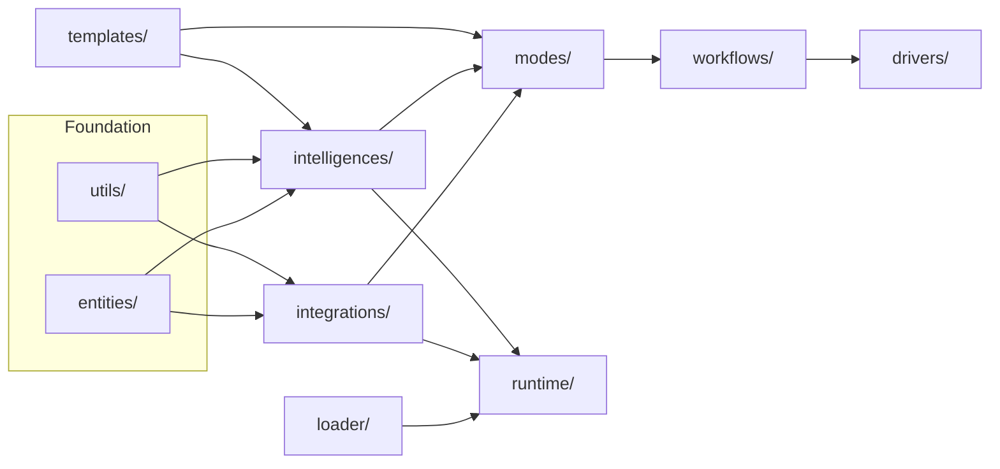
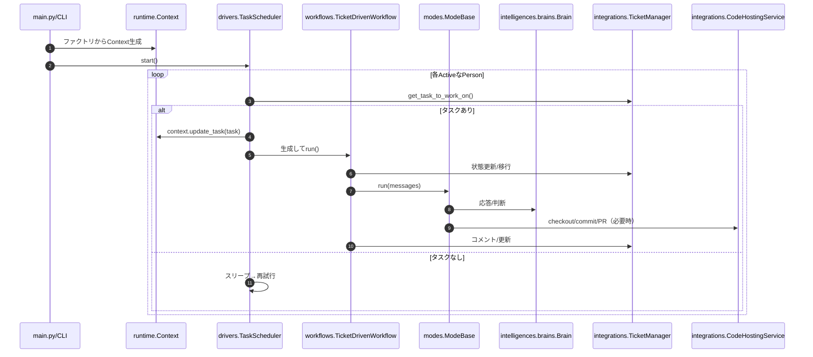

# アーキテクチャ概要

- ドキュメント種別: アーキテクチャ概要
- 目的: GuildBoticsの実行モデル、モジュール境界、依存方向とフローの共有
- 想定読者: コントリビューター（エンジニア）、ツール統合者、運用担当

## システム概要
GuildBoticsは、エージェントのタスク実行を編成するモジュール型ランタイムです。スケジューラ（drivers）がワークフロー（workflows）を起動し、モード（modes）が具体的な振る舞いを実装し、ブレイン（intelligences/brains）がLLM処理を担い、インテグレーション（integrations）が外部システムと連携します。

実行の流れ（高レベル）:
- `main.py`やCLIがファクトリと`Context`を初期化。
- `drivers/`が`workflows/`を特定の`Task`と`Person`で起動。
- `workflows/`が全体を調整し、`mode/`選択とインテグレーションを制御。
- `modes/`が具体的な振る舞い（コメント、編集、チケット対応など）を実装し、必要に応じて`Brain`を呼ぶ。
- `intelligences/`がLLMロジックや補助関数を提供。
- `integrations/`がチケット管理・コードホスティングなどの外部APIを抽象化。

## モジュール境界

トップレベルと責務:
- `entities/`: ドメインモデル（`Task`、`Message`、`Team`、`Person`等）。副作用なし。
- `utils/`: 横断的ユーティリティ（ログ、インポート、テキスト、ファイルI/O、レート制御、i18n、git）。
- `integrations/`: 外部システムIF（チケット管理、コードホスティングなど）。
- `intelligences/`: ブレイン（LLM）と共有関数。
- `modes/`: 振る舞いクラス。ブレイン/インテグレーションを束ねてユースケースを実現。
- `workflows/`: タスク単位のオーケストレーション。モード選択と終端までの制御。
- `drivers/`: スケジューリング/実行（例: `TaskScheduler`）。
- `runtime/`: `Context`とファクトリ群（`*Factory`）。DIの中核。
- `loader/`: チーム/プロジェクト設定のローディング。
- `templates/`: ロケールやプロンプト/設定テンプレート。
- `cli/`: セットアップツールと簡易ファクトリ。

一方向の依存（下位 → 上位）:

原則:
- 循環依存は禁止。下位層は上位層をimportしない。
- `entities/`と`utils/`は基盤。オーケストレーション層へは依存しない。
- `runtime/`はファクトリと`Context`の結線。`drivers/`は`runtime/`と`workflows/`を使用。

## 実行フロー

チケット駆動ワークフロー（例）:

主なクラス/ファイル:
- `drivers/task_scheduler.py:1`: スケジュール・タスク選択・ワークフロー実行。
- `workflows/ticket_driven_workflow.py:1`: モード選択、TM/CHS連携、コメント。
- `modes/mode_base.py:1`: 振る舞いAPIとgit/PR補助。
- `intelligences/brains/brain.py:1`: ブレイン抽象。
- `runtime/context.py:1`: DIのハブ（ファクトリ、チーム、Person、Task）。

## 設定とランタイムデータ
- 設定: `.env`（例: `LOG_LEVEL`）と、`loader/`や`templates/`経由のYAML（チーム/プロジェクト）。
- ランタイムデータ: 慣例として`~/.guildbotics/data/`配下を使用する場合あり。
- ログ: `utils/log_utils.py`の構造化ログ。

## 拡張ポイント
- Brain追加: `intelligences.brains.brain.Brain`を実装し、`BrainFactory`で生成を提供。
- Mode追加: `modes.ModeBase`を継承し、`run()`/`get_dependent_services()`/`get_use_case_description()`を実装。
- Workflow追加: `workflows.WorkflowBase`を継承し`run()`を実装。名前解決は`<name>_workflow.<PascalCase>Workflow`。
- Driver追加: `drivers/`配下に実装し、`runtime/`と`workflows/`のみに依存。
- Integration追加: `TicketManager`または`CodeHostingService`のIFを実装し、`IntegrationFactory`に結線。
- Loader追加: `loader/`配下に実装し、`LoaderFactory`で公開。

命名/インポート規約（ファクトリ/ユーティリティで利用）:
- Workflow: `guildbotics.workflows.<name>_workflow.<Name>Workflow`（`drivers/utils.py:1`参照）。
- Mode: `guildbotics.modes.<name>_mode.<Name>Mode`（`modes/mode_base.py:1`参照）。

## テスト戦略
- 単体テストは`tests/guildbotics/...`でパッケージ構成をミラー。
- 統合テストは`tests/it/...`（設定例は`tests/it/config/`）。
- `monkeypatch`で決定的にし、`coverage.xml`更新を確認。
