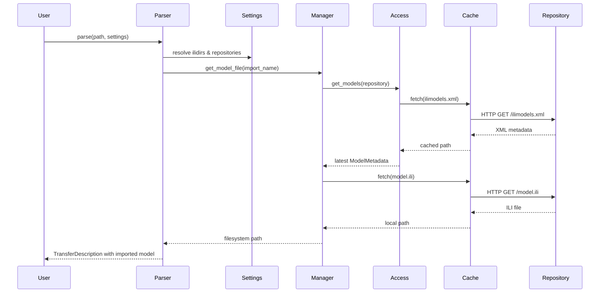

# ili2c Python module

The Python edition of **ili2c** brings a focused subset of the INTERLIS toolchain
into pure Python. It provides a light-weight metamodel that mirrors the Java
API, a parser backed by ANTLR grammars, rendering helpers, and repository tools
for discovering and caching INTERLIS models.

## Installation

```bash
pip install ili2c-python
```

You can also install directly from a clone of this repository:

```bash
pip install .
```

When developing locally, install the optional `test` extra to run the pytest suite:

```bash
pip install .[test]
```

## Package layout and features

The top-level package is `ili2c` with two subpackages:

### `ili2c.pyili2c`

* `parser` contains `parse()` and `ParserSettings`, combining the ANTLR grammar
  with repository discovery. It loads `.ili` files and recursively resolves
  imports into a `TransferDescription` tree that mirrors the Java API.
* `metamodel` offers the Python data structures (e.g. `TransferDescription`,
  `Model`, `Topic`, `Table`, `Attribute`) with helper methods such as
  `getModels()`, `find_model()`, and `elements_of_type()` for navigating a
  parsed model graph.
* `mermaid` converts transfer descriptions into Mermaid class diagrams—ideal
  for quickly visualising the content of an INTERLIS model.

### `ili2c.ilirepository`

* `IliRepositoryManager` walks configured repository URLs, follows links from
  `ilisite.xml`, picks the freshest version of each model, and can download the
  corresponding `.ili` file locally.
* `RepositoryAccess` reads `ilimodels.xml` metadata from HTTP(S) repositories or
  the file system and turns them into `ModelMetadata` records.
* `RepositoryCache` keeps HTTP downloads on disk, honours configurable TTLs,
  supports MD5 validation, and can sanitise paths so that repeated parses reuse
  cached models instead of hitting the network.

## Parsing models

The parser resolves imports via `ParserSettings`. Configure model directories
and repositories up front, then call `parse()`:

```python
import logging
from pathlib import Path

from ili2c.pyili2c import parser
from ili2c.pyili2c.metamodel import Table

logging.basicConfig(level=logging.INFO)

settings = parser.ParserSettings(
    ilidirs=["examples/models"],
    repositories=["http://models.interlis.ch/"],
)

transfer_description = parser.parse(
    Path("examples/models/DM01INTERLIS2_3.ili"),
    settings=settings,
)

for model in transfer_description.getModels():
    logging.info("Loaded model %%s (schema %%s)", model.getName(), model.getSchemaLanguage())
```

`ParserSettings` understands semicolon separated `ILI_DIR` strings, local
folders, HTTP(S) repositories, and the `%ILI_DIR` placeholder. The parser stores
already parsed files in a cache to avoid re-reading the same model twice.

### Discovering model elements

The `TransferDescription` returned by the parser mirrors the Java API. Use
`find_model()` to locate a model, then traverse its topics and tables or use the
recursive `elements_of_type()` helper:

```python
import logging

from ili2c.pyili2c import parser
from ili2c.pyili2c.metamodel import Table, TransferDescription

logging.basicConfig(level=logging.INFO)

transfer_description: TransferDescription = parser.parse("path/to/model.ili")
model = transfer_description.find_model("DM01INTERLIS2_3")
if model is None:
    raise RuntimeError("model not found")

logging.info("Model %s imports: %s", model.getName(), list(model.getImports()))

for topic in model.getTopics():
    logging.info("Topic %s contains %d classes", topic.getName(), len(topic.getClasses()))

for table in model.elements_of_type(Table):
    logging.info("Class %s has %d attributes", table.getScopedName(), len(table.getAttributes()))
```

`Table` instances expose methods such as `getAttributes()`, `getConstraints()`,
`isAbstract()`, and `getExtending()` which mirror the Java original. Use them to
inspect inheritance trees, mandatory attributes, or association ends.

### Rendering Mermaid diagrams

Turn a parsed model into a diagram to share with collaborators:

```python
import logging

from ili2c.pyili2c import parser
from ili2c.pyili2c.mermaid import render

logging.basicConfig(level=logging.INFO)

transfer_description = parser.parse("path/to/model.ili")
mermaid_source = render(transfer_description)
logging.info("Generated diagram:\n%s", mermaid_source)
```

The output can be pasted into any Mermaid-compatible viewer.

## Working with repositories

The repository manager can discover models, fetch metadata, and download files:

```python
import logging

from ili2c.ilirepository import IliRepositoryManager

logging.basicConfig(level=logging.INFO)

manager = IliRepositoryManager(["https://models.interlis.ch/"])
for metadata in manager.list_models():
    logging.info("%s %s -> %s", metadata.name, metadata.version, metadata.full_url)

metadata = manager.find_model("DM01INTERLIS2_3")
if metadata:
    local_path = manager.get_model_file(metadata.name)
    logging.info("Cached copy stored at %s", local_path)
```

`IliRepositoryManager` ranks multiple revisions by publishing date or version
number and walks the repository network discovered via `ilisite.xml` so that
linked repositories are searched automatically.

### Repository cache behaviour

`RepositoryCache` stores downloads inside a configurable folder. Override it via
`ILI_CACHE` or by passing `base_dir`. The cache key is derived from the URL and
may use hashed filenames when `ILI_CACHE_FILENAME=MD5` is set. Each request can
specify a TTL—`0` forces a re-download, `None` keeps the first copy indefinitely,
and positive values trigger refreshes once the files grow stale. When MD5 hashes
are provided the cache verifies them and re-fetches if they no longer match.

### Sequence of resolving an import



## Tips for exploring models

* Configure `logging` to `INFO` or `DEBUG` to observe cache hits, HTTP requests,
  and import resolution decisions.
* `TransferDescription.getModels()` returns immutable tuples—store mutable data
  on your own objects if needed.
* Use `Model.elements_of_type(...)` to search for specific element kinds
  anywhere inside a model without walking the nested structure manually.
* Combine the Mermaid renderer with `elements_of_type()` filters to render
  minimal diagrams that focus on selected topics or tables.

## Troubleshooting

* If the parser cannot locate an import, ensure the model name (case-insensitive)
  matches the filename and that the directory is listed in `ilidirs`.
* For repository downloads behind a proxy, export the standard `HTTP_PROXY`
  environment variables—`urllib` honours them automatically.
* To inspect cached files, open the directory reported in log messages; removing
  files forces the cache to fetch them again on the next parse.
