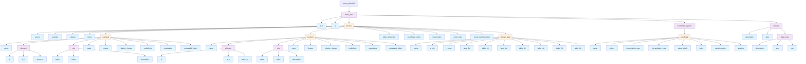

```mermaid
flowchart TD
    root["amns_data IDS"]

    n1[amns_data]
    root --> n1
    class n1 normalNode
    n2[z_n]
    n1 --> n2
    class n2 leafNode
    n3[a]
    n1 --> n3
    class n3 leafNode
    n4(process)
    n1 --> n4
    class n4 complexNode
    n5[source]
    n4 --> n5
    class n5 leafNode
    n6[provider]
    n4 --> n6
    class n6 leafNode
    n7[citation]
    n4 --> n7
    class n7 leafNode
    n8[name]
    n4 --> n8
    class n8 leafNode
    n9(reactants)
    n4 --> n9
    class n9 complexNode
    n10[name]
    n9 --> n10
    class n10 leafNode
    n11[element]
    n9 --> n11
    class n11 normalNode
    n12[a]
    n11 --> n12
    class n12 leafNode
    n13[z_n]
    n11 --> n13
    class n13 leafNode
    n14[atoms_n]
    n11 --> n14
    class n14 leafNode
    n15[role]
    n9 --> n15
    class n15 normalNode
    n16[name]
    n15 --> n16
    class n16 leafNode
    n17[index]
    n15 --> n17
    class n17 leafNode
    n18[description]
    n15 --> n18
    class n18 leafNode
    n19[mass]
    n9 --> n19
    class n19 leafNode
    n20[charge]
    n9 --> n20
    class n20 leafNode
    n21[relative_charge]
    n9 --> n21
    class n21 leafNode
    n22[multiplicity]
    n9 --> n22
    class n22 leafNode
    n23[metastable]
    n9 --> n23
    class n23 leafNode
    n24[metastable_label]
    n9 --> n24
    class n24 leafNode
    n25(products)
    n4 --> n25
    class n25 complexNode
    n26[name]
    n25 --> n26
    class n26 leafNode
    n27[element]
    n25 --> n27
    class n27 normalNode
    n28[a]
    n27 --> n28
    class n28 leafNode
    n29[z_n]
    n27 --> n29
    class n29 leafNode
    n30[atoms_n]
    n27 --> n30
    class n30 leafNode
    n31[role]
    n25 --> n31
    class n31 normalNode
    n32[name]
    n31 --> n32
    class n32 leafNode
    n33[index]
    n31 --> n33
    class n33 leafNode
    n34[description]
    n31 --> n34
    class n34 leafNode
    n35[mass]
    n25 --> n35
    class n35 leafNode
    n36[charge]
    n25 --> n36
    class n36 leafNode
    n37[relative_charge]
    n25 --> n37
    class n37 leafNode
    n38[multiplicity]
    n25 --> n38
    class n38 leafNode
    n39[metastable]
    n25 --> n39
    class n39 leafNode
    n40[metastable_label]
    n25 --> n40
    class n40 leafNode
    n41[table_dimension]
    n4 --> n41
    class n41 leafNode
    n42[coordinate_index]
    n4 --> n42
    class n42 leafNode
    n43[result_label]
    n4 --> n43
    class n43 leafNode
    n44[result_units]
    n4 --> n44
    class n44 leafNode
    n45[result_transformation]
    n4 --> n45
    class n45 leafNode
    n46(charge_state)
    n4 --> n46
    class n46 complexNode
    n47[name]
    n46 --> n47
    class n47 leafNode
    n48[z_min]
    n46 --> n48
    class n48 leafNode
    n49[z_max]
    n46 --> n49
    class n49 leafNode
    n50[table_0d]
    n46 --> n50
    class n50 leafNode
    n51[table_1d]
    n46 --> n51
    class n51 leafNode
    n52[table_2d]
    n46 --> n52
    class n52 leafNode
    n53[table_3d]
    n46 --> n53
    class n53 leafNode
    n54[table_4d]
    n46 --> n54
    class n54 leafNode
    n55[table_5d]
    n46 --> n55
    class n55 leafNode
    n56[table_6d]
    n46 --> n56
    class n56 leafNode
    n57[coordinate_system]
    n1 --> n57
    class n57 normalNode
    n58(coordinate)
    n57 --> n58
    class n58 complexNode
    n59[name]
    n58 --> n59
    class n59 leafNode
    n60[values]
    n58 --> n60
    class n60 leafNode
    n61[interpolation_type]
    n58 --> n61
    class n61 leafNode
    n62[extrapolation_type]
    n58 --> n62
    class n62 leafNode
    n63[value_labels]
    n58 --> n63
    class n63 leafNode
    n64[units]
    n58 --> n64
    class n64 leafNode
    n65[transformation]
    n58 --> n65
    class n65 leafNode
    n66[spacing]
    n58 --> n66
    class n66 leafNode
    n67[release]
    n1 --> n67
    class n67 normalNode
    n68[description]
    n67 --> n68
    class n68 leafNode
    n69[date]
    n67 --> n69
    class n69 leafNode
    n70[data_entry]
    n67 --> n70
    class n70 normalNode
    n71[description]
    n70 --> n71
    class n71 leafNode
    n72[shot]
    n70 --> n72
    class n72 leafNode
    n73[run]
    n70 --> n73
    class n73 leafNode

    classDef leafNode fill:#e1f5fe
    classDef complexNode fill:#fff3e0
    classDef normalNode fill:#f3e5f5
    classDef moreNode fill:#f5f5f5,stroke-dasharray: 5 5
```