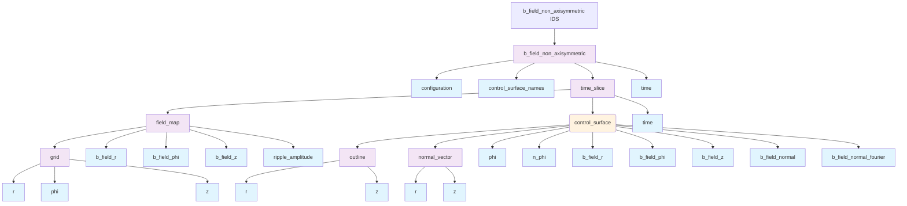

```mermaid
flowchart TD
    root["b_field_non_axisymmetric IDS"]

    n1[b_field_non_axisymmetric]
    root --> n1
    class n1 normalNode
    n2[configuration]
    n1 --> n2
    class n2 leafNode
    n3[control_surface_names]
    n1 --> n3
    class n3 leafNode
    n4[time_slice]
    n1 --> n4
    class n4 normalNode
    n5[field_map]
    n4 --> n5
    class n5 normalNode
    n6[grid]
    n5 --> n6
    class n6 normalNode
    n7[r]
    n6 --> n7
    class n7 leafNode
    n8[phi]
    n6 --> n8
    class n8 leafNode
    n9[z]
    n6 --> n9
    class n9 leafNode
    n10[b_field_r]
    n5 --> n10
    class n10 leafNode
    n11[b_field_phi]
    n5 --> n11
    class n11 leafNode
    n12[b_field_z]
    n5 --> n12
    class n12 leafNode
    n13[ripple_amplitude]
    n5 --> n13
    class n13 leafNode
    n14(control_surface)
    n4 --> n14
    class n14 complexNode
    n15[outline]
    n14 --> n15
    class n15 normalNode
    n16[r]
    n15 --> n16
    class n16 leafNode
    n17[z]
    n15 --> n17
    class n17 leafNode
    n18[normal_vector]
    n14 --> n18
    class n18 normalNode
    n19[r]
    n18 --> n19
    class n19 leafNode
    n20[z]
    n18 --> n20
    class n20 leafNode
    n21[phi]
    n14 --> n21
    class n21 leafNode
    n22[n_phi]
    n14 --> n22
    class n22 leafNode
    n23[b_field_r]
    n14 --> n23
    class n23 leafNode
    n24[b_field_phi]
    n14 --> n24
    class n24 leafNode
    n25[b_field_z]
    n14 --> n25
    class n25 leafNode
    n26[b_field_normal]
    n14 --> n26
    class n26 leafNode
    n27[b_field_normal_fourier]
    n14 --> n27
    class n27 leafNode
    n28[time]
    n4 --> n28
    class n28 leafNode
    n29[time]
    n1 --> n29
    class n29 leafNode

    classDef leafNode fill:#e1f5fe
    classDef complexNode fill:#fff3e0
    classDef normalNode fill:#f3e5f5
    classDef moreNode fill:#f5f5f5,stroke-dasharray: 5 5
```