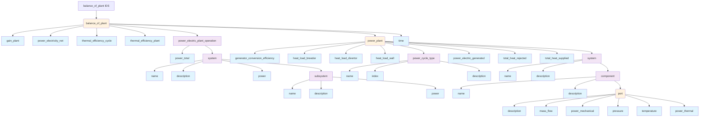

```mermaid
flowchart TD
    root["balance_of_plant IDS"]

    n1(balance_of_plant)
    root --> n1
    class n1 complexNode
    n2[gain_plant]
    n1 --> n2
    class n2 leafNode
    n3[power_electricity_net]
    n1 --> n3
    class n3 leafNode
    n4[thermal_efficiency_cycle]
    n1 --> n4
    class n4 leafNode
    n5[thermal_efficiency_plant]
    n1 --> n5
    class n5 leafNode
    n6[power_electric_plant_operation]
    n1 --> n6
    class n6 normalNode
    n7[power_total]
    n6 --> n7
    class n7 leafNode
    n8[system]
    n6 --> n8
    class n8 normalNode
    n9[name]
    n8 --> n9
    class n9 leafNode
    n10[description]
    n8 --> n10
    class n10 leafNode
    n11[power]
    n8 --> n11
    class n11 leafNode
    n12[subsystem]
    n8 --> n12
    class n12 normalNode
    n13[name]
    n12 --> n13
    class n13 leafNode
    n14[description]
    n12 --> n14
    class n14 leafNode
    n15[power]
    n12 --> n15
    class n15 leafNode
    n16(power_plant)
    n1 --> n16
    class n16 complexNode
    n17[generator_conversion_efficiency]
    n16 --> n17
    class n17 leafNode
    n18[heat_load_breeder]
    n16 --> n18
    class n18 leafNode
    n19[heat_load_divertor]
    n16 --> n19
    class n19 leafNode
    n20[heat_load_wall]
    n16 --> n20
    class n20 leafNode
    n21[power_cycle_type]
    n16 --> n21
    class n21 normalNode
    n22[name]
    n21 --> n22
    class n22 leafNode
    n23[index]
    n21 --> n23
    class n23 leafNode
    n24[description]
    n21 --> n24
    class n24 leafNode
    n25[power_electric_generated]
    n16 --> n25
    class n25 leafNode
    n26[total_heat_rejected]
    n16 --> n26
    class n26 leafNode
    n27[total_heat_supplied]
    n16 --> n27
    class n27 leafNode
    n28[system]
    n16 --> n28
    class n28 normalNode
    n29[name]
    n28 --> n29
    class n29 leafNode
    n30[description]
    n28 --> n30
    class n30 leafNode
    n31[component]
    n28 --> n31
    class n31 normalNode
    n32[name]
    n31 --> n32
    class n32 leafNode
    n33[description]
    n31 --> n33
    class n33 leafNode
    n34(port)
    n31 --> n34
    class n34 complexNode
    n35[description]
    n34 --> n35
    class n35 leafNode
    n36[mass_flow]
    n34 --> n36
    class n36 leafNode
    n37[power_mechanical]
    n34 --> n37
    class n37 leafNode
    n38[pressure]
    n34 --> n38
    class n38 leafNode
    n39[temperature]
    n34 --> n39
    class n39 leafNode
    n40[power_thermal]
    n34 --> n40
    class n40 leafNode
    n41[time]
    n1 --> n41
    class n41 leafNode

    classDef leafNode fill:#e1f5fe
    classDef complexNode fill:#fff3e0
    classDef normalNode fill:#f3e5f5
    classDef moreNode fill:#f5f5f5,stroke-dasharray: 5 5
```