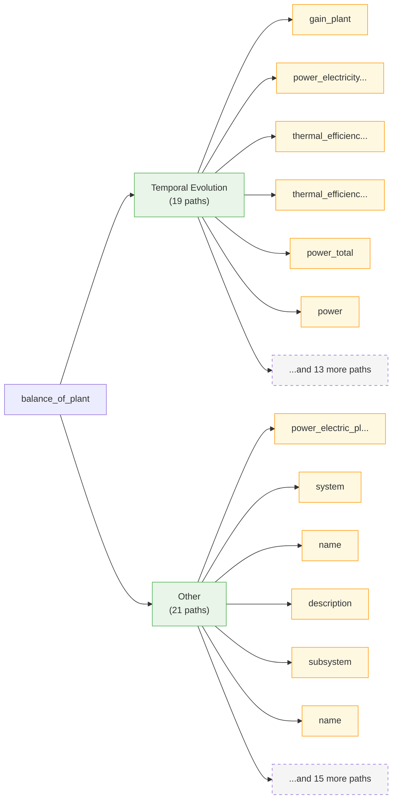

```mermaid
flowchart LR
    root["balance_of_plant"]

    d1["Temporal Evolution<br/>(19 paths)"]
    root --> d1
    p1_1["gain_plant"]
    d1 --> p1_1
    class p1_1 pathNode
    p1_2["power_electricity..."]
    d1 --> p1_2
    class p1_2 pathNode
    p1_3["thermal_efficienc..."]
    d1 --> p1_3
    class p1_3 pathNode
    p1_4["thermal_efficienc..."]
    d1 --> p1_4
    class p1_4 pathNode
    p1_5["power_total"]
    d1 --> p1_5
    class p1_5 pathNode
    p1_6["power"]
    d1 --> p1_6
    class p1_6 pathNode
    more1["...and 13 more paths"]
    d1 --> more1
    class more1 moreNode
    class d1 domainNode
    d2["Other<br/>(21 paths)"]
    root --> d2
    p2_1["power_electric_pl..."]
    d2 --> p2_1
    class p2_1 pathNode
    p2_2["system"]
    d2 --> p2_2
    class p2_2 pathNode
    p2_3["name"]
    d2 --> p2_3
    class p2_3 pathNode
    p2_4["description"]
    d2 --> p2_4
    class p2_4 pathNode
    p2_5["subsystem"]
    d2 --> p2_5
    class p2_5 pathNode
    p2_6["name"]
    d2 --> p2_6
    class p2_6 pathNode
    more2["...and 15 more paths"]
    d2 --> more2
    class more2 moreNode
    class d2 domainNode

    classDef domainNode fill:#e8f5e8,stroke:#4caf50
    classDef pathNode fill:#fff8e1,stroke:#ff9800
    classDef moreNode fill:#f5f5f5,stroke-dasharray: 5 5
```