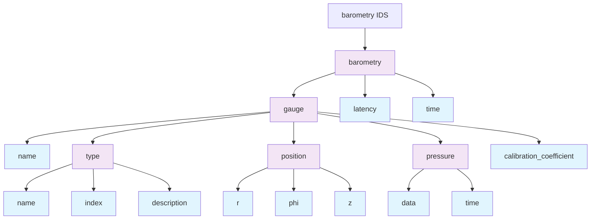

```mermaid
flowchart TD
    root["barometry IDS"]

    n1[barometry]
    root --> n1
    class n1 normalNode
    n2[gauge]
    n1 --> n2
    class n2 normalNode
    n3[name]
    n2 --> n3
    class n3 leafNode
    n4[type]
    n2 --> n4
    class n4 normalNode
    n5[name]
    n4 --> n5
    class n5 leafNode
    n6[index]
    n4 --> n6
    class n6 leafNode
    n7[description]
    n4 --> n7
    class n7 leafNode
    n8[position]
    n2 --> n8
    class n8 normalNode
    n9[r]
    n8 --> n9
    class n9 leafNode
    n10[phi]
    n8 --> n10
    class n10 leafNode
    n11[z]
    n8 --> n11
    class n11 leafNode
    n12[pressure]
    n2 --> n12
    class n12 normalNode
    n13[data]
    n12 --> n13
    class n13 leafNode
    n14[time]
    n12 --> n14
    class n14 leafNode
    n15[calibration_coefficient]
    n2 --> n15
    class n15 leafNode
    n16[latency]
    n1 --> n16
    class n16 leafNode
    n17[time]
    n1 --> n17
    class n17 leafNode

    classDef leafNode fill:#e1f5fe
    classDef complexNode fill:#fff3e0
    classDef normalNode fill:#f3e5f5
    classDef moreNode fill:#f5f5f5,stroke-dasharray: 5 5
```