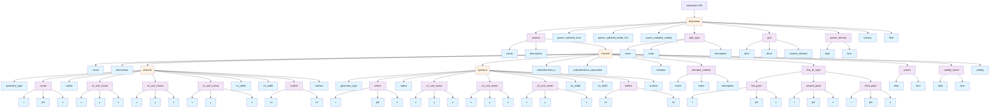

```mermaid
flowchart TD
    root["bolometer IDS"]

    n1(bolometer)
    root --> n1
    class n1 complexNode
    n2[camera]
    n1 --> n2
    class n2 normalNode
    n3[name]
    n2 --> n3
    class n3 leafNode
    n4[description]
    n2 --> n4
    class n4 leafNode
    n5(channel)
    n2 --> n5
    class n5 complexNode
    n6[name]
    n5 --> n6
    class n6 leafNode
    n7[description]
    n5 --> n7
    class n7 leafNode
    n8(detector)
    n5 --> n8
    class n8 complexNode
    n9[geometry_type]
    n8 --> n9
    class n9 leafNode
    n10[centre]
    n8 --> n10
    class n10 normalNode
    n11[r]
    n10 --> n11
    class n11 leafNode
    n12[phi]
    n10 --> n12
    class n12 leafNode
    n13[z]
    n10 --> n13
    class n13 leafNode
    n14[radius]
    n8 --> n14
    class n14 leafNode
    n15[x1_unit_vector]
    n8 --> n15
    class n15 normalNode
    n16[x]
    n15 --> n16
    class n16 leafNode
    n17[y]
    n15 --> n17
    class n17 leafNode
    n18[z]
    n15 --> n18
    class n18 leafNode
    n19[x2_unit_vector]
    n8 --> n19
    class n19 normalNode
    n20[x]
    n19 --> n20
    class n20 leafNode
    n21[y]
    n19 --> n21
    class n21 leafNode
    n22[z]
    n19 --> n22
    class n22 leafNode
    n23[x3_unit_vector]
    n8 --> n23
    class n23 normalNode
    n24[x]
    n23 --> n24
    class n24 leafNode
    n25[y]
    n23 --> n25
    class n25 leafNode
    n26[z]
    n23 --> n26
    class n26 leafNode
    n27[x1_width]
    n8 --> n27
    class n27 leafNode
    n28[x2_width]
    n8 --> n28
    class n28 leafNode
    n29[outline]
    n8 --> n29
    class n29 normalNode
    n30[x1]
    n29 --> n30
    class n30 leafNode
    n31[x2]
    n29 --> n31
    class n31 leafNode
    n32[surface]
    n8 --> n32
    class n32 leafNode
    n33(aperture)
    n5 --> n33
    class n33 complexNode
    n34[geometry_type]
    n33 --> n34
    class n34 leafNode
    n35[centre]
    n33 --> n35
    class n35 normalNode
    n36[r]
    n35 --> n36
    class n36 leafNode
    n37[phi]
    n35 --> n37
    class n37 leafNode
    n38[z]
    n35 --> n38
    class n38 leafNode
    n39[radius]
    n33 --> n39
    class n39 leafNode
    n40[x1_unit_vector]
    n33 --> n40
    class n40 normalNode
    n41[x]
    n40 --> n41
    class n41 leafNode
    n42[y]
    n40 --> n42
    class n42 leafNode
    n43[z]
    n40 --> n43
    class n43 leafNode
    n44[x2_unit_vector]
    n33 --> n44
    class n44 normalNode
    n45[x]
    n44 --> n45
    class n45 leafNode
    n46[y]
    n44 --> n46
    class n46 leafNode
    n47[z]
    n44 --> n47
    class n47 leafNode
    n48[x3_unit_vector]
    n33 --> n48
    class n48 normalNode
    n49[x]
    n48 --> n49
    class n49 leafNode
    n50[y]
    n48 --> n50
    class n50 leafNode
    n51[z]
    n48 --> n51
    class n51 leafNode
    n52[x1_width]
    n33 --> n52
    class n52 leafNode
    n53[x2_width]
    n33 --> n53
    class n53 leafNode
    n54[outline]
    n33 --> n54
    class n54 normalNode
    n55[x1]
    n54 --> n55
    class n55 leafNode
    n56[x2]
    n54 --> n56
    class n56 leafNode
    n57[surface]
    n33 --> n57
    class n57 leafNode
    n58[subcollimators_n]
    n5 --> n58
    class n58 leafNode
    n59[subcollimators_separation]
    n5 --> n59
    class n59 leafNode
    n60[etendue]
    n5 --> n60
    class n60 leafNode
    n61[etendue_method]
    n5 --> n61
    class n61 normalNode
    n62[name]
    n61 --> n62
    class n62 leafNode
    n63[index]
    n61 --> n63
    class n63 leafNode
    n64[description]
    n61 --> n64
    class n64 leafNode
    n65[line_of_sight]
    n5 --> n65
    class n65 normalNode
    n66[first_point]
    n65 --> n66
    class n66 normalNode
    n67[r]
    n66 --> n67
    class n67 leafNode
    n68[phi]
    n66 --> n68
    class n68 leafNode
    n69[z]
    n66 --> n69
    class n69 leafNode
    n70[second_point]
    n65 --> n70
    class n70 normalNode
    n71[r]
    n70 --> n71
    class n71 leafNode
    n72[phi]
    n70 --> n72
    class n72 leafNode
    n73[z]
    n70 --> n73
    class n73 leafNode
    n74[third_point]
    n65 --> n74
    class n74 normalNode
    n75[r]
    n74 --> n75
    class n75 leafNode
    n76[phi]
    n74 --> n76
    class n76 leafNode
    n77[z]
    n74 --> n77
    class n77 leafNode
    n78[power]
    n5 --> n78
    class n78 normalNode
    n79[data]
    n78 --> n79
    class n79 leafNode
    n80[time]
    n78 --> n80
    class n80 leafNode
    n81[validity_timed]
    n5 --> n81
    class n81 normalNode
    n82[data]
    n81 --> n82
    class n82 leafNode
    n83[time]
    n81 --> n83
    class n83 leafNode
    n84[validity]
    n5 --> n84
    class n84 leafNode
    n85[power_radiated_total]
    n1 --> n85
    class n85 leafNode
    n86[power_radiated_inside_lcfs]
    n1 --> n86
    class n86 leafNode
    n87[power_radiated_validity]
    n1 --> n87
    class n87 leafNode
    n88[grid_type]
    n1 --> n88
    class n88 normalNode
    n89[name]
    n88 --> n89
    class n89 leafNode
    n90[index]
    n88 --> n90
    class n90 leafNode
    n91[description]
    n88 --> n91
    class n91 leafNode
    n92[grid]
    n1 --> n92
    class n92 normalNode
    n93[dim1]
    n92 --> n93
    class n93 leafNode
    n94[dim2]
    n92 --> n94
    class n94 leafNode
    n95[volume_element]
    n92 --> n95
    class n95 leafNode
    n96[power_density]
    n1 --> n96
    class n96 normalNode
    n97[data]
    n96 --> n97
    class n97 leafNode
    n98[time]
    n96 --> n98
    class n98 leafNode
    n99[latency]
    n1 --> n99
    class n99 leafNode
    n100[time]
    n1 --> n100
    class n100 leafNode

    classDef leafNode fill:#e1f5fe
    classDef complexNode fill:#fff3e0
    classDef normalNode fill:#f3e5f5
    classDef moreNode fill:#f5f5f5,stroke-dasharray: 5 5
```