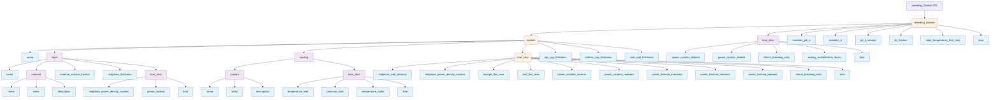

```mermaid
flowchart TD
    root["breeding_blanket IDS"]

    n1(breeding_blanket)
    root --> n1
    class n1 complexNode
    n2(module)
    n1 --> n2
    class n2 complexNode
    n3[name]
    n2 --> n3
    class n3 leafNode
    n4[layer]
    n2 --> n4
    class n4 normalNode
    n5[name]
    n4 --> n5
    class n5 leafNode
    n6[material]
    n4 --> n6
    class n6 normalNode
    n7[name]
    n6 --> n7
    class n7 leafNode
    n8[index]
    n6 --> n8
    class n8 leafNode
    n9[description]
    n6 --> n9
    class n9 leafNode
    n10[material_volume_fraction]
    n4 --> n10
    class n10 leafNode
    n11[midplane_thickness]
    n4 --> n11
    class n11 leafNode
    n12[time_slice]
    n4 --> n12
    class n12 normalNode
    n13[midplane_power_density_nuclear]
    n12 --> n13
    class n13 leafNode
    n14[power_nuclear]
    n12 --> n14
    class n14 leafNode
    n15[time]
    n12 --> n15
    class n15 leafNode
    n16[cooling]
    n2 --> n16
    class n16 normalNode
    n17[coolant]
    n16 --> n17
    class n17 normalNode
    n18[name]
    n17 --> n18
    class n18 leafNode
    n19[index]
    n17 --> n19
    class n19 leafNode
    n20[description]
    n17 --> n20
    class n20 leafNode
    n21[time_slice]
    n16 --> n21
    class n21 normalNode
    n22[temperature_inlet]
    n21 --> n22
    class n22 leafNode
    n23[pressure_inlet]
    n21 --> n23
    class n23 leafNode
    n24[temperature_outlet]
    n21 --> n24
    class n24 leafNode
    n25[time]
    n21 --> n25
    class n25 leafNode
    n26(time_slice)
    n2 --> n26
    class n26 complexNode
    n27[midplane_wall_distance]
    n26 --> n27
    class n27 leafNode
    n28[midplane_power_density_nuclear]
    n26 --> n28
    class n28 leafNode
    n29[escape_flux_max]
    n26 --> n29
    class n29 leafNode
    n30[wall_flux_max]
    n26 --> n30
    class n30 leafNode
    n31[power_incident_neutron]
    n26 --> n31
    class n31 leafNode
    n32[power_incident_radiated]
    n26 --> n32
    class n32 leafNode
    n33[power_thermal_extracted]
    n26 --> n33
    class n33 leafNode
    n34[power_thermal_neutrons]
    n26 --> n34
    class n34 leafNode
    n35[power_thermal_radiated]
    n26 --> n35
    class n35 leafNode
    n36[tritium_breeding_ratio]
    n26 --> n36
    class n36 leafNode
    n37[time]
    n26 --> n37
    class n37 leafNode
    n38[top_cap_thickness]
    n2 --> n38
    class n38 leafNode
    n39[bottom_cap_thickness]
    n2 --> n39
    class n39 leafNode
    n40[side_wall_thickness]
    n2 --> n40
    class n40 leafNode
    n41[time_slice]
    n1 --> n41
    class n41 normalNode
    n42[power_nuclear_blanket]
    n41 --> n42
    class n42 leafNode
    n43[power_nuclear_shields]
    n41 --> n43
    class n43 leafNode
    n44[tritium_breeding_ratio]
    n41 --> n44
    class n44 leafNode
    n45[energy_multiplication_factor]
    n41 --> n45
    class n45 leafNode
    n46[time]
    n41 --> n46
    class n46 leafNode
    n47[modules_pol_n]
    n1 --> n47
    class n47 leafNode
    n48[modules_n]
    n1 --> n48
    class n48 leafNode
    n49[pb_li_volume]
    n1 --> n49
    class n49 leafNode
    n50[li6_fraction]
    n1 --> n50
    class n50 leafNode
    n51[steel_temperature_limit_max]
    n1 --> n51
    class n51 leafNode
    n52[time]
    n1 --> n52
    class n52 leafNode

    classDef leafNode fill:#e1f5fe
    classDef complexNode fill:#fff3e0
    classDef normalNode fill:#f3e5f5
    classDef moreNode fill:#f5f5f5,stroke-dasharray: 5 5
```