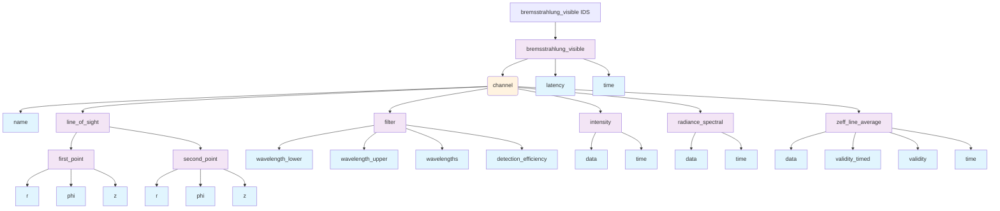

```mermaid
flowchart TD
    root["bremsstrahlung_visible IDS"]

    n1[bremsstrahlung_visible]
    root --> n1
    class n1 normalNode
    n2(channel)
    n1 --> n2
    class n2 complexNode
    n3[name]
    n2 --> n3
    class n3 leafNode
    n4[line_of_sight]
    n2 --> n4
    class n4 normalNode
    n5[first_point]
    n4 --> n5
    class n5 normalNode
    n6[r]
    n5 --> n6
    class n6 leafNode
    n7[phi]
    n5 --> n7
    class n7 leafNode
    n8[z]
    n5 --> n8
    class n8 leafNode
    n9[second_point]
    n4 --> n9
    class n9 normalNode
    n10[r]
    n9 --> n10
    class n10 leafNode
    n11[phi]
    n9 --> n11
    class n11 leafNode
    n12[z]
    n9 --> n12
    class n12 leafNode
    n13[filter]
    n2 --> n13
    class n13 normalNode
    n14[wavelength_lower]
    n13 --> n14
    class n14 leafNode
    n15[wavelength_upper]
    n13 --> n15
    class n15 leafNode
    n16[wavelengths]
    n13 --> n16
    class n16 leafNode
    n17[detection_efficiency]
    n13 --> n17
    class n17 leafNode
    n18[intensity]
    n2 --> n18
    class n18 normalNode
    n19[data]
    n18 --> n19
    class n19 leafNode
    n20[time]
    n18 --> n20
    class n20 leafNode
    n21[radiance_spectral]
    n2 --> n21
    class n21 normalNode
    n22[data]
    n21 --> n22
    class n22 leafNode
    n23[time]
    n21 --> n23
    class n23 leafNode
    n24[zeff_line_average]
    n2 --> n24
    class n24 normalNode
    n25[data]
    n24 --> n25
    class n25 leafNode
    n26[validity_timed]
    n24 --> n26
    class n26 leafNode
    n27[validity]
    n24 --> n27
    class n27 leafNode
    n28[time]
    n24 --> n28
    class n28 leafNode
    n29[latency]
    n1 --> n29
    class n29 leafNode
    n30[time]
    n1 --> n30
    class n30 leafNode

    classDef leafNode fill:#e1f5fe
    classDef complexNode fill:#fff3e0
    classDef normalNode fill:#f3e5f5
    classDef moreNode fill:#f5f5f5,stroke-dasharray: 5 5
```