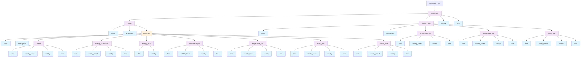

```mermaid
flowchart TD
    root["calorimetry IDS"]

    n1[calorimetry]
    root --> n1
    class n1 normalNode
    n2[group]
    n1 --> n2
    class n2 normalNode
    n3[name]
    n2 --> n3
    class n3 leafNode
    n4[description]
    n2 --> n4
    class n4 leafNode
    n5(component)
    n2 --> n5
    class n5 complexNode
    n6[name]
    n5 --> n6
    class n6 leafNode
    n7[description]
    n5 --> n7
    class n7 leafNode
    n8[power]
    n5 --> n8
    class n8 normalNode
    n9[data]
    n8 --> n9
    class n9 leafNode
    n10[validity_timed]
    n8 --> n10
    class n10 leafNode
    n11[validity]
    n8 --> n11
    class n11 leafNode
    n12[time]
    n8 --> n12
    class n12 leafNode
    n13[energy_cumulated]
    n5 --> n13
    class n13 normalNode
    n14[data]
    n13 --> n14
    class n14 leafNode
    n15[validity_timed]
    n13 --> n15
    class n15 leafNode
    n16[validity]
    n13 --> n16
    class n16 leafNode
    n17[time]
    n13 --> n17
    class n17 leafNode
    n18[energy_total]
    n5 --> n18
    class n18 normalNode
    n19[data]
    n18 --> n19
    class n19 leafNode
    n20[validity]
    n18 --> n20
    class n20 leafNode
    n21[temperature_in]
    n5 --> n21
    class n21 normalNode
    n22[data]
    n21 --> n22
    class n22 leafNode
    n23[validity_timed]
    n21 --> n23
    class n23 leafNode
    n24[validity]
    n21 --> n24
    class n24 leafNode
    n25[time]
    n21 --> n25
    class n25 leafNode
    n26[temperature_out]
    n5 --> n26
    class n26 normalNode
    n27[data]
    n26 --> n27
    class n27 leafNode
    n28[validity_timed]
    n26 --> n28
    class n28 leafNode
    n29[validity]
    n26 --> n29
    class n29 leafNode
    n30[time]
    n26 --> n30
    class n30 leafNode
    n31[mass_flow]
    n5 --> n31
    class n31 normalNode
    n32[data]
    n31 --> n32
    class n32 leafNode
    n33[validity_timed]
    n31 --> n33
    class n33 leafNode
    n34[validity]
    n31 --> n34
    class n34 leafNode
    n35[time]
    n31 --> n35
    class n35 leafNode
    n36[transit_time]
    n5 --> n36
    class n36 normalNode
    n37[data]
    n36 --> n37
    class n37 leafNode
    n38[validity_timed]
    n36 --> n38
    class n38 leafNode
    n39[validity]
    n36 --> n39
    class n39 leafNode
    n40[time]
    n36 --> n40
    class n40 leafNode
    n41[cooling_loop]
    n1 --> n41
    class n41 normalNode
    n42[name]
    n41 --> n42
    class n42 leafNode
    n43[description]
    n41 --> n43
    class n43 leafNode
    n44[temperature_in]
    n41 --> n44
    class n44 normalNode
    n45[data]
    n44 --> n45
    class n45 leafNode
    n46[validity_timed]
    n44 --> n46
    class n46 leafNode
    n47[validity]
    n44 --> n47
    class n47 leafNode
    n48[time]
    n44 --> n48
    class n48 leafNode
    n49[temperature_out]
    n41 --> n49
    class n49 normalNode
    n50[data]
    n49 --> n50
    class n50 leafNode
    n51[validity_timed]
    n49 --> n51
    class n51 leafNode
    n52[validity]
    n49 --> n52
    class n52 leafNode
    n53[time]
    n49 --> n53
    class n53 leafNode
    n54[mass_flow]
    n41 --> n54
    class n54 normalNode
    n55[data]
    n54 --> n55
    class n55 leafNode
    n56[validity_timed]
    n54 --> n56
    class n56 leafNode
    n57[validity]
    n54 --> n57
    class n57 leafNode
    n58[time]
    n54 --> n58
    class n58 leafNode
    n59[latency]
    n1 --> n59
    class n59 leafNode
    n60[time]
    n1 --> n60
    class n60 leafNode

    classDef leafNode fill:#e1f5fe
    classDef complexNode fill:#fff3e0
    classDef normalNode fill:#f3e5f5
    classDef moreNode fill:#f5f5f5,stroke-dasharray: 5 5
```