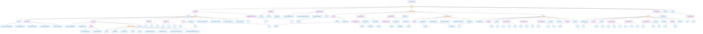

```mermaid
flowchart TD
    root["camera_ir IDS"]

    n1(camera_ir)
    root --> n1
    class n1 complexNode
    n2[channel]
    n1 --> n2
    class n2 normalNode
    n3[name]
    n2 --> n3
    class n3 leafNode
    n4(camera)
    n2 --> n4
    class n4 complexNode
    n5[name]
    n4 --> n5
    class n5 leafNode
    n6[calibration]
    n4 --> n6
    class n6 normalNode
    n7[luminance_to_temperature]
    n6 --> n7
    class n7 leafNode
    n8[transmission_barrel]
    n6 --> n8
    class n8 leafNode
    n9[transmission_mirror]
    n6 --> n9
    class n9 leafNode
    n10[transmission_window]
    n6 --> n10
    class n10 leafNode
    n11[optical_temperature]
    n6 --> n11
    class n11 leafNode
    n12[frame]
    n4 --> n12
    class n12 normalNode
    n13[apparent_temperature]
    n12 --> n13
    class n13 leafNode
    n14[integration_time]
    n12 --> n14
    class n14 leafNode
    n15[filter]
    n12 --> n15
    class n15 normalNode
    n16[wavelength_central]
    n15 --> n16
    class n16 leafNode
    n17[wavelength_width]
    n15 --> n17
    class n17 leafNode
    n18(region_of_interest)
    n12 --> n18
    class n18 complexNode
    n19[name]
    n18 --> n19
    class n19 leafNode
    n20[emissivity]
    n18 --> n20
    class n20 leafNode
    n21[surface_area]
    n18 --> n21
    class n21 leafNode
    n22[type]
    n18 --> n22
    class n22 leafNode
    n23[mask]
    n18 --> n23
    class n23 leafNode
    n24[temperature_limit_max]
    n18 --> n24
    class n24 leafNode
    n25[temperature_max]
    n18 --> n25
    class n25 leafNode
    n26[row_index_temperature_max]
    n18 --> n26
    class n26 leafNode
    n27[column_index_temperature_max]
    n18 --> n27
    class n27 leafNode
    n28[time]
    n12 --> n28
    class n28 leafNode
    n29[pinhole]
    n4 --> n29
    class n29 normalNode
    n30[x]
    n29 --> n30
    class n30 leafNode
    n31[y]
    n29 --> n31
    class n31 leafNode
    n32[z]
    n29 --> n32
    class n32 leafNode
    n33[direction]
    n4 --> n33
    class n33 normalNode
    n34[x]
    n33 --> n34
    class n34 leafNode
    n35[y]
    n33 --> n35
    class n35 leafNode
    n36[z]
    n33 --> n36
    class n36 leafNode
    n37[up]
    n4 --> n37
    class n37 normalNode
    n38[x]
    n37 --> n38
    class n38 leafNode
    n39[y]
    n37 --> n39
    class n39 leafNode
    n40[z]
    n37 --> n40
    class n40 leafNode
    n41[pixel_size]
    n4 --> n41
    class n41 leafNode
    n42[field_of_view_horizontal]
    n4 --> n42
    class n42 leafNode
    n43[field_of_view_vertical]
    n4 --> n43
    class n43 leafNode
    n44[pixels_n_horizontal]
    n4 --> n44
    class n44 leafNode
    n45[pixels_n_vertical]
    n4 --> n45
    class n45 leafNode
    n46[target_surface_center]
    n2 --> n46
    class n46 normalNode
    n47[x]
    n46 --> n47
    class n47 leafNode
    n48[y]
    n46 --> n48
    class n48 leafNode
    n49[z]
    n46 --> n49
    class n49 leafNode
    n50[midplane]
    n1 --> n50
    class n50 normalNode
    n51[name]
    n50 --> n51
    class n51 leafNode
    n52[index]
    n50 --> n52
    class n52 leafNode
    n53[description]
    n50 --> n53
    class n53 leafNode
    n54[frame_analysis]
    n1 --> n54
    class n54 normalNode
    n55[sol_heat_decay_length]
    n54 --> n55
    class n55 leafNode
    n56[distance_separatrix_midplane]
    n54 --> n56
    class n56 leafNode
    n57[power_flux_parallel]
    n54 --> n57
    class n57 leafNode
    n58[time]
    n54 --> n58
    class n58 leafNode
    n59(optical_element)
    n1 --> n59
    class n59 complexNode
    n60[type]
    n59 --> n60
    class n60 normalNode
    n61[name]
    n60 --> n61
    class n61 leafNode
    n62[index]
    n60 --> n62
    class n62 leafNode
    n63[description]
    n60 --> n63
    class n63 leafNode
    n64[front_surface]
    n59 --> n64
    class n64 normalNode
    n65[curvature_type]
    n64 --> n65
    class n65 normalNode
    n66[name]
    n65 --> n66
    class n66 leafNode
    n67[index]
    n65 --> n67
    class n67 leafNode
    n68[description]
    n65 --> n68
    class n68 leafNode
    n69[x1_curvature]
    n64 --> n69
    class n69 leafNode
    n70[x2_curvature]
    n64 --> n70
    class n70 leafNode
    n71[back_surface]
    n59 --> n71
    class n71 normalNode
    n72[curvature_type]
    n71 --> n72
    class n72 normalNode
    n73[name]
    n72 --> n73
    class n73 leafNode
    n74[index]
    n72 --> n74
    class n74 leafNode
    n75[description]
    n72 --> n75
    class n75 leafNode
    n76[x1_curvature]
    n71 --> n76
    class n76 leafNode
    n77[x2_curvature]
    n71 --> n77
    class n77 leafNode
    n78[thickness]
    n59 --> n78
    class n78 leafNode
    n79(material_properties)
    n59 --> n79
    class n79 complexNode
    n80[type]
    n79 --> n80
    class n80 normalNode
    n81[name]
    n80 --> n81
    class n81 leafNode
    n82[index]
    n80 --> n82
    class n82 leafNode
    n83[description]
    n80 --> n83
    class n83 leafNode
    n84[wavelengths]
    n79 --> n84
    class n84 leafNode
    n85[refractive_index]
    n79 --> n85
    class n85 leafNode
    n86[extinction_coefficient]
    n79 --> n86
    class n86 leafNode
    n87[transmission_coefficient]
    n79 --> n87
    class n87 leafNode
    n88[roughness]
    n79 --> n88
    class n88 leafNode
    n89(geometry)
    n59 --> n89
    class n89 complexNode
    n90[geometry_type]
    n89 --> n90
    class n90 leafNode
    n91[centre]
    n89 --> n91
    class n91 normalNode
    n92[r]
    n91 --> n92
    class n92 leafNode
    n93[phi]
    n91 --> n93
    class n93 leafNode
    n94[z]
    n91 --> n94
    class n94 leafNode
    n95[radius]
    n89 --> n95
    class n95 leafNode
    n96[x1_unit_vector]
    n89 --> n96
    class n96 normalNode
    n97[x]
    n96 --> n97
    class n97 leafNode
    n98[y]
    n96 --> n98
    class n98 leafNode
    n99[z]
    n96 --> n99
    class n99 leafNode
    n100[x2_unit_vector]
    n89 --> n100
    class n100 normalNode
    n101[x]
    n100 --> n101
    class n101 leafNode
    n102[y]
    n100 --> n102
    class n102 leafNode
    n103[z]
    n100 --> n103
    class n103 leafNode
    n104[x3_unit_vector]
    n89 --> n104
    class n104 normalNode
    n105[x]
    n104 --> n105
    class n105 leafNode
    n106[y]
    n104 --> n106
    class n106 leafNode
    n107[z]
    n104 --> n107
    class n107 leafNode
    n108[x1_width]
    n89 --> n108
    class n108 leafNode
    n109[x2_width]
    n89 --> n109
    class n109 leafNode
    n110[outline]
    n89 --> n110
    class n110 normalNode
    n111[x1]
    n110 --> n111
    class n111 leafNode
    n112[x2]
    n110 --> n112
    class n112 leafNode
    n113[surface]
    n89 --> n113
    class n113 leafNode
    n114[fibre_bundle]
    n1 --> n114
    class n114 normalNode
    n115(geometry)
    n114 --> n115
    class n115 complexNode
    n116[geometry_type]
    n115 --> n116
    class n116 leafNode
    n117[centre]
    n115 --> n117
    class n117 normalNode
    n118[r]
    n117 --> n118
    class n118 leafNode
    n119[phi]
    n117 --> n119
    class n119 leafNode
    n120[z]
    n117 --> n120
    class n120 leafNode
    n121[radius]
    n115 --> n121
    class n121 leafNode
    n122[x1_unit_vector]
    n115 --> n122
    class n122 normalNode
    n123[x]
    n122 --> n123
    class n123 leafNode
    n124[y]
    n122 --> n124
    class n124 leafNode
    n125[z]
    n122 --> n125
    class n125 leafNode
    n126[x2_unit_vector]
    n115 --> n126
    class n126 normalNode
    n127[x]
    n126 --> n127
    class n127 leafNode
    n128[y]
    n126 --> n128
    class n128 leafNode
    n129[z]
    n126 --> n129
    class n129 leafNode
    n130[x3_unit_vector]
    n115 --> n130
    class n130 normalNode
    n131[x]
    n130 --> n131
    class n131 leafNode
    n132[y]
    n130 --> n132
    class n132 leafNode
    n133[z]
    n130 --> n133
    class n133 leafNode
    n134[x1_width]
    n115 --> n134
    class n134 leafNode
    n135[x2_width]
    n115 --> n135
    class n135 leafNode
    n136[outline]
    n115 --> n136
    class n136 normalNode
    n137[x1]
    n136 --> n137
    class n137 leafNode
    n138[x2]
    n136 --> n138
    class n138 leafNode
    n139[surface]
    n115 --> n139
    class n139 leafNode
    n140[fibre_radius]
    n114 --> n140
    class n140 leafNode
    n141[fibre_positions]
    n114 --> n141
    class n141 normalNode
    n142[x1]
    n141 --> n142
    class n142 leafNode
    n143[x2]
    n141 --> n143
    class n143 leafNode
    n144[latency]
    n1 --> n144
    class n144 leafNode
    n145[time]
    n1 --> n145
    class n145 leafNode

    classDef leafNode fill:#e1f5fe
    classDef complexNode fill:#fff3e0
    classDef normalNode fill:#f3e5f5
    classDef moreNode fill:#f5f5f5,stroke-dasharray: 5 5
```