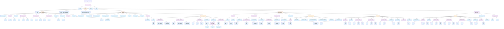

```mermaid
flowchart TD
    root["camera_visible IDS"]

    n1[camera_visible]
    root --> n1
    class n1 normalNode
    n2[name]
    n1 --> n2
    class n2 leafNode
    n3(channel)
    n1 --> n3
    class n3 complexNode
    n4[name]
    n3 --> n4
    class n4 leafNode
    n5(aperture)
    n3 --> n5
    class n5 complexNode
    n6[geometry_type]
    n5 --> n6
    class n6 leafNode
    n7[centre]
    n5 --> n7
    class n7 normalNode
    n8[r]
    n7 --> n8
    class n8 leafNode
    n9[phi]
    n7 --> n9
    class n9 leafNode
    n10[z]
    n7 --> n10
    class n10 leafNode
    n11[radius]
    n5 --> n11
    class n11 leafNode
    n12[x1_unit_vector]
    n5 --> n12
    class n12 normalNode
    n13[x]
    n12 --> n13
    class n13 leafNode
    n14[y]
    n12 --> n14
    class n14 leafNode
    n15[z]
    n12 --> n15
    class n15 leafNode
    n16[x2_unit_vector]
    n5 --> n16
    class n16 normalNode
    n17[x]
    n16 --> n17
    class n17 leafNode
    n18[y]
    n16 --> n18
    class n18 leafNode
    n19[z]
    n16 --> n19
    class n19 leafNode
    n20[x3_unit_vector]
    n5 --> n20
    class n20 normalNode
    n21[x]
    n20 --> n21
    class n21 leafNode
    n22[y]
    n20 --> n22
    class n22 leafNode
    n23[z]
    n20 --> n23
    class n23 leafNode
    n24[x1_width]
    n5 --> n24
    class n24 leafNode
    n25[x2_width]
    n5 --> n25
    class n25 leafNode
    n26[outline]
    n5 --> n26
    class n26 normalNode
    n27[x1]
    n26 --> n27
    class n27 leafNode
    n28[x2]
    n26 --> n28
    class n28 leafNode
    n29[surface]
    n5 --> n29
    class n29 leafNode
    n30[viewing_angle_alpha_bounds]
    n3 --> n30
    class n30 leafNode
    n31[viewing_angle_beta_bounds]
    n3 --> n31
    class n31 leafNode
    n32(detector)
    n3 --> n32
    class n32 complexNode
    n33[pixel_to_alpha]
    n32 --> n33
    class n33 leafNode
    n34[pixel_to_beta]
    n32 --> n34
    class n34 leafNode
    n35[wavelength_lower]
    n32 --> n35
    class n35 leafNode
    n36[wavelength_upper]
    n32 --> n36
    class n36 leafNode
    n37[counts_to_radiance]
    n32 --> n37
    class n37 leafNode
    n38[exposure_time]
    n32 --> n38
    class n38 leafNode
    n39[noise]
    n32 --> n39
    class n39 leafNode
    n40[columns_n]
    n32 --> n40
    class n40 leafNode
    n41[lines_n]
    n32 --> n41
    class n41 leafNode
    n42[frame]
    n32 --> n42
    class n42 normalNode
    n43[image_raw]
    n42 --> n43
    class n43 leafNode
    n44[radiance]
    n42 --> n44
    class n44 leafNode
    n45[time]
    n42 --> n45
    class n45 leafNode
    n46(geometry_matrix)
    n32 --> n46
    class n46 complexNode
    n47[with_reflections]
    n46 --> n47
    class n47 normalNode
    n48[data]
    n47 --> n48
    class n48 leafNode
    n49[voxel_indices]
    n47 --> n49
    class n49 leafNode
    n50[pixel_indices]
    n47 --> n50
    class n50 leafNode
    n51[without_reflections]
    n46 --> n51
    class n51 normalNode
    n52[data]
    n51 --> n52
    class n52 leafNode
    n53[voxel_indices]
    n51 --> n53
    class n53 leafNode
    n54[pixel_indices]
    n51 --> n54
    class n54 leafNode
    n55[interpolated]
    n46 --> n55
    class n55 normalNode
    n56[r]
    n55 --> n56
    class n56 leafNode
    n57[z]
    n55 --> n57
    class n57 leafNode
    n58[phi]
    n55 --> n58
    class n58 leafNode
    n59[data]
    n55 --> n59
    class n59 leafNode
    n60[voxel_map]
    n46 --> n60
    class n60 leafNode
    n61[voxels_n]
    n46 --> n61
    class n61 leafNode
    n62[emission_grid]
    n46 --> n62
    class n62 normalNode
    n63[grid_type]
    n62 --> n63
    class n63 normalNode
    n64[name]
    n63 --> n64
    class n64 leafNode
    n65[index]
    n63 --> n65
    class n65 leafNode
    n66[description]
    n63 --> n66
    class n66 leafNode
    n67[dim1]
    n62 --> n67
    class n67 leafNode
    n68[dim2]
    n62 --> n68
    class n68 leafNode
    n69[dim3]
    n62 --> n69
    class n69 leafNode
    n70(optical_element)
    n3 --> n70
    class n70 complexNode
    n71[type]
    n70 --> n71
    class n71 normalNode
    n72[name]
    n71 --> n72
    class n72 leafNode
    n73[index]
    n71 --> n73
    class n73 leafNode
    n74[description]
    n71 --> n74
    class n74 leafNode
    n75[front_surface]
    n70 --> n75
    class n75 normalNode
    n76[curvature_type]
    n75 --> n76
    class n76 normalNode
    n77[name]
    n76 --> n77
    class n77 leafNode
    n78[index]
    n76 --> n78
    class n78 leafNode
    n79[description]
    n76 --> n79
    class n79 leafNode
    n80[x1_curvature]
    n75 --> n80
    class n80 leafNode
    n81[x2_curvature]
    n75 --> n81
    class n81 leafNode
    n82[back_surface]
    n70 --> n82
    class n82 normalNode
    n83[curvature_type]
    n82 --> n83
    class n83 normalNode
    n84[name]
    n83 --> n84
    class n84 leafNode
    n85[index]
    n83 --> n85
    class n85 leafNode
    n86[description]
    n83 --> n86
    class n86 leafNode
    n87[x1_curvature]
    n82 --> n87
    class n87 leafNode
    n88[x2_curvature]
    n82 --> n88
    class n88 leafNode
    n89[thickness]
    n70 --> n89
    class n89 leafNode
    n90(material_properties)
    n70 --> n90
    class n90 complexNode
    n91[type]
    n90 --> n91
    class n91 normalNode
    n92[name]
    n91 --> n92
    class n92 leafNode
    n93[index]
    n91 --> n93
    class n93 leafNode
    n94[description]
    n91 --> n94
    class n94 leafNode
    n95[wavelengths]
    n90 --> n95
    class n95 leafNode
    n96[refractive_index]
    n90 --> n96
    class n96 leafNode
    n97[extinction_coefficient]
    n90 --> n97
    class n97 leafNode
    n98[transmission_coefficient]
    n90 --> n98
    class n98 leafNode
    n99[roughness]
    n90 --> n99
    class n99 leafNode
    n100(geometry)
    n70 --> n100
    class n100 complexNode
    n101[geometry_type]
    n100 --> n101
    class n101 leafNode
    n102[centre]
    n100 --> n102
    class n102 normalNode
    n103[r]
    n102 --> n103
    class n103 leafNode
    n104[phi]
    n102 --> n104
    class n104 leafNode
    n105[z]
    n102 --> n105
    class n105 leafNode
    n106[radius]
    n100 --> n106
    class n106 leafNode
    n107[x1_unit_vector]
    n100 --> n107
    class n107 normalNode
    n108[x]
    n107 --> n108
    class n108 leafNode
    n109[y]
    n107 --> n109
    class n109 leafNode
    n110[z]
    n107 --> n110
    class n110 leafNode
    n111[x2_unit_vector]
    n100 --> n111
    class n111 normalNode
    n112[x]
    n111 --> n112
    class n112 leafNode
    n113[y]
    n111 --> n113
    class n113 leafNode
    n114[z]
    n111 --> n114
    class n114 leafNode
    n115[x3_unit_vector]
    n100 --> n115
    class n115 normalNode
    n116[x]
    n115 --> n116
    class n116 leafNode
    n117[y]
    n115 --> n117
    class n117 leafNode
    n118[z]
    n115 --> n118
    class n118 leafNode
    n119[x1_width]
    n100 --> n119
    class n119 leafNode
    n120[x2_width]
    n100 --> n120
    class n120 leafNode
    n121[outline]
    n100 --> n121
    class n121 normalNode
    n122[x1]
    n121 --> n122
    class n122 leafNode
    n123[x2]
    n121 --> n123
    class n123 leafNode
    n124[surface]
    n100 --> n124
    class n124 leafNode
    n125[fibre_bundle]
    n3 --> n125
    class n125 normalNode
    n126(geometry)
    n125 --> n126
    class n126 complexNode
    n127[geometry_type]
    n126 --> n127
    class n127 leafNode
    n128[centre]
    n126 --> n128
    class n128 normalNode
    n129[r]
    n128 --> n129
    class n129 leafNode
    n130[phi]
    n128 --> n130
    class n130 leafNode
    n131[z]
    n128 --> n131
    class n131 leafNode
    n132[radius]
    n126 --> n132
    class n132 leafNode
    n133[x1_unit_vector]
    n126 --> n133
    class n133 normalNode
    n134[x]
    n133 --> n134
    class n134 leafNode
    n135[y]
    n133 --> n135
    class n135 leafNode
    n136[z]
    n133 --> n136
    class n136 leafNode
    n137[x2_unit_vector]
    n126 --> n137
    class n137 normalNode
    n138[x]
    n137 --> n138
    class n138 leafNode
    n139[y]
    n137 --> n139
    class n139 leafNode
    n140[z]
    n137 --> n140
    class n140 leafNode
    n141[x3_unit_vector]
    n126 --> n141
    class n141 normalNode
    n142[x]
    n141 --> n142
    class n142 leafNode
    n143[y]
    n141 --> n143
    class n143 leafNode
    n144[z]
    n141 --> n144
    class n144 leafNode
    n145[x1_width]
    n126 --> n145
    class n145 leafNode
    n146[x2_width]
    n126 --> n146
    class n146 leafNode
    n147[outline]
    n126 --> n147
    class n147 normalNode
    n148[x1]
    n147 --> n148
    class n148 leafNode
    n149[x2]
    n147 --> n149
    class n149 leafNode
    n150[surface]
    n126 --> n150
    class n150 leafNode
    n151[fibre_radius]
    n125 --> n151
    class n151 leafNode
    n152[fibre_positions]
    n125 --> n152
    class n152 normalNode
    n153[x1]
    n152 --> n153
    class n153 leafNode
    n154[x2]
    n152 --> n154
    class n154 leafNode
    n155[latency]
    n1 --> n155
    class n155 leafNode
    n156[time]
    n1 --> n156
    class n156 leafNode

    classDef leafNode fill:#e1f5fe
    classDef complexNode fill:#fff3e0
    classDef normalNode fill:#f3e5f5
    classDef moreNode fill:#f5f5f5,stroke-dasharray: 5 5
```