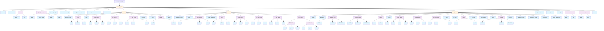

```mermaid
flowchart TD
    root["camera_x_rays IDS"]

    n1(camera_x_rays)
    root --> n1
    class n1 complexNode
    n2[name]
    n1 --> n2
    class n2 leafNode
    n3[description]
    n1 --> n3
    class n3 leafNode
    n4[frame]
    n1 --> n4
    class n4 normalNode
    n5[counts_n]
    n4 --> n5
    class n5 leafNode
    n6[time]
    n4 --> n6
    class n6 leafNode
    n7[t_e_magnetic_axis]
    n1 --> n7
    class n7 normalNode
    n8[data]
    n7 --> n8
    class n8 leafNode
    n9[validity_timed]
    n7 --> n9
    class n9 leafNode
    n10[validity]
    n7 --> n10
    class n10 leafNode
    n11[time]
    n7 --> n11
    class n11 leafNode
    n12[photon_energy]
    n1 --> n12
    class n12 leafNode
    n13[quantum_efficiency]
    n1 --> n13
    class n13 leafNode
    n14[energy_threshold_lower]
    n1 --> n14
    class n14 leafNode
    n15[energy_configuration_name]
    n1 --> n15
    class n15 leafNode
    n16[pixel_status]
    n1 --> n16
    class n16 leafNode
    n17(aperture)
    n1 --> n17
    class n17 complexNode
    n18[geometry_type]
    n17 --> n18
    class n18 leafNode
    n19[centre]
    n17 --> n19
    class n19 normalNode
    n20[r]
    n19 --> n20
    class n20 leafNode
    n21[phi]
    n19 --> n21
    class n21 leafNode
    n22[z]
    n19 --> n22
    class n22 leafNode
    n23[radius]
    n17 --> n23
    class n23 leafNode
    n24[x1_unit_vector]
    n17 --> n24
    class n24 normalNode
    n25[x]
    n24 --> n25
    class n25 leafNode
    n26[y]
    n24 --> n26
    class n26 leafNode
    n27[z]
    n24 --> n27
    class n27 leafNode
    n28[x2_unit_vector]
    n17 --> n28
    class n28 normalNode
    n29[x]
    n28 --> n29
    class n29 leafNode
    n30[y]
    n28 --> n30
    class n30 leafNode
    n31[z]
    n28 --> n31
    class n31 leafNode
    n32[x3_unit_vector]
    n17 --> n32
    class n32 normalNode
    n33[x]
    n32 --> n33
    class n33 leafNode
    n34[y]
    n32 --> n34
    class n34 leafNode
    n35[z]
    n32 --> n35
    class n35 leafNode
    n36[x1_width]
    n17 --> n36
    class n36 leafNode
    n37[x2_width]
    n17 --> n37
    class n37 leafNode
    n38[outline]
    n17 --> n38
    class n38 normalNode
    n39[x1]
    n38 --> n39
    class n39 leafNode
    n40[x2]
    n38 --> n40
    class n40 leafNode
    n41[surface]
    n17 --> n41
    class n41 leafNode
    n42(camera)
    n1 --> n42
    class n42 complexNode
    n43[pixel_dimensions]
    n42 --> n43
    class n43 leafNode
    n44[pixels_n]
    n42 --> n44
    class n44 leafNode
    n45[pixel_position]
    n42 --> n45
    class n45 normalNode
    n46[r]
    n45 --> n46
    class n46 leafNode
    n47[phi]
    n45 --> n47
    class n47 leafNode
    n48[z]
    n45 --> n48
    class n48 leafNode
    n49[camera_dimensions]
    n42 --> n49
    class n49 leafNode
    n50[centre]
    n42 --> n50
    class n50 normalNode
    n51[r]
    n50 --> n51
    class n51 leafNode
    n52[phi]
    n50 --> n52
    class n52 leafNode
    n53[z]
    n50 --> n53
    class n53 leafNode
    n54[x1_unit_vector]
    n42 --> n54
    class n54 normalNode
    n55[x]
    n54 --> n55
    class n55 leafNode
    n56[y]
    n54 --> n56
    class n56 leafNode
    n57[z]
    n54 --> n57
    class n57 leafNode
    n58[x2_unit_vector]
    n42 --> n58
    class n58 normalNode
    n59[x]
    n58 --> n59
    class n59 leafNode
    n60[y]
    n58 --> n60
    class n60 leafNode
    n61[z]
    n58 --> n61
    class n61 leafNode
    n62[x3_unit_vector]
    n42 --> n62
    class n62 normalNode
    n63[x]
    n62 --> n63
    class n63 leafNode
    n64[y]
    n62 --> n64
    class n64 leafNode
    n65[z]
    n62 --> n65
    class n65 leafNode
    n66[line_of_sight]
    n42 --> n66
    class n66 normalNode
    n67[first_point]
    n66 --> n67
    class n67 normalNode
    n68[r]
    n67 --> n68
    class n68 leafNode
    n69[phi]
    n67 --> n69
    class n69 leafNode
    n70[z]
    n67 --> n70
    class n70 leafNode
    n71[second_point]
    n66 --> n71
    class n71 normalNode
    n72[r]
    n71 --> n72
    class n72 leafNode
    n73[phi]
    n71 --> n73
    class n73 leafNode
    n74[z]
    n71 --> n74
    class n74 leafNode
    n75(filter_window)
    n1 --> n75
    class n75 complexNode
    n76[name]
    n75 --> n76
    class n76 leafNode
    n77[description]
    n75 --> n77
    class n77 leafNode
    n78[geometry_type]
    n75 --> n78
    class n78 normalNode
    n79[name]
    n78 --> n79
    class n79 leafNode
    n80[index]
    n78 --> n80
    class n80 leafNode
    n81[description]
    n78 --> n81
    class n81 leafNode
    n82[curvature_type]
    n75 --> n82
    class n82 normalNode
    n83[name]
    n82 --> n83
    class n83 leafNode
    n84[index]
    n82 --> n84
    class n84 leafNode
    n85[description]
    n82 --> n85
    class n85 leafNode
    n86[centre]
    n75 --> n86
    class n86 normalNode
    n87[r]
    n86 --> n87
    class n87 leafNode
    n88[phi]
    n86 --> n88
    class n88 leafNode
    n89[z]
    n86 --> n89
    class n89 leafNode
    n90[radius]
    n75 --> n90
    class n90 leafNode
    n91[x1_unit_vector]
    n75 --> n91
    class n91 normalNode
    n92[x]
    n91 --> n92
    class n92 leafNode
    n93[y]
    n91 --> n93
    class n93 leafNode
    n94[z]
    n91 --> n94
    class n94 leafNode
    n95[x2_unit_vector]
    n75 --> n95
    class n95 normalNode
    n96[x]
    n95 --> n96
    class n96 leafNode
    n97[y]
    n95 --> n97
    class n97 leafNode
    n98[z]
    n95 --> n98
    class n98 leafNode
    n99[x3_unit_vector]
    n75 --> n99
    class n99 normalNode
    n100[x]
    n99 --> n100
    class n100 leafNode
    n101[y]
    n99 --> n101
    class n101 leafNode
    n102[z]
    n99 --> n102
    class n102 leafNode
    n103[x1_width]
    n75 --> n103
    class n103 leafNode
    n104[x2_width]
    n75 --> n104
    class n104 leafNode
    n105[outline]
    n75 --> n105
    class n105 normalNode
    n106[x1]
    n105 --> n106
    class n106 leafNode
    n107[x2]
    n105 --> n107
    class n107 leafNode
    n108[x1_curvature]
    n75 --> n108
    class n108 leafNode
    n109[x2_curvature]
    n75 --> n109
    class n109 leafNode
    n110[surface]
    n75 --> n110
    class n110 leafNode
    n111[material]
    n75 --> n111
    class n111 normalNode
    n112[name]
    n111 --> n112
    class n112 leafNode
    n113[index]
    n111 --> n113
    class n113 leafNode
    n114[description]
    n111 --> n114
    class n114 leafNode
    n115[thickness]
    n75 --> n115
    class n115 leafNode
    n116[wavelength_lower]
    n75 --> n116
    class n116 leafNode
    n117[wavelength_upper]
    n75 --> n117
    class n117 leafNode
    n118[wavelengths]
    n75 --> n118
    class n118 leafNode
    n119[photon_absorption]
    n75 --> n119
    class n119 leafNode
    n120[exposure_time]
    n1 --> n120
    class n120 leafNode
    n121[readout_time]
    n1 --> n121
    class n121 leafNode
    n122[latency]
    n1 --> n122
    class n122 leafNode
    n123[detector_humidity]
    n1 --> n123
    class n123 normalNode
    n124[data]
    n123 --> n124
    class n124 leafNode
    n125[time]
    n123 --> n125
    class n125 leafNode
    n126[detector_temperature]
    n1 --> n126
    class n126 normalNode
    n127[data]
    n126 --> n127
    class n127 leafNode
    n128[time]
    n126 --> n128
    class n128 leafNode
    n129[time]
    n1 --> n129
    class n129 leafNode

    classDef leafNode fill:#e1f5fe
    classDef complexNode fill:#fff3e0
    classDef normalNode fill:#f3e5f5
    classDef moreNode fill:#f5f5f5,stroke-dasharray: 5 5
```