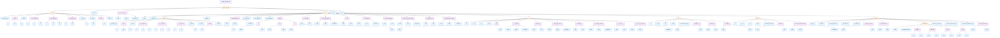

```mermaid
flowchart TD
    root["charge_exchange IDS"]

    n1(charge_exchange)
    root --> n1
    class n1 complexNode
    n2(aperture)
    n1 --> n2
    class n2 complexNode
    n3[geometry_type]
    n2 --> n3
    class n3 leafNode
    n4[centre]
    n2 --> n4
    class n4 normalNode
    n5[r]
    n4 --> n5
    class n5 leafNode
    n6[phi]
    n4 --> n6
    class n6 leafNode
    n7[z]
    n4 --> n7
    class n7 leafNode
    n8[radius]
    n2 --> n8
    class n8 leafNode
    n9[x1_unit_vector]
    n2 --> n9
    class n9 normalNode
    n10[x]
    n9 --> n10
    class n10 leafNode
    n11[y]
    n9 --> n11
    class n11 leafNode
    n12[z]
    n9 --> n12
    class n12 leafNode
    n13[x2_unit_vector]
    n2 --> n13
    class n13 normalNode
    n14[x]
    n13 --> n14
    class n14 leafNode
    n15[y]
    n13 --> n15
    class n15 leafNode
    n16[z]
    n13 --> n16
    class n16 leafNode
    n17[x3_unit_vector]
    n2 --> n17
    class n17 normalNode
    n18[x]
    n17 --> n18
    class n18 leafNode
    n19[y]
    n17 --> n19
    class n19 leafNode
    n20[z]
    n17 --> n20
    class n20 leafNode
    n21[x1_width]
    n2 --> n21
    class n21 leafNode
    n22[x2_width]
    n2 --> n22
    class n22 leafNode
    n23[outline]
    n2 --> n23
    class n23 normalNode
    n24[x1]
    n23 --> n24
    class n24 leafNode
    n25[x2]
    n23 --> n25
    class n25 leafNode
    n26[surface]
    n2 --> n26
    class n26 leafNode
    n27[etendue]
    n1 --> n27
    class n27 leafNode
    n28[etendue_method]
    n1 --> n28
    class n28 normalNode
    n29[name]
    n28 --> n29
    class n29 leafNode
    n30[index]
    n28 --> n30
    class n30 leafNode
    n31[description]
    n28 --> n31
    class n31 leafNode
    n32(channel)
    n1 --> n32
    class n32 complexNode
    n33[name]
    n32 --> n33
    class n33 leafNode
    n34[description]
    n32 --> n34
    class n34 leafNode
    n35(aperture)
    n32 --> n35
    class n35 complexNode
    n36[geometry_type]
    n35 --> n36
    class n36 leafNode
    n37[centre]
    n35 --> n37
    class n37 normalNode
    n38[r]
    n37 --> n38
    class n38 leafNode
    n39[phi]
    n37 --> n39
    class n39 leafNode
    n40[z]
    n37 --> n40
    class n40 leafNode
    n41[radius]
    n35 --> n41
    class n41 leafNode
    n42[x1_unit_vector]
    n35 --> n42
    class n42 normalNode
    n43[x]
    n42 --> n43
    class n43 leafNode
    n44[y]
    n42 --> n44
    class n44 leafNode
    n45[z]
    n42 --> n45
    class n45 leafNode
    n46[x2_unit_vector]
    n35 --> n46
    class n46 normalNode
    n47[x]
    n46 --> n47
    class n47 leafNode
    n48[y]
    n46 --> n48
    class n48 leafNode
    n49[z]
    n46 --> n49
    class n49 leafNode
    n50[x3_unit_vector]
    n35 --> n50
    class n50 normalNode
    n51[x]
    n50 --> n51
    class n51 leafNode
    n52[y]
    n50 --> n52
    class n52 leafNode
    n53[z]
    n50 --> n53
    class n53 leafNode
    n54[x1_width]
    n35 --> n54
    class n54 leafNode
    n55[x2_width]
    n35 --> n55
    class n55 leafNode
    n56[outline]
    n35 --> n56
    class n56 normalNode
    n57[x1]
    n56 --> n57
    class n57 leafNode
    n58[x2]
    n56 --> n58
    class n58 leafNode
    n59[surface]
    n35 --> n59
    class n59 leafNode
    n60[etendue]
    n32 --> n60
    class n60 leafNode
    n61[etendue_method]
    n32 --> n61
    class n61 normalNode
    n62[name]
    n61 --> n62
    class n62 leafNode
    n63[index]
    n61 --> n63
    class n63 leafNode
    n64[description]
    n61 --> n64
    class n64 leafNode
    n65[focal_length]
    n32 --> n65
    class n65 leafNode
    n66[cone_diameter]
    n32 --> n66
    class n66 leafNode
    n67[image_diameter]
    n32 --> n67
    class n67 leafNode
    n68[position]
    n32 --> n68
    class n68 normalNode
    n69[r]
    n68 --> n69
    class n69 normalNode
    n70[data]
    n69 --> n70
    class n70 leafNode
    n71[time]
    n69 --> n71
    class n71 leafNode
    n72[phi]
    n68 --> n72
    class n72 normalNode
    n73[data]
    n72 --> n73
    class n73 leafNode
    n74[time]
    n72 --> n74
    class n74 leafNode
    n75[z]
    n68 --> n75
    class n75 normalNode
    n76[data]
    n75 --> n76
    class n76 leafNode
    n77[time]
    n75 --> n77
    class n77 leafNode
    n78[t_i_average]
    n32 --> n78
    class n78 normalNode
    n79[data]
    n78 --> n79
    class n79 leafNode
    n80[time]
    n78 --> n80
    class n80 leafNode
    n81[t_i_average_method]
    n32 --> n81
    class n81 normalNode
    n82[name]
    n81 --> n82
    class n82 leafNode
    n83[index]
    n81 --> n83
    class n83 leafNode
    n84[description]
    n81 --> n84
    class n84 leafNode
    n85[zeff]
    n32 --> n85
    class n85 normalNode
    n86[data]
    n85 --> n86
    class n86 leafNode
    n87[time]
    n85 --> n87
    class n87 leafNode
    n88[zeff_method]
    n32 --> n88
    class n88 normalNode
    n89[name]
    n88 --> n89
    class n89 leafNode
    n90[index]
    n88 --> n90
    class n90 leafNode
    n91[description]
    n88 --> n91
    class n91 leafNode
    n92[zeff_line_average]
    n32 --> n92
    class n92 normalNode
    n93[data]
    n92 --> n93
    class n93 leafNode
    n94[time]
    n92 --> n94
    class n94 leafNode
    n95[zeff_line_average_method]
    n32 --> n95
    class n95 normalNode
    n96[name]
    n95 --> n96
    class n96 leafNode
    n97[index]
    n95 --> n97
    class n97 leafNode
    n98[description]
    n95 --> n98
    class n98 leafNode
    n99[momentum_phi]
    n32 --> n99
    class n99 normalNode
    n100[data]
    n99 --> n100
    class n100 leafNode
    n101[time]
    n99 --> n101
    class n101 leafNode
    n102[momentum_phi_method]
    n32 --> n102
    class n102 normalNode
    n103[name]
    n102 --> n103
    class n103 leafNode
    n104[index]
    n102 --> n104
    class n104 leafNode
    n105[description]
    n102 --> n105
    class n105 leafNode
    n106(ion)
    n32 --> n106
    class n106 complexNode
    n107[a]
    n106 --> n107
    class n107 leafNode
    n108[z_ion]
    n106 --> n108
    class n108 leafNode
    n109[z_n]
    n106 --> n109
    class n109 leafNode
    n110[name]
    n106 --> n110
    class n110 leafNode
    n111[t_i]
    n106 --> n111
    class n111 normalNode
    n112[data]
    n111 --> n112
    class n112 leafNode
    n113[time]
    n111 --> n113
    class n113 leafNode
    n114[t_i_method]
    n106 --> n114
    class n114 normalNode
    n115[name]
    n114 --> n115
    class n115 leafNode
    n116[index]
    n114 --> n116
    class n116 leafNode
    n117[description]
    n114 --> n117
    class n117 leafNode
    n118[velocity_phi]
    n106 --> n118
    class n118 normalNode
    n119[data]
    n118 --> n119
    class n119 leafNode
    n120[time]
    n118 --> n120
    class n120 leafNode
    n121[velocity_phi_method]
    n106 --> n121
    class n121 normalNode
    n122[name]
    n121 --> n122
    class n122 leafNode
    n123[index]
    n121 --> n123
    class n123 leafNode
    n124[description]
    n121 --> n124
    class n124 leafNode
    n125[velocity_pol]
    n106 --> n125
    class n125 normalNode
    n126[data]
    n125 --> n126
    class n126 leafNode
    n127[time]
    n125 --> n127
    class n127 leafNode
    n128[velocity_pol_method]
    n106 --> n128
    class n128 normalNode
    n129[name]
    n128 --> n129
    class n129 leafNode
    n130[index]
    n128 --> n130
    class n130 leafNode
    n131[description]
    n128 --> n131
    class n131 leafNode
    n132[n_i_over_n_e]
    n106 --> n132
    class n132 normalNode
    n133[data]
    n132 --> n133
    class n133 leafNode
    n134[time]
    n132 --> n134
    class n134 leafNode
    n135[n_i_over_n_e_method]
    n106 --> n135
    class n135 normalNode
    n136[name]
    n135 --> n136
    class n136 leafNode
    n137[index]
    n135 --> n137
    class n137 leafNode
    n138[description]
    n135 --> n138
    class n138 leafNode
    n139(bes)
    n32 --> n139
    class n139 complexNode
    n140[a]
    n139 --> n140
    class n140 leafNode
    n141[z_ion]
    n139 --> n141
    class n141 leafNode
    n142[z_n]
    n139 --> n142
    class n142 leafNode
    n143[name]
    n139 --> n143
    class n143 leafNode
    n144[transition_wavelength]
    n139 --> n144
    class n144 leafNode
    n145[doppler_shift]
    n139 --> n145
    class n145 normalNode
    n146[data]
    n145 --> n146
    class n146 leafNode
    n147[time]
    n145 --> n147
    class n147 leafNode
    n148[lorentz_shift]
    n139 --> n148
    class n148 normalNode
    n149[data]
    n148 --> n149
    class n149 leafNode
    n150[time]
    n148 --> n150
    class n150 leafNode
    n151[radiances]
    n139 --> n151
    class n151 normalNode
    n152[data]
    n151 --> n152
    class n152 leafNode
    n153[time]
    n151 --> n153
    class n153 leafNode
    n154(ion_fast)
    n32 --> n154
    class n154 complexNode
    n155[a]
    n154 --> n155
    class n155 leafNode
    n156[z_ion]
    n154 --> n156
    class n156 leafNode
    n157[z_n]
    n154 --> n157
    class n157 leafNode
    n158[name]
    n154 --> n158
    class n158 leafNode
    n159[transition_wavelength]
    n154 --> n159
    class n159 leafNode
    n160[radiance]
    n154 --> n160
    class n160 normalNode
    n161[data]
    n160 --> n161
    class n161 leafNode
    n162[time]
    n160 --> n162
    class n162 leafNode
    n163[radiance_spectral_method]
    n154 --> n163
    class n163 normalNode
    n164[name]
    n163 --> n164
    class n164 leafNode
    n165[index]
    n163 --> n165
    class n165 leafNode
    n166[description]
    n163 --> n166
    class n166 leafNode
    n167(spectrum)
    n32 --> n167
    class n167 complexNode
    n168[grating]
    n167 --> n168
    class n168 leafNode
    n169[slit_width]
    n167 --> n169
    class n169 leafNode
    n170[instrument_function]
    n167 --> n170
    class n170 leafNode
    n171[exposure_time]
    n167 --> n171
    class n171 leafNode
    n172[wavelengths]
    n167 --> n172
    class n172 leafNode
    n173[intensity_spectrum]
    n167 --> n173
    class n173 normalNode
    n174[data]
    n173 --> n174
    class n174 leafNode
    n175[time]
    n173 --> n175
    class n175 leafNode
    n176[radiance_spectral]
    n167 --> n176
    class n176 normalNode
    n177[data]
    n176 --> n177
    class n177 leafNode
    n178[time]
    n176 --> n178
    class n178 leafNode
    n179(processed_line)
    n167 --> n179
    class n179 complexNode
    n180[name]
    n179 --> n180
    class n180 leafNode
    n181[wavelength_central]
    n179 --> n181
    class n181 leafNode
    n182[radiance]
    n179 --> n182
    class n182 normalNode
    n183[data]
    n182 --> n183
    class n183 leafNode
    n184[time]
    n182 --> n184
    class n184 leafNode
    n185[intensity]
    n179 --> n185
    class n185 normalNode
    n186[data]
    n185 --> n186
    class n186 leafNode
    n187[time]
    n185 --> n187
    class n187 leafNode
    n188[width]
    n179 --> n188
    class n188 normalNode
    n189[data]
    n188 --> n189
    class n189 leafNode
    n190[time]
    n188 --> n190
    class n190 leafNode
    n191[shift]
    n179 --> n191
    class n191 normalNode
    n192[data]
    n191 --> n192
    class n192 leafNode
    n193[time]
    n191 --> n193
    class n193 leafNode
    n194[radiance_calibration]
    n167 --> n194
    class n194 leafNode
    n195[radiance_calibration_date]
    n167 --> n195
    class n195 leafNode
    n196[wavelength_calibration_date]
    n167 --> n196
    class n196 leafNode
    n197[radiance_continuum]
    n167 --> n197
    class n197 normalNode
    n198[data]
    n197 --> n198
    class n198 leafNode
    n199[time]
    n197 --> n199
    class n199 leafNode
    n200[latency]
    n1 --> n200
    class n200 leafNode
    n201[time]
    n1 --> n201
    class n201 leafNode

    classDef leafNode fill:#e1f5fe
    classDef complexNode fill:#fff3e0
    classDef normalNode fill:#f3e5f5
    classDef moreNode fill:#f5f5f5,stroke-dasharray: 5 5
```