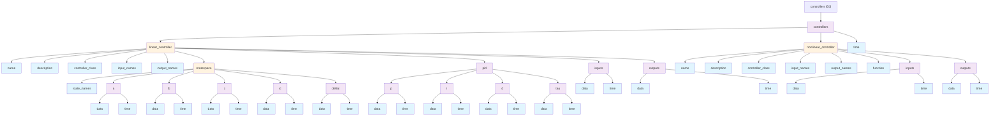

```mermaid
flowchart TD
    root["controllers IDS"]

    n1[controllers]
    root --> n1
    class n1 normalNode
    n2(linear_controller)
    n1 --> n2
    class n2 complexNode
    n3[name]
    n2 --> n3
    class n3 leafNode
    n4[description]
    n2 --> n4
    class n4 leafNode
    n5[controller_class]
    n2 --> n5
    class n5 leafNode
    n6[input_names]
    n2 --> n6
    class n6 leafNode
    n7[output_names]
    n2 --> n7
    class n7 leafNode
    n8(statespace)
    n2 --> n8
    class n8 complexNode
    n9[state_names]
    n8 --> n9
    class n9 leafNode
    n10[a]
    n8 --> n10
    class n10 normalNode
    n11[data]
    n10 --> n11
    class n11 leafNode
    n12[time]
    n10 --> n12
    class n12 leafNode
    n13[b]
    n8 --> n13
    class n13 normalNode
    n14[data]
    n13 --> n14
    class n14 leafNode
    n15[time]
    n13 --> n15
    class n15 leafNode
    n16[c]
    n8 --> n16
    class n16 normalNode
    n17[data]
    n16 --> n17
    class n17 leafNode
    n18[time]
    n16 --> n18
    class n18 leafNode
    n19[d]
    n8 --> n19
    class n19 normalNode
    n20[data]
    n19 --> n20
    class n20 leafNode
    n21[time]
    n19 --> n21
    class n21 leafNode
    n22[deltat]
    n8 --> n22
    class n22 normalNode
    n23[data]
    n22 --> n23
    class n23 leafNode
    n24[time]
    n22 --> n24
    class n24 leafNode
    n25[pid]
    n2 --> n25
    class n25 normalNode
    n26[p]
    n25 --> n26
    class n26 normalNode
    n27[data]
    n26 --> n27
    class n27 leafNode
    n28[time]
    n26 --> n28
    class n28 leafNode
    n29[i]
    n25 --> n29
    class n29 normalNode
    n30[data]
    n29 --> n30
    class n30 leafNode
    n31[time]
    n29 --> n31
    class n31 leafNode
    n32[d]
    n25 --> n32
    class n32 normalNode
    n33[data]
    n32 --> n33
    class n33 leafNode
    n34[time]
    n32 --> n34
    class n34 leafNode
    n35[tau]
    n25 --> n35
    class n35 normalNode
    n36[data]
    n35 --> n36
    class n36 leafNode
    n37[time]
    n35 --> n37
    class n37 leafNode
    n38[inputs]
    n2 --> n38
    class n38 normalNode
    n39[data]
    n38 --> n39
    class n39 leafNode
    n40[time]
    n38 --> n40
    class n40 leafNode
    n41[outputs]
    n2 --> n41
    class n41 normalNode
    n42[data]
    n41 --> n42
    class n42 leafNode
    n43[time]
    n41 --> n43
    class n43 leafNode
    n44(nonlinear_controller)
    n1 --> n44
    class n44 complexNode
    n45[name]
    n44 --> n45
    class n45 leafNode
    n46[description]
    n44 --> n46
    class n46 leafNode
    n47[controller_class]
    n44 --> n47
    class n47 leafNode
    n48[input_names]
    n44 --> n48
    class n48 leafNode
    n49[output_names]
    n44 --> n49
    class n49 leafNode
    n50[function]
    n44 --> n50
    class n50 leafNode
    n51[inputs]
    n44 --> n51
    class n51 normalNode
    n52[data]
    n51 --> n52
    class n52 leafNode
    n53[time]
    n51 --> n53
    class n53 leafNode
    n54[outputs]
    n44 --> n54
    class n54 normalNode
    n55[data]
    n54 --> n55
    class n55 leafNode
    n56[time]
    n54 --> n56
    class n56 leafNode
    n57[time]
    n1 --> n57
    class n57 leafNode

    classDef leafNode fill:#e1f5fe
    classDef complexNode fill:#fff3e0
    classDef normalNode fill:#f3e5f5
    classDef moreNode fill:#f5f5f5,stroke-dasharray: 5 5
```