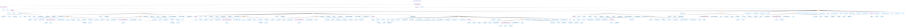

```mermaid
flowchart TD
    root["core_instant_changes IDS"]

    n1[core_instant_changes]
    root --> n1
    class n1 normalNode
    n2[vacuum_toroidal_field]
    n1 --> n2
    class n2 normalNode
    n3[r0]
    n2 --> n3
    class n3 leafNode
    n4[b0]
    n2 --> n4
    class n4 leafNode
    n5[change]
    n1 --> n5
    class n5 normalNode
    n6[identifier]
    n5 --> n6
    class n6 normalNode
    n7[name]
    n6 --> n7
    class n7 leafNode
    n8[index]
    n6 --> n8
    class n8 leafNode
    n9[description]
    n6 --> n9
    class n9 leafNode
    n10(profiles_1d)
    n5 --> n10
    class n10 complexNode
    n11(grid)
    n10 --> n11
    class n11 complexNode
    n12[rho_tor_norm]
    n11 --> n12
    class n12 leafNode
    n13[rho_tor]
    n11 --> n13
    class n13 leafNode
    n14[rho_pol_norm]
    n11 --> n14
    class n14 leafNode
    n15[psi]
    n11 --> n15
    class n15 leafNode
    n16[volume]
    n11 --> n16
    class n16 leafNode
    n17[area]
    n11 --> n17
    class n17 leafNode
    n18[surface]
    n11 --> n18
    class n18 leafNode
    n19[psi_magnetic_axis]
    n11 --> n19
    class n19 leafNode
    n20[psi_boundary]
    n11 --> n20
    class n20 leafNode
    n21(electrons)
    n10 --> n21
    class n21 complexNode
    n22[temperature]
    n21 --> n22
    class n22 leafNode
    n23[temperature_validity]
    n21 --> n23
    class n23 leafNode
    n24(temperature_fit)
    n21 --> n24
    class n24 complexNode
    n25[measured]
    n24 --> n25
    class n25 leafNode
    n26[source]
    n24 --> n26
    class n26 leafNode
    n27[time_measurement]
    n24 --> n27
    class n27 leafNode
    n28[time_measurement_slice_method]
    n24 --> n28
    class n28 normalNode
    n29[name]
    n28 --> n29
    class n29 leafNode
    n30[index]
    n28 --> n30
    class n30 leafNode
    n31[description]
    n28 --> n31
    class n31 leafNode
    n32[time_measurement_width]
    n24 --> n32
    class n32 leafNode
    n33[local]
    n24 --> n33
    class n33 leafNode
    n34[rho_tor_norm]
    n24 --> n34
    class n34 leafNode
    n35[weight]
    n24 --> n35
    class n35 leafNode
    n36[reconstructed]
    n24 --> n36
    class n36 leafNode
    n37[chi_squared]
    n24 --> n37
    class n37 leafNode
    n38[parameters]
    n24 --> n38
    class n38 leafNode
    n39[density]
    n21 --> n39
    class n39 leafNode
    n40[density_validity]
    n21 --> n40
    class n40 leafNode
    n41(density_fit)
    n21 --> n41
    class n41 complexNode
    n42[measured]
    n41 --> n42
    class n42 leafNode
    n43[source]
    n41 --> n43
    class n43 leafNode
    n44[time_measurement]
    n41 --> n44
    class n44 leafNode
    n45[time_measurement_slice_method]
    n41 --> n45
    class n45 normalNode
    n46[name]
    n45 --> n46
    class n46 leafNode
    n47[index]
    n45 --> n47
    class n47 leafNode
    n48[description]
    n45 --> n48
    class n48 leafNode
    n49[time_measurement_width]
    n41 --> n49
    class n49 leafNode
    n50[local]
    n41 --> n50
    class n50 leafNode
    n51[rho_tor_norm]
    n41 --> n51
    class n51 leafNode
    n52[weight]
    n41 --> n52
    class n52 leafNode
    n53[reconstructed]
    n41 --> n53
    class n53 leafNode
    n54[chi_squared]
    n41 --> n54
    class n54 leafNode
    n55[parameters]
    n41 --> n55
    class n55 leafNode
    n56[density_thermal]
    n21 --> n56
    class n56 leafNode
    n57[density_fast]
    n21 --> n57
    class n57 leafNode
    n58[pressure]
    n21 --> n58
    class n58 leafNode
    n59[pressure_thermal]
    n21 --> n59
    class n59 leafNode
    n60[pressure_fast_perpendicular]
    n21 --> n60
    class n60 leafNode
    n61[pressure_fast_parallel]
    n21 --> n61
    class n61 leafNode
    n62[collisionality_norm]
    n21 --> n62
    class n62 leafNode
    n63(ion)
    n10 --> n63
    class n63 complexNode
    n64[element]
    n63 --> n64
    class n64 normalNode
    n65[a]
    n64 --> n65
    class n65 leafNode
    n66[z_n]
    n64 --> n66
    class n66 leafNode
    n67[atoms_n]
    n64 --> n67
    class n67 leafNode
    n68[z_ion]
    n63 --> n68
    class n68 leafNode
    n69[name]
    n63 --> n69
    class n69 leafNode
    n70[neutral_index]
    n63 --> n70
    class n70 leafNode
    n71[z_ion_1d]
    n63 --> n71
    class n71 leafNode
    n72[z_ion_square_1d]
    n63 --> n72
    class n72 leafNode
    n73[temperature]
    n63 --> n73
    class n73 leafNode
    n74[temperature_validity]
    n63 --> n74
    class n74 leafNode
    n75(temperature_fit)
    n63 --> n75
    class n75 complexNode
    n76[measured]
    n75 --> n76
    class n76 leafNode
    n77[source]
    n75 --> n77
    class n77 leafNode
    n78[time_measurement]
    n75 --> n78
    class n78 leafNode
    n79[time_measurement_slice_method]
    n75 --> n79
    class n79 normalNode
    n80[name]
    n79 --> n80
    class n80 leafNode
    n81[index]
    n79 --> n81
    class n81 leafNode
    n82[description]
    n79 --> n82
    class n82 leafNode
    n83[time_measurement_width]
    n75 --> n83
    class n83 leafNode
    n84[local]
    n75 --> n84
    class n84 leafNode
    n85[rho_tor_norm]
    n75 --> n85
    class n85 leafNode
    n86[weight]
    n75 --> n86
    class n86 leafNode
    n87[reconstructed]
    n75 --> n87
    class n87 leafNode
    n88[chi_squared]
    n75 --> n88
    class n88 leafNode
    n89[parameters]
    n75 --> n89
    class n89 leafNode
    n90[density]
    n63 --> n90
    class n90 leafNode
    n91[density_validity]
    n63 --> n91
    class n91 leafNode
    n92(density_fit)
    n63 --> n92
    class n92 complexNode
    n93[measured]
    n92 --> n93
    class n93 leafNode
    n94[source]
    n92 --> n94
    class n94 leafNode
    n95[time_measurement]
    n92 --> n95
    class n95 leafNode
    n96[time_measurement_slice_method]
    n92 --> n96
    class n96 normalNode
    n97[name]
    n96 --> n97
    class n97 leafNode
    n98[index]
    n96 --> n98
    class n98 leafNode
    n99[description]
    n96 --> n99
    class n99 leafNode
    n100[time_measurement_width]
    n92 --> n100
    class n100 leafNode
    n101[local]
    n92 --> n101
    class n101 leafNode
    n102[rho_tor_norm]
    n92 --> n102
    class n102 leafNode
    n103[weight]
    n92 --> n103
    class n103 leafNode
    n104[reconstructed]
    n92 --> n104
    class n104 leafNode
    n105[chi_squared]
    n92 --> n105
    class n105 leafNode
    n106[parameters]
    n92 --> n106
    class n106 leafNode
    n107[density_thermal]
    n63 --> n107
    class n107 leafNode
    n108[density_fast]
    n63 --> n108
    class n108 leafNode
    n109[pressure]
    n63 --> n109
    class n109 leafNode
    n110[pressure_thermal]
    n63 --> n110
    class n110 leafNode
    n111[pressure_fast_perpendicular]
    n63 --> n111
    class n111 leafNode
    n112[pressure_fast_parallel]
    n63 --> n112
    class n112 leafNode
    n113[rotation_frequency_tor]
    n63 --> n113
    class n113 leafNode
    n114[velocity]
    n63 --> n114
    class n114 normalNode
    n115[radial]
    n114 --> n115
    class n115 leafNode
    n116[diamagnetic]
    n114 --> n116
    class n116 leafNode
    n117[parallel]
    n114 --> n117
    class n117 leafNode
    n118[poloidal]
    n114 --> n118
    class n118 leafNode
    n119[toroidal]
    n114 --> n119
    class n119 leafNode
    n120[multiple_states_flag]
    n63 --> n120
    class n120 leafNode
    n121(state)
    n63 --> n121
    class n121 complexNode
    n122[z_min]
    n121 --> n122
    class n122 leafNode
    n123[z_max]
    n121 --> n123
    class n123 leafNode
    n124[z_average]
    n121 --> n124
    class n124 leafNode
    n125[z_square_average]
    n121 --> n125
    class n125 leafNode
    n126[z_average_1d]
    n121 --> n126
    class n126 leafNode
    n127[z_average_square_1d]
    n121 --> n127
    class n127 leafNode
    n128[ionization_potential]
    n121 --> n128
    class n128 leafNode
    n129[name]
    n121 --> n129
    class n129 leafNode
    n130[electron_configuration]
    n121 --> n130
    class n130 leafNode
    n131[vibrational_level]
    n121 --> n131
    class n131 leafNode
    n132[vibrational_mode]
    n121 --> n132
    class n132 leafNode
    n133[rotation_frequency_tor]
    n121 --> n133
    class n133 leafNode
    n134[velocity]
    n121 --> n134
    class n134 normalNode
    n135[radial]
    n134 --> n135
    class n135 leafNode
    n136[diamagnetic]
    n134 --> n136
    class n136 leafNode
    n137[parallel]
    n134 --> n137
    class n137 leafNode
    n138[poloidal]
    n134 --> n138
    class n138 leafNode
    n139[toroidal]
    n134 --> n139
    class n139 leafNode
    n140[temperature]
    n121 --> n140
    class n140 leafNode
    n141[density]
    n121 --> n141
    class n141 leafNode
    n142(density_fit)
    n121 --> n142
    class n142 complexNode
    n143[measured]
    n142 --> n143
    class n143 leafNode
    n144[source]
    n142 --> n144
    class n144 leafNode
    n145[time_measurement]
    n142 --> n145
    class n145 leafNode
    n146[time_measurement_slice_method]
    n142 --> n146
    class n146 normalNode
    n147[name]
    n146 --> n147
    class n147 leafNode
    n148[index]
    n146 --> n148
    class n148 leafNode
    n149[description]
    n146 --> n149
    class n149 leafNode
    n150[time_measurement_width]
    n142 --> n150
    class n150 leafNode
    n151[local]
    n142 --> n151
    class n151 leafNode
    n152[rho_tor_norm]
    n142 --> n152
    class n152 leafNode
    n153[weight]
    n142 --> n153
    class n153 leafNode
    n154[reconstructed]
    n142 --> n154
    class n154 leafNode
    n155[chi_squared]
    n142 --> n155
    class n155 leafNode
    n156[parameters]
    n142 --> n156
    class n156 leafNode
    n157[density_thermal]
    n121 --> n157
    class n157 leafNode
    n158[density_fast]
    n121 --> n158
    class n158 leafNode
    n159[pressure]
    n121 --> n159
    class n159 leafNode
    n160[pressure_thermal]
    n121 --> n160
    class n160 leafNode
    n161[pressure_fast_perpendicular]
    n121 --> n161
    class n161 leafNode
    n162[pressure_fast_parallel]
    n121 --> n162
    class n162 leafNode
    n163(neutral)
    n10 --> n163
    class n163 complexNode
    n164[element]
    n163 --> n164
    class n164 normalNode
    n165[a]
    n164 --> n165
    class n165 leafNode
    n166[z_n]
    n164 --> n166
    class n166 leafNode
    n167[atoms_n]
    n164 --> n167
    class n167 leafNode
    n168[name]
    n163 --> n168
    class n168 leafNode
    n169[ion_index]
    n163 --> n169
    class n169 leafNode
    n170[temperature]
    n163 --> n170
    class n170 leafNode
    n171[density]
    n163 --> n171
    class n171 leafNode
    n172[density_thermal]
    n163 --> n172
    class n172 leafNode
    n173[density_fast]
    n163 --> n173
    class n173 leafNode
    n174[pressure]
    n163 --> n174
    class n174 leafNode
    n175[pressure_thermal]
    n163 --> n175
    class n175 leafNode
    n176[pressure_fast_perpendicular]
    n163 --> n176
    class n176 leafNode
    n177[pressure_fast_parallel]
    n163 --> n177
    class n177 leafNode
    n178[multiple_states_flag]
    n163 --> n178
    class n178 leafNode
    n179(state)
    n163 --> n179
    class n179 complexNode
    n180[name]
    n179 --> n180
    class n180 leafNode
    n181[electron_configuration]
    n179 --> n181
    class n181 leafNode
    n182[vibrational_level]
    n179 --> n182
    class n182 leafNode
    n183[vibrational_mode]
    n179 --> n183
    class n183 leafNode
    n184[neutral_type]
    n179 --> n184
    class n184 normalNode
    n185[name]
    n184 --> n185
    class n185 leafNode
    n186[index]
    n184 --> n186
    class n186 leafNode
    n187[description]
    n184 --> n187
    class n187 leafNode
    n188[temperature]
    n179 --> n188
    class n188 leafNode
    n189[density]
    n179 --> n189
    class n189 leafNode
    n190[density_thermal]
    n179 --> n190
    class n190 leafNode
    n191[density_fast]
    n179 --> n191
    class n191 leafNode
    n192[pressure]
    n179 --> n192
    class n192 leafNode
    n193[pressure_thermal]
    n179 --> n193
    class n193 leafNode
    n194[pressure_fast_perpendicular]
    n179 --> n194
    class n194 leafNode
    n195[pressure_fast_parallel]
    n179 --> n195
    class n195 leafNode
    n196[t_i_average]
    n10 --> n196
    class n196 leafNode
    n197(t_i_average_fit)
    n10 --> n197
    class n197 complexNode
    n198[measured]
    n197 --> n198
    class n198 leafNode
    n199[source]
    n197 --> n199
    class n199 leafNode
    n200[time_measurement]
    n197 --> n200
    class n200 leafNode
    n201[time_measurement_slice_method]
    n197 --> n201
    class n201 normalNode
    n202[name]
    n201 --> n202
    class n202 leafNode
    n203[index]
    n201 --> n203
    class n203 leafNode
    n204[description]
    n201 --> n204
    class n204 leafNode
    n205[time_measurement_width]
    n197 --> n205
    class n205 leafNode
    n206[local]
    n197 --> n206
    class n206 leafNode
    n207[rho_tor_norm]
    n197 --> n207
    class n207 leafNode
    n208[weight]
    n197 --> n208
    class n208 leafNode
    n209[reconstructed]
    n197 --> n209
    class n209 leafNode
    n210[chi_squared]
    n197 --> n210
    class n210 leafNode
    n211[parameters]
    n197 --> n211
    class n211 leafNode
    n212[n_i_total_over_n_e]
    n10 --> n212
    class n212 leafNode
    n213[n_i_thermal_total]
    n10 --> n213
    class n213 leafNode
    n214[momentum_phi]
    n10 --> n214
    class n214 leafNode
    n215[zeff]
    n10 --> n215
    class n215 leafNode
    n216(zeff_fit)
    n10 --> n216
    class n216 complexNode
    n217[measured]
    n216 --> n217
    class n217 leafNode
    n218[source]
    n216 --> n218
    class n218 leafNode
    n219[time_measurement]
    n216 --> n219
    class n219 leafNode
    n220[time_measurement_slice_method]
    n216 --> n220
    class n220 normalNode
    n221[name]
    n220 --> n221
    class n221 leafNode
    n222[index]
    n220 --> n222
    class n222 leafNode
    n223[description]
    n220 --> n223
    class n223 leafNode
    n224[time_measurement_width]
    n216 --> n224
    class n224 leafNode
    n225[local]
    n216 --> n225
    class n225 leafNode
    n226[rho_tor_norm]
    n216 --> n226
    class n226 leafNode
    n227[weight]
    n216 --> n227
    class n227 leafNode
    n228[reconstructed]
    n216 --> n228
    class n228 leafNode
    n229[chi_squared]
    n216 --> n229
    class n229 leafNode
    n230[parameters]
    n216 --> n230
    class n230 leafNode
    n231[pressure_ion_total]
    n10 --> n231
    class n231 leafNode
    n232[pressure_thermal]
    n10 --> n232
    class n232 leafNode
    n233[pressure_perpendicular]
    n10 --> n233
    class n233 leafNode
    n234[pressure_parallel]
    n10 --> n234
    class n234 leafNode
    n235[j_total]
    n10 --> n235
    class n235 leafNode
    n236[current_parallel_inside]
    n10 --> n236
    class n236 leafNode
    n237[j_phi]
    n10 --> n237
    class n237 leafNode
    n238[j_ohmic]
    n10 --> n238
    class n238 leafNode
    n239[j_non_inductive]
    n10 --> n239
    class n239 leafNode
    n240[j_bootstrap]
    n10 --> n240
    class n240 leafNode
    n241[conductivity_parallel]
    n10 --> n241
    class n241 leafNode
    n242[e_field]
    n10 --> n242
    class n242 normalNode
    n243[radial]
    n242 --> n243
    class n243 leafNode
    n244[diamagnetic]
    n242 --> n244
    class n244 leafNode
    n245[parallel]
    n242 --> n245
    class n245 leafNode
    n246[poloidal]
    n242 --> n246
    class n246 leafNode
    n247[toroidal]
    n242 --> n247
    class n247 leafNode
    n248[phi_potential]
    n10 --> n248
    class n248 leafNode
    n249[rotation_frequency_tor_sonic]
    n10 --> n249
    class n249 leafNode
    n250[q]
    n10 --> n250
    class n250 leafNode
    n251[magnetic_shear]
    n10 --> n251
    class n251 leafNode
    n252[time]
    n10 --> n252
    class n252 leafNode
    n253[time]
    n1 --> n253
    class n253 leafNode

    classDef leafNode fill:#e1f5fe
    classDef complexNode fill:#fff3e0
    classDef normalNode fill:#f3e5f5
    classDef moreNode fill:#f5f5f5,stroke-dasharray: 5 5
```