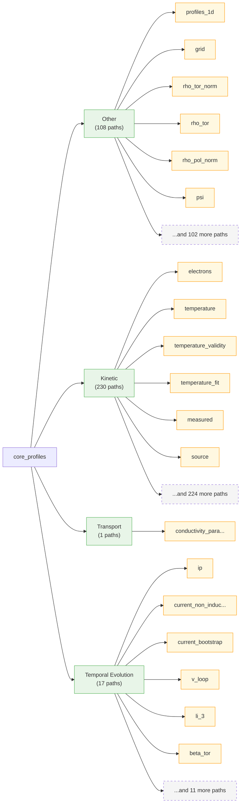

```mermaid
flowchart LR
    root["core_profiles"]

    d1["Other<br/>(108 paths)"]
    root --> d1
    p1_1["profiles_1d"]
    d1 --> p1_1
    class p1_1 pathNode
    p1_2["grid"]
    d1 --> p1_2
    class p1_2 pathNode
    p1_3["rho_tor_norm"]
    d1 --> p1_3
    class p1_3 pathNode
    p1_4["rho_tor"]
    d1 --> p1_4
    class p1_4 pathNode
    p1_5["rho_pol_norm"]
    d1 --> p1_5
    class p1_5 pathNode
    p1_6["psi"]
    d1 --> p1_6
    class p1_6 pathNode
    more1["...and 102 more paths"]
    d1 --> more1
    class more1 moreNode
    class d1 domainNode
    d2["Kinetic<br/>(230 paths)"]
    root --> d2
    p2_1["electrons"]
    d2 --> p2_1
    class p2_1 pathNode
    p2_2["temperature"]
    d2 --> p2_2
    class p2_2 pathNode
    p2_3["temperature_validity"]
    d2 --> p2_3
    class p2_3 pathNode
    p2_4["temperature_fit"]
    d2 --> p2_4
    class p2_4 pathNode
    p2_5["measured"]
    d2 --> p2_5
    class p2_5 pathNode
    p2_6["source"]
    d2 --> p2_6
    class p2_6 pathNode
    more2["...and 224 more paths"]
    d2 --> more2
    class more2 moreNode
    class d2 domainNode
    d3["Transport<br/>(1 paths)"]
    root --> d3
    p3_1["conductivity_para..."]
    d3 --> p3_1
    class p3_1 pathNode
    class d3 domainNode
    d4["Temporal Evolution<br/>(17 paths)"]
    root --> d4
    p4_1["ip"]
    d4 --> p4_1
    class p4_1 pathNode
    p4_2["current_non_induc..."]
    d4 --> p4_2
    class p4_2 pathNode
    p4_3["current_bootstrap"]
    d4 --> p4_3
    class p4_3 pathNode
    p4_4["v_loop"]
    d4 --> p4_4
    class p4_4 pathNode
    p4_5["li_3"]
    d4 --> p4_5
    class p4_5 pathNode
    p4_6["beta_tor"]
    d4 --> p4_6
    class p4_6 pathNode
    more4["...and 11 more paths"]
    d4 --> more4
    class more4 moreNode
    class d4 domainNode

    classDef domainNode fill:#e8f5e8,stroke:#4caf50
    classDef pathNode fill:#fff8e1,stroke:#ff9800
    classDef moreNode fill:#f5f5f5,stroke-dasharray: 5 5
```