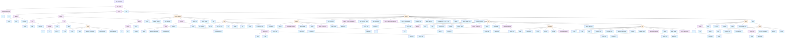

```mermaid
flowchart TD
    root["core_sources IDS"]

    n1[core_sources]
    root --> n1
    class n1 normalNode
    n2[vacuum_toroidal_field]
    n1 --> n2
    class n2 normalNode
    n3[r0]
    n2 --> n3
    class n3 leafNode
    n4[b0]
    n2 --> n4
    class n4 leafNode
    n5[source]
    n1 --> n5
    class n5 normalNode
    n6[identifier]
    n5 --> n6
    class n6 normalNode
    n7[name]
    n6 --> n7
    class n7 leafNode
    n8[index]
    n6 --> n8
    class n8 leafNode
    n9[description]
    n6 --> n9
    class n9 leafNode
    n10[species]
    n5 --> n10
    class n10 normalNode
    n11[type]
    n10 --> n11
    class n11 normalNode
    n12[name]
    n11 --> n12
    class n12 leafNode
    n13[index]
    n11 --> n13
    class n13 leafNode
    n14[description]
    n11 --> n14
    class n14 leafNode
    n15[ion]
    n10 --> n15
    class n15 normalNode
    n16[element]
    n15 --> n16
    class n16 normalNode
    n17[a]
    n16 --> n17
    class n17 leafNode
    n18[z_n]
    n16 --> n18
    class n18 leafNode
    n19[atoms_n]
    n16 --> n19
    class n19 leafNode
    n20[z_ion]
    n15 --> n20
    class n20 leafNode
    n21[name]
    n15 --> n21
    class n21 leafNode
    n22(state)
    n15 --> n22
    class n22 complexNode
    n23[z_min]
    n22 --> n23
    class n23 leafNode
    n24[z_max]
    n22 --> n24
    class n24 leafNode
    n25[name]
    n22 --> n25
    class n25 leafNode
    n26[electron_configuration]
    n22 --> n26
    class n26 leafNode
    n27[vibrational_level]
    n22 --> n27
    class n27 leafNode
    n28[vibrational_mode]
    n22 --> n28
    class n28 leafNode
    n29[neutral]
    n10 --> n29
    class n29 normalNode
    n30[element]
    n29 --> n30
    class n30 normalNode
    n31[a]
    n30 --> n31
    class n31 leafNode
    n32[z_n]
    n30 --> n32
    class n32 leafNode
    n33[atoms_n]
    n30 --> n33
    class n33 leafNode
    n34[name]
    n29 --> n34
    class n34 leafNode
    n35[state]
    n29 --> n35
    class n35 normalNode
    n36[name]
    n35 --> n36
    class n36 leafNode
    n37[electron_configuration]
    n35 --> n37
    class n37 leafNode
    n38[vibrational_level]
    n35 --> n38
    class n38 leafNode
    n39[vibrational_mode]
    n35 --> n39
    class n39 leafNode
    n40[neutral_type]
    n35 --> n40
    class n40 normalNode
    n41[name]
    n40 --> n41
    class n41 leafNode
    n42[index]
    n40 --> n42
    class n42 leafNode
    n43[description]
    n40 --> n43
    class n43 leafNode
    n44(global_quantities)
    n5 --> n44
    class n44 complexNode
    n45[power]
    n44 --> n45
    class n45 leafNode
    n46[total_ion_particles]
    n44 --> n46
    class n46 leafNode
    n47[total_ion_power]
    n44 --> n47
    class n47 leafNode
    n48[electrons]
    n44 --> n48
    class n48 normalNode
    n49[particles]
    n48 --> n49
    class n49 leafNode
    n50[power]
    n48 --> n50
    class n50 leafNode
    n51[torque_phi]
    n44 --> n51
    class n51 leafNode
    n52[current_parallel]
    n44 --> n52
    class n52 leafNode
    n53[time]
    n44 --> n53
    class n53 leafNode
    n54(profiles_1d)
    n5 --> n54
    class n54 complexNode
    n55(grid)
    n54 --> n55
    class n55 complexNode
    n56[rho_tor_norm]
    n55 --> n56
    class n56 leafNode
    n57[rho_tor]
    n55 --> n57
    class n57 leafNode
    n58[rho_pol_norm]
    n55 --> n58
    class n58 leafNode
    n59[psi]
    n55 --> n59
    class n59 leafNode
    n60[volume]
    n55 --> n60
    class n60 leafNode
    n61[area]
    n55 --> n61
    class n61 leafNode
    n62[surface]
    n55 --> n62
    class n62 leafNode
    n63[psi_magnetic_axis]
    n55 --> n63
    class n63 leafNode
    n64[psi_boundary]
    n55 --> n64
    class n64 leafNode
    n65(electrons)
    n54 --> n65
    class n65 complexNode
    n66[particles]
    n65 --> n66
    class n66 leafNode
    n67[particles_decomposed]
    n65 --> n67
    class n67 normalNode
    n68[implicit_part]
    n67 --> n68
    class n68 leafNode
    n69[explicit_part]
    n67 --> n69
    class n69 leafNode
    n70[particles_inside]
    n65 --> n70
    class n70 leafNode
    n71[energy]
    n65 --> n71
    class n71 leafNode
    n72[energy_decomposed]
    n65 --> n72
    class n72 normalNode
    n73[implicit_part]
    n72 --> n73
    class n73 leafNode
    n74[explicit_part]
    n72 --> n74
    class n74 leafNode
    n75[power_inside]
    n65 --> n75
    class n75 leafNode
    n76[total_ion_energy]
    n54 --> n76
    class n76 leafNode
    n77[total_ion_energy_decomposed]
    n54 --> n77
    class n77 normalNode
    n78[implicit_part]
    n77 --> n78
    class n78 leafNode
    n79[explicit_part]
    n77 --> n79
    class n79 leafNode
    n80[total_ion_power_inside]
    n54 --> n80
    class n80 leafNode
    n81[total_ion_particles]
    n54 --> n81
    class n81 leafNode
    n82[total_ion_particles_decomposed]
    n54 --> n82
    class n82 normalNode
    n83[implicit_part]
    n82 --> n83
    class n83 leafNode
    n84[explicit_part]
    n82 --> n84
    class n84 leafNode
    n85[total_ion_particles_inside]
    n54 --> n85
    class n85 leafNode
    n86[momentum_phi]
    n54 --> n86
    class n86 leafNode
    n87[torque_phi_inside]
    n54 --> n87
    class n87 leafNode
    n88[momentum_phi_j_cross_b_field]
    n54 --> n88
    class n88 leafNode
    n89[j_parallel]
    n54 --> n89
    class n89 leafNode
    n90[current_parallel_inside]
    n54 --> n90
    class n90 leafNode
    n91[conductivity_parallel]
    n54 --> n91
    class n91 leafNode
    n92(ion)
    n54 --> n92
    class n92 complexNode
    n93[element]
    n92 --> n93
    class n93 normalNode
    n94[a]
    n93 --> n94
    class n94 leafNode
    n95[z_n]
    n93 --> n95
    class n95 leafNode
    n96[atoms_n]
    n93 --> n96
    class n96 leafNode
    n97[z_ion]
    n92 --> n97
    class n97 leafNode
    n98[name]
    n92 --> n98
    class n98 leafNode
    n99[neutral_index]
    n92 --> n99
    class n99 leafNode
    n100[particles]
    n92 --> n100
    class n100 leafNode
    n101[particles_inside]
    n92 --> n101
    class n101 leafNode
    n102[particles_decomposed]
    n92 --> n102
    class n102 normalNode
    n103[implicit_part]
    n102 --> n103
    class n103 leafNode
    n104[explicit_part]
    n102 --> n104
    class n104 leafNode
    n105[energy]
    n92 --> n105
    class n105 leafNode
    n106[power_inside]
    n92 --> n106
    class n106 leafNode
    n107[energy_decomposed]
    n92 --> n107
    class n107 normalNode
    n108[implicit_part]
    n107 --> n108
    class n108 leafNode
    n109[explicit_part]
    n107 --> n109
    class n109 leafNode
    n110(momentum)
    n92 --> n110
    class n110 complexNode
    n111[radial]
    n110 --> n111
    class n111 leafNode
    n112[diamagnetic]
    n110 --> n112
    class n112 leafNode
    n113[parallel]
    n110 --> n113
    class n113 leafNode
    n114[poloidal]
    n110 --> n114
    class n114 leafNode
    n115[toroidal]
    n110 --> n115
    class n115 leafNode
    n116[toroidal_decomposed]
    n110 --> n116
    class n116 normalNode
    n117[implicit_part]
    n116 --> n117
    class n117 leafNode
    n118[explicit_part]
    n116 --> n118
    class n118 leafNode
    n119[multiple_states_flag]
    n92 --> n119
    class n119 leafNode
    n120(state)
    n92 --> n120
    class n120 complexNode
    n121[z_min]
    n120 --> n121
    class n121 leafNode
    n122[z_max]
    n120 --> n122
    class n122 leafNode
    n123[name]
    n120 --> n123
    class n123 leafNode
    n124[vibrational_level]
    n120 --> n124
    class n124 leafNode
    n125[vibrational_mode]
    n120 --> n125
    class n125 leafNode
    n126[electron_configuration]
    n120 --> n126
    class n126 leafNode
    n127[particles]
    n120 --> n127
    class n127 leafNode
    n128[particles_inside]
    n120 --> n128
    class n128 leafNode
    n129[particles_decomposed]
    n120 --> n129
    class n129 normalNode
    n130[implicit_part]
    n129 --> n130
    class n130 leafNode
    n131[explicit_part]
    n129 --> n131
    class n131 leafNode
    n132[energy]
    n120 --> n132
    class n132 leafNode
    n133[power_inside]
    n120 --> n133
    class n133 leafNode
    n134[energy_decomposed]
    n120 --> n134
    class n134 normalNode
    n135[implicit_part]
    n134 --> n135
    class n135 leafNode
    n136[explicit_part]
    n134 --> n136
    class n136 leafNode
    n137(neutral)
    n54 --> n137
    class n137 complexNode
    n138[element]
    n137 --> n138
    class n138 normalNode
    n139[a]
    n138 --> n139
    class n139 leafNode
    n140[z_n]
    n138 --> n140
    class n140 leafNode
    n141[atoms_n]
    n138 --> n141
    class n141 leafNode
    n142[name]
    n137 --> n142
    class n142 leafNode
    n143[ion_index]
    n137 --> n143
    class n143 leafNode
    n144[particles]
    n137 --> n144
    class n144 leafNode
    n145[energy]
    n137 --> n145
    class n145 leafNode
    n146[multiple_states_flag]
    n137 --> n146
    class n146 leafNode
    n147(state)
    n137 --> n147
    class n147 complexNode
    n148[name]
    n147 --> n148
    class n148 leafNode
    n149[vibrational_level]
    n147 --> n149
    class n149 leafNode
    n150[vibrational_mode]
    n147 --> n150
    class n150 leafNode
    n151[neutral_type]
    n147 --> n151
    class n151 normalNode
    n152[name]
    n151 --> n152
    class n152 leafNode
    n153[index]
    n151 --> n153
    class n153 leafNode
    n154[description]
    n151 --> n154
    class n154 leafNode
    n155[electron_configuration]
    n147 --> n155
    class n155 leafNode
    n156[particles]
    n147 --> n156
    class n156 leafNode
    n157[energy]
    n147 --> n157
    class n157 leafNode
    n158[time]
    n54 --> n158
    class n158 leafNode
    n159[time]
    n1 --> n159
    class n159 leafNode

    classDef leafNode fill:#e1f5fe
    classDef complexNode fill:#fff3e0
    classDef normalNode fill:#f3e5f5
    classDef moreNode fill:#f5f5f5,stroke-dasharray: 5 5
```