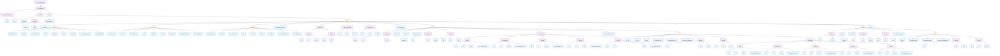

```mermaid
flowchart TD
    root["core_transport IDS"]

    n1[core_transport]
    root --> n1
    class n1 normalNode
    n2[vacuum_toroidal_field]
    n1 --> n2
    class n2 normalNode
    n3[r0]
    n2 --> n3
    class n3 leafNode
    n4[b0]
    n2 --> n4
    class n4 leafNode
    n5[model]
    n1 --> n5
    class n5 normalNode
    n6[comment]
    n5 --> n6
    class n6 leafNode
    n7[identifier]
    n5 --> n7
    class n7 normalNode
    n8[name]
    n7 --> n8
    class n8 leafNode
    n9[index]
    n7 --> n9
    class n9 leafNode
    n10[description]
    n7 --> n10
    class n10 leafNode
    n11[flux_multiplier]
    n5 --> n11
    class n11 leafNode
    n12(profiles_1d)
    n5 --> n12
    class n12 complexNode
    n13(grid_d)
    n12 --> n13
    class n13 complexNode
    n14[rho_tor_norm]
    n13 --> n14
    class n14 leafNode
    n15[rho_tor]
    n13 --> n15
    class n15 leafNode
    n16[rho_pol_norm]
    n13 --> n16
    class n16 leafNode
    n17[psi]
    n13 --> n17
    class n17 leafNode
    n18[volume]
    n13 --> n18
    class n18 leafNode
    n19[area]
    n13 --> n19
    class n19 leafNode
    n20[surface]
    n13 --> n20
    class n20 leafNode
    n21[psi_magnetic_axis]
    n13 --> n21
    class n21 leafNode
    n22[psi_boundary]
    n13 --> n22
    class n22 leafNode
    n23(grid_v)
    n12 --> n23
    class n23 complexNode
    n24[rho_tor_norm]
    n23 --> n24
    class n24 leafNode
    n25[rho_tor]
    n23 --> n25
    class n25 leafNode
    n26[rho_pol_norm]
    n23 --> n26
    class n26 leafNode
    n27[psi]
    n23 --> n27
    class n27 leafNode
    n28[volume]
    n23 --> n28
    class n28 leafNode
    n29[area]
    n23 --> n29
    class n29 leafNode
    n30[surface]
    n23 --> n30
    class n30 leafNode
    n31[psi_magnetic_axis]
    n23 --> n31
    class n31 leafNode
    n32[psi_boundary]
    n23 --> n32
    class n32 leafNode
    n33(grid_flux)
    n12 --> n33
    class n33 complexNode
    n34[rho_tor_norm]
    n33 --> n34
    class n34 leafNode
    n35[rho_tor]
    n33 --> n35
    class n35 leafNode
    n36[rho_pol_norm]
    n33 --> n36
    class n36 leafNode
    n37[psi]
    n33 --> n37
    class n37 leafNode
    n38[volume]
    n33 --> n38
    class n38 leafNode
    n39[area]
    n33 --> n39
    class n39 leafNode
    n40[surface]
    n33 --> n40
    class n40 leafNode
    n41[psi_magnetic_axis]
    n33 --> n41
    class n41 leafNode
    n42[psi_boundary]
    n33 --> n42
    class n42 leafNode
    n43[conductivity_parallel]
    n12 --> n43
    class n43 leafNode
    n44[electrons]
    n12 --> n44
    class n44 normalNode
    n45[particles]
    n44 --> n45
    class n45 normalNode
    n46[d]
    n45 --> n46
    class n46 leafNode
    n47[v]
    n45 --> n47
    class n47 leafNode
    n48[flux]
    n45 --> n48
    class n48 leafNode
    n49[energy]
    n44 --> n49
    class n49 normalNode
    n50[d]
    n49 --> n50
    class n50 leafNode
    n51[v]
    n49 --> n51
    class n51 leafNode
    n52[flux]
    n49 --> n52
    class n52 leafNode
    n53[total_ion_energy]
    n12 --> n53
    class n53 normalNode
    n54[d]
    n53 --> n54
    class n54 leafNode
    n55[v]
    n53 --> n55
    class n55 leafNode
    n56[flux]
    n53 --> n56
    class n56 leafNode
    n57[momentum_phi]
    n12 --> n57
    class n57 normalNode
    n58[d]
    n57 --> n58
    class n58 leafNode
    n59[v]
    n57 --> n59
    class n59 leafNode
    n60[flux]
    n57 --> n60
    class n60 leafNode
    n61[e_field_radial]
    n12 --> n61
    class n61 leafNode
    n62(ion)
    n12 --> n62
    class n62 complexNode
    n63[element]
    n62 --> n63
    class n63 normalNode
    n64[a]
    n63 --> n64
    class n64 leafNode
    n65[z_n]
    n63 --> n65
    class n65 leafNode
    n66[atoms_n]
    n63 --> n66
    class n66 leafNode
    n67[z_ion]
    n62 --> n67
    class n67 leafNode
    n68[name]
    n62 --> n68
    class n68 leafNode
    n69[neutral_index]
    n62 --> n69
    class n69 leafNode
    n70[particles]
    n62 --> n70
    class n70 normalNode
    n71[d]
    n70 --> n71
    class n71 leafNode
    n72[v]
    n70 --> n72
    class n72 leafNode
    n73[flux]
    n70 --> n73
    class n73 leafNode
    n74[energy]
    n62 --> n74
    class n74 normalNode
    n75[d]
    n74 --> n75
    class n75 leafNode
    n76[v]
    n74 --> n76
    class n76 leafNode
    n77[flux]
    n74 --> n77
    class n77 leafNode
    n78[momentum]
    n62 --> n78
    class n78 normalNode
    n79[radial]
    n78 --> n79
    class n79 normalNode
    n80[d]
    n79 --> n80
    class n80 leafNode
    n81[v]
    n79 --> n81
    class n81 leafNode
    n82[flux]
    n79 --> n82
    class n82 leafNode
    n83[flow_damping_rate]
    n79 --> n83
    class n83 leafNode
    n84[diamagnetic]
    n78 --> n84
    class n84 normalNode
    n85[d]
    n84 --> n85
    class n85 leafNode
    n86[v]
    n84 --> n86
    class n86 leafNode
    n87[flux]
    n84 --> n87
    class n87 leafNode
    n88[flow_damping_rate]
    n84 --> n88
    class n88 leafNode
    n89[parallel]
    n78 --> n89
    class n89 normalNode
    n90[d]
    n89 --> n90
    class n90 leafNode
    n91[v]
    n89 --> n91
    class n91 leafNode
    n92[flux]
    n89 --> n92
    class n92 leafNode
    n93[flow_damping_rate]
    n89 --> n93
    class n93 leafNode
    n94[poloidal]
    n78 --> n94
    class n94 normalNode
    n95[d]
    n94 --> n95
    class n95 leafNode
    n96[v]
    n94 --> n96
    class n96 leafNode
    n97[flux]
    n94 --> n97
    class n97 leafNode
    n98[flow_damping_rate]
    n94 --> n98
    class n98 leafNode
    n99[toroidal]
    n78 --> n99
    class n99 normalNode
    n100[d]
    n99 --> n100
    class n100 leafNode
    n101[v]
    n99 --> n101
    class n101 leafNode
    n102[flux]
    n99 --> n102
    class n102 leafNode
    n103[flow_damping_rate]
    n99 --> n103
    class n103 leafNode
    n104[multiple_states_flag]
    n62 --> n104
    class n104 leafNode
    n105(state)
    n62 --> n105
    class n105 complexNode
    n106[z_min]
    n105 --> n106
    class n106 leafNode
    n107[z_max]
    n105 --> n107
    class n107 leafNode
    n108[name]
    n105 --> n108
    class n108 leafNode
    n109[vibrational_level]
    n105 --> n109
    class n109 leafNode
    n110[vibrational_mode]
    n105 --> n110
    class n110 leafNode
    n111[electron_configuration]
    n105 --> n111
    class n111 leafNode
    n112[particles]
    n105 --> n112
    class n112 normalNode
    n113[d]
    n112 --> n113
    class n113 leafNode
    n114[v]
    n112 --> n114
    class n114 leafNode
    n115[flux]
    n112 --> n115
    class n115 leafNode
    n116[energy]
    n105 --> n116
    class n116 normalNode
    n117[d]
    n116 --> n117
    class n117 leafNode
    n118[v]
    n116 --> n118
    class n118 leafNode
    n119[flux]
    n116 --> n119
    class n119 leafNode
    n120[momentum]
    n105 --> n120
    class n120 normalNode
    n121[radial]
    n120 --> n121
    class n121 normalNode
    n122[d]
    n121 --> n122
    class n122 leafNode
    n123[v]
    n121 --> n123
    class n123 leafNode
    n124[flux]
    n121 --> n124
    class n124 leafNode
    n125[flow_damping_rate]
    n121 --> n125
    class n125 leafNode
    n126[diamagnetic]
    n120 --> n126
    class n126 normalNode
    n127[d]
    n126 --> n127
    class n127 leafNode
    n128[v]
    n126 --> n128
    class n128 leafNode
    n129[flux]
    n126 --> n129
    class n129 leafNode
    n130[flow_damping_rate]
    n126 --> n130
    class n130 leafNode
    n131[parallel]
    n120 --> n131
    class n131 normalNode
    n132[d]
    n131 --> n132
    class n132 leafNode
    n133[v]
    n131 --> n133
    class n133 leafNode
    n134[flux]
    n131 --> n134
    class n134 leafNode
    n135[flow_damping_rate]
    n131 --> n135
    class n135 leafNode
    n136[poloidal]
    n120 --> n136
    class n136 normalNode
    n137[d]
    n136 --> n137
    class n137 leafNode
    n138[v]
    n136 --> n138
    class n138 leafNode
    n139[flux]
    n136 --> n139
    class n139 leafNode
    n140[flow_damping_rate]
    n136 --> n140
    class n140 leafNode
    n141[toroidal]
    n120 --> n141
    class n141 normalNode
    n142[d]
    n141 --> n142
    class n142 leafNode
    n143[v]
    n141 --> n143
    class n143 leafNode
    n144[flux]
    n141 --> n144
    class n144 leafNode
    n145[flow_damping_rate]
    n141 --> n145
    class n145 leafNode
    n146(neutral)
    n12 --> n146
    class n146 complexNode
    n147[element]
    n146 --> n147
    class n147 normalNode
    n148[a]
    n147 --> n148
    class n148 leafNode
    n149[z_n]
    n147 --> n149
    class n149 leafNode
    n150[atoms_n]
    n147 --> n150
    class n150 leafNode
    n151[name]
    n146 --> n151
    class n151 leafNode
    n152[ion_index]
    n146 --> n152
    class n152 leafNode
    n153[particles]
    n146 --> n153
    class n153 normalNode
    n154[d]
    n153 --> n154
    class n154 leafNode
    n155[v]
    n153 --> n155
    class n155 leafNode
    n156[flux]
    n153 --> n156
    class n156 leafNode
    n157[energy]
    n146 --> n157
    class n157 normalNode
    n158[d]
    n157 --> n158
    class n158 leafNode
    n159[v]
    n157 --> n159
    class n159 leafNode
    n160[flux]
    n157 --> n160
    class n160 leafNode
    n161[multiple_states_flag]
    n146 --> n161
    class n161 leafNode
    n162(state)
    n146 --> n162
    class n162 complexNode
    n163[name]
    n162 --> n163
    class n163 leafNode
    n164[vibrational_level]
    n162 --> n164
    class n164 leafNode
    n165[vibrational_mode]
    n162 --> n165
    class n165 leafNode
    n166[electron_configuration]
    n162 --> n166
    class n166 leafNode
    n167[particles]
    n162 --> n167
    class n167 normalNode
    n168[d]
    n167 --> n168
    class n168 leafNode
    n169[v]
    n167 --> n169
    class n169 leafNode
    n170[flux]
    n167 --> n170
    class n170 leafNode
    n171[energy]
    n162 --> n171
    class n171 normalNode
    n172[d]
    n171 --> n172
    class n172 leafNode
    n173[v]
    n171 --> n173
    class n173 leafNode
    n174[flux]
    n171 --> n174
    class n174 leafNode
    n175[time]
    n12 --> n175
    class n175 leafNode
    n176[time]
    n1 --> n176
    class n176 leafNode

    classDef leafNode fill:#e1f5fe
    classDef complexNode fill:#fff3e0
    classDef normalNode fill:#f3e5f5
    classDef moreNode fill:#f5f5f5,stroke-dasharray: 5 5
```