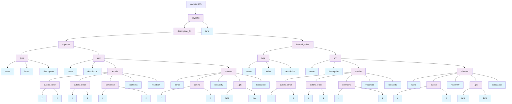

```mermaid
flowchart TD
    root["cryostat IDS"]

    n1[cryostat]
    root --> n1
    class n1 normalNode
    n2[description_2d]
    n1 --> n2
    class n2 normalNode
    n3[cryostat]
    n2 --> n3
    class n3 normalNode
    n4[type]
    n3 --> n4
    class n4 normalNode
    n5[name]
    n4 --> n5
    class n5 leafNode
    n6[index]
    n4 --> n6
    class n6 leafNode
    n7[description]
    n4 --> n7
    class n7 leafNode
    n8[unit]
    n3 --> n8
    class n8 normalNode
    n9[name]
    n8 --> n9
    class n9 leafNode
    n10[description]
    n8 --> n10
    class n10 leafNode
    n11[annular]
    n8 --> n11
    class n11 normalNode
    n12[outline_inner]
    n11 --> n12
    class n12 normalNode
    n13[r]
    n12 --> n13
    class n13 leafNode
    n14[z]
    n12 --> n14
    class n14 leafNode
    n15[outline_outer]
    n11 --> n15
    class n15 normalNode
    n16[r]
    n15 --> n16
    class n16 leafNode
    n17[z]
    n15 --> n17
    class n17 leafNode
    n18[centreline]
    n11 --> n18
    class n18 normalNode
    n19[r]
    n18 --> n19
    class n19 leafNode
    n20[z]
    n18 --> n20
    class n20 leafNode
    n21[thickness]
    n11 --> n21
    class n21 leafNode
    n22[resistivity]
    n11 --> n22
    class n22 leafNode
    n23[element]
    n8 --> n23
    class n23 normalNode
    n24[name]
    n23 --> n24
    class n24 leafNode
    n25[outline]
    n23 --> n25
    class n25 normalNode
    n26[r]
    n25 --> n26
    class n26 leafNode
    n27[z]
    n25 --> n27
    class n27 leafNode
    n28[resistivity]
    n23 --> n28
    class n28 leafNode
    n29[j_phi]
    n23 --> n29
    class n29 normalNode
    n30[data]
    n29 --> n30
    class n30 leafNode
    n31[time]
    n29 --> n31
    class n31 leafNode
    n32[resistance]
    n23 --> n32
    class n32 leafNode
    n33[thermal_shield]
    n2 --> n33
    class n33 normalNode
    n34[type]
    n33 --> n34
    class n34 normalNode
    n35[name]
    n34 --> n35
    class n35 leafNode
    n36[index]
    n34 --> n36
    class n36 leafNode
    n37[description]
    n34 --> n37
    class n37 leafNode
    n38[unit]
    n33 --> n38
    class n38 normalNode
    n39[name]
    n38 --> n39
    class n39 leafNode
    n40[description]
    n38 --> n40
    class n40 leafNode
    n41[annular]
    n38 --> n41
    class n41 normalNode
    n42[outline_inner]
    n41 --> n42
    class n42 normalNode
    n43[r]
    n42 --> n43
    class n43 leafNode
    n44[z]
    n42 --> n44
    class n44 leafNode
    n45[outline_outer]
    n41 --> n45
    class n45 normalNode
    n46[r]
    n45 --> n46
    class n46 leafNode
    n47[z]
    n45 --> n47
    class n47 leafNode
    n48[centreline]
    n41 --> n48
    class n48 normalNode
    n49[r]
    n48 --> n49
    class n49 leafNode
    n50[z]
    n48 --> n50
    class n50 leafNode
    n51[thickness]
    n41 --> n51
    class n51 leafNode
    n52[resistivity]
    n41 --> n52
    class n52 leafNode
    n53[element]
    n38 --> n53
    class n53 normalNode
    n54[name]
    n53 --> n54
    class n54 leafNode
    n55[outline]
    n53 --> n55
    class n55 normalNode
    n56[r]
    n55 --> n56
    class n56 leafNode
    n57[z]
    n55 --> n57
    class n57 leafNode
    n58[resistivity]
    n53 --> n58
    class n58 leafNode
    n59[j_phi]
    n53 --> n59
    class n59 normalNode
    n60[data]
    n59 --> n60
    class n60 leafNode
    n61[time]
    n59 --> n61
    class n61 leafNode
    n62[resistance]
    n53 --> n62
    class n62 leafNode
    n63[time]
    n1 --> n63
    class n63 leafNode

    classDef leafNode fill:#e1f5fe
    classDef complexNode fill:#fff3e0
    classDef normalNode fill:#f3e5f5
    classDef moreNode fill:#f5f5f5,stroke-dasharray: 5 5
```