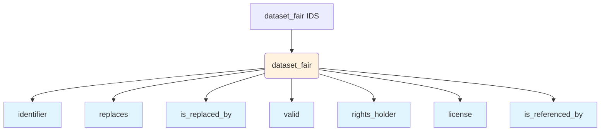

```mermaid
flowchart TD
    root["dataset_fair IDS"]

    n1(dataset_fair)
    root --> n1
    class n1 complexNode
    n2[identifier]
    n1 --> n2
    class n2 leafNode
    n3[replaces]
    n1 --> n3
    class n3 leafNode
    n4[is_replaced_by]
    n1 --> n4
    class n4 leafNode
    n5[valid]
    n1 --> n5
    class n5 leafNode
    n6[rights_holder]
    n1 --> n6
    class n6 leafNode
    n7[license]
    n1 --> n7
    class n7 leafNode
    n8[is_referenced_by]
    n1 --> n8
    class n8 leafNode

    classDef leafNode fill:#e1f5fe
    classDef complexNode fill:#fff3e0
    classDef normalNode fill:#f3e5f5
    classDef moreNode fill:#f5f5f5,stroke-dasharray: 5 5
```