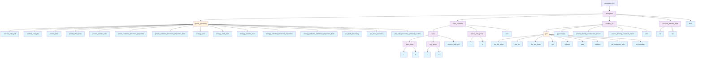

```mermaid
flowchart TD
    root["disruption IDS"]

    n1[disruption]
    root --> n1
    class n1 normalNode
    n2(global_quantities)
    n1 --> n2
    class n2 complexNode
    n3[current_halo_pol]
    n2 --> n3
    class n3 leafNode
    n4[current_halo_phi]
    n2 --> n4
    class n4 leafNode
    n5[power_ohm]
    n2 --> n5
    class n5 leafNode
    n6[power_ohm_halo]
    n2 --> n6
    class n6 leafNode
    n7[power_parallel_halo]
    n2 --> n7
    class n7 leafNode
    n8[power_radiated_electrons_impurities]
    n2 --> n8
    class n8 leafNode
    n9[power_radiated_electrons_impurities_halo]
    n2 --> n9
    class n9 leafNode
    n10[energy_ohm]
    n2 --> n10
    class n10 leafNode
    n11[energy_ohm_halo]
    n2 --> n11
    class n11 leafNode
    n12[energy_parallel_halo]
    n2 --> n12
    class n12 leafNode
    n13[energy_radiated_electrons_impurities]
    n2 --> n13
    class n13 leafNode
    n14[energy_radiated_electrons_impurities_halo]
    n2 --> n14
    class n14 leafNode
    n15[psi_halo_boundary]
    n2 --> n15
    class n15 leafNode
    n16[phi_halo_boundary]
    n2 --> n16
    class n16 leafNode
    n17[phi_halo_boundary_poloidal_current]
    n2 --> n17
    class n17 leafNode
    n18[halo_currents]
    n1 --> n18
    class n18 normalNode
    n19[area]
    n18 --> n19
    class n19 normalNode
    n20[start_point]
    n19 --> n20
    class n20 normalNode
    n21[r]
    n20 --> n21
    class n21 leafNode
    n22[z]
    n20 --> n22
    class n22 leafNode
    n23[end_point]
    n19 --> n23
    class n23 normalNode
    n24[r]
    n23 --> n24
    class n24 leafNode
    n25[z]
    n23 --> n25
    class n25 leafNode
    n26[current_halo_pol]
    n19 --> n26
    class n26 leafNode
    n27[active_wall_point]
    n18 --> n27
    class n27 normalNode
    n28[r]
    n27 --> n28
    class n28 leafNode
    n29[z]
    n27 --> n29
    class n29 leafNode
    n30[time]
    n18 --> n30
    class n30 leafNode
    n31[profiles_1d]
    n1 --> n31
    class n31 normalNode
    n32(grid)
    n31 --> n32
    class n32 complexNode
    n33[rho_tor_norm]
    n32 --> n33
    class n33 leafNode
    n34[rho_tor]
    n32 --> n34
    class n34 leafNode
    n35[rho_pol_norm]
    n32 --> n35
    class n35 leafNode
    n36[psi]
    n32 --> n36
    class n36 leafNode
    n37[volume]
    n32 --> n37
    class n37 leafNode
    n38[area]
    n32 --> n38
    class n38 leafNode
    n39[surface]
    n32 --> n39
    class n39 leafNode
    n40[psi_magnetic_axis]
    n32 --> n40
    class n40 leafNode
    n41[psi_boundary]
    n32 --> n41
    class n41 leafNode
    n42[j_runaways]
    n31 --> n42
    class n42 leafNode
    n43[power_density_conductive_losses]
    n31 --> n43
    class n43 leafNode
    n44[power_density_radiative_losses]
    n31 --> n44
    class n44 leafNode
    n45[time]
    n31 --> n45
    class n45 leafNode
    n46[vacuum_toroidal_field]
    n1 --> n46
    class n46 normalNode
    n47[r0]
    n46 --> n47
    class n47 leafNode
    n48[b0]
    n46 --> n48
    class n48 leafNode
    n49[time]
    n1 --> n49
    class n49 leafNode

    classDef leafNode fill:#e1f5fe
    classDef complexNode fill:#fff3e0
    classDef normalNode fill:#f3e5f5
    classDef moreNode fill:#f5f5f5,stroke-dasharray: 5 5
```