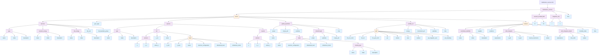

```mermaid
flowchart TD
    root["distribution_sources IDS"]

    n1[distribution_sources]
    root --> n1
    class n1 normalNode
    n2(source)
    n1 --> n2
    class n2 complexNode
    n3[process]
    n2 --> n3
    class n3 normalNode
    n4[type]
    n3 --> n4
    class n4 normalNode
    n5[name]
    n4 --> n5
    class n5 leafNode
    n6[index]
    n4 --> n6
    class n6 leafNode
    n7[description]
    n4 --> n7
    class n7 leafNode
    n8[reactant_energy]
    n3 --> n8
    class n8 normalNode
    n9[name]
    n8 --> n9
    class n9 leafNode
    n10[index]
    n8 --> n10
    class n10 leafNode
    n11[description]
    n8 --> n11
    class n11 leafNode
    n12[nbi_energy]
    n3 --> n12
    class n12 normalNode
    n13[name]
    n12 --> n13
    class n13 leafNode
    n14[index]
    n12 --> n14
    class n14 leafNode
    n15[description]
    n12 --> n15
    class n15 leafNode
    n16[nbi_unit]
    n3 --> n16
    class n16 leafNode
    n17[nbi_beamlets_group]
    n3 --> n17
    class n17 leafNode
    n18[gyro_type]
    n2 --> n18
    class n18 leafNode
    n19[species]
    n2 --> n19
    class n19 normalNode
    n20[type]
    n19 --> n20
    class n20 normalNode
    n21[name]
    n20 --> n21
    class n21 leafNode
    n22[index]
    n20 --> n22
    class n22 leafNode
    n23[description]
    n20 --> n23
    class n23 leafNode
    n24[ion]
    n19 --> n24
    class n24 normalNode
    n25[element]
    n24 --> n25
    class n25 normalNode
    n26[a]
    n25 --> n26
    class n26 leafNode
    n27[z_n]
    n25 --> n27
    class n27 leafNode
    n28[atoms_n]
    n25 --> n28
    class n28 leafNode
    n29[z_ion]
    n24 --> n29
    class n29 leafNode
    n30[name]
    n24 --> n30
    class n30 leafNode
    n31(state)
    n24 --> n31
    class n31 complexNode
    n32[z_min]
    n31 --> n32
    class n32 leafNode
    n33[z_max]
    n31 --> n33
    class n33 leafNode
    n34[name]
    n31 --> n34
    class n34 leafNode
    n35[electron_configuration]
    n31 --> n35
    class n35 leafNode
    n36[vibrational_level]
    n31 --> n36
    class n36 leafNode
    n37[vibrational_mode]
    n31 --> n37
    class n37 leafNode
    n38[neutral]
    n19 --> n38
    class n38 normalNode
    n39[element]
    n38 --> n39
    class n39 normalNode
    n40[a]
    n39 --> n40
    class n40 leafNode
    n41[z_n]
    n39 --> n41
    class n41 leafNode
    n42[atoms_n]
    n39 --> n42
    class n42 leafNode
    n43[name]
    n38 --> n43
    class n43 leafNode
    n44[state]
    n38 --> n44
    class n44 normalNode
    n45[name]
    n44 --> n45
    class n45 leafNode
    n46[electron_configuration]
    n44 --> n46
    class n46 leafNode
    n47[vibrational_level]
    n44 --> n47
    class n47 leafNode
    n48[vibrational_mode]
    n44 --> n48
    class n48 leafNode
    n49[neutral_type]
    n44 --> n49
    class n49 normalNode
    n50[name]
    n49 --> n50
    class n50 leafNode
    n51[index]
    n49 --> n51
    class n51 leafNode
    n52[description]
    n49 --> n52
    class n52 leafNode
    n53[global_quantities]
    n2 --> n53
    class n53 normalNode
    n54[power]
    n53 --> n54
    class n54 leafNode
    n55[torque_phi]
    n53 --> n55
    class n55 leafNode
    n56[particles]
    n53 --> n56
    class n56 leafNode
    n57[shinethrough]
    n53 --> n57
    class n57 normalNode
    n58[power]
    n57 --> n58
    class n58 leafNode
    n59[particles]
    n57 --> n59
    class n59 leafNode
    n60[torque_phi]
    n57 --> n60
    class n60 leafNode
    n61[time]
    n53 --> n61
    class n61 leafNode
    n62[profiles_1d]
    n2 --> n62
    class n62 normalNode
    n63(grid)
    n62 --> n63
    class n63 complexNode
    n64[rho_tor_norm]
    n63 --> n64
    class n64 leafNode
    n65[rho_tor]
    n63 --> n65
    class n65 leafNode
    n66[rho_pol_norm]
    n63 --> n66
    class n66 leafNode
    n67[psi]
    n63 --> n67
    class n67 leafNode
    n68[volume]
    n63 --> n68
    class n68 leafNode
    n69[area]
    n63 --> n69
    class n69 leafNode
    n70[surface]
    n63 --> n70
    class n70 leafNode
    n71[psi_magnetic_axis]
    n63 --> n71
    class n71 leafNode
    n72[psi_boundary]
    n63 --> n72
    class n72 leafNode
    n73[energy]
    n62 --> n73
    class n73 leafNode
    n74[momentum_phi]
    n62 --> n74
    class n74 leafNode
    n75[particles]
    n62 --> n75
    class n75 leafNode
    n76[time]
    n62 --> n76
    class n76 leafNode
    n77(markers)
    n2 --> n77
    class n77 complexNode
    n78[coordinate_identifier]
    n77 --> n78
    class n78 normalNode
    n79[name]
    n78 --> n79
    class n79 leafNode
    n80[index]
    n78 --> n80
    class n80 leafNode
    n81[description]
    n78 --> n81
    class n81 leafNode
    n82[weights]
    n77 --> n82
    class n82 leafNode
    n83[positions]
    n77 --> n83
    class n83 leafNode
    n84[orbit_integrals]
    n77 --> n84
    class n84 normalNode
    n85[expressions]
    n84 --> n85
    class n85 leafNode
    n86[n_phi]
    n84 --> n86
    class n86 leafNode
    n87[m_pol]
    n84 --> n87
    class n87 leafNode
    n88[bounce_harmonics]
    n84 --> n88
    class n88 leafNode
    n89[values]
    n84 --> n89
    class n89 leafNode
    n90[orbit_integrals_instant]
    n77 --> n90
    class n90 normalNode
    n91[expressions]
    n90 --> n91
    class n91 leafNode
    n92[time_orbit]
    n90 --> n92
    class n92 leafNode
    n93[values]
    n90 --> n93
    class n93 leafNode
    n94[toroidal_mode]
    n77 --> n94
    class n94 leafNode
    n95[time]
    n77 --> n95
    class n95 leafNode
    n96[vacuum_toroidal_field]
    n1 --> n96
    class n96 normalNode
    n97[r0]
    n96 --> n97
    class n97 leafNode
    n98[b0]
    n96 --> n98
    class n98 leafNode
    n99[magnetic_axis]
    n1 --> n99
    class n99 normalNode
    n100[r]
    n99 --> n100
    class n100 leafNode
    n101[z]
    n99 --> n101
    class n101 leafNode
    n102[time]
    n1 --> n102
    class n102 leafNode

    classDef leafNode fill:#e1f5fe
    classDef complexNode fill:#fff3e0
    classDef normalNode fill:#f3e5f5
    classDef moreNode fill:#f5f5f5,stroke-dasharray: 5 5
```