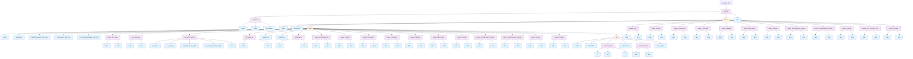

```mermaid
flowchart TD
    root["divertors IDS"]

    n1[divertors]
    root --> n1
    class n1 normalNode
    n2[midplane]
    n1 --> n2
    class n2 normalNode
    n3[name]
    n2 --> n3
    class n3 leafNode
    n4[index]
    n2 --> n4
    class n4 leafNode
    n5[description]
    n2 --> n5
    class n5 leafNode
    n6(divertor)
    n1 --> n6
    class n6 complexNode
    n7[name]
    n6 --> n7
    class n7 leafNode
    n8[description]
    n6 --> n8
    class n8 leafNode
    n9(target)
    n6 --> n9
    class n9 complexNode
    n10[name]
    n9 --> n10
    class n10 leafNode
    n11[description]
    n9 --> n11
    class n11 leafNode
    n12[heat_flux_steady_limit_max]
    n9 --> n12
    class n12 leafNode
    n13[temperature_limit_max]
    n9 --> n13
    class n13 leafNode
    n14[t_e_target_sputtering_limit_max]
    n9 --> n14
    class n14 leafNode
    n15[power_flux_peak]
    n9 --> n15
    class n15 normalNode
    n16[data]
    n15 --> n16
    class n16 leafNode
    n17[time]
    n15 --> n17
    class n17 leafNode
    n18[flux_expansion]
    n9 --> n18
    class n18 normalNode
    n19[data]
    n18 --> n19
    class n19 leafNode
    n20[time]
    n18 --> n20
    class n20 leafNode
    n21[two_point_model]
    n9 --> n21
    class n21 normalNode
    n22[t_e_target]
    n21 --> n22
    class n22 leafNode
    n23[n_e_target]
    n21 --> n23
    class n23 leafNode
    n24[sol_heat_decay_length]
    n21 --> n24
    class n24 leafNode
    n25[sol_heat_spreading_length]
    n21 --> n25
    class n25 leafNode
    n26[time]
    n21 --> n26
    class n26 leafNode
    n27[tilt_angle_pol]
    n9 --> n27
    class n27 normalNode
    n28[data]
    n27 --> n28
    class n28 leafNode
    n29[time]
    n27 --> n29
    class n29 leafNode
    n30[extension_r]
    n9 --> n30
    class n30 leafNode
    n31[extension_z]
    n9 --> n31
    class n31 leafNode
    n32[wetted_area]
    n9 --> n32
    class n32 normalNode
    n33[data]
    n32 --> n33
    class n33 leafNode
    n34[time]
    n32 --> n34
    class n34 leafNode
    n35[power_incident_fraction]
    n9 --> n35
    class n35 normalNode
    n36[data]
    n35 --> n36
    class n36 leafNode
    n37[time]
    n35 --> n37
    class n37 leafNode
    n38[power_incident]
    n9 --> n38
    class n38 normalNode
    n39[data]
    n38 --> n39
    class n39 leafNode
    n40[time]
    n38 --> n40
    class n40 leafNode
    n41[power_conducted]
    n9 --> n41
    class n41 normalNode
    n42[data]
    n41 --> n42
    class n42 leafNode
    n43[time]
    n41 --> n43
    class n43 leafNode
    n44[power_convected]
    n9 --> n44
    class n44 normalNode
    n45[data]
    n44 --> n45
    class n45 leafNode
    n46[time]
    n44 --> n46
    class n46 leafNode
    n47[power_radiated]
    n9 --> n47
    class n47 normalNode
    n48[data]
    n47 --> n48
    class n48 leafNode
    n49[time]
    n47 --> n49
    class n49 leafNode
    n50[power_black_body]
    n9 --> n50
    class n50 normalNode
    n51[data]
    n50 --> n51
    class n51 leafNode
    n52[time]
    n50 --> n52
    class n52 leafNode
    n53[power_neutrals]
    n9 --> n53
    class n53 normalNode
    n54[data]
    n53 --> n54
    class n54 leafNode
    n55[time]
    n53 --> n55
    class n55 leafNode
    n56[power_recombination_plasma]
    n9 --> n56
    class n56 normalNode
    n57[data]
    n56 --> n57
    class n57 leafNode
    n58[time]
    n56 --> n58
    class n58 leafNode
    n59[power_recombination_neutrals]
    n9 --> n59
    class n59 normalNode
    n60[data]
    n59 --> n60
    class n60 leafNode
    n61[time]
    n59 --> n61
    class n61 leafNode
    n62[power_currents]
    n9 --> n62
    class n62 normalNode
    n63[data]
    n62 --> n63
    class n63 leafNode
    n64[time]
    n62 --> n64
    class n64 leafNode
    n65[current_incident]
    n9 --> n65
    class n65 normalNode
    n66[data]
    n65 --> n66
    class n66 leafNode
    n67[time]
    n65 --> n67
    class n67 leafNode
    n68(tile)
    n9 --> n68
    class n68 complexNode
    n69[name]
    n68 --> n69
    class n69 leafNode
    n70[description]
    n68 --> n70
    class n70 leafNode
    n71[surface_outline]
    n68 --> n71
    class n71 normalNode
    n72[r]
    n71 --> n72
    class n72 leafNode
    n73[phi]
    n71 --> n73
    class n73 leafNode
    n74[z]
    n71 --> n74
    class n74 leafNode
    n75[surface_area]
    n68 --> n75
    class n75 leafNode
    n76[current_incident]
    n68 --> n76
    class n76 normalNode
    n77[data]
    n76 --> n77
    class n77 leafNode
    n78[time]
    n76 --> n78
    class n78 leafNode
    n79[shunt_index]
    n68 --> n79
    class n79 leafNode
    n80[wetted_area]
    n6 --> n80
    class n80 normalNode
    n81[data]
    n80 --> n81
    class n81 leafNode
    n82[time]
    n80 --> n82
    class n82 leafNode
    n83[power_incident]
    n6 --> n83
    class n83 normalNode
    n84[data]
    n83 --> n84
    class n84 leafNode
    n85[time]
    n83 --> n85
    class n85 leafNode
    n86[power_conducted]
    n6 --> n86
    class n86 normalNode
    n87[data]
    n86 --> n87
    class n87 leafNode
    n88[time]
    n86 --> n88
    class n88 leafNode
    n89[power_convected]
    n6 --> n89
    class n89 normalNode
    n90[data]
    n89 --> n90
    class n90 leafNode
    n91[time]
    n89 --> n91
    class n91 leafNode
    n92[power_radiated]
    n6 --> n92
    class n92 normalNode
    n93[data]
    n92 --> n93
    class n93 leafNode
    n94[time]
    n92 --> n94
    class n94 leafNode
    n95[power_black_body]
    n6 --> n95
    class n95 normalNode
    n96[data]
    n95 --> n96
    class n96 leafNode
    n97[time]
    n95 --> n97
    class n97 leafNode
    n98[power_neutrals]
    n6 --> n98
    class n98 normalNode
    n99[data]
    n98 --> n99
    class n99 leafNode
    n100[time]
    n98 --> n100
    class n100 leafNode
    n101[power_recombination_plasma]
    n6 --> n101
    class n101 normalNode
    n102[data]
    n101 --> n102
    class n102 leafNode
    n103[time]
    n101 --> n103
    class n103 leafNode
    n104[power_recombination_neutrals]
    n6 --> n104
    class n104 normalNode
    n105[data]
    n104 --> n105
    class n105 leafNode
    n106[time]
    n104 --> n106
    class n106 leafNode
    n107[power_currents]
    n6 --> n107
    class n107 normalNode
    n108[data]
    n107 --> n108
    class n108 leafNode
    n109[time]
    n107 --> n109
    class n109 leafNode
    n110[particle_flux_recycled_total]
    n6 --> n110
    class n110 normalNode
    n111[data]
    n110 --> n111
    class n111 leafNode
    n112[time]
    n110 --> n112
    class n112 leafNode
    n113[current_incident]
    n6 --> n113
    class n113 normalNode
    n114[data]
    n113 --> n114
    class n114 leafNode
    n115[time]
    n113 --> n115
    class n115 leafNode
    n116[time]
    n1 --> n116
    class n116 leafNode

    classDef leafNode fill:#e1f5fe
    classDef complexNode fill:#fff3e0
    classDef normalNode fill:#f3e5f5
    classDef moreNode fill:#f5f5f5,stroke-dasharray: 5 5
```