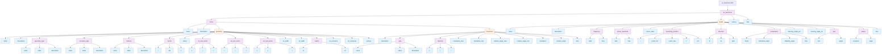

```mermaid
flowchart TD
    root["ec_launchers IDS"]

    n1[ec_launchers]
    root --> n1
    class n1 normalNode
    n2[mirror]
    n1 --> n2
    class n2 normalNode
    n3[name]
    n2 --> n3
    class n3 leafNode
    n4[description]
    n2 --> n4
    class n4 leafNode
    n5(geometry)
    n2 --> n5
    class n5 complexNode
    n6[name]
    n5 --> n6
    class n6 leafNode
    n7[description]
    n5 --> n7
    class n7 leafNode
    n8[geometry_type]
    n5 --> n8
    class n8 normalNode
    n9[name]
    n8 --> n9
    class n9 leafNode
    n10[index]
    n8 --> n10
    class n10 leafNode
    n11[description]
    n8 --> n11
    class n11 leafNode
    n12[curvature_type]
    n5 --> n12
    class n12 normalNode
    n13[name]
    n12 --> n13
    class n13 leafNode
    n14[index]
    n12 --> n14
    class n14 leafNode
    n15[description]
    n12 --> n15
    class n15 leafNode
    n16[material]
    n5 --> n16
    class n16 normalNode
    n17[name]
    n16 --> n17
    class n17 leafNode
    n18[index]
    n16 --> n18
    class n18 leafNode
    n19[description]
    n16 --> n19
    class n19 leafNode
    n20[centre]
    n5 --> n20
    class n20 normalNode
    n21[r]
    n20 --> n21
    class n21 leafNode
    n22[phi]
    n20 --> n22
    class n22 leafNode
    n23[z]
    n20 --> n23
    class n23 leafNode
    n24[radius]
    n5 --> n24
    class n24 leafNode
    n25[x1_unit_vector]
    n5 --> n25
    class n25 normalNode
    n26[x]
    n25 --> n26
    class n26 leafNode
    n27[y]
    n25 --> n27
    class n27 leafNode
    n28[z]
    n25 --> n28
    class n28 leafNode
    n29[x2_unit_vector]
    n5 --> n29
    class n29 normalNode
    n30[x]
    n29 --> n30
    class n30 leafNode
    n31[y]
    n29 --> n31
    class n31 leafNode
    n32[z]
    n29 --> n32
    class n32 leafNode
    n33[x3_unit_vector]
    n5 --> n33
    class n33 normalNode
    n34[x]
    n33 --> n34
    class n34 leafNode
    n35[y]
    n33 --> n35
    class n35 leafNode
    n36[z]
    n33 --> n36
    class n36 leafNode
    n37[x1_width]
    n5 --> n37
    class n37 leafNode
    n38[x2_width]
    n5 --> n38
    class n38 leafNode
    n39[outline]
    n5 --> n39
    class n39 normalNode
    n40[x1]
    n39 --> n40
    class n40 leafNode
    n41[x2]
    n39 --> n41
    class n41 leafNode
    n42[x1_curvature]
    n5 --> n42
    class n42 leafNode
    n43[x2_curvature]
    n5 --> n43
    class n43 leafNode
    n44[surface]
    n5 --> n44
    class n44 leafNode
    n45(movement)
    n2 --> n45
    class n45 complexNode
    n46[description]
    n45 --> n46
    class n46 leafNode
    n47[type]
    n45 --> n47
    class n47 normalNode
    n48[name]
    n47 --> n48
    class n48 leafNode
    n49[index]
    n47 --> n49
    class n49 leafNode
    n50[description]
    n47 --> n50
    class n50 leafNode
    n51[direction]
    n45 --> n51
    class n51 normalNode
    n52[x]
    n51 --> n52
    class n52 leafNode
    n53[y]
    n51 --> n53
    class n53 leafNode
    n54[z]
    n51 --> n54
    class n54 leafNode
    n55[translation_max]
    n45 --> n55
    class n55 leafNode
    n56[translation_min]
    n45 --> n56
    class n56 leafNode
    n57[rotation_angle_max]
    n45 --> n57
    class n57 leafNode
    n58[rotation_angle_min]
    n45 --> n58
    class n58 leafNode
    n59[translation]
    n45 --> n59
    class n59 leafNode
    n60[rotation_angle]
    n45 --> n60
    class n60 leafNode
    n61[time]
    n45 --> n61
    class n61 leafNode
    n62(beam)
    n1 --> n62
    class n62 complexNode
    n63[name]
    n62 --> n63
    class n63 leafNode
    n64[description]
    n62 --> n64
    class n64 leafNode
    n65[frequency]
    n62 --> n65
    class n65 normalNode
    n66[data]
    n65 --> n66
    class n66 leafNode
    n67[time]
    n65 --> n67
    class n67 leafNode
    n68[power_launched]
    n62 --> n68
    class n68 normalNode
    n69[data]
    n68 --> n69
    class n69 leafNode
    n70[time]
    n68 --> n70
    class n70 leafNode
    n71[mirror_index]
    n62 --> n71
    class n71 leafNode
    n72[launching_position]
    n62 --> n72
    class n72 normalNode
    n73[r]
    n72 --> n73
    class n73 leafNode
    n74[r_limit_min]
    n72 --> n74
    class n74 leafNode
    n75[r_limit_max]
    n72 --> n75
    class n75 leafNode
    n76[z]
    n72 --> n76
    class n76 leafNode
    n77[phi]
    n72 --> n77
    class n77 leafNode
    n78[direction]
    n62 --> n78
    class n78 normalNode
    n79[kr]
    n78 --> n79
    class n79 leafNode
    n80[kz]
    n78 --> n80
    class n80 leafNode
    n81[kphi]
    n78 --> n81
    class n81 leafNode
    n82[polarization]
    n62 --> n82
    class n82 normalNode
    n83[mode]
    n82 --> n83
    class n83 leafNode
    n84[azimuthal_angle]
    n82 --> n84
    class n84 leafNode
    n85[ellipticity_angle]
    n82 --> n85
    class n85 leafNode
    n86[time]
    n82 --> n86
    class n86 leafNode
    n87[steering_angle_pol]
    n62 --> n87
    class n87 leafNode
    n88[steering_angle_tor]
    n62 --> n88
    class n88 leafNode
    n89[spot]
    n62 --> n89
    class n89 normalNode
    n90[size]
    n89 --> n90
    class n90 leafNode
    n91[angle]
    n89 --> n91
    class n91 leafNode
    n92[phase]
    n62 --> n92
    class n92 normalNode
    n93[curvature]
    n92 --> n93
    class n93 leafNode
    n94[angle]
    n92 --> n94
    class n94 leafNode
    n95[time]
    n62 --> n95
    class n95 leafNode
    n96[latency]
    n1 --> n96
    class n96 leafNode
    n97[time]
    n1 --> n97
    class n97 leafNode

    classDef leafNode fill:#e1f5fe
    classDef complexNode fill:#fff3e0
    classDef normalNode fill:#f3e5f5
    classDef moreNode fill:#f5f5f5,stroke-dasharray: 5 5
```