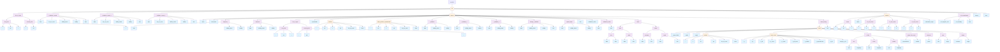

```mermaid
flowchart TD
    root["ece IDS"]

    n1(ece)
    root --> n1
    class n1 complexNode
    n2[line_of_sight]
    n1 --> n2
    class n2 normalNode
    n3[first_point]
    n2 --> n3
    class n3 normalNode
    n4[r]
    n3 --> n4
    class n4 leafNode
    n5[phi]
    n3 --> n5
    class n5 leafNode
    n6[z]
    n3 --> n6
    class n6 leafNode
    n7[second_point]
    n2 --> n7
    class n7 normalNode
    n8[r]
    n7 --> n8
    class n8 leafNode
    n9[phi]
    n7 --> n9
    class n9 leafNode
    n10[z]
    n7 --> n10
    class n10 leafNode
    n11[t_radiation_central]
    n1 --> n11
    class n11 normalNode
    n12[data]
    n11 --> n12
    class n12 leafNode
    n13[rho_tor_norm]
    n11 --> n13
    class n13 leafNode
    n14[validity_timed]
    n11 --> n14
    class n14 leafNode
    n15[validity]
    n11 --> n15
    class n15 leafNode
    n16[time]
    n11 --> n16
    class n16 leafNode
    n17[t_radiation_central_x]
    n1 --> n17
    class n17 normalNode
    n18[data]
    n17 --> n18
    class n18 leafNode
    n19[rho_tor_norm]
    n17 --> n19
    class n19 leafNode
    n20[validity_timed]
    n17 --> n20
    class n20 leafNode
    n21[validity]
    n17 --> n21
    class n21 leafNode
    n22[time]
    n17 --> n22
    class n22 leafNode
    n23[t_radiation_central_o]
    n1 --> n23
    class n23 normalNode
    n24[data]
    n23 --> n24
    class n24 leafNode
    n25[rho_tor_norm]
    n23 --> n25
    class n25 leafNode
    n26[validity_timed]
    n23 --> n26
    class n26 leafNode
    n27[validity]
    n23 --> n27
    class n27 leafNode
    n28[time]
    n23 --> n28
    class n28 leafNode
    n29(channel)
    n1 --> n29
    class n29 complexNode
    n30[name]
    n29 --> n30
    class n30 leafNode
    n31[description]
    n29 --> n31
    class n31 leafNode
    n32[frequency]
    n29 --> n32
    class n32 normalNode
    n33[data]
    n32 --> n33
    class n33 leafNode
    n34[validity_timed]
    n32 --> n34
    class n34 leafNode
    n35[validity]
    n32 --> n35
    class n35 leafNode
    n36[harmonic]
    n29 --> n36
    class n36 normalNode
    n37[data]
    n36 --> n37
    class n37 leafNode
    n38[validity_timed]
    n36 --> n38
    class n38 leafNode
    n39[validity]
    n36 --> n39
    class n39 leafNode
    n40[line_of_sight]
    n29 --> n40
    class n40 normalNode
    n41[first_point]
    n40 --> n41
    class n41 normalNode
    n42[r]
    n41 --> n42
    class n42 leafNode
    n43[phi]
    n41 --> n43
    class n43 leafNode
    n44[z]
    n41 --> n44
    class n44 leafNode
    n45[second_point]
    n40 --> n45
    class n45 normalNode
    n46[r]
    n45 --> n46
    class n46 leafNode
    n47[phi]
    n45 --> n47
    class n47 leafNode
    n48[z]
    n45 --> n48
    class n48 leafNode
    n49[if_bandwidth]
    n29 --> n49
    class n49 leafNode
    n50(position)
    n29 --> n50
    class n50 complexNode
    n51[r]
    n50 --> n51
    class n51 leafNode
    n52[phi]
    n50 --> n52
    class n52 leafNode
    n53[z]
    n50 --> n53
    class n53 leafNode
    n54[psi]
    n50 --> n54
    class n54 leafNode
    n55[rho_tor_norm]
    n50 --> n55
    class n55 leafNode
    n56[theta]
    n50 --> n56
    class n56 leafNode
    n57(delta_position_suprathermal)
    n29 --> n57
    class n57 complexNode
    n58[r]
    n57 --> n58
    class n58 leafNode
    n59[phi]
    n57 --> n59
    class n59 leafNode
    n60[z]
    n57 --> n60
    class n60 leafNode
    n61[psi]
    n57 --> n61
    class n61 leafNode
    n62[rho_tor_norm]
    n57 --> n62
    class n62 leafNode
    n63[theta]
    n57 --> n63
    class n63 leafNode
    n64[t_radiation]
    n29 --> n64
    class n64 normalNode
    n65[data]
    n64 --> n65
    class n65 leafNode
    n66[validity_timed]
    n64 --> n66
    class n66 leafNode
    n67[validity]
    n64 --> n67
    class n67 leafNode
    n68[t_radiation_x]
    n29 --> n68
    class n68 normalNode
    n69[data]
    n68 --> n69
    class n69 leafNode
    n70[validity_timed]
    n68 --> n70
    class n70 leafNode
    n71[validity]
    n68 --> n71
    class n71 leafNode
    n72[t_radiation_o]
    n29 --> n72
    class n72 normalNode
    n73[data]
    n72 --> n73
    class n73 leafNode
    n74[validity_timed]
    n72 --> n74
    class n74 leafNode
    n75[validity]
    n72 --> n75
    class n75 leafNode
    n76[voltage_t_radiation]
    n29 --> n76
    class n76 normalNode
    n77[data]
    n76 --> n77
    class n77 leafNode
    n78[validity_timed]
    n76 --> n78
    class n78 leafNode
    n79[validity]
    n76 --> n79
    class n79 leafNode
    n80[time]
    n76 --> n80
    class n80 leafNode
    n81[optical_depth]
    n29 --> n81
    class n81 normalNode
    n82[data]
    n81 --> n82
    class n82 leafNode
    n83[validity_timed]
    n81 --> n83
    class n83 leafNode
    n84[validity]
    n81 --> n84
    class n84 leafNode
    n85[time]
    n29 --> n85
    class n85 leafNode
    n86[calibration_factor]
    n29 --> n86
    class n86 leafNode
    n87[calibration_offset]
    n29 --> n87
    class n87 normalNode
    n88[data]
    n87 --> n88
    class n88 leafNode
    n89[time]
    n87 --> n89
    class n89 leafNode
    n90[beam]
    n29 --> n90
    class n90 normalNode
    n91[spot]
    n90 --> n91
    class n91 normalNode
    n92[size]
    n91 --> n92
    class n92 normalNode
    n93[data]
    n92 --> n93
    class n93 leafNode
    n94[time]
    n92 --> n94
    class n94 leafNode
    n95[angle]
    n91 --> n95
    class n95 normalNode
    n96[data]
    n95 --> n96
    class n96 leafNode
    n97[time]
    n95 --> n97
    class n97 leafNode
    n98[phase]
    n90 --> n98
    class n98 normalNode
    n99[curvature]
    n98 --> n99
    class n99 normalNode
    n100[data]
    n99 --> n100
    class n100 leafNode
    n101[time]
    n99 --> n101
    class n101 leafNode
    n102[angle]
    n98 --> n102
    class n102 normalNode
    n103[data]
    n102 --> n103
    class n103 leafNode
    n104[time]
    n102 --> n104
    class n104 leafNode
    n105[beam_tracing]
    n29 --> n105
    class n105 normalNode
    n106(beam)
    n105 --> n106
    class n106 complexNode
    n107[power_initial]
    n106 --> n107
    class n107 leafNode
    n108[mode]
    n106 --> n108
    class n108 leafNode
    n109[length]
    n106 --> n109
    class n109 leafNode
    n110(position)
    n106 --> n110
    class n110 complexNode
    n111[r]
    n110 --> n111
    class n111 leafNode
    n112[z]
    n110 --> n112
    class n112 leafNode
    n113[phi]
    n110 --> n113
    class n113 leafNode
    n114[psi]
    n110 --> n114
    class n114 leafNode
    n115[rho_tor_norm]
    n110 --> n115
    class n115 leafNode
    n116[theta]
    n110 --> n116
    class n116 leafNode
    n117(wave_vector)
    n106 --> n117
    class n117 complexNode
    n118[k_r]
    n117 --> n118
    class n118 leafNode
    n119[k_z]
    n117 --> n119
    class n119 leafNode
    n120[k_phi]
    n117 --> n120
    class n120 leafNode
    n121[k_r_norm]
    n117 --> n121
    class n121 leafNode
    n122[k_z_norm]
    n117 --> n122
    class n122 leafNode
    n123[k_phi_norm]
    n117 --> n123
    class n123 leafNode
    n124[n_parallel]
    n117 --> n124
    class n124 leafNode
    n125[n_perpendicular]
    n117 --> n125
    class n125 leafNode
    n126[n_phi]
    n117 --> n126
    class n126 leafNode
    n127[varying_n_phi]
    n117 --> n127
    class n127 leafNode
    n128[e_field]
    n106 --> n128
    class n128 normalNode
    n129[plus]
    n128 --> n129
    class n129 normalNode
    n130[real]
    n129 --> n130
    class n130 leafNode
    n131[imaginary]
    n129 --> n131
    class n131 leafNode
    n132[minus]
    n128 --> n132
    class n132 normalNode
    n133[real]
    n132 --> n133
    class n133 leafNode
    n134[imaginary]
    n132 --> n134
    class n134 leafNode
    n135[parallel]
    n128 --> n135
    class n135 normalNode
    n136[real]
    n135 --> n136
    class n136 leafNode
    n137[imaginary]
    n135 --> n137
    class n137 leafNode
    n138[power_flow_norm]
    n106 --> n138
    class n138 normalNode
    n139[perpendicular]
    n138 --> n139
    class n139 leafNode
    n140[parallel]
    n138 --> n140
    class n140 leafNode
    n141[electrons]
    n106 --> n141
    class n141 normalNode
    n142[power]
    n141 --> n142
    class n142 leafNode
    n143[spot]
    n106 --> n143
    class n143 normalNode
    n144[size]
    n143 --> n144
    class n144 leafNode
    n145[angle]
    n143 --> n145
    class n145 leafNode
    n146[phase]
    n106 --> n146
    class n146 normalNode
    n147[curvature]
    n146 --> n147
    class n147 leafNode
    n148[angle]
    n146 --> n148
    class n148 leafNode
    n149[time]
    n105 --> n149
    class n149 leafNode
    n150(polarizer)
    n1 --> n150
    class n150 complexNode
    n151[centre]
    n150 --> n151
    class n151 normalNode
    n152[r]
    n151 --> n152
    class n152 leafNode
    n153[phi]
    n151 --> n153
    class n153 leafNode
    n154[z]
    n151 --> n154
    class n154 leafNode
    n155[radius]
    n150 --> n155
    class n155 leafNode
    n156[x1_unit_vector]
    n150 --> n156
    class n156 normalNode
    n157[x]
    n156 --> n157
    class n157 leafNode
    n158[y]
    n156 --> n158
    class n158 leafNode
    n159[z]
    n156 --> n159
    class n159 leafNode
    n160[x2_unit_vector]
    n150 --> n160
    class n160 normalNode
    n161[x]
    n160 --> n161
    class n161 leafNode
    n162[y]
    n160 --> n162
    class n162 leafNode
    n163[z]
    n160 --> n163
    class n163 leafNode
    n164[x3_unit_vector]
    n150 --> n164
    class n164 normalNode
    n165[x]
    n164 --> n165
    class n165 leafNode
    n166[y]
    n164 --> n166
    class n166 leafNode
    n167[z]
    n164 --> n167
    class n167 leafNode
    n168[polarization_angle]
    n150 --> n168
    class n168 leafNode
    n169[psi_normalization]
    n1 --> n169
    class n169 normalNode
    n170[psi_magnetic_axis]
    n169 --> n170
    class n170 leafNode
    n171[psi_boundary]
    n169 --> n171
    class n171 leafNode
    n172[time]
    n169 --> n172
    class n172 leafNode
    n173[latency]
    n1 --> n173
    class n173 leafNode
    n174[time]
    n1 --> n174
    class n174 leafNode

    classDef leafNode fill:#e1f5fe
    classDef complexNode fill:#fff3e0
    classDef normalNode fill:#f3e5f5
    classDef moreNode fill:#f5f5f5,stroke-dasharray: 5 5
```