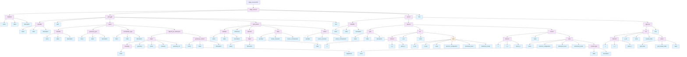

```mermaid
flowchart TD
    root["edge_sources IDS"]

    n1[edge_sources]
    root --> n1
    class n1 normalNode
    n2[midplane]
    n1 --> n2
    class n2 normalNode
    n3[name]
    n2 --> n3
    class n3 leafNode
    n4[index]
    n2 --> n4
    class n4 leafNode
    n5[description]
    n2 --> n5
    class n5 leafNode
    n6[grid_ggd]
    n1 --> n6
    class n6 normalNode
    n7[identifier]
    n6 --> n7
    class n7 normalNode
    n8[name]
    n7 --> n8
    class n8 leafNode
    n9[index]
    n7 --> n9
    class n9 leafNode
    n10[description]
    n7 --> n10
    class n10 leafNode
    n11[path]
    n6 --> n11
    class n11 leafNode
    n12[space]
    n6 --> n12
    class n12 normalNode
    n13[identifier]
    n12 --> n13
    class n13 normalNode
    n14[name]
    n13 --> n14
    class n14 leafNode
    n15[index]
    n13 --> n15
    class n15 leafNode
    n16[description]
    n13 --> n16
    class n16 leafNode
    n17[geometry_type]
    n12 --> n17
    class n17 normalNode
    n18[name]
    n17 --> n18
    class n18 leafNode
    n19[index]
    n17 --> n19
    class n19 leafNode
    n20[description]
    n17 --> n20
    class n20 leafNode
    n21[coordinates_type]
    n12 --> n21
    class n21 normalNode
    n22[name]
    n21 --> n22
    class n22 leafNode
    n23[index]
    n21 --> n23
    class n23 leafNode
    n24[description]
    n21 --> n24
    class n24 leafNode
    n25[objects_per_dimension]
    n12 --> n25
    class n25 normalNode
    n26[object]
    n25 --> n26
    class n26 normalNode
    n27[boundary]
    n26 --> n27
    class n27 normalNode
    n28[index]
    n27 --> n28
    class n28 leafNode
    n29[neighbours]
    n27 --> n29
    class n29 leafNode
    n30[geometry]
    n26 --> n30
    class n30 leafNode
    n31[nodes]
    n26 --> n31
    class n31 leafNode
    n32[measure]
    n26 --> n32
    class n32 leafNode
    n33[geometry_2d]
    n26 --> n33
    class n33 leafNode
    n34[geometry_content]
    n25 --> n34
    class n34 normalNode
    n35[name]
    n34 --> n35
    class n35 leafNode
    n36[index]
    n34 --> n36
    class n36 leafNode
    n37[description]
    n34 --> n37
    class n37 leafNode
    n38[grid_subset]
    n6 --> n38
    class n38 normalNode
    n39[identifier]
    n38 --> n39
    class n39 normalNode
    n40[name]
    n39 --> n40
    class n40 leafNode
    n41[index]
    n39 --> n41
    class n41 leafNode
    n42[description]
    n39 --> n42
    class n42 leafNode
    n43[dimension]
    n38 --> n43
    class n43 leafNode
    n44[element]
    n38 --> n44
    class n44 normalNode
    n45[object]
    n44 --> n45
    class n45 normalNode
    n46[space]
    n45 --> n46
    class n46 leafNode
    n47[dimension]
    n45 --> n47
    class n47 leafNode
    n48[index]
    n45 --> n48
    class n48 leafNode
    n49[base]
    n38 --> n49
    class n49 normalNode
    n50[jacobian]
    n49 --> n50
    class n50 leafNode
    n51[tensor_covariant]
    n49 --> n51
    class n51 leafNode
    n52[tensor_contravariant]
    n49 --> n52
    class n52 leafNode
    n53[metric]
    n38 --> n53
    class n53 normalNode
    n54[jacobian]
    n53 --> n54
    class n54 leafNode
    n55[tensor_covariant]
    n53 --> n55
    class n55 leafNode
    n56[tensor_contravariant]
    n53 --> n56
    class n56 leafNode
    n57[time]
    n6 --> n57
    class n57 leafNode
    n58[source]
    n1 --> n58
    class n58 normalNode
    n59[identifier]
    n58 --> n59
    class n59 normalNode
    n60[name]
    n59 --> n60
    class n60 leafNode
    n61[index]
    n59 --> n61
    class n61 leafNode
    n62[description]
    n59 --> n62
    class n62 leafNode
    n63[species]
    n58 --> n63
    class n63 normalNode
    n64[type]
    n63 --> n64
    class n64 normalNode
    n65[name]
    n64 --> n65
    class n65 leafNode
    n66[index]
    n64 --> n66
    class n66 leafNode
    n67[description]
    n64 --> n67
    class n67 leafNode
    n68[ion]
    n63 --> n68
    class n68 normalNode
    n69[element]
    n68 --> n69
    class n69 normalNode
    n70[a]
    n69 --> n70
    class n70 leafNode
    n71[z_n]
    n69 --> n71
    class n71 leafNode
    n72[atoms_n]
    n69 --> n72
    class n72 leafNode
    n73[z_ion]
    n68 --> n73
    class n73 leafNode
    n74[name]
    n68 --> n74
    class n74 leafNode
    n75(state)
    n68 --> n75
    class n75 complexNode
    n76[z_min]
    n75 --> n76
    class n76 leafNode
    n77[z_max]
    n75 --> n77
    class n77 leafNode
    n78[name]
    n75 --> n78
    class n78 leafNode
    n79[electron_configuration]
    n75 --> n79
    class n79 leafNode
    n80[vibrational_level]
    n75 --> n80
    class n80 leafNode
    n81[vibrational_mode]
    n75 --> n81
    class n81 leafNode
    n82[neutral]
    n63 --> n82
    class n82 normalNode
    n83[element]
    n82 --> n83
    class n83 normalNode
    n84[a]
    n83 --> n84
    class n84 leafNode
    n85[z_n]
    n83 --> n85
    class n85 leafNode
    n86[atoms_n]
    n83 --> n86
    class n86 leafNode
    n87[name]
    n82 --> n87
    class n87 leafNode
    n88[state]
    n82 --> n88
    class n88 normalNode
    n89[name]
    n88 --> n89
    class n89 leafNode
    n90[electron_configuration]
    n88 --> n90
    class n90 leafNode
    n91[vibrational_level]
    n88 --> n91
    class n91 leafNode
    n92[vibrational_mode]
    n88 --> n92
    class n92 leafNode
    n93[neutral_type]
    n88 --> n93
    class n93 normalNode
    n94[name]
    n93 --> n94
    class n94 leafNode
    n95[index]
    n93 --> n95
    class n95 leafNode
    n96[description]
    n93 --> n96
    class n96 leafNode
    n97[ggd_fast]
    n58 --> n97
    class n97 normalNode
    n98[ion]
    n97 --> n98
    class n98 normalNode
    n99[element]
    n98 --> n99
    class n99 normalNode
    n100[a]
    n99 --> n100
    class n100 leafNode
    n101[z_n]
    n99 --> n101
    class n101 leafNode
    n102[atoms_n]
    n99 --> n102
    class n102 leafNode
    n103[z_ion]
    n98 --> n103
    class n103 leafNode
    n104[name]
    n98 --> n104
    class n104 leafNode
    n105[neutral_index]
    n98 --> n105
    class n105 leafNode
    n106[power]
    n98 --> n106
    class n106 normalNode
    n107[grid_index]
    n106 --> n107
    class n107 leafNode
    n108[grid_subset_index]
    n106 --> n108
    class n108 leafNode
    n109[value]
    n106 --> n109
    class n109 leafNode
    n110[time]
    n97 --> n110
    class n110 leafNode
    n111[time]
    n1 --> n111
    class n111 leafNode

    classDef leafNode fill:#e1f5fe
    classDef complexNode fill:#fff3e0
    classDef normalNode fill:#f3e5f5
    classDef moreNode fill:#f5f5f5,stroke-dasharray: 5 5
```