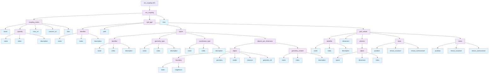

```mermaid
flowchart TD
    root["em_coupling IDS"]

    n1[em_coupling]
    root --> n1
    class n1 normalNode
    n2[coupling_matrix]
    n1 --> n2
    class n2 normalNode
    n3[name]
    n2 --> n3
    class n3 leafNode
    n4[quantity]
    n2 --> n4
    class n4 normalNode
    n5[name]
    n4 --> n5
    class n5 leafNode
    n6[index]
    n4 --> n6
    class n6 leafNode
    n7[description]
    n4 --> n7
    class n7 leafNode
    n8[rows_uri]
    n2 --> n8
    class n8 leafNode
    n9[columns_uri]
    n2 --> n9
    class n9 leafNode
    n10[data]
    n2 --> n10
    class n10 leafNode
    n11[grid_ggd]
    n1 --> n11
    class n11 normalNode
    n12[identifier]
    n11 --> n12
    class n12 normalNode
    n13[name]
    n12 --> n13
    class n13 leafNode
    n14[index]
    n12 --> n14
    class n14 leafNode
    n15[description]
    n12 --> n15
    class n15 leafNode
    n16[path]
    n11 --> n16
    class n16 leafNode
    n17[space]
    n11 --> n17
    class n17 normalNode
    n18[identifier]
    n17 --> n18
    class n18 normalNode
    n19[name]
    n18 --> n19
    class n19 leafNode
    n20[index]
    n18 --> n20
    class n20 leafNode
    n21[description]
    n18 --> n21
    class n21 leafNode
    n22[geometry_type]
    n17 --> n22
    class n22 normalNode
    n23[name]
    n22 --> n23
    class n23 leafNode
    n24[index]
    n22 --> n24
    class n24 leafNode
    n25[description]
    n22 --> n25
    class n25 leafNode
    n26[coordinates_type]
    n17 --> n26
    class n26 normalNode
    n27[name]
    n26 --> n27
    class n27 leafNode
    n28[index]
    n26 --> n28
    class n28 leafNode
    n29[description]
    n26 --> n29
    class n29 leafNode
    n30[objects_per_dimension]
    n17 --> n30
    class n30 normalNode
    n31[object]
    n30 --> n31
    class n31 normalNode
    n32[boundary]
    n31 --> n32
    class n32 normalNode
    n33[index]
    n32 --> n33
    class n33 leafNode
    n34[neighbours]
    n32 --> n34
    class n34 leafNode
    n35[geometry]
    n31 --> n35
    class n35 leafNode
    n36[nodes]
    n31 --> n36
    class n36 leafNode
    n37[measure]
    n31 --> n37
    class n37 leafNode
    n38[geometry_2d]
    n31 --> n38
    class n38 leafNode
    n39[geometry_content]
    n30 --> n39
    class n39 normalNode
    n40[name]
    n39 --> n40
    class n40 leafNode
    n41[index]
    n39 --> n41
    class n41 leafNode
    n42[description]
    n39 --> n42
    class n42 leafNode
    n43[grid_subset]
    n11 --> n43
    class n43 normalNode
    n44[identifier]
    n43 --> n44
    class n44 normalNode
    n45[name]
    n44 --> n45
    class n45 leafNode
    n46[index]
    n44 --> n46
    class n46 leafNode
    n47[description]
    n44 --> n47
    class n47 leafNode
    n48[dimension]
    n43 --> n48
    class n48 leafNode
    n49[element]
    n43 --> n49
    class n49 normalNode
    n50[object]
    n49 --> n50
    class n50 normalNode
    n51[space]
    n50 --> n51
    class n51 leafNode
    n52[dimension]
    n50 --> n52
    class n52 leafNode
    n53[index]
    n50 --> n53
    class n53 leafNode
    n54[base]
    n43 --> n54
    class n54 normalNode
    n55[jacobian]
    n54 --> n55
    class n55 leafNode
    n56[tensor_covariant]
    n54 --> n56
    class n56 leafNode
    n57[tensor_contravariant]
    n54 --> n57
    class n57 leafNode
    n58[metric]
    n43 --> n58
    class n58 normalNode
    n59[jacobian]
    n58 --> n59
    class n59 leafNode
    n60[tensor_covariant]
    n58 --> n60
    class n60 leafNode
    n61[tensor_contravariant]
    n58 --> n61
    class n61 leafNode
    n62[time]
    n1 --> n62
    class n62 leafNode

    classDef leafNode fill:#e1f5fe
    classDef complexNode fill:#fff3e0
    classDef normalNode fill:#f3e5f5
    classDef moreNode fill:#f5f5f5,stroke-dasharray: 5 5
```