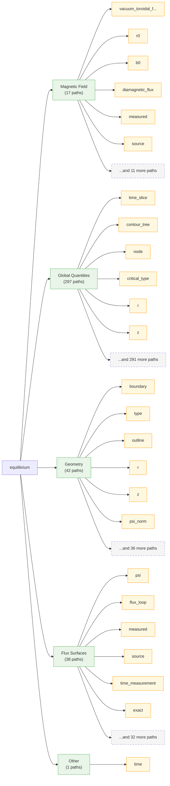

```mermaid
flowchart LR
    root["equilibrium"]

    d1["Magnetic Field<br/>(17 paths)"]
    root --> d1
    p1_1["vacuum_toroidal_f..."]
    d1 --> p1_1
    class p1_1 pathNode
    p1_2["r0"]
    d1 --> p1_2
    class p1_2 pathNode
    p1_3["b0"]
    d1 --> p1_3
    class p1_3 pathNode
    p1_4["diamagnetic_flux"]
    d1 --> p1_4
    class p1_4 pathNode
    p1_5["measured"]
    d1 --> p1_5
    class p1_5 pathNode
    p1_6["source"]
    d1 --> p1_6
    class p1_6 pathNode
    more1["...and 11 more paths"]
    d1 --> more1
    class more1 moreNode
    class d1 domainNode
    d2["Global Quantities<br/>(297 paths)"]
    root --> d2
    p2_1["time_slice"]
    d2 --> p2_1
    class p2_1 pathNode
    p2_2["contour_tree"]
    d2 --> p2_2
    class p2_2 pathNode
    p2_3["node"]
    d2 --> p2_3
    class p2_3 pathNode
    p2_4["critical_type"]
    d2 --> p2_4
    class p2_4 pathNode
    p2_5["r"]
    d2 --> p2_5
    class p2_5 pathNode
    p2_6["z"]
    d2 --> p2_6
    class p2_6 pathNode
    more2["...and 291 more paths"]
    d2 --> more2
    class more2 moreNode
    class d2 domainNode
    d3["Geometry<br/>(42 paths)"]
    root --> d3
    p3_1["boundary"]
    d3 --> p3_1
    class p3_1 pathNode
    p3_2["type"]
    d3 --> p3_2
    class p3_2 pathNode
    p3_3["outline"]
    d3 --> p3_3
    class p3_3 pathNode
    p3_4["r"]
    d3 --> p3_4
    class p3_4 pathNode
    p3_5["z"]
    d3 --> p3_5
    class p3_5 pathNode
    p3_6["psi_norm"]
    d3 --> p3_6
    class p3_6 pathNode
    more3["...and 36 more paths"]
    d3 --> more3
    class more3 moreNode
    class d3 domainNode
    d4["Flux Surfaces<br/>(38 paths)"]
    root --> d4
    p4_1["psi"]
    d4 --> p4_1
    class p4_1 pathNode
    p4_2["flux_loop"]
    d4 --> p4_2
    class p4_2 pathNode
    p4_3["measured"]
    d4 --> p4_3
    class p4_3 pathNode
    p4_4["source"]
    d4 --> p4_4
    class p4_4 pathNode
    p4_5["time_measurement"]
    d4 --> p4_5
    class p4_5 pathNode
    p4_6["exact"]
    d4 --> p4_6
    class p4_6 pathNode
    more4["...and 32 more paths"]
    d4 --> more4
    class more4 moreNode
    class d4 domainNode
    d5["Other<br/>(1 paths)"]
    root --> d5
    p5_1["time"]
    d5 --> p5_1
    class p5_1 pathNode
    class d5 domainNode

    classDef domainNode fill:#e8f5e8,stroke:#4caf50
    classDef pathNode fill:#fff8e1,stroke:#ff9800
    classDef moreNode fill:#f5f5f5,stroke-dasharray: 5 5
```